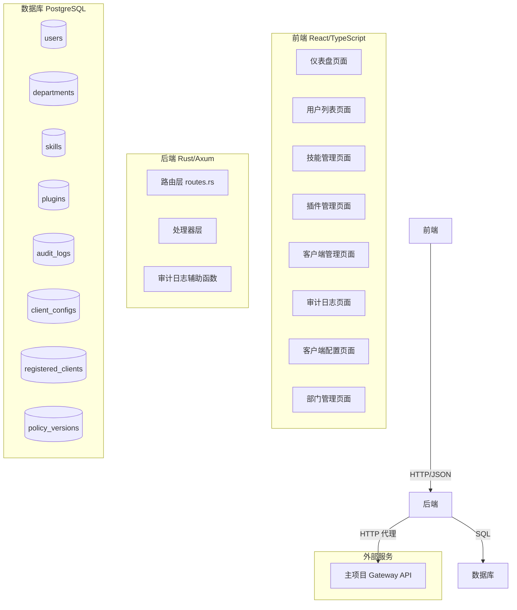

# 技术设计文档：Admin Backend 待开发功能

## 概览

本文档为 Admin Backend 七项待开发功能提供完整的技术设计方案。这些功能基于已批准的需求文档，涵盖后端 API 设计、数据库迁移、前端组件设计及测试策略。

**技术栈**：
- 后端：Rust + Axum + deadpool-postgres + ironclaw_auth
- 前端：React + TypeScript + Ant Design + React Router v6 + Axios
- 数据库：PostgreSQL
- 属性测试：proptest（Rust）

---

## 架构



### 新增 API 端点总览

| 功能 | 方法 | 路径 |
|------|------|------|
| 仪表盘统计 | GET | `/api/dashboard/stats` |
| 仪表盘活动 | GET | `/api/dashboard/activity` |
| 仪表盘趋势 | GET | `/api/dashboard/trends` |
| 技能启用 | POST | `/api/skills/{id}/enable` |
| 技能禁用 | POST | `/api/skills/{id}/disable` |
| 插件启用 | POST | `/api/plugins/{id}/enable` |
| 插件禁用 | POST | `/api/plugins/{id}/disable` |
| 用户编辑 | PUT | `/api/users/{id}` |
| 客户端配置更新 | PUT | `/api/client-config` |
| 审计日志导出 | GET | `/api/audit-logs/export` |
| 客户端强制下线 | POST | `/api/clients/{id}/disconnect` |
| 单客户端推送策略 | POST | `/api/clients/{id}/push-policy` |
| 全量推送策略 | POST | `/api/clients/push-policy-all` |
| 部门列表 | GET | `/api/departments` |
| 创建部门 | POST | `/api/departments` |
| 更新部门 | PUT | `/api/departments/{id}` |
| 删除部门 | DELETE | `/api/departments/{id}` |

---

## 组件与接口

### 功能 1：仪表盘真实数据接入

#### 后端接口

**GET /api/dashboard/stats**

响应示例：
```json
{
  "total_users": 156,
  "online_clients": 42,
  "dlp_blocked_today": 23,
  "sensitive_ops_today": 8
}
```

SQL 实现要点：
- `total_users`：`SELECT COUNT(*) FROM users`
- `online_clients`：`SELECT COUNT(*) FROM registered_clients WHERE online = true`
- `dlp_blocked_today`：`SELECT COUNT(*) FROM audit_logs WHERE action = 'dlp_block' AND created_at >= CURRENT_DATE`
- `sensitive_ops_today`：`SELECT COUNT(*) FROM audit_logs WHERE action LIKE 'sensitive_%' AND created_at >= CURRENT_DATE`

**GET /api/dashboard/activity**

响应示例：
```json
{
  "logs": [
    {
      "id": "uuid",
      "username": "admin",
      "action": "create_user",
      "details": "创建用户 alice",
      "created_at": "2024-01-15T10:30:00Z"
    }
  ]
}
```

SQL：`SELECT ... FROM audit_logs LEFT JOIN users ... ORDER BY created_at DESC LIMIT 20`

**GET /api/dashboard/trends**

响应示例：
```json
{
  "user_activity": [
    { "date": "2024-01-09", "count": 45 },
    { "date": "2024-01-10", "count": 52 }
  ],
  "dlp_blocks": [
    { "date": "2024-01-09", "count": 12 },
    { "date": "2024-01-10", "count": 18 }
  ]
}
```

SQL 实现：使用 `generate_series` 生成近 7 天日期序列，LEFT JOIN 审计日志按日期分组统计，确保无数据的日期也返回 count=0。

#### 前端改造

`Dashboard.tsx` 改造要点：
- 移除 `setTimeout` 硬编码逻辑
- 并发调用三个 API：`Promise.all([getStats(), getActivity(), getTrends()])`
- 加载中使用 `Skeleton` 组件替换 `loading` prop
- API 失败时统计数字显示 `--`，不崩溃

---

### 功能 2：技能/插件启用禁用管理

#### 后端接口

**POST /api/skills/{id}/enable** 和 **POST /api/skills/{id}/disable**

处理逻辑：
1. 查询技能是否存在，不存在返回 404
2. 尝试代理到 Gateway（`POST {GATEWAY_URL}/api/skills/{id}/enable`）
3. 若 Gateway 不可用，直接更新本地 `skills` 表的 `enabled` 字段
4. 写入审计日志（`enable_skill` / `disable_skill`）
5. 返回更新后的技能对象，包含 `gateway_synced` 字段

响应示例（Gateway 不可用时）：
```json
{
  "id": "uuid",
  "name": "代码分析",
  "enabled": true,
  "gateway_synced": false
}
```

插件接口（`/api/plugins/{id}/enable|disable`）逻辑相同，审计类型为 `enable_plugin` / `disable_plugin`。

#### 前端改造

`SkillList.tsx` 和 `PluginList.tsx` 新增操作列：
```tsx
{
  title: '操作',
  key: 'action',
  width: 120,
  render: (_, record) => (
    <Switch
      checked={record.enabled}
      loading={switchLoading[record.id]}
      onChange={(checked) => handleToggle(record.id, checked)}
    />
  ),
}
```

`handleToggle` 逻辑：
- 设置该行 loading 状态
- 调用 enable 或 disable 接口
- 成功后刷新列表
- 失败时显示错误提示，Switch 状态回滚

---

### 功能 3：用户编辑功能

#### 后端接口

**PUT /api/users/{id}**

请求体（所有字段可选）：
```json
{
  "email": "new@example.com",
  "password": "newpassword123",
  "department_id": "uuid-or-null"
}
```

处理逻辑：
1. 查询用户是否存在，不存在返回 404
2. 验证 `email` 格式（若提供）：使用正则 `^[^@\s]+@[^@\s]+\.[^@\s]+$`
3. 验证 `password` 长度（若提供）：8-128 字符
4. 若修改密码，使用 `ironclaw_auth::AuthManager::hash_password()` 哈希
5. 动态构建 UPDATE 语句，只更新提供的字段
6. 写入审计日志，记录修改的字段名（不记录密码值）

响应：返回更新后的用户对象（不含 password_hash）

新增 `UpdateUserRequest` 模型（`models.rs`）：
```rust
#[derive(Debug, Clone, Serialize, Deserialize)]
pub struct UpdateUserRequest {
    pub email: Option<String>,
    pub password: Option<String>,
    pub department_id: Option<Option<Uuid>>, // None=不修改, Some(None)=清除部门, Some(Some(id))=设置部门
}
```

#### 前端改造

`UserList.tsx` 新增：
- 操作列增加"编辑"按钮（`EditOutlined`）
- `EditUserModal` 组件（新建 `components/Users/EditUserModal.tsx`）
- 模态框字段：邮箱（预填）、新密码（可选）、确认密码、所属部门（Select，从 `/api/departments` 获取）

---

### 功能 4：客户端配置下发管理界面

#### 后端接口

**PUT /api/client-config**

请求体（所有字段可选）：
```json
{
  "llm_backend": "openai",
  "llm_api_key": "sk-xxxx",
  "llm_model": "gpt-4",
  "llm_base_url": "https://api.openai.com/v1",
  "safety_enabled": true,
  "skills_enabled": true,
  "extensions_enabled": false,
  "max_cost_per_day_cents": 1000
}
```

处理逻辑：
1. 验证 `max_cost_per_day_cents` ≥ 0（若提供）
2. 验证 `llm_base_url` 为合法 URL 或空字符串（若提供）
3. 使用 UPSERT 更新 `client_configs` 表中 `client_id IS NULL` 的记录
4. `config_version` 自增：`config_version = config_version + 1`
5. 写入审计日志，列出变更字段名，不记录 `llm_api_key` 值

**GET /api/client-config 脱敏改造**

现有 `get_client_config` 函数需增加脱敏逻辑：
```rust
fn mask_api_key(key: &str) -> String {
    if key.len() <= 4 {
        return "****".to_string();
    }
    format!("{}****", &key[..4])
}
```

#### 前端新增页面

新建 `pages/ClientConfig.tsx`：
- 页面加载时调用 `GET /api/client-config`
- 表单控件：LLM 后端（Input）、API Key（Password Input，显示脱敏值）、模型名称（Input）、Base URL（Input）、三个功能开关（Switch）、每日费用限制（InputNumber）
- "保存配置"按钮调用 `PUT /api/client-config`
- 保存成功后重新加载配置，显示最新 `config_version`

路由和导航更新：
- `router/index.tsx` 新增 `{ path: 'client-config', element: <ClientConfig /> }`
- `MainLayout.tsx` 系统配置分组下新增"客户端配置"菜单项

---

### 功能 5：审计日志导出功能

#### 后端接口

**GET /api/audit-logs/export**

查询参数：
- `start_time`：ISO 8601 格式（可选）
- `end_time`：ISO 8601 格式（可选）
- `action`：精确匹配（可选）
- `username`：模糊匹配（可选）

响应头：
```
Content-Type: text/csv; charset=utf-8
Content-Disposition: attachment; filename="audit-logs-2024-01-15.csv"
```

CSV 生成实现（使用 Rust 标准库，不引入额外依赖）：

```rust
fn escape_csv_field(s: &str) -> String {
    // 若字段包含逗号、换行符或双引号，则用双引号包裹，内部双引号转义为 ""
    if s.contains(',') || s.contains('\n') || s.contains('"') {
        format!("\"{}\"", s.replace('"', "\"\""))
    } else {
        s.to_string()
    }
}

fn build_csv(rows: &[AuditLogRow]) -> String {
    let bom = "\u{FEFF}";
    let header = "时间,操作人,操作类型,详情,日志ID\n";
    let mut csv = format!("{}{}", bom, header);
    for row in rows {
        let line = format!(
            "{},{},{},{},{}\n",
            escape_csv_field(&row.created_at),
            escape_csv_field(row.username.as_deref().unwrap_or("系统")),
            escape_csv_field(&row.action),
            escape_csv_field(&row.details),
            escape_csv_field(&row.id.to_string()),
        );
        csv.push_str(&line);
    }
    csv
}
```

返回类型使用 `axum::response::Response`，手动设置响应头和 body。

#### 前端改造

`AuditLog.tsx` 改造 `handleExport`：
- 调用 `GET /api/audit-logs/export`，传递当前筛选参数
- 使用 `responseType: 'blob'` 接收二进制响应
- 通过 `URL.createObjectURL` 触发浏览器下载
- 导出按钮设置 `loading` 状态防止重复点击

---

### 功能 6：客户端强制下线与策略推送

#### 后端接口

**POST /api/clients/{id}/disconnect**

处理逻辑：
1. 查询客户端是否存在，不存在返回 404
2. 更新 `online = false, last_activity = NOW()`（幂等操作）
3. 写入审计日志（`disconnect_client`）

**POST /api/clients/{id}/push-policy**

处理逻辑：
1. 查询客户端是否存在，不存在返回 404
2. 从 `policy_versions` 表获取最新版本号：`SELECT version FROM policy_versions ORDER BY created_at DESC LIMIT 1`
3. 更新客户端 `policy_version` 字段
4. 写入审计日志（`push_policy`）

**POST /api/clients/push-policy-all**

处理逻辑：
1. 获取最新策略版本号
2. `UPDATE registered_clients SET policy_version = $1 WHERE online = true`
3. 返回 `{ "updated_count": N, "policy_version": "v1.2" }`
4. 写入审计日志（`push_policy_all`）

注意：路由注册顺序需确保 `/api/clients/push-policy-all` 在 `/api/clients/{id}` 之前，避免路径冲突。

#### 前端改造

`ClientList.tsx` 新增：
- 操作列增加"强制下线"（`PoweroffOutlined`，danger 样式，带 Popconfirm）和"推送策略"（`SyncOutlined`）按钮
- 页面顶部增加"全部推送"按钮（带 Popconfirm）
- 使用 `loadingStates: Record<string, boolean>` 管理各行按钮的 loading 状态

---

### 功能 7：部门管理

#### 后端接口

**GET /api/departments**

响应示例：
```json
{
  "departments": [
    {
      "id": "uuid",
      "name": "研发部",
      "description": "负责产品研发",
      "token_quota_enabled": true,
      "token_quota_per_day": 100000,
      "member_count": 15,
      "created_at": "2024-01-01T00:00:00Z",
      "updated_at": "2024-01-15T10:00:00Z"
    }
  ]
}
```

SQL：使用子查询或 LEFT JOIN 计算 `member_count`：
```sql
SELECT d.*, COUNT(u.id) as member_count
FROM departments d
LEFT JOIN users u ON u.department_id = d.id
GROUP BY d.id
ORDER BY d.created_at DESC
```

**POST /api/departments**

请求体：
```json
{
  "name": "研发部",
  "description": "负责产品研发",
  "token_quota_enabled": true,
  "token_quota_per_day": 100000
}
```

验证规则：
- `name` 长度 2-100 字符，且不与已有部门重名（返回 409）
- `token_quota_enabled = true` 时，`token_quota_per_day` 必须 ≥ 1（返回 400）

**PUT /api/departments/{id}**

支持部分更新，验证规则同 POST。

**DELETE /api/departments/{id}**

处理逻辑：
1. 查询 `SELECT COUNT(*) FROM users WHERE department_id = $1`
2. 若 count > 0，返回 HTTP 400 和错误信息"该部门下还有用户，无法删除"
3. 否则执行删除

删除保护采用**应用层检查**（而非数据库约束），原因：
- 提供更友好的错误信息
- 避免数据库外键约束错误信息暴露给前端
- 与现有代码风格一致

**GET /api/users 改造**

在用户查询中 LEFT JOIN departments 表，返回 `department` 字段：
```json
{
  "id": "uuid",
  "username": "alice",
  "department": {
    "id": "dept-uuid",
    "name": "研发部"
  }
}
```

#### 前端新增页面

新建 `pages/Departments/DepartmentList.tsx`：
- 表格展示部门列表
- "新建部门"按钮 → 创建模态框
- 操作列"编辑"和"删除"按钮
- Token 限额开关控制 InputNumber 的显示/隐藏

路由和导航更新：
- `router/index.tsx` 新增 `{ path: 'departments', element: <DepartmentList /> }`
- `MainLayout.tsx` 用户管理分组下新增"部门管理"菜单项

---

## 数据模型

### 新增迁移文件：`012_departments.sql`

```sql
-- 部门表
CREATE TABLE IF NOT EXISTS departments (
    id UUID PRIMARY KEY DEFAULT gen_random_uuid(),
    name VARCHAR(100) NOT NULL UNIQUE,
    description TEXT,
    token_quota_enabled BOOLEAN NOT NULL DEFAULT false,
    token_quota_per_day INTEGER,
    created_at TIMESTAMPTZ NOT NULL DEFAULT NOW(),
    updated_at TIMESTAMPTZ NOT NULL DEFAULT NOW()
);

CREATE INDEX IF NOT EXISTS idx_departments_name ON departments(name);

-- users 表新增 department_id 字段
ALTER TABLE users
    ADD COLUMN IF NOT EXISTS department_id UUID REFERENCES departments(id) ON DELETE SET NULL;

CREATE INDEX IF NOT EXISTS idx_users_department_id ON users(department_id);
```

### 新增 Rust 模型（models.rs）

```rust
// 用户编辑请求
pub struct UpdateUserRequest {
    pub email: Option<String>,
    pub password: Option<String>,
    pub department_id: Option<Option<Uuid>>,
}

// 部门相关
pub struct CreateDepartmentRequest {
    pub name: String,
    pub description: Option<String>,
    pub token_quota_enabled: Option<bool>,
    pub token_quota_per_day: Option<i32>,
}

pub struct UpdateDepartmentRequest {
    pub name: Option<String>,
    pub description: Option<String>,
    pub token_quota_enabled: Option<bool>,
    pub token_quota_per_day: Option<Option<i32>>,
}

// 审计日志导出查询参数
pub struct AuditLogExportQuery {
    pub start_time: Option<DateTime<Utc>>,
    pub end_time: Option<DateTime<Utc>>,
    pub action: Option<String>,
    pub username: Option<String>,
}
```

### 现有表结构关键字段

| 表名 | 关键字段 | 说明 |
|------|---------|------|
| `users` | `department_id UUID` | 新增，外键引用 departments |
| `skills` | `enabled BOOLEAN` | 已有，需要 enable/disable 接口 |
| `plugins` | `enabled BOOLEAN` | 已有，需要 enable/disable 接口 |
| `registered_clients` | `online BOOLEAN`, `policy_version TEXT` | 已有，需要 disconnect/push-policy 接口 |
| `client_configs` | `config_version BIGINT` | 已有，PUT 时自增 |
| `audit_logs` | `action VARCHAR`, `details TEXT` | 已有，所有操作写入 |

---


## 正确性属性

*属性（Property）是在系统所有有效执行中都应成立的特征或行为——本质上是对系统应该做什么的形式化陈述。属性是人类可读规范与机器可验证正确性保证之间的桥梁。*

### 属性 1：仪表盘统计数值非负性

*对于任意* 数据库状态，`GET /api/dashboard/stats` 返回的所有数值字段（`total_users`、`online_clients`、`dlp_blocked_today`、`sensitive_ops_today`）必须 ≥ 0。

**验证：需求 1.1**

---

### 属性 2：活动日志数量上限

*对于任意* 数量的审计日志记录，`GET /api/dashboard/activity` 返回的日志条数必须 ≤ 20，且按 `created_at` 降序排列（最新的在前）。

**验证：需求 1.2**

---

### 属性 3：趋势数据长度约束

*对于任意* 时间范围的数据，`GET /api/dashboard/trends` 返回的 `user_activity` 和 `dlp_blocks` 数组长度必须 ≤ 7。

**验证：需求 1.3**

---

### 属性 4：技能/插件启用禁用状态翻转一致性

*对于任意* 技能或插件，调用 `enable` 接口后查询该资源，`enabled` 字段必须为 `true`；调用 `disable` 接口后查询，`enabled` 字段必须为 `false`。连续调用两次 `enable`，结果与调用一次相同（幂等性）。

**验证：需求 2.1、2.2、2.3、2.4**

---

### 属性 5：资源不存在返回 404

*对于任意* 不存在于数据库中的资源 ID，所有修改类接口（技能/插件 enable/disable、用户编辑、客户端 disconnect/push-policy）必须返回 HTTP 404 状态码。

**验证：需求 2.6、3.4、6.2、6.5**

---

### 属性 6：操作后审计日志完整性

*对于任意* 成功执行的写操作（技能/插件状态变更、用户编辑、配置更新、客户端操作、部门 CRUD），`audit_logs` 表中必须存在一条对应的审计记录，且记录中不包含密码明文或完整 API Key 值。

**验证：需求 2.7、3.5、4.3、6.3、6.6、6.8、7.8**

---

### 属性 7：密码哈希安全性

*对于任意* 通过 `PUT /api/users/{id}` 修改的密码，数据库中存储的 `password_hash` 字段不等于明文密码，且可通过 `ironclaw_auth::AuthManager::verify_password()` 验证原始密码。

**验证：需求 3.6**

---

### 属性 8：用户编辑字段验证

*对于任意* 不符合邮箱格式的 `email` 字符串，或长度不在 8-128 范围内的 `password` 字符串，`PUT /api/users/{id}` 必须返回 HTTP 400 状态码。

**验证：需求 3.2、3.3**

---

### 属性 9：客户端配置往返一致性（Round-Trip）

*对于任意* 有效的配置更新请求，调用 `PUT /api/client-config` 后立即调用 `GET /api/client-config`，返回的非敏感字段（除 `llm_api_key` 外）必须与提交的值完全一致。

**验证：需求 4.1**

---

### 属性 10：配置版本单调递增

*对于任意* 成功的 `PUT /api/client-config` 调用，响应中的 `config_version` 必须比调用前的值恰好大 1。

**验证：需求 4.2**

---

### 属性 11：API Key 脱敏不可逆

*对于任意* 长度大于 4 的 `llm_api_key` 值，`GET /api/client-config` 返回的 `llm_api_key` 字段不包含完整的原始值（仅保留前 4 位加 `****`）。

**验证：需求 4.6**

---

### 属性 12：审计日志导出与查询结果一致性（Metamorphic Property）

*对于任意* 筛选条件，使用相同参数分别调用 `GET /api/audit-logs`（获取 `total`）和 `GET /api/audit-logs/export`，导出 CSV 的数据行数（不含表头和 BOM）必须等于查询接口返回的 `total` 字段值。

**验证：需求 5.1**

---

### 属性 13：CSV 字段正确转义

*对于任意* 包含逗号、换行符或双引号的审计日志字段值，导出的 CSV 文件中该字段必须用双引号包裹，且内部双引号必须转义为 `""`，使得标准 CSV 解析器能正确解析。

**验证：需求 5（CSV 可解析性）**

---

### 属性 14：客户端强制下线幂等性

*对于任意* 客户端（无论当前 `online` 状态），连续调用两次 `POST /api/clients/{id}/disconnect`，第二次调用不返回错误，且客户端 `online` 字段保持为 `false`。

**验证：需求 6.1**

---

### 属性 15：全量策略推送一致性

*对于任意* 数据库状态，调用 `POST /api/clients/push-policy-all` 后，所有 `online = true` 的客户端的 `policy_version` 字段必须等于 `policy_versions` 表中最新的版本号，且返回的 `updated_count` 等于调用前 `online = true` 的客户端数量。

**验证：需求 6.7**

---

### 属性 16：部门成员计数准确性

*对于任意* 数据库状态，`GET /api/departments` 返回的每个部门的 `member_count` 必须等于 `users` 表中 `department_id` 等于该部门 ID 的记录数量。

**验证：需求 7.1、7.12**

---

### 属性 17：部门名称唯一性

*对于任意* 已存在的部门名称，使用相同名称调用 `POST /api/departments` 或 `PUT /api/departments/{id}` 必须返回 HTTP 409 状态码，不得创建或更新成功。

**验证：需求 7.6**

---

### 属性 18：部门删除保护不变量

*对于任意* `users` 表中存在 `department_id = X` 记录的部门 X，`DELETE /api/departments/X` 必须返回 HTTP 400，不得删除成功。

**验证：需求 7.5**

---

### 属性 19：Token 限额一致性

*对于任意* `token_quota_enabled = false` 的部门，`GET /api/departments` 返回的该部门 `token_quota_per_day` 字段必须为 `null`，无论数据库中存储何值。

**验证：需求 7.7**

---

## 错误处理

### 统一错误响应格式

所有错误响应沿用现有格式：
```json
{
  "error": "错误类型描述",
  "details": "详细错误信息"
}
```

### 新增错误类型（error.rs）

```rust
// 现有 Error 枚举新增变体：
Error::DepartmentHasUsers  // HTTP 400，部门下有用户无法删除
Error::DepartmentNotFound  // HTTP 404，部门不存在
Error::SkillNotFound       // HTTP 404，技能不存在
Error::PluginNotFound      // HTTP 404，插件不存在
Error::ClientNotFound      // HTTP 404，客户端不存在
```

### 各功能错误处理策略

| 场景 | HTTP 状态码 | 错误信息 |
|------|------------|---------|
| 资源 ID 不存在 | 404 | "Resource not found" |
| 邮箱格式无效 | 400 | "Invalid email format" |
| 密码长度不合法 | 400 | "Password must be 8-128 characters" |
| 部门名称重复 | 409 | "Department name already exists" |
| 部门下有用户 | 400 | "该部门下还有用户，无法删除" |
| Token 限额配置无效 | 400 | "token_quota_per_day must be >= 1 when quota is enabled" |
| 费用限制为负数 | 400 | "max_cost_per_day_cents must be >= 0" |
| URL 格式无效 | 400 | "Invalid URL format" |
| 时间参数格式无效 | 400 | "Invalid datetime format, expected ISO 8601" |
| Gateway 不可用 | 200（降级） | 响应中包含 `gateway_synced: false` |

---

## 测试策略

### 双轨测试方法

采用单元测试 + 属性测试的双轨策略：
- **单元测试**：验证具体示例、边界条件和错误路径
- **属性测试**：使用 `proptest` 验证普遍性属性，每个属性测试运行 ≥ 100 次迭代

### 属性测试配置（proptest）

在 `admin-backend/Cargo.toml` 中添加：
```toml
[dev-dependencies]
proptest = "1"
```

每个属性测试必须包含注释标注对应的设计属性：
```rust
// Feature: admin-backend-missing-features, Property 4: 技能/插件启用禁用状态翻转一致性
proptest! {
    #[test]
    fn prop_skill_enable_disable_toggle(skill_id in any::<Uuid>()) {
        // ...
    }
}
```

### 测试文件组织

```
admin-backend/tests/
├── dashboard_unit_tests.rs          # 仪表盘 API 单元测试
├── skill_plugin_toggle_tests.rs     # 技能/插件启用禁用属性测试
├── user_edit_tests.rs               # 用户编辑单元测试 + 属性测试
├── client_config_tests.rs           # 客户端配置属性测试
├── audit_log_export_tests.rs        # 审计日志导出属性测试
├── client_operations_tests.rs       # 客户端操作属性测试
└── department_tests.rs              # 部门管理属性测试
```

### 各属性的测试实现指引

**属性 4（技能/插件状态翻转）**：
```rust
// Feature: admin-backend-missing-features, Property 4: 技能/插件启用禁用状态翻转一致性
proptest! {
    #[test]
    fn prop_skill_enable_idempotent(initial_enabled in any::<bool>()) {
        // 生成随机初始状态的技能，调用 enable 两次，验证结果相同
    }
}
```

**属性 9（配置往返一致性）**：
```rust
// Feature: admin-backend-missing-features, Property 9: 客户端配置往返一致性
proptest! {
    #[test]
    fn prop_client_config_round_trip(
        llm_model in "[a-z0-9-]{1,50}",
        safety_enabled in any::<bool>(),
        max_cost in 0i64..1_000_000i64,
    ) {
        // PUT 配置后 GET，验证非敏感字段一致
    }
}
```

**属性 12（CSV 导出一致性）**：
```rust
// Feature: admin-backend-missing-features, Property 12: 审计日志导出与查询结果一致性
proptest! {
    #[test]
    fn prop_audit_export_count_matches_query(
        action_filter in proptest::option::of("[a-z_]{3,30}"),
        log_count in 0usize..200usize,
    ) {
        // 生成随机日志数据，用相同筛选条件查询和导出，验证行数一致
    }
}
```

**属性 13（CSV 转义）**：
```rust
// Feature: admin-backend-missing-features, Property 13: CSV 字段正确转义
proptest! {
    #[test]
    fn prop_csv_field_escape_parseable(
        field_value in ".*", // 任意字符串，包含逗号、换行、引号
    ) {
        let escaped = escape_csv_field(&field_value);
        // 用标准 CSV 解析器解析，验证还原后等于原始值
        let parsed = parse_csv_field(&escaped);
        prop_assert_eq!(parsed, field_value);
    }
}
```

**属性 15（全量推送一致性）**：
```rust
// Feature: admin-backend-missing-features, Property 15: 全量策略推送一致性
proptest! {
    #[test]
    fn prop_push_policy_all_consistency(
        online_count in 0usize..50usize,
        offline_count in 0usize..50usize,
    ) {
        // 生成随机在线/离线客户端，调用 push-policy-all
        // 验证所有在线客户端 policy_version 更新，updated_count 准确
    }
}
```

**属性 18（部门删除保护）**：
```rust
// Feature: admin-backend-missing-features, Property 18: 部门删除保护不变量
proptest! {
    #[test]
    fn prop_department_delete_blocked_when_has_users(
        user_count in 1usize..20usize, // 至少 1 个用户
    ) {
        // 创建部门，分配随机数量用户，尝试删除，验证返回 400
    }
}
```

### 单元测试重点覆盖

- `escape_csv_field()` 函数：空字符串、含逗号、含换行、含双引号、含所有特殊字符的组合
- `mask_api_key()` 函数：长度 0、1、4、5、长字符串
- 邮箱格式验证：有效格式、缺少 @、缺少域名、空字符串
- 密码长度验证：7 字符（边界-1）、8 字符（边界）、128 字符（边界）、129 字符（边界+1）
- 部门 Token 限额验证：enabled=true 且 quota=null、enabled=true 且 quota=0、enabled=false 且 quota=null

### 失败路径测试

遵循 AGENTS.md 中的测试原则，每个功能必须覆盖失败路径：
- 数据库连接失败时的错误处理
- Gateway 不可用时的降级行为（技能/插件操作）
- 并发修改同一资源时的一致性
- 无效 UUID 格式的路径参数处理
