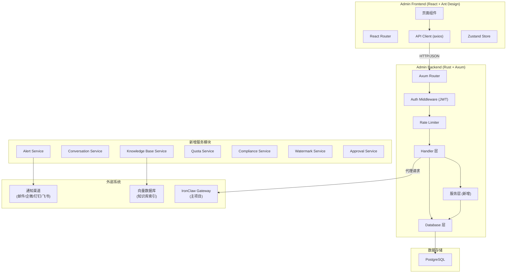
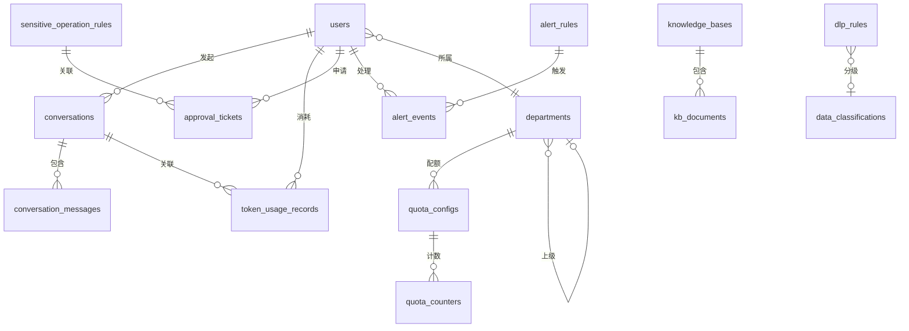

# IronClaw 政企级 AI 办公助手管理平台 — 技术设计文档

## 概述

本设计文档基于已完成的需求规格文档（22 个需求模块、148 条验收标准），为 IronClaw 管理平台的扩展功能提供技术设计方案。

### 设计范围

需求分为两类：
- **已实现功能**（标记 `[已实现]`）：用户管理、RBAC、DLP 规则、敏感操作、策略版本、客户端管理、审计日志、统计报表、系统设置、扩展管理、部门管理、模型配置 — 共 13 个模块
- **新增功能**（标记 `[新增]`）：告警与通知、AI 对话审计、知识库管理、Token 配额与费用、数据分类分级、水印与追踪、操作审批流、系统安全加固 — 共 8 个新模块 + 已有模块的扩展字段

### 实现优先级

所有模块按业务价值和依赖关系分为三个阶段：

#### P0 — 核心功能（第一阶段，必须实现）

| 模块 | 需求编号 | 说明 | 状态 |
|------|----------|------|------|
| 认证与登录 | 需求1 | MFA + SSO 扩展 | 已实现 + 扩展 |
| 仪表盘 | 需求2 | 新增 AI 对话统计、告警徽标 | 已实现 + 扩展 |
| 用户管理 | 需求3 | 批量导入、LDAP 同步 | 已实现 + 扩展 |
| 部门管理 | 需求4 | 树形架构、Token 配额、知识库/模型白名单 | 已实现 + 扩展 |
| DLP 数据防泄漏 | 需求5 | 双向扫描、数据分级关联 | 已实现 + 扩展 |
| 敏感操作管理 | 需求6 | — | 已实现 |
| 客户端管理 | 需求8 | 设备指纹、版本管控 | 已实现 + 扩展 |
| 模型配置 | 需求10 | 调用统计、模型白名单 | 已实现 + 扩展 |
| 审计日志 | 需求11 | IP/UA 记录、全文搜索 | 已实现 + 扩展 |
| 系统设置 | 需求13 | 告警通知渠道、安全策略、水印配置 | 已实现 + 扩展 |
| 系统安全加固 | 需求22 | JWT 验证、频率限制、安全头 | 新增 |

#### P1 — 重要功能（第二阶段，高优先级）

| 模块 | 需求编号 | 说明 | 状态 |
|------|----------|------|------|
| 告警与通知 | 需求15 | 告警规则、多渠道通知、告警处理 | 新增 |
| AI 对话审计 | 需求16 | 对话记录、DLP 标记、Token 统计 | 新增 |
| 知识库管理 | 需求17 | 文档上传、向量化、检索测试 | 新增 |
| Token 配额与费用 | 需求18 | 三级配额、费用统计、预算预警 | 新增 |
| 策略版本管理 | 需求7 | 数字签名、回滚 | 已实现 + 扩展 |
| 客户端配置下发 | 需求9 | 按部门差异化配置 | 已实现 + 扩展 |
| 操作审批流 | 需求21 | 审批工单、催办通知 | 新增 |
| 扩展管理 | 需求14 | 按部门配置技能/插件白名单 | 已实现 + 扩展 |

#### P2 — 增强功能（第三阶段，后期实现）

| 模块 | 需求编号 | 说明 | 状态 |
|------|----------|------|------|
| 数据分类分级与合规 | 需求19 | 四级分类、合规报告、数据保留策略 | 新增 |
| 水印与追踪 | 需求20 | 隐式水印嵌入/提取、泄露追溯 | 新增 |
| 统计报表 | 需求12 | AI 使用量报表、PDF/Excel 导出 | 已实现 + 扩展 |

> **P2 模块说明**：合规管理和水印追踪是政企场景的增值功能，在核心安全能力（DLP + 告警 + 审计）稳定后再实现。统计报表的扩展依赖 P1 阶段的数据积累。

### 设计原则

1. **代码复用优先**：遵循 AGENTS.md 的架构规则，优先复用共享 crate 和主项目能力
2. **Fail-Safe 设计**：安全模块失败时拒绝操作，而非放行（参考 DLP 历史教训）
3. **增量迁移**：新增数据库表和字段通过 refinery 迁移文件管理，不修改已有迁移
4. **前后端一致**：API 接口遵循现有 RESTful 风格，前端遵循 Ant Design + React 模式

### 现有技术栈

| 层级 | 技术 | 说明 |
|------|------|------|
| 后端框架 | Rust + Axum 0.8 | 异步 HTTP 服务 |
| 数据库 | PostgreSQL (tokio-postgres + deadpool) | 连接池管理 |
| 数据库迁移 | refinery | SQL 迁移文件 |
| 认证 | ironclaw_auth (共享 crate) + JWT | bcrypt 密码哈希 |
| 前端框架 | React 18 + TypeScript + Vite | SPA 应用 |
| UI 组件库 | Ant Design 5 | 中文本地化 |
| 状态管理 | Zustand (authStore) | 轻量状态管理 |
| HTTP 客户端 | axios (前端) / reqwest (后端) | API 通信 |
| 桌面客户端 | Tauri | 与管理后台通过 API 交互 |


## 架构

### 系统架构总览



### 模块分层架构

现有代码采用扁平结构（`routes.rs` 包含所有 handler），随着新增 8 个模块，需要引入服务层拆分：

```
admin-backend/src/
├── main.rs                    # 入口 [已有]
├── lib.rs                     # AppState 定义 [已有，扩展]
├── auth.rs                    # 认证模块 [已有]
├── db.rs                      # 数据库层 [已有，扩展]
├── error.rs                   # 错误类型 [已有，扩展]
├── models.rs                  # 数据模型 [已有，扩展]
├── routes.rs                  # 路由注册 [已有，扩展]
├── handlers.rs                # 已有 handler [已有]
├── policy_management.rs       # 策略管理 [已有]
├── services/                  # 新增服务层
│   ├── mod.rs
│   ├── alert.rs               # 告警服务 (需求15)
│   ├── conversation.rs        # 对话审计服务 (需求16)
│   ├── knowledge_base.rs      # 知识库服务 (需求17)
│   ├── quota.rs               # 配额服务 (需求18)
│   ├── compliance.rs          # 合规服务 (需求19)
│   ├── watermark.rs           # 水印服务 (需求20)
│   └── approval.rs            # 审批服务 (需求21)
├── handlers/                  # 新增 handler（按模块拆分）
│   ├── mod.rs
│   ├── alerts.rs              # 告警 API handler
│   ├── conversations.rs       # 对话审计 API handler
│   ├── knowledge_base.rs      # 知识库 API handler
│   ├── quota.rs               # 配额 API handler
│   ├── compliance.rs          # 合规 API handler
│   ├── watermark.rs           # 水印 API handler
│   └── approval.rs            # 审批 API handler
└── middleware/                 # 新增中间件
    ├── mod.rs
    ├── rate_limit.rs           # 请求频率限制 (需求22)
    └── security_headers.rs     # 安全 HTTP 头 (需求22)
```

### 共享 Crate 策略

| Crate | 状态 | 用途 |
|-------|------|------|
| `ironclaw_auth` | 已有 | JWT 签发/验证、密码哈希 (bcrypt) |
| `ironclaw_auth` (扩展) | 扩展 | 新增 MFA (TOTP) 支持、SSO 协议适配、账户锁定逻辑 |
| `ironclaw_quota` (新建) | 新增 | Token 配额计算逻辑，供 Admin Backend 和 Desktop Client 共用 |
| `ironclaw_watermark` (新建) | 新增 | 水印嵌入/提取算法，供 Admin Backend 和 Desktop Client 共用 |


## 组件与接口

### 后端 API 接口设计

所有 API 遵循现有模式：`/api/{resource}` RESTful 风格，JWT Bearer Token 认证，JSON 请求/响应体。

#### 已有 API（无需修改）

| 方法 | 路径 | 说明 | 需求 |
|------|------|------|------|
| POST | `/api/auth/login` | 登录 | 1.1 |
| POST | `/api/auth/register` | 注册 | 3.2 |
| POST | `/api/auth/refresh` | 刷新令牌 | 1.4 |
| GET | `/api/users` | 用户列表 | 3.1 |
| POST | `/api/users` | 创建用户 | 3.2 |
| PUT | `/api/users/:id` | 更新用户 | 3.3 |
| DELETE | `/api/users/:id` | 删除用户 | 3.4 |
| GET/POST/PUT/DELETE | `/api/roles/*` | 角色 CRUD | 3.5-3.6 |
| GET | `/api/permissions` | 权限列表 | 3.7 |
| GET/POST/PUT/DELETE | `/api/dlp-rules/*` | DLP 规则 CRUD | 5.1-5.6 |
| GET/POST/PUT/DELETE | `/api/dictionaries/*` | 敏感词典 CRUD | 5.7 |
| GET/POST/PUT/DELETE | `/api/sensitive-operations/*` | 敏感操作 CRUD | 6.1-6.4 |
| GET | `/api/policy-changes` | 策略变更记录 | 7.2-7.3 |
| GET | `/api/clients` | 客户端列表 | 8.1-8.3 |
| POST | `/api/clients/:id/push-policy` | 推送策略 | 8.4 |
| POST | `/api/clients/push-policy-all` | 批量推送 | 8.5 |
| DELETE | `/api/clients/:id` | 删除客户端 | 8.7 |
| POST | `/api/clients/:id/disconnect` | 强制下线 | 8.6 |
| GET/PUT | `/api/client-config` | 客户端配置 | 9.1-9.5 |
| GET/POST/PUT/DELETE | `/api/model-configs/*` | 模型配置 CRUD | 10.1-10.7 |
| GET | `/api/audit-logs` | 审计日志 | 11.1-11.5 |
| GET | `/api/audit-logs/export` | 导出审计日志 | 11.4 |
| GET | `/api/dashboard/*` | 仪表盘数据 | 2.1-2.4 |
| GET | `/api/reports/*` | 统计报表 | 12.1-12.4 |
| GET/PUT | `/api/settings` | 系统设置 | 13.1-13.6 |
| GET | `/api/skills` | 技能列表 | 14.1 |
| PUT | `/api/skills/:id/toggle` | 切换技能状态 | 14.2 |
| GET | `/api/plugins` | 插件列表 | 14.3 |
| PUT | `/api/plugins/:id/toggle` | 切换插件状态 | 14.4 |
| GET/POST/PUT/DELETE | `/api/departments/*` | 部门 CRUD | 4.1-4.4 |

#### 已有 API 扩展（新增字段或参数）

| 方法 | 路径 | 扩展内容 | 需求 |
|------|------|----------|------|
| GET | `/api/dashboard/stats` | 新增 `ai_conversations_today`, `token_usage_today`, `unhandled_alerts` 字段 | 2.5-2.7 |
| GET | `/api/audit-logs` | 新增 `ip_address`, `user_agent` 字段；新增全文搜索参数 `q` | 11.7-11.8 |
| POST | `/api/users/import` | 新增批量导入端点 | 3.8 |
| GET | `/api/departments` | 新增树形结构支持 `?tree=true` 参数 | 4.6 |
| PUT | `/api/departments/:id/model-whitelist` | 新增部门模型白名单配置 | 4.9 |
| GET | `/api/departments/:id/model-whitelist` | 获取部门模型白名单 | 4.9 |
| GET | `/api/client-models` | 扩展：根据用户所属部门的模型白名单过滤返回可用模型（供 Desktop Client 使用） | 4.10, 10.11 |
| GET | `/api/reports/ai-usage` | 新增 AI 使用量报表 | 12.5-12.7 |
| PUT | `/api/settings` | 新增告警、安全、水印配置项 | 13.7-13.9 |

#### 新增 API

**告警与通知 (需求 15)**

| 方法 | 路径 | 说明 |
|------|------|------|
| GET | `/api/alert-rules` | 告警规则列表 |
| POST | `/api/alert-rules` | 创建告警规则 |
| PUT | `/api/alert-rules/:id` | 更新告警规则 |
| DELETE | `/api/alert-rules/:id` | 删除告警规则 |
| GET | `/api/alerts` | 告警事件列表 |
| PUT | `/api/alerts/:id/status` | 更新告警处理状态 |
| GET | `/api/alerts/unhandled-count` | 未处理告警数量 |

**AI 对话审计 (需求 16)**

| 方法 | 路径 | 说明 |
|------|------|------|
| GET | `/api/conversations` | 对话记录列表 |
| GET | `/api/conversations/:id` | 对话详情（含消息流） |
| GET | `/api/conversations/export` | 导出对话审计报告 |

**知识库管理 (需求 17)**

| 方法 | 路径 | 说明 |
|------|------|------|
| GET | `/api/knowledge-bases` | 知识库列表 |
| POST | `/api/knowledge-bases` | 创建知识库 |
| PUT | `/api/knowledge-bases/:id` | 更新知识库 |
| DELETE | `/api/knowledge-bases/:id` | 删除知识库 |
| POST | `/api/knowledge-bases/:id/documents` | 上传文档 |
| DELETE | `/api/knowledge-bases/:id/documents/:doc_id` | 删除文档 |
| GET | `/api/knowledge-bases/:id/documents` | 文档列表 |
| POST | `/api/knowledge-bases/:id/search` | 检索测试 |

**Token 配额与费用 (需求 18)**

| 方法 | 路径 | 说明 |
|------|------|------|
| GET | `/api/quota/overview` | 全局 Token 使用概览 |
| GET | `/api/quota/details` | Token 消耗明细 |
| GET | `/api/quota/ranking` | 消耗排行 |
| PUT | `/api/quota/config` | 配额配置（组织/部门/个人） |
| GET | `/api/quota/config` | 获取配额配置 |

**数据分类分级与合规 (需求 19)**

| 方法 | 路径 | 说明 |
|------|------|------|
| GET | `/api/compliance/classifications` | 数据分级体系 |
| PUT | `/api/compliance/classifications` | 更新分级体系 |
| GET | `/api/compliance/overview` | 合规概览 |
| POST | `/api/compliance/reports` | 生成合规报告 |
| GET | `/api/compliance/reports/:id` | 下载合规报告 |

**水印与追踪 (需求 20)**

| 方法 | 路径 | 说明 |
|------|------|------|
| GET | `/api/watermark/config` | 水印配置 |
| PUT | `/api/watermark/config` | 更新水印配置 |
| POST | `/api/watermark/extract` | 提取水印信息 |
| GET | `/api/watermark/extract-records` | 水印提取记录 |

**操作审批流 (需求 21)**

| 方法 | 路径 | 说明 |
|------|------|------|
| GET | `/api/approvals` | 审批工单列表 |
| POST | `/api/approvals` | 创建审批工单 |
| PUT | `/api/approvals/:id` | 审批操作（批准/拒绝） |
| GET | `/api/approvals/pending-count` | 待审批数量 |

### 前端页面与组件结构

#### 新增页面

| 路由 | 页面组件 | 说明 | 需求 |
|------|----------|------|------|
| `/alerts/rules` | `AlertRuleList` | 告警规则管理 | 15.1-15.2 |
| `/alerts/events` | `AlertEventList` | 告警事件列表 | 15.5-15.6 |
| `/conversations` | `ConversationList` | 对话审计列表 | 16.1-16.3 |
| `/conversations/:id` | `ConversationDetail` | 对话详情 | 16.2 |
| `/knowledge-bases` | `KnowledgeBaseList` | 知识库管理 | 17.1-17.2 |
| `/knowledge-bases/:id` | `KnowledgeBaseDetail` | 知识库文档管理 | 17.3-17.8 |
| `/quota` | `QuotaOverview` | 配额与费用概览 | 18.1-18.6 |
| `/compliance` | `ComplianceOverview` | 合规概览 | 19.1-19.5 |
| `/watermark` | `WatermarkConfig` | 水印配置与追踪 | 20.1-20.5 |
| `/approvals` | `ApprovalList` | 审批工单列表 | 21.1-21.5 |

#### 扩展已有页面

| 页面 | 扩展内容 | 需求 |
|------|----------|------|
| `Dashboard` | 新增 AI 对话统计卡片、Token 消耗卡片、未处理告警徽标 | 2.5-2.7 |
| `MainLayout` | 导航栏新增告警徽标、新增菜单项 | 15.8 |
| `Settings` | 新增告警配置、安全配置、水印配置 Tab | 13.7-13.9 |
| `Reports` | 新增 AI 使用量报表 Tab | 12.5-12.8 |
| `DepartmentList` | 新增树形展示、Token 消耗排行 | 4.6-4.8 |

#### 新增前端类型定义 (types/index.ts 扩展)

```typescript
// 告警规则
export interface AlertRule {
  id: string;
  name: string;
  trigger_type: 'dlp_threshold' | 'abnormal_login' | 'quota_exceeded' | 'model_error' | 'custom';
  trigger_config: Record<string, any>;
  severity: 'low' | 'medium' | 'high' | 'critical';
  notification_channels: string[];
  silence_minutes: number;
  enabled: boolean;
  created_at: string;
  updated_at: string;
}

// 告警事件
export interface AlertEvent {
  id: string;
  rule_id: string;
  rule_name: string;
  severity: 'low' | 'medium' | 'high' | 'critical';
  trigger_detail: Record<string, any>;
  status: 'pending' | 'acknowledged' | 'in_progress' | 'closed';
  handler_id?: string;
  handler_name?: string;
  handler_note?: string;
  created_at: string;
  handled_at?: string;
}

// 对话记录
export interface Conversation {
  id: string;
  user_id: string;
  username: string;
  topic: string;
  message_count: number;
  token_usage: number;
  model_id: string;
  dlp_flagged: boolean;
  started_at: string;
  last_message_at: string;
}

// 对话消息
export interface ConversationMessage {
  id: string;
  conversation_id: string;
  role: 'user' | 'assistant' | 'system';
  content: string;
  token_count: number;
  model_id?: string;
  dlp_flagged: boolean;
  created_at: string;
}

// 知识库
export interface KnowledgeBase {
  id: string;
  name: string;
  description?: string;
  document_count: number;
  enabled: boolean;
  allowed_departments: string[];
  allowed_roles: string[];
  created_at: string;
  updated_at: string;
}

// 知识库文档
export interface KBDocument {
  id: string;
  knowledge_base_id: string;
  filename: string;
  file_type: 'pdf' | 'docx' | 'md' | 'txt';
  file_size: number;
  status: 'pending' | 'processing' | 'completed' | 'failed';
  chunk_count: number;
  error_message?: string;
  uploaded_at: string;
  processed_at?: string;
}

// Token 配额
export interface QuotaConfig {
  id: string;
  scope: 'organization' | 'department' | 'user';
  scope_id: string;
  daily_limit?: number;
  monthly_limit?: number;
  monthly_budget_cents?: number;
  enabled: boolean;
}

// Token 使用记录
export interface TokenUsageRecord {
  id: string;
  user_id: string;
  username: string;
  department_id?: string;
  department_name?: string;
  model_id: string;
  input_tokens: number;
  output_tokens: number;
  cost_cents: number;
  created_at: string;
}

// 审批工单
export interface ApprovalTicket {
  id: string;
  applicant_id: string;
  applicant_name: string;
  operation_type: string;
  operation_detail: Record<string, any>;
  status: 'pending' | 'approved' | 'rejected' | 'expired';
  approver_id?: string;
  approver_name?: string;
  approver_note?: string;
  expires_at: string;
  created_at: string;
  resolved_at?: string;
}

// 水印提取记录
export interface WatermarkExtractRecord {
  id: string;
  filename: string;
  extracted_user_id?: string;
  extracted_username?: string;
  extracted_department?: string;
  extracted_timestamp?: string;
  success: boolean;
  created_at: string;
}

// 数据分级
export interface DataClassification {
  id: string;
  level: 'public' | 'internal' | 'confidential' | 'top_secret';
  name: string;
  description: string;
  retention_days: number;
  dlp_rule_count: number;
}
```


## 数据模型

### 已有数据库表（不修改）

以下表已通过迁移 001-013 创建，本次设计不修改其结构：

| 表名 | 迁移文件 | 说明 |
|------|----------|------|
| `users` | 001 | 用户账户 |
| `audit_logs` | 001 | 审计日志 |
| `dlp_rules` | 001, 003, 005 | DLP 规则 |
| `sensitive_operation_rules` | 001, 007 | 敏感操作规则 |
| `roles` | 002 | 角色 |
| `permissions` | 002 | 权限 |
| `role_permissions` | 002 | 角色-权限关联 |
| `user_roles` | 002 | 用户-角色关联 |
| `dlp_dictionaries` | 006 | 敏感词典 |
| `dlp_dictionary_keywords` | 006 | 词典关键词 |
| `policy_change_records` | 008 | 策略变更记录 |
| `clients` | 009 | 客户端注册 |
| `skills` | 010 | 技能 |
| `plugins` | 010 | 插件 |
| `system_settings` | 010 | 系统设置 |
| `client_config` | 011 | 客户端配置 |
| `departments` | 012 | 部门 |
| `model_configs` | 013 | 模型配置 |

### 已有表扩展字段

通过新迁移文件 `014_platform_extensions.sql` 为已有表添加字段：

```sql
-- 014_platform_extensions.sql

-- users 表扩展：部门关联
ALTER TABLE users ADD COLUMN IF NOT EXISTS department_id UUID REFERENCES departments(id);
ALTER TABLE users ADD COLUMN IF NOT EXISTS mfa_enabled BOOLEAN NOT NULL DEFAULT FALSE;
ALTER TABLE users ADD COLUMN IF NOT EXISTS mfa_secret TEXT;
ALTER TABLE users ADD COLUMN IF NOT EXISTS login_fail_count INTEGER NOT NULL DEFAULT 0;
ALTER TABLE users ADD COLUMN IF NOT EXISTS locked_until TIMESTAMPTZ;

-- audit_logs 表扩展：IP 和 User-Agent
ALTER TABLE audit_logs ADD COLUMN IF NOT EXISTS ip_address TEXT;
ALTER TABLE audit_logs ADD COLUMN IF NOT EXISTS user_agent TEXT;
ALTER TABLE audit_logs ADD COLUMN IF NOT EXISTS is_immutable BOOLEAN NOT NULL DEFAULT TRUE;

-- departments 表扩展：树形结构 + 模型白名单
ALTER TABLE departments ADD COLUMN IF NOT EXISTS parent_id UUID REFERENCES departments(id);
ALTER TABLE departments ADD COLUMN IF NOT EXISTS path TEXT NOT NULL DEFAULT '';
ALTER TABLE departments ADD COLUMN IF NOT EXISTS allowed_model_ids JSONB NOT NULL DEFAULT '[]';

-- dlp_rules 表扩展：数据分级关联
ALTER TABLE dlp_rules ADD COLUMN IF NOT EXISTS classification_level TEXT;

-- clients 表扩展：设备指纹和版本管控
ALTER TABLE clients ADD COLUMN IF NOT EXISTS device_fingerprint JSONB;
ALTER TABLE clients ADD COLUMN IF NOT EXISTS needs_upgrade BOOLEAN NOT NULL DEFAULT FALSE;

-- model_configs 表扩展：调用统计
ALTER TABLE model_configs ADD COLUMN IF NOT EXISTS total_calls BIGINT NOT NULL DEFAULT 0;
ALTER TABLE model_configs ADD COLUMN IF NOT EXISTS avg_latency_ms DOUBLE PRECISION;
ALTER TABLE model_configs ADD COLUMN IF NOT EXISTS last_error_at TIMESTAMPTZ;
ALTER TABLE model_configs ADD COLUMN IF NOT EXISTS consecutive_failures INTEGER NOT NULL DEFAULT 0;
```

### 新增数据库表

#### 迁移 015：告警系统 (需求 15)

```sql
-- 015_alert_system.sql

CREATE TABLE alert_rules (
    id UUID PRIMARY KEY DEFAULT gen_random_uuid(),
    name TEXT NOT NULL,
    description TEXT,
    trigger_type TEXT NOT NULL,  -- 'dlp_threshold', 'abnormal_login', 'quota_exceeded', 'model_error', 'custom'
    trigger_config JSONB NOT NULL DEFAULT '{}',
    severity TEXT NOT NULL DEFAULT 'medium',  -- 'low', 'medium', 'high', 'critical'
    notification_channels JSONB NOT NULL DEFAULT '[]',  -- ['email', 'wechat_work', 'dingtalk', 'feishu']
    silence_minutes INTEGER NOT NULL DEFAULT 60,
    enabled BOOLEAN NOT NULL DEFAULT TRUE,
    created_at TIMESTAMPTZ NOT NULL DEFAULT NOW(),
    updated_at TIMESTAMPTZ NOT NULL DEFAULT NOW()
);

CREATE TABLE alert_events (
    id UUID PRIMARY KEY DEFAULT gen_random_uuid(),
    rule_id UUID NOT NULL REFERENCES alert_rules(id),
    severity TEXT NOT NULL,
    trigger_detail JSONB NOT NULL DEFAULT '{}',
    status TEXT NOT NULL DEFAULT 'pending',  -- 'pending', 'acknowledged', 'in_progress', 'closed'
    handler_id UUID REFERENCES users(id),
    handler_note TEXT,
    notification_status TEXT NOT NULL DEFAULT 'pending',  -- 'pending', 'sent', 'failed'
    notification_retry_count INTEGER NOT NULL DEFAULT 0,
    last_notification_at TIMESTAMPTZ,
    created_at TIMESTAMPTZ NOT NULL DEFAULT NOW(),
    handled_at TIMESTAMPTZ
);

CREATE INDEX idx_alert_events_status ON alert_events(status);
CREATE INDEX idx_alert_events_severity ON alert_events(severity);
CREATE INDEX idx_alert_events_created_at ON alert_events(created_at);
```

#### 迁移 016：对话审计 (需求 16)

```sql
-- 016_conversations.sql

CREATE TABLE conversations (
    id UUID PRIMARY KEY DEFAULT gen_random_uuid(),
    user_id UUID NOT NULL REFERENCES users(id),
    topic TEXT NOT NULL DEFAULT '',
    message_count INTEGER NOT NULL DEFAULT 0,
    total_tokens INTEGER NOT NULL DEFAULT 0,
    model_id TEXT,
    dlp_flagged BOOLEAN NOT NULL DEFAULT FALSE,
    started_at TIMESTAMPTZ NOT NULL DEFAULT NOW(),
    last_message_at TIMESTAMPTZ NOT NULL DEFAULT NOW()
);

CREATE TABLE conversation_messages (
    id UUID PRIMARY KEY DEFAULT gen_random_uuid(),
    conversation_id UUID NOT NULL REFERENCES conversations(id) ON DELETE CASCADE,
    role TEXT NOT NULL,  -- 'user', 'assistant', 'system'
    content TEXT NOT NULL,
    token_count INTEGER NOT NULL DEFAULT 0,
    model_id TEXT,
    dlp_flagged BOOLEAN NOT NULL DEFAULT FALSE,
    dlp_rule_ids JSONB,  -- 触发的 DLP 规则 ID 列表
    created_at TIMESTAMPTZ NOT NULL DEFAULT NOW()
);

CREATE INDEX idx_conversations_user_id ON conversations(user_id);
CREATE INDEX idx_conversations_dlp_flagged ON conversations(dlp_flagged);
CREATE INDEX idx_conversations_started_at ON conversations(started_at);
CREATE INDEX idx_conversation_messages_conversation_id ON conversation_messages(conversation_id);
```

#### 迁移 017：知识库 (需求 17)

```sql
-- 017_knowledge_bases.sql

CREATE TABLE knowledge_bases (
    id UUID PRIMARY KEY DEFAULT gen_random_uuid(),
    name TEXT NOT NULL,
    description TEXT,
    document_count INTEGER NOT NULL DEFAULT 0,
    enabled BOOLEAN NOT NULL DEFAULT TRUE,
    allowed_departments JSONB NOT NULL DEFAULT '[]',
    allowed_roles JSONB NOT NULL DEFAULT '[]',
    created_at TIMESTAMPTZ NOT NULL DEFAULT NOW(),
    updated_at TIMESTAMPTZ NOT NULL DEFAULT NOW()
);

CREATE TABLE kb_documents (
    id UUID PRIMARY KEY DEFAULT gen_random_uuid(),
    knowledge_base_id UUID NOT NULL REFERENCES knowledge_bases(id) ON DELETE CASCADE,
    filename TEXT NOT NULL,
    file_type TEXT NOT NULL,  -- 'pdf', 'docx', 'md', 'txt'
    file_size BIGINT NOT NULL DEFAULT 0,
    status TEXT NOT NULL DEFAULT 'pending',  -- 'pending', 'processing', 'completed', 'failed'
    chunk_count INTEGER NOT NULL DEFAULT 0,
    error_message TEXT,
    storage_path TEXT,  -- 文件存储路径
    uploaded_at TIMESTAMPTZ NOT NULL DEFAULT NOW(),
    processed_at TIMESTAMPTZ
);

CREATE INDEX idx_kb_documents_knowledge_base_id ON kb_documents(knowledge_base_id);
CREATE INDEX idx_kb_documents_status ON kb_documents(status);
```

#### 迁移 018：Token 配额 (需求 18)

```sql
-- 018_token_quota.sql

CREATE TABLE quota_configs (
    id UUID PRIMARY KEY DEFAULT gen_random_uuid(),
    scope TEXT NOT NULL,  -- 'organization', 'department', 'user'
    scope_id TEXT NOT NULL,  -- 对应的组织/部门/用户 ID
    daily_limit BIGINT,
    monthly_limit BIGINT,
    monthly_budget_cents BIGINT,
    enabled BOOLEAN NOT NULL DEFAULT TRUE,
    created_at TIMESTAMPTZ NOT NULL DEFAULT NOW(),
    updated_at TIMESTAMPTZ NOT NULL DEFAULT NOW(),
    UNIQUE(scope, scope_id)
);

CREATE TABLE token_usage_records (
    id UUID PRIMARY KEY DEFAULT gen_random_uuid(),
    user_id UUID NOT NULL REFERENCES users(id),
    department_id UUID REFERENCES departments(id),
    model_id TEXT NOT NULL,
    input_tokens INTEGER NOT NULL DEFAULT 0,
    output_tokens INTEGER NOT NULL DEFAULT 0,
    cost_cents INTEGER NOT NULL DEFAULT 0,
    conversation_id UUID REFERENCES conversations(id),
    created_at TIMESTAMPTZ NOT NULL DEFAULT NOW()
);

-- 日/月聚合计数器（避免每次查询全表）
CREATE TABLE quota_counters (
    id UUID PRIMARY KEY DEFAULT gen_random_uuid(),
    scope TEXT NOT NULL,
    scope_id TEXT NOT NULL,
    period TEXT NOT NULL,  -- 'daily', 'monthly'
    period_key TEXT NOT NULL,  -- '2025-01-15' 或 '2025-01'
    token_count BIGINT NOT NULL DEFAULT 0,
    cost_cents BIGINT NOT NULL DEFAULT 0,
    updated_at TIMESTAMPTZ NOT NULL DEFAULT NOW(),
    UNIQUE(scope, scope_id, period, period_key)
);

CREATE INDEX idx_token_usage_user_id ON token_usage_records(user_id);
CREATE INDEX idx_token_usage_created_at ON token_usage_records(created_at);
CREATE INDEX idx_quota_counters_lookup ON quota_counters(scope, scope_id, period, period_key);
```

#### 迁移 019：合规与分级 (需求 19)

```sql
-- 019_compliance.sql

CREATE TABLE data_classifications (
    id UUID PRIMARY KEY DEFAULT gen_random_uuid(),
    level TEXT NOT NULL UNIQUE,  -- 'public', 'internal', 'confidential', 'top_secret'
    name TEXT NOT NULL,
    description TEXT,
    retention_days INTEGER NOT NULL DEFAULT 365,
    sort_order INTEGER NOT NULL DEFAULT 0,
    created_at TIMESTAMPTZ NOT NULL DEFAULT NOW(),
    updated_at TIMESTAMPTZ NOT NULL DEFAULT NOW()
);

-- 预置四个默认分级
INSERT INTO data_classifications (level, name, description, retention_days, sort_order) VALUES
    ('public', '公开', '可公开发布的信息', 365, 1),
    ('internal', '内部', '仅限组织内部使用', 730, 2),
    ('confidential', '机密', '需要严格访问控制的敏感信息', 1825, 3),
    ('top_secret', '绝密', '最高级别保护的核心机密', 3650, 4);

CREATE TABLE compliance_reports (
    id UUID PRIMARY KEY DEFAULT gen_random_uuid(),
    title TEXT NOT NULL,
    report_type TEXT NOT NULL DEFAULT 'audit',  -- 'audit', 'dlp_summary', 'policy_change'
    time_range_start TIMESTAMPTZ NOT NULL,
    time_range_end TIMESTAMPTZ NOT NULL,
    content JSONB NOT NULL DEFAULT '{}',
    generated_by UUID REFERENCES users(id),
    file_path TEXT,  -- PDF 文件存储路径
    created_at TIMESTAMPTZ NOT NULL DEFAULT NOW()
);
```

#### 迁移 020：水印与追踪 (需求 20)

```sql
-- 020_watermark.sql

CREATE TABLE watermark_config (
    id UUID PRIMARY KEY DEFAULT gen_random_uuid(),
    enabled BOOLEAN NOT NULL DEFAULT FALSE,
    content_template TEXT NOT NULL DEFAULT '{{username}} - {{department}} - {{timestamp}}',
    watermark_type TEXT NOT NULL DEFAULT 'text',  -- 'text', 'image'
    style_config JSONB NOT NULL DEFAULT '{}',
    updated_at TIMESTAMPTZ NOT NULL DEFAULT NOW()
);

-- 初始化默认配置
INSERT INTO watermark_config (enabled, content_template, watermark_type) VALUES
    (FALSE, '{{username}} - {{department}} - {{timestamp}}', 'text');

CREATE TABLE watermark_extract_records (
    id UUID PRIMARY KEY DEFAULT gen_random_uuid(),
    filename TEXT NOT NULL,
    extracted_user_id UUID REFERENCES users(id),
    extracted_department TEXT,
    extracted_timestamp TIMESTAMPTZ,
    success BOOLEAN NOT NULL DEFAULT FALSE,
    raw_watermark_data TEXT,
    created_at TIMESTAMPTZ NOT NULL DEFAULT NOW()
);
```

#### 迁移 021：审批流 (需求 21)

```sql
-- 021_approvals.sql

CREATE TABLE approval_tickets (
    id UUID PRIMARY KEY DEFAULT gen_random_uuid(),
    applicant_id UUID NOT NULL REFERENCES users(id),
    operation_type TEXT NOT NULL,  -- 关联 sensitive_operation_rules.operation_type
    operation_detail JSONB NOT NULL DEFAULT '{}',
    status TEXT NOT NULL DEFAULT 'pending',  -- 'pending', 'approved', 'rejected', 'expired'
    approver_id UUID REFERENCES users(id),
    approver_note TEXT,
    expires_at TIMESTAMPTZ NOT NULL,
    created_at TIMESTAMPTZ NOT NULL DEFAULT NOW(),
    resolved_at TIMESTAMPTZ
);

CREATE INDEX idx_approval_tickets_status ON approval_tickets(status);
CREATE INDEX idx_approval_tickets_applicant ON approval_tickets(applicant_id);
CREATE INDEX idx_approval_tickets_expires_at ON approval_tickets(expires_at);
```

#### 迁移 022：安全加固 (需求 22)

```sql
-- 022_security_hardening.sql

CREATE TABLE rate_limit_records (
    id UUID PRIMARY KEY DEFAULT gen_random_uuid(),
    ip_address TEXT NOT NULL,
    endpoint TEXT NOT NULL,
    request_count INTEGER NOT NULL DEFAULT 1,
    window_start TIMESTAMPTZ NOT NULL DEFAULT NOW(),
    UNIQUE(ip_address, endpoint, window_start)
);

CREATE TABLE session_config (
    id UUID PRIMARY KEY DEFAULT gen_random_uuid(),
    session_timeout_minutes INTEGER NOT NULL DEFAULT 480,
    password_min_length INTEGER NOT NULL DEFAULT 8,
    password_require_uppercase BOOLEAN NOT NULL DEFAULT TRUE,
    password_require_number BOOLEAN NOT NULL DEFAULT TRUE,
    password_require_special BOOLEAN NOT NULL DEFAULT TRUE,
    max_login_attempts INTEGER NOT NULL DEFAULT 5,
    lockout_duration_minutes INTEGER NOT NULL DEFAULT 15,
    updated_at TIMESTAMPTZ NOT NULL DEFAULT NOW()
);

-- 初始化默认安全配置
INSERT INTO session_config (session_timeout_minutes, password_min_length) VALUES (480, 8);

CREATE INDEX idx_rate_limit_lookup ON rate_limit_records(ip_address, endpoint, window_start);
```

### 数据模型关系图



### 后端 Rust 数据模型 (models.rs 扩展)

新增模型遵循现有 `models.rs` 的 `#[derive(Debug, Serialize, Deserialize)]` 模式，使用 `uuid::Uuid` 作为主键类型，`chrono::DateTime<Utc>` 作为时间类型。

关键设计决策：
- **JSONB 字段**：告警触发配置、通知渠道列表、设备指纹等使用 `serde_json::Value` 映射
- **枚举字段**：状态、类型等使用 `String` 存储（与现有 DLP 规则的 `rule_type` 模式一致），在应用层做校验
- **外键约束**：所有关联使用 UUID 外键，`ON DELETE CASCADE` 仅用于强聚合关系（如 conversation_messages）

