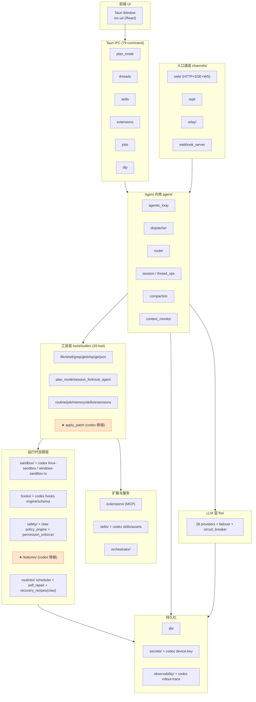
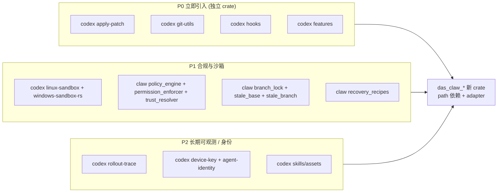
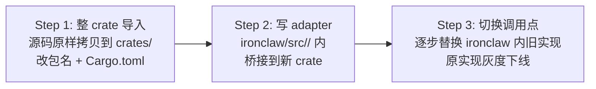
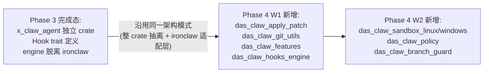

# 09 · 三库能力清单 × ironclaw 客户端现状 × 架构设计 × 迁移策略

> 基于 tokei + aider repo-map + 逐模块 `ls`/`grep` 验证产出。
> 前置文档: `08-three-tree-framework-overview.md` (commit `98c0eed9`)。
> 本文档回答三个问题：能力清单/重叠/丢弃 → 目标架构 → 零散 vs 模块为基座迁移策略。

## ⚠️ 关键自我更正 (必须先读)

先前多轮结论说"ironclaw 缺 Plan Mode / Session Fork / Sub-Agent / 33 tool 生态"。**代码实读结果: 全部已经实现**。

证据:

| 先前断言 | 实际状态 | 证据文件 |
|---|---|---|
| "缺 Plan Mode" | `PlanModeTool` 已实现 177 行含测试 | `desktop-client/ironclaw/src/tools/builtin/plan_mode.rs` |
| "缺 Session Fork" | `SessionForkTool` 已实现含 5 个测试 | `desktop-client/ironclaw/src/tools/builtin/session_fork.rs` |
| "缺 Sub-Agent" | `SubAgentTool` 已实现 Explore/Verify/Custom 三角色, MAX_DEPTH=1, per-role 工具白名单 | `desktop-client/ironclaw/src/tools/builtin/sub_agent.rs` |
| "工具生态薄弱" | **33 个 builtin tool** 已注册 | `desktop-client/ironclaw/src/tools/builtin/` |
| "客户端 IPC 层单薄" | **79 个 Tauri IPC command** 通过 `all_tauri_commands!` 宏注册 | `desktop-client/src/lib.rs:85-190` |
| "沙箱薄弱" | Sandbox 11 个文件 / 2,593 代码行 | `desktop-client/ironclaw/src/sandbox/` |
| "Hooks 薄弱" | Hooks 5 个文件 / 2,041 代码行 | `desktop-client/ironclaw/src/hooks/` |

**结论更正**: ironclaw 不是"需要大规模引入 codex/claw-code 能力", 而是"锁定几个真正的能力升级点 + 架构层对齐"。

---

## 1. 三库能力清单 (实测, 非推断)

### 1.1 codex (78 个 crate / 644k LOC)

**顶部 20 crate 按 LOC 排序**:

```
217,938  core              78,434  app-server       19,947  app-server-protocol
142,167  tui               15,712  protocol         13,615  exec-server
 12,768  state             12,545  windows-sandbox-rs  10,804  tools
 10,385  codex-api          9,911  rollout-trace     9,265  config
  8,876  network-proxy      8,454  login             8,101  rollout
  8,062  exec               7,282  rmcp-client       7,087  cli
  6,922  hooks              6,424  core-plugins
```

**按能力分组**:

| 组 | crate | ironclaw 是否已有 |
|---|---|---|
| **Agent 内核** | `core` (agent/, session/, tasks/, context_manager/, compact.rs, codex_thread.rs, thread_manager.rs) | ✅ 已有 `src/agent/*` (15 files) + `src/context/` |
| **工具系统** | `tools` (agent_tool, agent_job_tool, apply_patch_tool, code_mode, js_repl_tool, mcp_tool, mcp_resource_tool, plan_tool, request_user_input_tool, utility_tool, view_image, tool_registry_plan, tool_spec, tool_suggest) | ⚠️ 部分已有 (33 tool), 但缺 `code_mode` / `js_repl_tool` / `tool_registry_plan` / `request_user_input_tool` / `tool_suggest` |
| **Patch 协议** ⭐ | `apply-patch` (parser + invocation + seek_sequence + standalone_executable + lark 语法) | ❌ ironclaw 只有私有 `code_edit.rs`, 不是协议级 |
| **Git 工具** ⭐ | `git-utils` (ghost_commits, baseline, branch, apply, operations, platform) | ❌ ironclaw `tools/builtin/git/` 简化版 |
| **沙箱** | `linux-sandbox`, `windows-sandbox-rs` (12,545 LOC), `sandboxing`, `process-hardening` | ⚠️ 已有 `sandbox/` (2.6k LOC, 11 files), 但平台覆盖不够 |
| **Hooks** ⭐ | `hooks` (6,922 LOC: schema.rs, registry.rs, engine/, events/, types.rs, user_notification.rs, legacy_notify.rs) | ⚠️ 已有 `hooks/` (5 files, 2k LOC) 但缺 schema/engine 分离 |
| **Feature flags** ⭐ | `features` (feature_configs + legacy) | ❌ ironclaw 无统一 feature gate |
| **Skills 资产** | `skills` (assets/ 预置 skills + lib.rs) | ⚠️ 已有 `skills/` 但缺 codex 的 bundled asset 集 |
| **身份 / 安全** | `agent-identity`, `device-key`, `keyring-store`, `secrets`, `process-hardening` | ⚠️ 已有 `secrets/`, 缺 device-key / agent-identity |
| **可观测** | `rollout`, `rollout-trace`, `otel`, `analytics` | ⚠️ 已有 `observability/`, 缺 rollout-trace |
| **协议/客户端** | `protocol`, `codex-api`, `codex-client`, `app-server-protocol`, `mcp-server`, `rmcp-client`, `codex-mcp` | ⚠️ 已有 `channels/web/`, MCP 路径与 codex 不同 |
| **LLM providers** | `model-provider`, `model-provider-info`, `lmstudio`, `ollama`, `chatgpt`, `backend-client`, `aws-auth`, `connectors` | ✅ 已有 `llm/` (~28 个 provider 文件), 甚至更强 |
| **Exec / Shell** | `exec`, `exec-server`, `execpolicy`, `execpolicy-legacy`, `shell-command`, `shell-escalation` | ⚠️ `shell.rs` + `bash_validator` 已有 |
| **TUI 前端** ❌ | `tui` (142k LOC, ratatui) | ❌ ironclaw 走 Tauri+React **不需要** |
| **App-Server 后端** ❌ | `app-server` (78k LOC), `app-server-client`, `exec-server` | ❌ ironclaw 已有 `channels/web/` (40k LOC) **不需要** |
| **实验 / SaaS** ❌ | `cloud-tasks`, `cloud-tasks-client`, `cloud-tasks-mock-client`, `cloud-requirements`, `realtime-webrtc`, `v8-poc`, `responses-api-proxy`, `stdio-to-uds`, `uds`, `vendor` | ❌ 全部**不复制** (SaaS/实验/非办公) |
| **协作模板** | `collaboration-mode-templates` | ⚠️ 可选 |
| **反馈/调试** | `feedback`, `debug-client`, `response-debug-context`, `prompt_debug` | ⚠️ 可选, ironclaw 自有链路 |

### 1.2 claw-code (9 crate / 69.6k LOC)

**crate 列表**:

```
api/        commands/       compat-harness/   mock-anthropic-service/   plugins/
runtime/    rusty-claude-cli/  telemetry/    tools/
```

**特点**: 把几乎所有逻辑塞进 `runtime/src/` **扁平 44 个文件**, `tools/src/` 只有 3 个大文件 (lib.rs + lane_completion.rs + pdf_extract.rs, 共 9,639 LOC)。**这是反模式, 不宜整 crate 迁移**。

**runtime/ 的独特能力** (按价值排序):

| 文件 | 作用 | ironclaw 对应 | 价值 |
|---|---|---|---|
| `task_registry.rs` + `team_cron_registry.rs` | TaskRegistry 支撑 /team /subagent | `sub_agent.rs` 做了角色切片, 未做 registry | ⭐⭐ 参考模式 |
| `branch_lock.rs` | 分支排他锁 (多 agent 冲突) | ❌ 无 | ⭐⭐⭐ 企业并发关键 |
| `stale_base.rs` + `stale_branch.rs` | 检测过期 base / branch | ❌ 无 | ⭐⭐⭐ 长会话治理 |
| `green_contract.rs` | 交付绿色条件校验 | ❌ 无 | ⭐⭐ 质量门禁 |
| `policy_engine.rs` + `permission_enforcer.rs` | 策略引擎与执行器 | `safety/` (单 mod.rs) | ⭐⭐⭐ 合规核心 |
| `recovery_recipes.rs` | 错误恢复菜谱 | ❌ 无 | ⭐⭐ Fail-safe 升级 |
| `mcp_lifecycle_hardened.rs` + `mcp_tool_bridge.rs` | MCP 加固与工具桥接 | `extensions/` 做了另一套 | ⭐⭐ 参考模式 |
| `summary_compression.rs` + `compact.rs` | 上下文压缩两种模式 | `agent/compaction.rs` 已有 | ⭐ 参考 |
| `plugin_lifecycle.rs` | 插件生命周期 | `extensions/manager.rs` 已有 | ⭐ 参考 |
| `trust_resolver.rs` | 信任链解析 | ❌ 无 | ⭐⭐ 企业相关 |
| `session_control.rs` | 会话精细控制 | `agent/session.rs` | ⭐ 参考 |
| `worker_boot.rs` + `bootstrap.rs` | 启动时序 | `setup/` + `hooks/bootstrap.rs` | - |
| `lsp_client.rs` | LSP 客户端 | `tools/builtin/lsp/` 已有 | - |

**claw-code 不复制的部分**:

- `compat-harness/` (Anthropic 协议兼容测试套)
- `mock-anthropic-service/` (Mock 服务)
- `rusty-claude-cli/` (CLI 前端, ironclaw 用 Tauri)
- `tools/src/lane_completion.rs` + `pdf_extract.rs` (塞在一个 crate 里, 分开到 ironclaw tools 即可)

### 1.3 ironclaw 客户端当前能力 (桌面 + 服务端合体)

**桌面 Tauri 层** (`desktop-client/src/`):
- `all_tauri_commands!` 宏注册 **79 个 IPC command**
- 14 个 IPC 模块: `chat / threads / memory / skills / extensions / jobs / routines / approval / dlp / file_ops / logs / models / persistence / workspace / plan_mode`
- 关键命令: `ic_toggle_plan_mode` / `ic_approve_plan` / `ic_revise_plan` / `ic_fork_thread` / `scan_user_input` / `ic_undo_file_edit` / `ic_install_extension` / `ic_job_events` / `ic_routine_runs`
- Engine (`engine.rs`), safety bridge (`safety_bridge.rs`), DLP (`dlp/`)

**ironclaw 核心库** (`desktop-client/ironclaw/src/`, 232.7k LOC):

| 模块 | 文件数 | 核心职责 |
|---|---|---|
| `tools/builtin/` | **33 tool** | routine(2640) / job(2290) / shell(1541) / http(1486) / skill_tools(1323) / message(1067) / memory(974) / file(925) / extension_tools(829) / plus 24 个 |
| `agent/` | 15 | agent_loop + agentic_loop + dispatcher + router + session + submission + commands + compaction + context_monitor + undo + task + thread_ops + traits_impl + attachments |
| `channels/web/` | 2 层 handlers | 完整 Web Gateway (chat/jobs/memory/routines/skills/settings/tokens/users/webhooks/extensions/secrets/llm/static_files) |
| `llm/` | 28 | 20+ provider (codex_chatgpt / github_copilot / gemini_oauth / bedrock / nearai / openai_codex_provider) + failover + circuit_breaker + costs |
| `extensions/` | 4 | discovery + manager + registry + mod |
| `sandbox/` | 11 | agent_executor + config + container + detect + error + manager + proxy/ |
| `hooks/` | 5 | bootstrap + bundled + hook + mod + registry |
| `skills/` | 7 | catalog + gating + parser + registry + selector + attenuation |
| `routines/` | 8 | scheduler + cost_guard + heartbeat + job_monitor + routine + routine_engine + self_repair |
| `orchestrator/` | 5 | api + auth + job_manager + reaper |
| `safety/` | **1** ⚠️ | 仅 `mod.rs` |
| `secrets/` / `evaluation/` / `webhooks/` / `history/` / `workspace/` / `tunnel/` | 多 | 辅助 |

**子 crate** (`crates/`):
- `ironclaw_auth/` (共享认证)
- `ironclaw_workspace_cap/` (工作区能力)
- `x_claw_agent/` (agent 协议)

---

## 2. 重叠分析 × 取舍表

覆盖度评级: ✅ 已满足 / ⚠️ 部分缺口 / ❌ 完全缺口

| 能力主题 | codex | claw-code | ironclaw 现状 | 决策 |
|---|---|---|---|---|
| Agentic Loop | ✅ `core/agent` | ✅ runtime/agentic | ✅ `agent/agentic_loop.rs` | **不引入**, 保留自有 |
| Plan Mode | ✅ `plan_tool` | ✅ | ✅ `plan_mode.rs` + IPC | **不引入**, 已对等 |
| Session Fork | ⚠️ `codex_thread` | ✅ | ✅ `session_fork.rs` | **不引入** |
| Sub-Agent / 多 agent | ✅ `agent_tool` + `agent_job_tool` | ✅ task_registry | ✅ `sub_agent.rs` (Explore/Verify/Custom) | **不引入**, 可借鉴 registry 模式 |
| Compact 上下文 | ✅ `compact.rs` | ✅ 两种 | ✅ `agent/compaction.rs` | **不引入** |
| **Apply Patch 协议** | ✅ 独立 crate + lark 语法 | ⚠️ | ❌ 只有 `code_edit.rs` | **P0 引入**整 crate |
| **Git 工具加固** | ✅ `git-utils` (ghost_commits/baseline/branch) | ✅ branch_lock + stale | ⚠️ `tools/builtin/git/` | **P0 引入 codex git-utils + claw branch_lock + stale_*** |
| **Hooks 引擎** | ✅ schema + engine 分层 | ✅ hooks.rs | ⚠️ 5 文件无 schema 分离 | **P0 引入** codex hooks schema/engine |
| **Feature flags** | ✅ `features` crate | ❌ | ❌ 无统一 gate | **P0 引入** codex features crate |
| 沙箱 (Linux/Windows) | ✅ linux-sandbox + windows-sandbox-rs | ✅ sandbox.rs | ⚠️ 2.6k LOC 覆盖不全 | **P1 引入**两平台独立 crate |
| 企业合规策略 | ⚠️ safety.rs | ✅ policy_engine + permission_enforcer + trust_resolver | ⚠️ `safety/mod.rs` 单文件 | **P1 引入** claw policy_engine + trust_resolver |
| 降级恢复 | ⚠️ | ✅ recovery_recipes + self_repair | ⚠️ `routines/self_repair.rs` 已有 | **P1 融合** claw recovery_recipes |
| 设备/身份 | ✅ device-key + agent-identity | ❌ | ❌ | **P2 引入** codex device-key |
| Rollout-trace | ✅ 独立 crate | ❌ | ⚠️ `observability/` | **P2 引入** codex rollout-trace |
| Skills 资产 | ✅ bundled assets | ❌ | ⚠️ 无 bundled | **P2 引入** codex skills/assets |
| MCP 协议 | ✅ codex-mcp + rmcp-client | ✅ mcp_lifecycle_hardened | ✅ `extensions/` 自有 | **不引入**, 借鉴 hardened 思路 |
| LLM Providers | ✅ model-provider + ollama/lmstudio | ✅ oauth | ✅ 28 文件更全 | **不引入** |
| TUI 前端 | ✅ tui (142k) | ✅ CLI | ❌ Tauri GUI | ❌ **不复制** |
| App-Server / Exec-Server | ✅ 两个 crate (91k) | ❌ | ✅ `channels/web/` | ❌ **不复制** |
| 云任务 / 实时音视频 | ✅ cloud-tasks + realtime-webrtc | ❌ | ❌ | ❌ **不复制** (与政企合规目标冲突) |
| Mock / 测试辅助 | - | ✅ compat-harness + mock-anthropic | - | ❌ **不复制** (已有自有测试) |

**丢弃列表** (不复制, 明确):

1. `codex-cli-main/codex-rs/tui/` (142k LOC ratatui) — 我们是 Tauri GUI
2. `codex-cli-main/codex-rs/app-server/` + `app-server-client/` + `app-server-test-client/` + `exec-server/` — 已有 `channels/web/`
3. `codex-cli-main/codex-rs/cloud-tasks*` (4 个 crate) — SaaS, 与政企合规冲突
4. `codex-cli-main/codex-rs/realtime-webrtc/` — 音视频非办公场景
5. `codex-cli-main/codex-rs/v8-poc/` — 实验
6. `codex-cli-main/codex-rs/stdio-to-uds/` + `uds/` — IPC 桥接, Tauri 不需要
7. `codex-cli-main/codex-rs/responses-api-proxy/` — 自有 `channels/web/responses_api.rs`
8. `codex-cli-main/codex-rs/lmstudio/` + `ollama/` — ironclaw `llm/` 已更全
9. `codex-cli-main/codex-rs/feedback/` + `debug-client/` + `v8-poc/` + `codex-backend-openapi-models/` — 非核心
10. `claw-code/rust/crates/compat-harness/` + `mock-anthropic-service/` + `rusty-claude-cli/` — 测试辅助 / CLI 前端

---

## 3. 目标架构设计

### 3.1 分层视图



### 3.2 能力升级的 6 个锚点



### 3.3 目录规划 (最小改动原则)

> **命名规范 (用户决策)**: 新增的所有 crate 统一使用 `das_claw_*` 前缀;
> 存量 `ironclaw_*` crate (`ironclaw_auth`, `ironclaw_workspace_cap`) 和 `ironclaw/` 主库
> 后续分阶段改名为 `das_claw_*`, 本文档 Phase 4 只处理新增项。

```
x-claw/
├─ crates/                          # 共享 crate
│   ├─ ironclaw_auth/               # 保留 (后续改名 das_claw_auth)
│   ├─ ironclaw_workspace_cap/      # 保留 (后续改名 das_claw_workspace_cap)
│   ├─ x_claw_agent/                # 保留 (Phase 3 产出)
│   ├─ das_claw_apply_patch/        # ★ W1: 整 crate 从 codex apply-patch 移植
│   ├─ das_claw_git_utils/          # ★ W1: 整 crate 从 codex git-utils 移植
│   ├─ das_claw_hooks_engine/       # ★ W1: 整 crate 从 codex hooks 移植 schema+engine
│   ├─ das_claw_features/           # ★ W1: 整 crate 从 codex features 移植
│   ├─ das_claw_sandbox_linux/      # ★ W2: 从 codex linux-sandbox
│   ├─ das_claw_sandbox_windows/    # ★ W2: 从 codex windows-sandbox-rs
│   ├─ das_claw_policy/             # ★ W2: 聚合 claw policy_engine + permission_enforcer + trust_resolver
│   ├─ das_claw_branch_guard/       # ★ W2: 聚合 claw branch_lock + stale_base + stale_branch
│   ├─ das_claw_rollout_trace/      # ★ W3: 从 codex rollout-trace
│   └─ das_claw_device_identity/    # ★ W4: 从 codex device-key + agent-identity

├─ desktop-client/ironclaw/src/     # 现有主库 (**适配层在此**, 后续整体改名)
│   ├─ tools/builtin/
│   │   └─ apply_patch.rs           # 改写: 调用 das_claw_apply_patch
│   ├─ hooks/                       # 改写: 基于 das_claw_hooks_engine
│   ├─ safety/                      # 改写: 基于 das_claw_policy
│   ├─ sandbox/                     # 新增 linux/windows 分发层
│   └─ routines/
│       └─ recovery.rs              # ★ 新增: 封装 claw recovery_recipes
```

---

## 4. 迁移策略: 零散 vs 模块为基座

### 4.1 决策矩阵

| 源代码形态 | 推荐策略 | 原因 |
|---|---|---|
| **独立 Cargo crate** (codex apply-patch / git-utils / hooks / features / linux-sandbox / windows-sandbox-rs / rollout-trace / device-key) | **整 crate 迁移**, 作为 path 依赖 | 保持依赖图、测试、schema 完整; Apache-2.0 允许直接复用; 升级跟进方便 |
| **扁平单文件** (claw runtime/*.rs 如 branch_lock / stale_base / policy_engine) | **聚合新 crate**, 跨文件整合 | 原仓单文件碎, 没有 crate 边界; 新建 `ironclaw_policy / ironclaw_branch_guard` 聚合 |
| **工具类单个 .rs** (如 claw recovery_recipes) | **零散拷贝到现有模块** | 单文件强耦合特定场景; 不值得单起 crate |
| **跨仓算法实现** (如 compact/summary_compression) | **不迁移**, 仅借鉴思路 | ironclaw 自有 `compaction.rs`, 融合容易冲突 |

### 4.2 推荐整体策略: **"模块为基座 + 适配层" 为主, 零散拷贝为辅**

**三步法**:



**每个 P0 crate 的具体适配点**:

| 新 crate | ironclaw 适配点 | 灰度退役目标 |
|---|---|---|
| `das_claw_apply_patch` | `tools/builtin/code_edit.rs` 改调用 | 内部 patch 实现 |
| `das_claw_git_utils` | `tools/builtin/git/` 替换 | 简化 git 实现 |
| `das_claw_hooks_engine` | `hooks/{hook,registry}.rs` 改为薄适配 | 自写 hook 注册表 |
| `das_claw_features` | 新建 `src/features_gate.rs` | 全局 feature flag 空缺 |

### 4.3 不应做的事

1. ❌ **把 codex `core/` 整包拷贝**: 217k LOC, 包含 `agent/` / `session/` / `tasks/` — ironclaw 的 `agent/*` 已是可运行态, 替换风险极高。**只抽独立子能力 crate**。
2. ❌ **把 claw `runtime/*.rs` 一股脑拷过来**: 单文件耦合, 直接破坏 ironclaw 模块边界。**必须按能力主题重组到新 crate**。
3. ❌ **先做 TUI / app-server 对齐**: 142k + 78k LOC, **永不复制**, ironclaw 的 Tauri+channels/web 是更合适的方案。
4. ❌ **边移植边改逻辑**: 每次迁移应分两次 commit — 第一次"原样迁入"(测试必须全过), 第二次"改写适配"。

### 4.4 Licensing 确认

- **codex**: Apache-2.0, 允许直接 port; 需在新 crate 保留 NOTICE 与 LICENSE-APACHE。
- **claw-code**: 确认其 LICENSE 后再决定整合方式 (若非 Apache/MIT 则按 "参考不拷贝" 处理)。

---

## 5. 修订后的 Phase 4 路线图

| Wave | 周期 | 内容 | 产出 |
|---|---|---|---|
| **W1 · 基座** | 引入 apply-patch / git-utils / features / hooks | 4 个新 crate + 4 个 adapter | PR × 4 |
| **W2 · 合规沙箱** | 引入 linux-sandbox / windows-sandbox-rs + claw policy_engine 重构 safety | 4 个新 crate (sandbox_linux / sandbox_windows / policy / branch_guard) | PR × 4 |
| **W3 · 治理** | 引入 recovery_recipes 融合 self_repair, 引入 rollout-trace | 可观测闭环 | PR × 2 |
| **W4 · 身份** | 引入 device-key / agent-identity, skills bundled assets | 企业身份链 | PR × 2 |
| **W5 · 回归** | 契约/冒烟测试扩充, Tauri command 契约覆盖新能力 | 测试矩阵 | PR × 1 |

每个 Wave 出口条件: `cargo build --workspace` 0 错误 0 警告 + `cargo test --workspace` 全绿 + `integration_smoke_tests.rs` 通过。

---

## 6. 待用户决策 (已全部确定 ✅)

| # | 决策 | 结论 |
|---|---|---|
| 1 | 迁移顺序 | **W1 (apply-patch / git-utils / features / hooks) 起步** |
| 2 | 新 crate 命名 | **统一 `das_claw_*` 前缀**; 存量 `ironclaw_*` 后续分阶段改名 |
| 3 | claw-code LICENSE | **允许整 crate port**; W2 / W3 将直接原样迁入 |

---

## 7. Phase 3 架构重构的延续性 (补充)

**问: 之前做的架构重构还能用上吗?**

**答: 全部延续, 且 Phase 4 正好是它的自然延伸。**

Phase 3 的成果 (已落地, commit `26f4b11f`):

- `crates/x_claw_agent/` 独立 crate (17 个文件) 从 ironclaw 主包抽出 agent 引擎
- `agentic_loop` / `session_manager` / `intent` / `reasoning_ctx` 等从 `ironclaw/src/agent/` port 到独立 crate
- `agentic_loop.rs` Route-B 设计: 去除 `Reasoning` 依赖, 引擎只看 `RespondOutput`
- Hook traits (`SafetyHook` / `SandboxExecutor` / `SecretProvider` / `ApprovalGate`) 在 `x_claw_agent::hooks` 定义
- `bash_validation` / `permissions` 已从 claw-code 原样 port 进来
- `desktop-client/ironclaw/src/agent/agentic_loop.rs` 退化为 **re-export shim**

**Phase 4 对 Phase 3 的关系**:



Phase 3 验证了 **"抽独立 crate + 在 ironclaw 写适配 shim"** 的模式是可行的, 所以 Phase 4 就直接按同样思路扩展新能力。**不需要重新架构重构, 只需要按这个模式持续加 crate**。

---

## 8. ironclaw agent 血缘澄清 (补充)

**问: 客户端的 ironclaw agent 能力是不是从 claw-code 搬迁过来?**

**答: 部分是, 部分不是。证据来自 `crates/x_claw_agent/` 内的源码注释。**

| 组件 | 来源 | 证据注释 |
|---|---|---|
| `x_claw_agent::lib.rs` | **fork of claw-code** | `//! x_claw_agent — agent runtime fork of claw-code for the x-claw project.` |
| `bash_validation.rs` | **claw-code 原样 port** | `//! - Source: claw-code/rust/crates/runtime/src/bash_validation.rs` |
| `permissions.rs` | **claw-code 切片 port** | `//! This module is a deliberately sliced port of upstream claw-code's ...` |
| `agentic_loop.rs` | **ironclaw 自有, Phase 3 时 port 进来** | `//! Ported from ironclaw agent/agentic_loop.rs as part of Phase 3 Step D-4.` |
| `session_manager.rs` | **ironclaw 自有** | `//! Ported from ironclaw's src/agent/session_manager.rs (Phase 3 Step D-5)` |
| `intent.rs` | **ironclaw 自有** | `//! Ported from ironclaw llm/reasoning.rs as part of Phase 3 Step D-4.` |
| `reasoning_ctx.rs` | **ironclaw 自有** | `//! Ported from ironclaw::llm::reasoning::ReasoningContext` |
| `hooks.rs` | **新写, 零依赖** | `//! No ironclaw / claw-code dependency. Traits use only std, serde_json, ...` |

**结论**:

- **血缘真相**: x_claw_agent 的骨架是"**claw-code fork 作为容器 + ironclaw 原生 engine 注入**"的混合体
- **`bash_validation` / `permissions`** 来自 claw-code
- **`agentic_loop` / `session_manager` / `intent` / `reasoning_ctx` / `compaction` / `context_monitor` / `undo` / `submission` / `task`** 来自 ironclaw 原生实现
- **`hooks` trait** 是 Phase 3 为解耦新写的

Phase 4 的策略与这个历史事实一致: **对 codex/claw-code 已有独立 crate 的能力**, 继续走"整 crate 导入 + adapter"路线; **对 ironclaw 原生成熟的能力** (agentic loop / session / dispatcher / 33 builtin tool), **保留不动**。

---

## 附录 · 证据索引

| 断言 | 证据位置 |
|---|---|
| codex 78 crate | `codex-cli-main/codex-rs/` 下 `find -maxdepth 2 -name Cargo.toml` |
| codex core 217k LOC | `tokei codex-cli-main/codex-rs/core` |
| codex tui 142k LOC | `tokei codex-cli-main/codex-rs/tui` |
| claw-code runtime 扁平 44 文件 | `ls claw-code/rust/crates/runtime/src/` |
| ironclaw 33 builtin tool | `ls desktop-client/ironclaw/src/tools/builtin/*.rs` |
| 79 IPC command | `desktop-client/src/lib.rs:85-190` |
| sub_agent 三角色 | `desktop-client/ironclaw/src/tools/builtin/sub_agent.rs:1-120` |
| plan_mode 已实装 | `desktop-client/ironclaw/src/tools/builtin/plan_mode.rs` (177 行) |
| session_fork + 5 测试 | `desktop-client/ironclaw/src/tools/builtin/session_fork.rs` |
| Repo-maps (可复用) | `/tmp/xclaw-analysis/repomap-{claw,codex,ironclaw}.txt` (10,601 行) |
