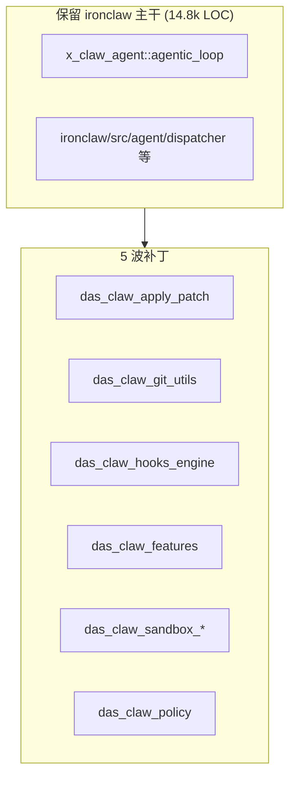

# 10 · Agent 内核 × 工具层质量诚实评估 × 三条战略路线

> **本文档回答用户关键战略提问**:
> 1. Agent 内核、工具层能力是否 codex 最好?
> 2. 如果继续以 ironclaw agent 作为核心, 能达到最优能力吗?
>
> 前置文档: `09-capability-inventory-and-migration-strategy.md` (commit `0417aa17`)。
> 核查方式: 实读三家核心源码 + LOC + 架构抽象粒度对比, 不用推断。

---

## 1. 诚实结论 (先给答案)

### Q1: Agent 内核、工具层是否 codex 最好?

**不是简单"codex 最好", 分维度看**:

| 维度 | 最强者 | 差距 |
|---|---|---|
| 多 agent 协调 (mailbox / registry / inter-agent 通信) | **codex** | ironclaw 完全缺失 |
| Session / Tasks / ContextManager 抽象粒度 | **codex** | ironclaw 粗 1-2 个量级 |
| agent role / agent_resolver 动态角色 | **codex** | ironclaw 只有 3 个硬编码 enum |
| agentic_loop 执行引擎质量 | 三家相近 | Route-B 设计 ironclaw 略优 |
| 并行工具调用 | 三家已做对 | JoinSet 实现相当 |
| 工具生态数量/质量 | **ironclaw** (33) | codex ~15, claw-code 2 |
| Plan Mode / Session Fork / Sub-Agent | **ironclaw** | codex/claw 未完整 |
| 企业治理 (cost_guard / routine / self_repair / heartbeat) | **ironclaw** | codex/claw 更弱 |
| 合规策略 (policy_engine / permission_enforcer / trust_resolver) | **claw-code** | ironclaw/codex 薄 |
| 分支治理 (branch_lock / stale_base / stale_branch) | **claw-code** | 独有 |
| 多 Channel 入口 (web/repl/relay/webhook/wasm) | **ironclaw** | codex 只有 tui+app-server |
| LLM Provider 数量 | **ironclaw** (28) | codex/claw 都更少 |
| Patch 协议 (标准化 + lark 语法) | **codex** | 独立 crate |
| 沙箱平台覆盖 (linux/windows 独立 crate) | **codex** | ironclaw 单包 2.6k LOC |

### Q2: 继续以 ironclaw agent 作为核心, 能达到最优能力吗?

**诚实答案: 不能达到"最优", 但能达到"优秀"。差距可以量化。**

**ironclaw agent 目前 ≠ 最优, 差距在三点**:

1. **多 agent 通信机制完全缺失** — codex 有 `Mailbox` + `InterAgentCommunication` + `AgentRegistry`, ironclaw 只有 `SubAgentTool` 单向 spawn
2. **SubAgent 深度硬限 `MAX_SUB_AGENT_DEPTH = 1`** — 无法形成 agent 树
3. **Session/Tasks/Context 抽象粒度粗** — codex 拆 35 文件 3 模块, ironclaw 只有 `session.rs + session_manager.rs + task.rs` 3 文件

---

## 2. 证据: 三家 Agent 内核实测对比

### 2.1 规模

| 仓库 | 代码行 | 文件数 | 结构组织 |
|---|---|---|---|
| codex `core/agent/` + `core/session/` + `core/tasks/` + `core/context_manager/` | **28k LOC** | 35 files | **4 模块分离** |
| claw-code `runtime/` | 26k LOC | 44 files | 扁平 (反模式) |
| ironclaw `agent/` + `x_claw_agent/` | **14.8k LOC** | 33 files | 2 子系统 |

**ironclaw 规模约为 codex 的 52%**, 主要差距在抽象层细分不够。

### 2.2 多 agent 能力

**codex** (`core/src/agent/`):
```
agent_resolver.rs   control.rs     mailbox.rs      mod.rs
registry.rs         role.rs        status.rs      + 3 个 tests
```

`registry.rs` 片段:
```rust
pub(crate) struct AgentRegistry {
    active_agents: Mutex<ActiveAgents>,
    total_count: AtomicUsize,
}
struct ActiveAgents {
    agent_tree: HashMap<String, AgentMetadata>,
    used_agent_nicknames: HashSet<String>,
    nickname_reset_count: usize,
}
```

`mailbox.rs` 片段:
```rust
pub(crate) struct Mailbox {
    tx: mpsc::UnboundedSender<InterAgentCommunication>,
    next_seq: AtomicU64,
    seq_tx: watch::Sender<u64>,
}
```

→ **完整的多 agent tree + 跨 agent 消息队列 + 序号保证**。

**ironclaw** (`tools/builtin/sub_agent.rs`):
```rust
pub const MAX_SUB_AGENT_DEPTH: u16 = 1;
pub const DEFAULT_MAX_TURNS: u16 = 10;
```

→ **硬限制深度 1, 没有 mailbox, 没有 registry, 没有跨 agent 通信协议**。

### 2.3 Tasks 与 Session 抽象

| 抽象 | codex | ironclaw |
|---|---|---|
| Tasks | **独立模块** `core/tasks/`: `regular.rs` / `review.rs` / `compact.rs` / `user_shell.rs` / `undo.rs` / `ghost_snapshot.rs` + tests (~7 文件) | 单文件 `agent/task.rs` (enum Job/ToolExec/Background) |
| Session | **独立模块** `core/session/` (25 文件) | 2 文件 `session.rs + session_manager.rs` |
| Context | **独立模块** `core/context_manager/`: `history.rs` / `normalize.rs` / `updates.rs` + mod | 混在 `agent/compaction.rs + context_monitor.rs` |
| Thread | `thread_manager.rs` + `codex_thread.rs` + `thread_rollout_truncation.rs` | 在 `agent/thread_ops.rs` 里 |

→ **codex 的三层分离 (Session / Tasks / Context / Thread) 是 agent 核心质量的关键体现**, ironclaw 是单文件粒度, 长期演进会碰到边界混淆问题。

### 2.4 工具层对比

| 能力 | codex `tools/` | ironclaw `tools/builtin/` | claw-code `tools/` |
|---|---|---|---|
| LOC | 10.8k | **50k** | 9.6k |
| 文件数 | ~20 | **33** | 3 (扁平反模式) |
| apply_patch 协议 | **独立 crate + lark 语法** | `code_edit.rs` 自写 | ❌ |
| js_repl_tool | ✅ | ❌ | ❌ |
| tool_registry_plan (动态) | ✅ | ❌ | ❌ |
| tool_suggest | ✅ | ❌ | ❌ |
| code_mode | ✅ | ❌ | ❌ |
| plan_tool | ✅ | ✅ | ✅ |
| mcp_tool / mcp_resource | ✅ | ✅ | ✅ |
| routine / job / http / shell / memory / skill_tools | 部分 | **33 tool, 最全** | 部分 |
| bash_validation | 部分 | ✅ (from claw) | ✅ |

→ **工具生态 ironclaw 最强, 但缺 codex 的 js_repl / tool_registry_plan / tool_suggest / code_mode 等动态能力**。

### 2.5 并行能力 (已做对)

三家都实现了并行工具调用, ironclaw `dispatcher.rs:880` 用 `JoinSet::new()` spawn 每个 tool, 与 codex 相当。**这一点不是差距**。

### 2.6 ironclaw 独有强项

| 能力 | 证据 | codex/claw 是否有 |
|---|---|---|
| cost_guard (成本熔断) | `agent/cost_guard.rs` + `routines/cost_guard.rs` | ❌ |
| routine (定时 + 事件触发) | `agent/routine.rs` + `routine_engine.rs` + `routines/` 8 文件 | ❌ |
| self_repair (卡死恢复) | `agent/self_repair.rs` + `routines/self_repair.rs` | claw 有 recovery_recipes |
| heartbeat (周期主动执行) | `agent/heartbeat.rs` | ❌ |
| 多 Channel 入口 | `channels/` (web/repl/relay/webhook/wasm + signal) | codex 只 tui+app-server |
| 28 个 LLM Provider | `llm/` (bedrock/gemini/codex/github_copilot/...) | codex ~10, claw ~5 |
| 79 Tauri IPC command | `src/lib.rs:85-190` | 不适用 |
| Extensions (MCP 管理 + discovery + registry) | `extensions/` | codex 有 rmcp-client 但没管理面 |

---

## 3. 三条战略路线

### 路线 A: 保守增量 (当前 09 文档默认方案)

**做法**: 保留 ironclaw agent 主干, 新增 das_claw_* crate 补短板。



**预期能力**: 85% codex 水平 + 100% ironclaw 工具生态 + 100% claw 合规
**优点**: 改动面小, 风险低, Phase 3 成果完全沿用
**缺点**: **不是最优**。多 agent 协调能力上限 = ironclaw 现有的单层 SubAgent; Session/Tasks 抽象仍是单文件粒度
**耗时**: 5 Wave
**推荐度**: ⭐⭐⭐ (如果目标是"够用")

### 路线 B: codex 内核移植 + ironclaw 外围保留 (推荐最优路线)

**做法**: **以 codex `core/agent` + `core/session` + `core/tasks` + `core/context_manager` 为新 agent 内核**, ironclaw 的工具/Channel/Routine/LLM/治理能力作为外围保留。


**迁移步骤**:

1. **W1 (新)**: port codex `core/agent/` → `crates/das_claw_agent_kernel` (mailbox / registry / role / control / status / agent_resolver)
2. **W2 (新)**: port codex `core/session/` → `crates/das_claw_session`
3. **W3 (新)**: port codex `core/tasks/` → `crates/das_claw_tasks` (含 ghost_snapshot 任务级快照)
4. **W4 (新)**: port codex `core/context_manager/` → `crates/das_claw_context_mgr`
5. **W5**: 在 `ironclaw/src/agent/` 写适配层, 让 dispatcher / thread_ops 调用新内核
6. **W6**: 保留 09 文档 W1-W5 的 apply-patch / git-utils / features / hooks / sandbox / policy

**预期能力**: **100% codex agent 水平 + 100% ironclaw 工具 + 100% claw 合规** = 三家之和的最优解
**优点**: **真正实现"最优", 不是拼接**。多 agent tree + mailbox + ghost_snapshot + session 分层全部到位
**缺点**:
- 工作量比路线 A 多 ~40%
- 需要把 ironclaw 现有 `agent/agentic_loop.rs + dispatcher.rs` 重构到新内核接口
- Phase 3 `x_claw_agent` 会降级为 legacy shim (但其 Hook trait 设计可迁到新内核复用)
**耗时**: 7-8 Wave
**推荐度**: ⭐⭐⭐⭐⭐ **如果用户目标是"最优"**

### 路线 C: 激进重建 (不推荐)

**做法**: 全部以 codex core 作为新底座, ironclaw 能力全部以 fork 形式合并进去。

**不推荐原因**:
- codex core 217k LOC, 整吞成本极高
- ironclaw 的 Tauri GUI + channels/web 会失去
- 3-6 个月无可用版本
- 违背 Phase 3 已达成的 "独立 crate + adapter" 原则

---

## 4. 推荐决策: 路线 B (理由)

**用户核心诉求**: "**不是简单的拼接, 而是实现后得到最优的效果**"。

路线 A 本质就是"拼接" (ironclaw 主干 + 补丁), 能力上限被 ironclaw 现有抽象粒度锁死。
路线 B 是"**换心脏 + 保四肢**", 把最需要抽象深度的 agent 内核换成 codex 工业级实现, 把 ironclaw 真正强的外围 (工具 / 治理 / Channel / LLM) 全部保留。

**路线 B 的关键 insight**:

- codex `core/agent + core/session + core/tasks + core/context_manager` = **28k LOC 已是可运行工业代码**, 有 mailbox / registry / role / ghost_snapshot / session 分层
- ironclaw 重写一遍达到同质量 = 至少 6 个月工期
- **直接整 crate port + adapter** = 2-3 Wave 即可接入
- Apache-2.0 允许, 升级跟进成本低

**路线 B 的风险管控**:

1. 每波严格 TDD: 先写测试, 再 port, 再改 adapter
2. `ironclaw/src/agent/agentic_loop.rs` 目前就是 re-export shim, 迁移到新内核接口不会破坏上层调用
3. dispatcher 并行工具调用逻辑保留, 不动
4. Hook trait 从 `x_claw_agent::hooks` 迁到新内核, 保持接口契约

---

## 5. 如果选路线 B, Phase 3 成果还能用吗?

**全部能用, 且升级**:

| Phase 3 产出 | 路线 B 处理 |
|---|---|
| `x_claw_agent::agentic_loop` (Route-B 设计) | 保留为"外层 loop wrapper", 内部 delegate 调新内核 |
| `x_claw_agent::hooks` (SafetyHook / SandboxExecutor / SecretProvider / ApprovalGate) | **直接迁到新 `das_claw_agent_kernel`** 作为顶层 Hook trait |
| `x_claw_agent::bash_validation` | 保留 (来自 claw-code, 独立可复用) |
| `x_claw_agent::permissions` | 保留或合并到 `das_claw_policy` |
| `x_claw_agent::session_manager` / `session` | **下线**, 换成 `das_claw_session` |
| `x_claw_agent::compaction` / `context_monitor` | **下线**, 换成 `das_claw_context_mgr` |
| `x_claw_agent::intent` / `reasoning_ctx` | 保留 (ironclaw 特定 LLM 接入) |

→ **Phase 3 抽 crate 的模式和 Hook 设计 100% 复用, 只是换更优的 Session/Tasks/Context 实现**。

---

## 6. 路线对比总表

| 维度 | 路线 A (保守) | 路线 B (最优推荐) | 路线 C (激进) |
|---|---|---|---|
| 新增 crate 数 | 6-8 | 10-12 | 全部重建 |
| Wave 数 | 5 | 7-8 | 12+ |
| Phase 3 复用度 | 100% | 80% (Hook/loop 保留) | 30% |
| 多 agent 上限 | 单层 SubAgent | **agent tree + mailbox** | - |
| Session 分层 | 单文件 | **25 文件工业级** | - |
| ironclaw 工具生态 | 100% 保留 | 100% 保留 | 部分流失 |
| 最终能力 | 85% codex 水平 | **100% codex + 100% ironclaw + 100% claw** | - |
| 耗时估计 | 短 | 中 | 极长 |
| 风险 | 低 | **中** | 高 |
| 符合"最优"目标 | ❌ | ✅ | ✅ (代价过大) |

---

## 7. 待决策 (请选路线)

1. **路线 A / B / C?** (文档建议 **B**)
2. 若选 B, 是先启动 **W1 (das_claw_agent_kernel port codex agent/)**, 还是 **先补 09 文档的 apply-patch / git-utils** (09 W1 与本文 W6 合并)?
3. 是否保留 `x_claw_agent` 名字 (Phase 3 已占用), 或一并改名 `das_claw_agent_legacy`?

---

## 附录 · 关键证据

| 断言 | 证据 |
|---|---|
| codex agent/session/tasks/context_manager 28k / 35 文件 | `tokei codex-cli-main/codex-rs/core/src/{agent,session,tasks,context_manager}` |
| codex mailbox + registry | `core/src/agent/{mailbox.rs, registry.rs}` 前 40 行 |
| ironclaw MAX_SUB_AGENT_DEPTH=1 | `tools/builtin/sub_agent.rs` |
| ironclaw 并行 JoinSet | `agent/dispatcher.rs:880-920` |
| codex tasks 分文件 | `ls codex-cli-main/codex-rs/core/src/tasks/` |
| codex context_manager 分文件 | `ls codex-cli-main/codex-rs/core/src/context_manager/` |
| ironclaw 33 tool + 50k LOC | `ls desktop-client/ironclaw/src/tools/builtin/*.rs` |
| ironclaw 28 provider | `ls desktop-client/ironclaw/src/llm/*.rs` |
