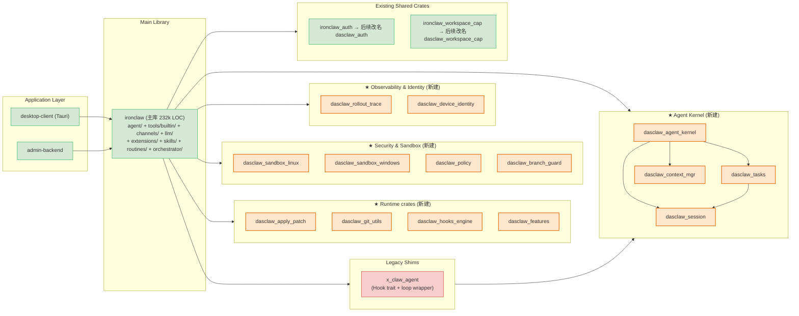
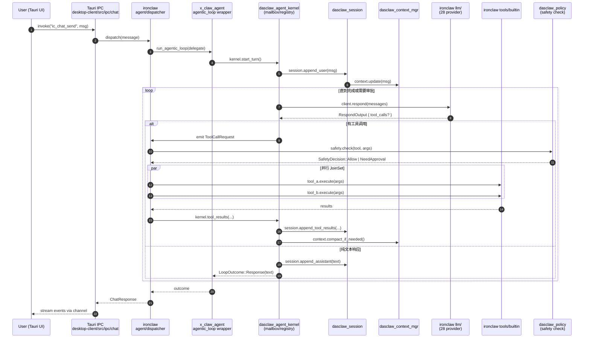
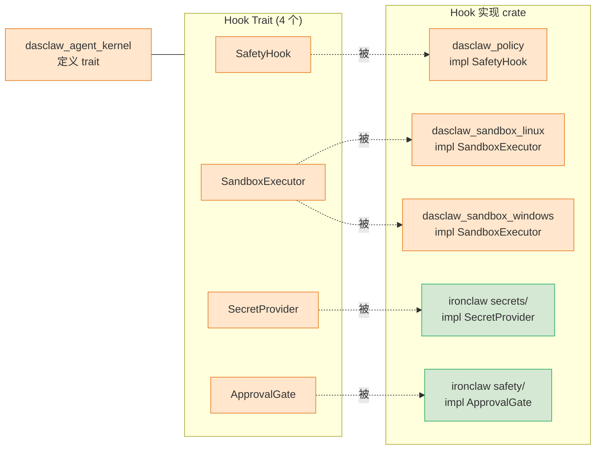

# 11 · 路线 B 目标架构设计 (供仔细 Review)

> 本文档专注**目标架构**, 不重复 09/10 的能力清单与质量评估。
> 路线 B = codex 内核 port + ironclaw 外围保留 + claw-code 能力源聚合。
> 命名规范: 新 crate 统一 `dasclaw_*` 前缀; 存量 `ironclaw_*` 后续分阶段改名。

---

## 1. 总览: 五层架构

```mermaid
flowchart TB
    subgraph L1["L1 · 用户入口 (UI)"]
        UI1["Tauri Window<br/>desktop-client/src-ui (React)"]
        UI2["Web Browser"]
        UI3["REPL CLI"]
        UI4["Webhook Caller"]
    end

    subgraph L2["L2 · 通信层 (Channels & IPC)"]
        IPC["Tauri IPC<br/>desktop-client/src/ipc/<br/>(79 command, 14 module)"]
        WEB["channels/web/<br/>(HTTP+SSE+WS+OpenAI 兼容)"]
        REPL["channels/repl/"]
        WH["channels/webhook_server"]
        RELAY["channels/relay/"]
    end

    subgraph L3["L3 · 编排层 (Agent Orchestration)"]
        DISP["ironclaw agent/dispatcher.rs<br/>★ 并行 JoinSet 工具调度<br/>★ 保留, 内部调用 L4 kernel"]
        ROUT["ironclaw agent/router.rs<br/>(/command 路由)"]
        SUB["ironclaw agent/submission.rs<br/>(用户输入解析)"]
        ROUTINE["ironclaw routines/<br/>scheduler + cron + event"]
        ORCH["ironclaw orchestrator/<br/>job_manager + reaper"]
    end

    subgraph L4["L4 · Agent 内核 (★ 路线 B 新建, codex port)"]
        K1["dasclaw_agent_kernel<br/>← codex core/agent<br/>★ mailbox + registry + role"]
        K2["dasclaw_session<br/>← codex core/session<br/>(25 文件分层)"]
        K3["dasclaw_tasks<br/>← codex core/tasks<br/>(含 ghost_snapshot)"]
        K4["dasclaw_context_mgr<br/>← codex core/context_manager"]
        WRAP["x_claw_agent (legacy)<br/>agentic_loop wrapper<br/>+ Hook trait → 迁到 K1"]
    end

    subgraph L5["L5 · 工具与运行时 (Tools & Runtime)"]
        TOOLS["ironclaw tools/builtin/<br/>33 builtin tool · 50k LOC<br/>★ 100% 保留"]
        APPLY["dasclaw_apply_patch<br/>← codex apply-patch"]
        GIT["dasclaw_git_utils<br/>← codex git-utils"]
        HOOKS["dasclaw_hooks_engine<br/>← codex hooks"]
        FEAT["dasclaw_features<br/>← codex features"]
        SANDLIN["dasclaw_sandbox_linux"]
        SANDWIN["dasclaw_sandbox_windows"]
        POL["dasclaw_policy<br/>← claw policy_engine + 等"]
        BRANCH["dasclaw_branch_guard<br/>← claw branch_lock + stale_*"]
        EXT["ironclaw extensions/<br/>+ claw mcp_lifecycle_hardened"]
        SKILL["ironclaw skills/<br/>+ codex skills/assets"]
    end

    subgraph L6["L6 · 持久化与服务 (Infra)"]
        LLM["ironclaw llm/<br/>28 provider + failover<br/>★ 100% 保留"]
        DB["ironclaw db/"]
        SEC["ironclaw secrets/<br/>+ dasclaw_device_identity"]
        OBS["ironclaw observability/<br/>+ dasclaw_rollout_trace"]
        AUTH["crates/ironclaw_auth"]
        WS["crates/ironclaw_workspace_cap"]
    end

    UI1 --> IPC
    UI2 --> WEB
    UI3 --> REPL
    UI4 --> WH

    IPC --> DISP
    WEB --> DISP
    REPL --> DISP
    WH --> DISP
    RELAY --> DISP

    DISP --> ROUT
    DISP --> SUB
    ROUTINE --> DISP
    ORCH --> DISP

    DISP --> WRAP
    WRAP --> K1
    K1 --> K2
    K1 --> K3
    K1 --> K4

    DISP --> TOOLS
    TOOLS --> APPLY
    TOOLS --> GIT
    TOOLS --> HOOKS
    TOOLS --> FEAT
    TOOLS --> SANDLIN
    TOOLS --> SANDWIN
    TOOLS --> POL
    TOOLS --> BRANCH
    TOOLS --> EXT
    TOOLS --> SKILL

    K1 --> LLM
    K2 --> DB
    OBS -.观察.-> K1
    SEC -.读密钥.-> TOOLS
    AUTH -.认证.-> WEB
    WS -.工作区.-> TOOLS

    classDef newCap fill:#ffe6cc,stroke:#e67e22,stroke-width:2px
    classDef retained fill:#d5e8d4,stroke:#27ae60
    classDef legacy fill:#f8cecc,stroke:#c0392b
    class K1,K2,K3,K4,APPLY,GIT,HOOKS,FEAT,SANDLIN,SANDWIN,POL,BRANCH newCap
    class TOOLS,LLM,DISP,WEB,IPC,EXT,SKILL,ROUTINE,ORCH retained
    class WRAP legacy
```



**色标**:
- 🟧 橙色: 新建 `dasclaw_*` crate (路线 B 新增, 14 个)
- 🟩 绿色: ironclaw 100% 保留模块
- 🟥 红色: legacy (保留为 wrapper, 部分内部下线)

---

## 2. Crate 依赖关系图



---

## 3. 数据流: 一次用户消息的处理路径



---

## 4. 多 Agent 协调架构 (路线 B 的最大升级点)

```mermaid
flowchart TB
    subgraph main_session["主会话 Session A"]
        MA["Main Agent A<br/>(role: planner)"]
    end

    subgraph kernel_inner["dasclaw_agent_kernel"]
        REG["AgentRegistry<br/>HashMap&lt;agent_id, AgentMetadata&gt;<br/>active_agents tree<br/>nicknames"]
        MBA["Mailbox A<br/>mpsc + watch + seq"]
        MBB["Mailbox B"]
        MBC["Mailbox C"]
        MBD["Mailbox D"]
    end

    subgraph subs["Sub-Agents (无深度限制)"]
        SA["Sub-Agent B<br/>(role: explore)"]
        SB["Sub-Agent C<br/>(role: verify)"]
        SC["Sub-Agent D<br/>(role: custom)"]
        SD["Sub-Sub-Agent E<br/>(由 D spawn)"]
    end

    MA <-->|InterAgentCommunication| MBA
    SA <--> MBB
    SB <--> MBC
    SC <--> MBD
    SD <--> MBD

    REG -.管理.-> MBA & MBB & MBC & MBD
    REG -.tree.-> MA & SA & SB & SC & SD

    MA -->|spawn| SA
    MA -->|spawn| SB
    MA -->|spawn| SC
    SC -->|spawn (depth 2+)| SD

    classDef new fill:#ffe6cc,stroke:#e67e22,stroke-width:2px
    class REG,MBA,MBB,MBC,MBD new
```

**对比 ironclaw 现状**:

| 能力 | ironclaw 现状 | 路线 B 后 |
|---|---|---|
| Agent 注册表 | ❌ 无 | ✅ `AgentRegistry` 维护活跃 agent + nickname + metadata |
| Agent 间通信 | ❌ 无, 仅父→子单向 spawn | ✅ `Mailbox` mpsc + watch + 序号保证 |
| Agent 树 | ❌ 平铺 | ✅ `agent_tree: HashMap<String, AgentMetadata>` |
| 深度限制 | `MAX_SUB_AGENT_DEPTH = 1` | ✅ 移除硬限, 由 registry 配额管控 |
| 角色解析 | 3 个硬编码 enum (Explore/Verify/Custom) | ✅ `agent_resolver.rs` 动态加载 + role registry |

---

## 5. Hook 注入点 (Phase 3 设计延续)

Phase 3 已在 `x_claw_agent::hooks` 定义 4 个 Hook trait, 路线 B 把它们**迁到 `dasclaw_agent_kernel` 顶层**, 接口契约不变, 实现层下沉到新 crate。



---

## 6. 文件级目录规划 (最终态)

```
x-claw/
├─ Cargo.toml                          # workspace root
├─ crates/                             # 共享 crate (16 个)
│   ├─ ironclaw_auth/                  # 保留, 后续改名 dasclaw_auth
│   ├─ ironclaw_workspace_cap/         # 保留, 后续改名 dasclaw_workspace_cap
│   ├─ x_claw_agent/                   # legacy: 仅保留 agentic_loop wrapper + bash_validation + permissions
│   │
│   ├─ dasclaw_agent_kernel/           # ★ W1: codex core/agent port (5.8k)
│   │   └─ src/
│   │       ├─ lib.rs
│   │       ├─ registry.rs             # AgentRegistry / ActiveAgents / AgentMetadata
│   │       ├─ mailbox.rs              # Mailbox / MailboxReceiver (mpsc+watch+seq)
│   │       ├─ control.rs              # AgentControl
│   │       ├─ role.rs                 # AgentRole / RoleRegistry
│   │       ├─ status.rs
│   │       ├─ agent_resolver.rs
│   │       └─ hooks.rs                # ← 从 x_claw_agent 迁来 (4 个 trait)
│   │
│   ├─ dasclaw_session/                # ★ W2: codex core/session port (~15k, 25 文件)
│   ├─ dasclaw_tasks/                  # ★ W3: codex core/tasks port (3k, 含 ghost_snapshot)
│   ├─ dasclaw_context_mgr/            # ★ W4: codex core/context_manager port (2k)
│   │
│   ├─ dasclaw_apply_patch/            # ★ W5: codex apply-patch (2k)
│   ├─ dasclaw_git_utils/              # ★ W5: codex git-utils (3k)
│   ├─ dasclaw_hooks_engine/           # ★ W6: codex hooks (6.9k schema+engine)
│   ├─ dasclaw_features/               # ★ W6: codex features (1k feature flag)
│   │
│   ├─ dasclaw_sandbox_linux/          # ★ W7: codex linux-sandbox
│   ├─ dasclaw_sandbox_windows/        # ★ W7: codex windows-sandbox-rs (12.5k)
│   ├─ dasclaw_policy/                 # ★ W8: claw policy_engine+permission_enforcer+trust_resolver 聚合
│   ├─ dasclaw_branch_guard/           # ★ W8: claw branch_lock+stale_base+stale_branch 聚合
│   │
│   ├─ dasclaw_rollout_trace/          # ★ W9: codex rollout-trace
│   └─ dasclaw_device_identity/        # ★ W9: codex device-key + agent-identity

├─ desktop-client/
│   ├─ src/                            # Tauri 层 (79 IPC, 14 module) — ★ 100% 保留
│   │   ├─ lib.rs                      # all_tauri_commands! 宏
│   │   ├─ ipc/                        # chat/threads/skills/extensions/jobs/...
│   │   ├─ engine.rs
│   │   ├─ safety_bridge.rs
│   │   ├─ dlp/
│   │   └─ src-ui/                     # React 前端
│   │
│   └─ ironclaw/src/                   # 主库 232k LOC — ★ 大部分保留
│       ├─ agent/
│       │   ├─ agentic_loop.rs         # re-export shim (沿用)
│       │   ├─ dispatcher.rs           # 并行 JoinSet 调度 (★ 保留, 内部调 kernel)
│       │   ├─ router.rs               # ★ 保留
│       │   ├─ submission.rs           # ★ 保留
│       │   ├─ thread_ops.rs           # 重写: 调 dasclaw_session
│       │   ├─ commands.rs             # ★ 保留
│       │   ├─ session.rs              # ❌ 下线 (换 dasclaw_session)
│       │   ├─ session_manager.rs      # ❌ 下线
│       │   ├─ task.rs                 # ❌ 下线 (换 dasclaw_tasks)
│       │   ├─ compaction.rs           # ❌ 下线 (换 dasclaw_context_mgr)
│       │   ├─ context_monitor.rs      # ❌ 下线
│       │   ├─ self_repair.rs          # ★ 保留 (合并 claw recovery_recipes)
│       │   ├─ heartbeat.rs            # ★ 保留 (ironclaw 独有)
│       │   ├─ cost_guard.rs           # ★ 保留 (ironclaw 独有)
│       │   ├─ routine.rs              # ★ 保留
│       │   └─ routine_engine.rs       # ★ 保留
│       ├─ tools/builtin/              # ★ 33 tool 100% 保留
│       │   ├─ apply_patch.rs          # ★ 新增 (薄 adapter 调 dasclaw_apply_patch)
│       │   ├─ code_edit.rs            # 改写: 调 dasclaw_apply_patch
│       │   ├─ git/                    # 改写: 调 dasclaw_git_utils
│       │   ├─ sub_agent.rs            # 重写: 移除 MAX_DEPTH=1, 调 dasclaw_agent_kernel
│       │   └─ ... (其余 30 个 tool 不变)
│       ├─ channels/                   # ★ 100% 保留 (web/repl/relay/webhook/wasm/signal)
│       ├─ llm/                        # ★ 100% 保留 (28 provider)
│       ├─ extensions/                 # ★ 保留 (融合 claw mcp_lifecycle_hardened)
│       ├─ skills/                     # ★ 保留 (引入 codex skills/assets)
│       ├─ routines/                   # ★ 保留 (融合 claw recovery_recipes)
│       ├─ orchestrator/               # ★ 100% 保留
│       ├─ hooks/                      # 改写: 基于 dasclaw_hooks_engine schema/engine
│       ├─ safety/                     # ★ 保留 (重导到 `ironclaw_safety` crate, 见 13 文档)
│       ├─ sandbox/                    # ★ 保留 3611 行容器级 + codex 借鉴子进程内核加固
│       ├─ secrets/                    # ★ 保留 2546 行 (独立于 device_identity)
│       └─ observability/              # ★ 保留 (融合 dasclaw_rollout_trace)
```

---

## 7. 关键能力归属表 (一览)

| 能力 | 所在 crate / 模块 | 来源 | 路线 B 状态 |
|---|---|---|---|
| **Agentic Loop** | `x_claw_agent::agentic_loop` (wrapper) + `dasclaw_agent_kernel` (内核) | ironclaw 原生 + codex port | 重组 |
| **多 Agent Mailbox** | `dasclaw_agent_kernel::mailbox` | codex port | ★ 新增 |
| **Agent Registry / Tree** | `dasclaw_agent_kernel::registry` | codex port | ★ 新增 |
| **Agent Role 解析** | `dasclaw_agent_kernel::role + agent_resolver` | codex port | ★ 新增 |
| **Session 生命周期** | `dasclaw_session` | codex port | ★ 替换 |
| **Tasks (regular/review/compact/undo/ghost_snapshot)** | `dasclaw_tasks` | codex port | ★ 替换 |
| **Context Manager** | `dasclaw_context_mgr` | codex port | ★ 替换 |
| **Hook 4 trait** | `dasclaw_agent_kernel::hooks` | Phase 3 自写 | 迁移 |
| **并行工具调度** | `ironclaw agent/dispatcher.rs` JoinSet | ironclaw 原生 | ★ 保留 |
| **Plan Mode** | `ironclaw tools/builtin/plan_mode.rs` | ironclaw 原生 | ★ 保留 |
| **Session Fork** | `ironclaw tools/builtin/session_fork.rs` | ironclaw 原生 | ★ 保留 (调 dasclaw_session) |
| **Sub-Agent** | `ironclaw tools/builtin/sub_agent.rs` | ironclaw 原生 | 重写 (调 kernel) |
| **33 Builtin Tool** | `ironclaw tools/builtin/` | ironclaw 原生 | ★ 100% 保留 |
| **Apply Patch 协议** | `dasclaw_apply_patch` | codex port | ★ 新增 |
| **Git utils (ghost_commits/baseline)** | `dasclaw_git_utils` | codex port | ★ 新增 |
| **Hooks schema + engine** | `dasclaw_hooks_engine` | codex port | ★ 新增 |
| **Feature flags** | `dasclaw_features` | codex port | ★ 新增 |
| **L1 主进程 FS 防护** (cap_std TOCTOU-safe) | `ironclaw_workspace_cap` (568 行) | ironclaw 原生 | ★ 100% 保留 |
| **L2 子进程沙箱统一管理器** (`SandboxPolicy` 分发) | `dasclaw_sandbox` | **codex sandboxing/ port (含 policy_transforms + manager)** | ★ 新增, 整 port |
| **L2 子进程沙箱 Linux** (bubblewrap + seccomp + landlock + netns) | `dasclaw_sandbox_linux` | **codex linux-sandbox port (4780 行)** | ★ 新增, 整 port |
| **L2 子进程沙箱 Windows** (Restricted Token + Cap SID + ACL + Firewall) | `dasclaw_sandbox_windows` | **codex windows-sandbox-rs port (9753 行)** | ★ 新增, 整 port |
| **L2 子进程沙箱 macOS** (Seatbelt / sandbox-exec + .sbpl 策略) | `dasclaw_sandbox_macos` | **codex sandboxing/src/seatbelt.rs port (721 行 + 3 个 .sbpl)** | ★ 新增, 整 port |
| **L3 容器沙箱 host 侧** (Docker orchestrator + proxy + allowlist) | `ironclaw sandbox/` + `sandbox/proxy/` (3611 行) | ironclaw 原生 | ★ 100% 保留 |
| **L3 容器沙箱 guest 侧** (容器内 runtime + ProxyLlmProvider 反向调用) | `ironclaw worker/` (5343 行) | ironclaw 独有 | ★ 100% 保留 |
| **L4 WASM 工具沙箱** + capability opt-in | `ironclaw tools/wasm/` (15 文件) | ironclaw 独有 | ★ 100% 保留 |
| **L5 凭证 host 边界注入** (tool 看不到 secret) | `ironclaw tools/wasm/credential_injector.rs` (639) | ironclaw 独有 | ★ 100% 保留 |
| **L5 Secrets 存储 + OS Keychain** | `ironclaw secrets/` (2546 行) | ironclaw 独有 | ★ 100% 保留 |
| **L6 Safety (prompt inj / 凭证检测 / DLP / policy)** | `ironclaw_safety` crate (4849 行 + fuzz) | ironclaw 独有 | ★ 100% 保留, 不动一行 |
| **L7 Redaction** (18+ 敏感字段自动脱敏) | `ironclaw tools/redaction.rs` (251) | ironclaw 独有 | ★ 100% 保留 |
| **L8 网络威胁模型** (4 边界 + 5 端口) | `NETWORK_SECURITY.md` | ironclaw 独有 | ★ 维护 |
| **L9 合规策略** | `dasclaw_policy` | claw 聚合 + 对齐 ironclaw_safety::policy | 增强 |
| **分支治理** | `dasclaw_branch_guard` | claw 聚合 | ★ 新增 |
| **错误恢复** | `ironclaw routines/self_repair.rs` 合并 | ironclaw + claw 融合 | 增强 |
| **MCP 加固** | `ironclaw extensions/` 内部 | ironclaw + claw 融合 | 增强 |
| **bash_validation** | `x_claw_agent::bash_validation` | claw port (Phase 3) | ★ 保留 |
| **permissions** | `x_claw_agent::permissions` | claw port (Phase 3) | ★ 保留 |
| **Rollout Trace** | `dasclaw_rollout_trace` | codex port | ★ 新增 |
| **Device Identity** | `dasclaw_device_identity` | codex port | ★ 新增 |
| **多 Channel 入口** | `ironclaw channels/` | ironclaw 原生 | ★ 100% 保留 |
| **28 LLM Provider** | `ironclaw llm/` | ironclaw 原生 | ★ 100% 保留 |
| **Routine + cron** | `ironclaw routines/` | ironclaw 原生 | ★ 100% 保留 |
| **Cost Guard** | `ironclaw agent/cost_guard.rs` | ironclaw 独有 | ★ 100% 保留 |
| **Heartbeat** | `ironclaw agent/heartbeat.rs` | ironclaw 独有 | ★ 100% 保留 |
| **Tauri 79 IPC** | `desktop-client/src/ipc/` | ironclaw 原生 | ★ 100% 保留 |
| **Skills 资产 (SKILL.md prompt 层 + 信任衰减)** | `ironclaw skills/` (3665 行) + codex bundled assets | ironclaw + codex 融合 | 增强 |
| **Job 完成质量评估** | `ironclaw evaluation/` (965 行) | ironclaw 独有 | ★ 100% 保留 |
| **插件式 Observability** (noop/log/multi + prompt_cache) | `ironclaw observability/` (835 行) | ironclaw 独有 | ★ 100% 保留 |

---

## 8. Wave 路线图 (路线 B 完整版)

| Wave | 主题 | 新增 / 改动 | 依赖 |
|---|---|---|---|
| **W1** | Agent Kernel | port codex `core/agent/` → `dasclaw_agent_kernel`; 把 Hook trait 从 `x_claw_agent` 迁过来 | - |
| **W2** | Session 分层 | port codex `core/session/` → `dasclaw_session`; ironclaw `session.rs/session_manager.rs` 下线 | W1 |
| **W3** | Tasks 与快照 | port codex `core/tasks/` → `dasclaw_tasks`; 含 ghost_snapshot 任务级回滚 | W1, W2 |
| **W4** | Context Manager | port codex `core/context_manager/` → `dasclaw_context_mgr`; ironclaw `compaction.rs/context_monitor.rs` 下线 | W1 |
| **W5** | Patch 与 Git | port `dasclaw_apply_patch` + `dasclaw_git_utils`; ironclaw `code_edit.rs / tools/builtin/git/` 改 adapter | - (并行) |
| **W6** | Hooks 与 Features | port `dasclaw_hooks_engine` + `dasclaw_features`; ironclaw `hooks/` 改 adapter | - (并行) |
| **W7** | 沙箱平台覆盖 | port `dasclaw_sandbox` (管理器) + `dasclaw_sandbox_linux` + `dasclaw_sandbox_windows` + `dasclaw_sandbox_macos`; ironclaw `sandbox/` 加分发层 | - (并行) |
| **W8** | 合规与分支治理 | 聚合 claw → `dasclaw_policy` + `dasclaw_branch_guard`; ironclaw `safety/` 改 adapter | - (并行) |
| **W9** | 可观测与身份 | port `dasclaw_rollout_trace` + `dasclaw_device_identity` | - (并行) |
| **W10** | 集成测试 + 老 sub_agent 重写 | `tools/builtin/sub_agent.rs` 重写为 kernel adapter; 契约/冒烟测试覆盖 14 个新 crate | W1-W9 |

**并行性**: W5/W6/W7/W8/W9 互不依赖, 可并行推进。W1→W4 是顺序的 (kernel 定义接口, 后续依赖)。

---

## 9. 编排层 (L3) 为什么保留 ironclaw 实现? — 用户关键提问回答

**一句话**: ironclaw 的 dispatcher/router/thread_ops **不是 agent 内核**, 而是连接 codex kernel 与 ironclaw 特有外围 (skills/jobs/channels/extensions) 的**胶水层**。这些胶水能力是 codex/claw-code 都没有的, 替换成本极高且没有对等物可换。

### 9.1 ironclaw dispatcher 的 4 项独有能力 (证据)

**文件规模**:

```
dispatcher.rs      3,017 行   (工具调度 + skill 注入 + channel 感知)
thread_ops.rs      2,583 行   (thread 操作 + undo/redo + 审批)
commands.rs        1,033 行   (/help /model /status /skills 等命令)
router.rs            200 行   (自然语言 → MessageIntent)
submission.rs          4 行   (re-export)
─────────────────────
合计                6,837 行
```

#### 能力 1: Skill 动态注入 (dispatcher.rs:132-199) ⭐

```rust
// dispatcher.rs 第 132-144 行
// Select and prepare active skills (if skills system is enabled)
let (disabled_skills, disabled_extensions) = if message.channel == "tauri" {
    (
        disabled_names_from_metadata(message, "disabled_skills"),
        disabled_names_from_metadata(message, "disabled_extensions"),
    )
} else { ... };

let active_skills = self.select_active_skills(&message.content, &disabled_skills);

// 第 147-174 行: 注入 <skill> XML block
let skill_context = if !active_skills.is_empty() {
    for skill in &active_skills {
        let trust_label = match skill.trust {
            SkillTrust::Trusted => "TRUSTED",
            SkillTrust::Installed => "INSTALLED",
        };
        format!("<skill name=\"{}\" version=\"{}\" trust=\"{}\">...</skill>", ...)
    }
}
```

**价值**: 这是**整个系统 skill 系统的唯一注入点**。根据用户消息内容**动态选择** trusted/installed skill, 注入为 XML block 到 system prompt。**codex / claw-code 完全没有这个机制**。

#### 能力 2: Channel 感知差异化 (dispatcher.rs 多处)

```rust
if message.channel == "tauri" { ... }  // 仅 Tauri 前端从 metadata 读 disabled 列表
```

**价值**: ironclaw 有 **7 个 channel 入口** (tauri / web / repl / relay / webhook / wasm / signal), dispatcher 是它们的**统一收敛点**, 针对不同 channel 差异化读取 metadata / 启用 skill / 审批策略。codex 只有 tui+app-server 两个入口, 没有多 channel 抽象。

#### 能力 3: 并行 JoinSet 工具调度 (dispatcher.rs:880-920)

```rust
let mut join_set = JoinSet::new();
for (pf_idx, tc) in &runnable {
    join_set.spawn(async move {
        // 每个工具独立 status event + safety check + execute + post-flight
    });
}
```

**价值**: 工业级并行调度, 集成 status event 流式推送, 与 codex 的并行实现水平相当。**路线 B 直接保留**, 无需重写。

#### 能力 4: Job 语义路由 (router.rs)

```rust
pub enum MessageIntent {
    CreateJob { title, description, category },
    CheckJobStatus { job_id },
    CancelJob { job_id },
    ListJobs { filter },
    HelpJob { job_id },
    Chat { content },
    Command { command, args },
    Unknown,
}
```

**价值**: 把自然语言对话**语义映射到 Job 系统**, 连接 `routines/` 与 `orchestrator/`。**codex / claw-code 没有 job 概念**, 它们只管对话 turn。

### 9.2 codex 编排层对应物 (做什么)

**codex `codex_delegate.rs` (852 行) + `thread_manager.rs` (1,129 行)** 职责:

| 职责 | 是否与 ironclaw 重叠 |
|---|---|
| Guardian approval 路由 (企业审批流) | ⚠️ ironclaw `safety/` + `approval` IPC 已有不同实现 |
| MCP tool 批准缓存 (ACCEPT / ACCEPT_FOR_SESSION / DECLINE) | ⚠️ 可借鉴到 dispatcher |
| Collaboration mode 切换 (collaboration_mode_presets) | ❌ ironclaw 无此概念 |
| Thread 生命周期 (spawn/prune) | ✅ 路线 B 已切到 `dasclaw_session` |
| Model preset 管理 | ⚠️ ironclaw `llm/models.rs` 已有 |

**codex 的编排层没有**:
- ❌ Skill 动态注入
- ❌ Channel 感知差异化
- ❌ Job 语义路由
- ❌ 7 channel 入口汇聚

### 9.3 claw-code 编排层对应物

**claw-code `runtime/conversation.rs` (1,811 行) + `session_control.rs` (966 行)**:

- 对话状态机 (turn / message / tool_call 推进)
- session 生命周期控制
- **没有**: skill 动态注入、multi-channel、job 路由

### 9.4 三家对比表

| 编排层职责 | ironclaw dispatcher | codex codex_delegate | claw-code conversation |
|---|---|---|---|
| LLM call → tool → repeat 主循环 | ✅ (调 x_claw_agent loop) | ✅ | ✅ |
| 并行工具调度 | ✅ JoinSet (3k LOC) | ✅ | ✅ |
| **Skill 动态选择 + 注入** | ✅ **独有** | ❌ | ❌ |
| **Channel 感知 metadata** | ✅ **独有 (7 入口)** | ❌ (2 入口硬编码) | ❌ |
| **Job 语义路由** | ✅ **独有** | ❌ | ❌ |
| **Extensions 动态禁用** | ✅ **独有** | ⚠️ (plugin 系统不同) | ⚠️ |
| **/help /model /status 命令** | ✅ commands.rs 1k | ✅ | ✅ |
| Guardian approval | ⚠️ 不同实现 | ✅ 更全 | ⚠️ |
| MCP approval 缓存 | ⚠️ 基础 | ✅ 更细 | ⚠️ |
| Collaboration mode | ❌ | ✅ | ❌ |
| Thread 生命周期 | 部分 (thread_ops) | ✅ | ✅ |
| undo/redo checkpoint | ✅ agent/undo.rs | ✅ core/tasks/undo.rs | ❌ |
| **定时任务系统** (cron/scheduler/recurring) | ✅ **独有 8,662 行** (`routines/`) | ❌ **完全无** | ❌ **完全无** |

> **定时任务证据补充**: codex 仅在 `code-mode/runtime/timers.rs` 有 V8 setTimeout API 实现 (114 行), 无任何 cron/scheduler/routine 概念; claw-code 同样无定时任务系统。ironclaw `routines/` 8 文件 8,662 行包括: cron 表达式解析 (5/6/7 字段, `routine.rs:733`)、`scheduler.rs` (1,238)、`routine_engine.rs` (2,578)、企业运维 routine (`cost_guard` 892 / `heartbeat` 971 / `self_repair` 856 / `job_monitor` 534)。**这是 ironclaw 编排层第 5 项独有能力**。

### 9.5 结论: 为什么编排层用 ironclaw?

**3 条理由**:

1. **ironclaw 编排层集成了系统特有能力**: skill 注入 / 7 channel / job 路由 / extensions 禁用 — 这些都是 codex/claw 没有的, 替换 = 从零重写
2. **替换成本 ≈ 重构整个应用层**: dispatcher + thread_ops + commands + router = **6,837 行深度耦合代码**, 与 skills/channels/jobs/extensions 双向引用
3. **codex 的编排层强项可选择性融合**, 不需要整替换:
   - **MCP approval 缓存** (ACCEPT_FOR_SESSION 等) 可借鉴思路合并到 dispatcher
   - **Guardian approval** 可参考设计, 但 ironclaw 已有自己的 approval IPC (`ic_approve_plan`)
   - **Thread 生命周期** 已通过 `dasclaw_session` 替换内核部分

**路线 B 的正确边界划分**:

```
codex → 内核 (agent_kernel / session / tasks / context_mgr)  ← 算法标准化, 越替换越优
ironclaw → 编排层 (dispatcher / router / thread_ops / commands)  ← 应用胶水, 越保留越省
codex/claw → 工具与治理 (apply_patch / git / policy / sandbox)  ← 独立子能力, 整 crate 移植
ironclaw → 外围生态 (channels / llm / tools / routines / extensions / skills)  ← 7年积累, 完全保留
```

**简言之**: dispatcher 不是"agent 引擎", 而是"**把 agent 引擎和公司应用接起来的胶水**"。胶水是 ironclaw 独有的, 所以保留; 引擎是 codex 更优的, 所以替换。这就是路线 B 的本质。

### 9.6 两个"编排"层次辨析 — Coordinator vs Spawn Tree (Round 15)

**"编排"在本项目有两种截然不同的含义**, 必须严格区分:

#### (A) LLM 决策层编排 — Spawn Tree (codex 主导)

| 维度 | 实现 |
|------|------|
| 触发方 | **LLM 自主决策** (在一次 session 中调 `SpawnAgent` 工具) |
| 生命周期 | 一次会话内, 父结束即子取消 |
| 通信 | **Mailbox** (`agent/mailbox.rs`) + `InterAgentCommunication` (protocol) |
| 关键代码 (codex) | `codex_delegate.rs` 852 + `agent/` 10 文件 (control/registry/mailbox/role/status/agent_resolver/builtins/agent_names.txt) + `tools/handlers/multi_agents/` v1 208 + `multi_agents_v2/` 304 + `multi_agents_common.rs` 380 + `context/{spawn_agent_instructions,subagent_notification}.rs` + protocol 的 `SubAgentSource`/`InterAgentCommunication`/`AgentPath` |
| 关键代码 (ironclaw) | `tools/builtin/sub_agent.rs` 381 行 — role 白名单 (Explore/Verify/Custom) + depth=1 限制 + safety 过滤 |
| Route B 决策 | **新 crate `dasclaw_agent_spawn`** = codex 机制 (~3000 行 port) + ironclaw sub_agent 安全封装 (381 行保留, 作为 codex spawn 的前置校验层) |

#### (B) Job 调度层编排 — Coordinator (ironclaw 独有)

| 维度 | 实现 |
|------|------|
| 触发方 | **外部 HTTP API** (例: `POST /jobs { task: "code review PR#123" }`) |
| 生命周期 | 跨 session 跨容器, Reaper 清理僵尸 |
| 通信 | HTTP + ProxyLlmProvider 反向调用 (容器内 Worker ↔ Orchestrator) |
| 关键代码 (ironclaw) | `orchestrator/` 3,188 行: `api.rs` 991 (HTTP 接口) + `auth.rs` 293 (JWT) + `job_manager.rs` 738 (**核心 Coordinator**) + `reaper.rs` 969 (**僵尸 Job 清理**) + `mod.rs` 197; 配对 `worker/` 5,343 行 L3 guest runtime |
| codex | ❌ 完全没有 (codex 面向 CLI/TUI 单机, 不做 HTTP 作业分发) |
| claw-code | ❌ 完全没有 |
| Route B 决策 | **100% 保留 ironclaw** — codex 无对等物, 替换成本 = 重写整套 Job 调度 |

#### 两层关系图

```text
[外部系统/用户]
     │ HTTP POST /jobs
     ▼
┌─────────────────────────────────────────────┐
│ (B) ironclaw orchestrator/ — Coordinator     │
│   api → auth → job_manager → reaper         │
└─────────────────────────────────────────────┘
     │ 启动容器 + 分配 Job
     ▼
┌─────────────────────────────────────────────┐
│ ironclaw worker/ — L3 容器内 runtime          │
│   ProxyLlmProvider + 工具注册表              │
└─────────────────────────────────────────────┘
     │ 容器内跑 dasclaw_agent_kernel
     ▼
┌─────────────────────────────────────────────┐
│ (A) codex spawn tree — LLM 决策层编排        │
│   SpawnAgent tool →                          │
│   ironclaw sub_agent 前置校验                │
│     (role whitelist / depth=1 / safety) →    │
│   codex_delegate fork child thread + mailbox │
└─────────────────────────────────────────────┘
```

**结论**:
- 用户问的 **"Team 模式"** 在 **三家都没有显式概念**, 期望的"团队协作"实际是 (A) spawn tree 的 sibling agents
- **"Coordinator"** = **ironclaw `orchestrator/` (3,188 行)**, 不是 codex 的 delegate
- **"子 Agent"** 的 fork 机制 port codex, 安全封装保留 ironclaw, **两者融合**不是二选一

---

## 10. 设计决策记录 (避免过度设计)

### 10.1 暂不做 4-Tier 分层 (Foundation / Assistant SDK / Governance / Integration)

**背景**: 评估过"按可剥离性分 4 层 + 新增 `dasclaw_assistant` SDK tier"的方案, 最终**当前阶段不采纳**。

**理由**:
- 当前 14 个 `dasclaw_*` crate 的扁平结构已经满足核心剥离需求 (kernel 零 UI / Tauri / sqlite 依赖)
- 4-Tier 分层会引入额外抽象层 + Tier 间依赖规则 + `dasclaw_assistant` 包装层, **当前没有真实需求**
- "个人助理 SDK"、"云端 claw"等抽离场景**目前未启动**, 等需求落地时再规划更准
- 避免**过度设计**: 现在画出来的 Tier 边界很可能与未来真实抽离需求不匹配, 反而成为重构负担

**未来再考虑的触发条件**:
- ✅ 决定将 agent 内核作为独立 SDK 发布 (crates.io 公开 / 给三方使用)
- ✅ 决定启动云端 claw 项目, 需要在 server 环境复用 agent 能力
- ✅ 出现 ≥ 2 个独立产品形态需要复用同一套 agent 内核

**当前保持原则**:
- 14 个 `dasclaw_*` crate 扁平结构
- 保持 trait 驱动 (kernel 不依赖具体 UI / 存储实现) — 为未来抽离留接口
- **不合并** `dasclaw_skills` + `dasclaw_tool_runtime` (将来抽离个人助理 SDK 时各自独立更灵活)
- **不预创建** `dasclaw_assistant` 包装 crate (YAGNI)

### 10.2 安全能力归属修正 → 见独立文档

ironclaw 的安全栈 (~25,000 行) 是项目最大差异化优势, 包含:
- WASM 工具沙箱 + 凭证 host 边界注入 (工具看不到 API key)
- `ironclaw_safety` crate (4849 行 + fuzz 测试, 含 credential_detect + DLP leak_detector)
- `ironclaw_workspace_cap` (cap_std TOCTOU-safe 路径防护, **应用层**)
- 容器级 Docker 沙箱 + 出口代理 + 域名白名单 (**容器层**)
- NETWORK_SECURITY.md 4 层威胁模型 + 5 端口审计

**关键修正 (根据用户深入问题)**:

- `dasclaw_sandbox_linux` = **整 port codex linux-sandbox 4780 行** (bubblewrap + seccomp + landlock), 是 **子进程内核层沙箱**, 非 Docker
- `dasclaw_sandbox_windows` = **整 port codex windows-sandbox-rs 9753 行** (Restricted Token + Cap SID + ACL), 是 **子进程内核层沙箱**, 非 Docker
- `ironclaw sandbox/` (Docker 容器级) 与 `ironclaw_workspace_cap` (应用层) **均保留**
- 三者不是二选一, 是互补的 3 层沙箱栈 (应用层 / 内核层 / 容器层)

完整 9 层纵深防御栈与归属决策详见:

📄 **[13-security-capability-inventory.md](./13-security-capability-inventory.md)**

### 10.3 移植合规策略 → 见独立文档

所有从 codex (Apache-2.0) 和 claw-code (MIT) 移植代码的合规要求, 详见:

📄 **[12-porting-compliance.md](./12-porting-compliance.md)** — 完整 checklist 包括:
- Apache 2.0 / MIT 4 条强制红线
- NOTICE / LICENSE 文件模板
- 移植文件头模板 (3 种场景)
- 字符串常量改写 checklist (防二进制指纹)
- PR 提交前 checklist
- 风险矩阵

**最低执行标准 (TL;DR)**:
1. 每个 `dasclaw_*` crate 根附 `LICENSE-APACHE` + `NOTICE`
2. 移植文件头加 SPDX + 来源 commit + 修改概述注释
3. crate 名禁用 `codex` / `openai`
4. 改写移植的 prompt / error / log target 字符串
5. README 主动致谢上游

---

## 12. 核心四项能力归属细化 (Round 12 审计)

> 回答 "压缩/缓存/权限检查/工具注册执行/系统提示词组装都有了吗? 用哪个库?"
> 结论: 五项全有, 分布不均, 各有 "最优归属"。

### 12.1 归属矩阵 (经源码审计)

| 能力 | codex 现状 | ironclaw 现状 | claw-code 现状 | Route B 决策 | 外部库 |
|------|-----------|--------------|---------------|-------------|-------|
| **1. 压缩 (Compaction)** | `core/src/context_manager/` (mod/history/normalize/updates) + `core/templates/compact/{prompt,summary_prefix}.md` | `agent/compaction.rs` 是 shim, 生产实现在 `x_claw_agent::compaction` | `x_claw_agent::compaction` | `x_claw_agent::compaction` 主实现 + port codex `templates/compact/*.md` + port codex `TotalTokenUsageBreakdown` token 计算 → `dasclaw_context_mgr` | 无 (纯 prompt 策略) |
| **2. 缓存 (Prompt Cache)** | ❌ 被动: `codex-api/src/sse/responses.rs:143` 仅解析 `cached_tokens` 透传 OTel, 不注入 cache_control, 不做磁盘缓存 | ✅ **监控层**: `observability/prompt_cache.rs` 175 行 `PromptCacheMonitor` (AtomicU64 hit rate + Observer 事件), `llm/config.rs:26` 自注"cache_control injected through **claw-code-api**" — **消费方, 不做注入** | ✅ **引擎层**: `crates/api/src/prompt_cache.rs` **735 行** + 14 文件 (`providers/anthropic.rs`, `providers/openai_compat.rs`, `runtime/session|conversation|usage.rs`, `api/sse|types|client.rs`, `tools/lib.rs`, `mock-anthropic-service/lib.rs`, `rusty-claude-cli/main.rs`): cache_control 注入 + completions/{hash}.json 磁盘缓存 + FNV 指纹 + session 状态/stats 持久化 + 双 TTL (completion 30s / prompt 300s) + 跨 Anthropic/OpenAI 适配 | **新 crate `dasclaw_llm_cache`** = **引擎 port claw-code** (735 + api providers 14 文件) + **监控保留 ironclaw** (175 行) 两层叠加 | 无外部库; FNV-1a 指纹纯算法 |
| **3. 权限检查 (Permissions/Approval)** | **15+ 文件最完整**: `protocol/approvals.rs` + `protocol/permissions.rs` 协议; `core/config/permissions.rs` + `config/permissions_toml.rs` 配置; `core/guardian/approval_request.rs` guardian; `core/context/permissions_instructions.rs` + `context/prompts/permissions/` prompt; `tui/.../approval_overlay.rs` UI; `hooks/events/permission_request.rs` hook; `utils/approval-presets/` preset | ❌ **`ApprovalPolicy`/`permission_check` 零命中 — 无显式 approval 系统**; `ironclaw_safety` 是 DLP 不是 approval | ✅ `x_claw_agent::permissions` (1268 行: `permissions.rs` 683 + `permission_enforcer.rs` 585, 已 Phase 3 port) | **新 crate `dasclaw_permissions`** = codex 协议 + codex prompt/preset/guardian + claw-code 强制引擎 + ironclaw_safety 补 L6 内容策略 | 无 |
| **4. 工具注册执行 (Tool Registry)** | `core/src/tools/` 20 文件骨架: registry + router + orchestrator + parallel + network_approval + sandboxing + handlers + runtimes (code_mode/js_repl) + hook_names + events + spec | `tools/` 加固层: coercion + rate_limiter + schema_validator + redaction + autonomy + feature_flags + wasm + mcp + builtin + builder | ❌ | **骨架 port codex `core/tools/`** (W1 kernel 的一部分, 命名 `dasclaw_tools_kernel`) + **保留 ironclaw `tools/` 加固层** 叠加 | `wasmtime` 28 + WASI component model (WASM); `jsonschema` crate (schema 校验); MCP SDK (内部) |
| **5. 系统提示词组装** | **30+ 个按 concern 拆分的 `*_instructions.rs`**: apps / available_plugins / available_skills / collaboration_mode / environment_context / hook_additional_context / image_generation / model_switch / permissions / personality_spec / plugin / realtime_start / realtime_end / skill / spawn_agent / subagent_notification / user / user_shell_command / turn_aborted + `fragment.rs` + `prompts/` 模板目录 | ❌ 散落在 `tools/builder/core.rs`, `tools/builtin/memory.rs`, `llm/reasoning.rs`, `workspace/mod.rs`, **无统一组装模块** | ❌ | **整 port codex `core/context/`** → 进 `dasclaw_context_mgr` (W4), 保留按 concern 分文件结构 | 无 (纯模板字符串) |

### 12.2 对 §7 能力归属总表的修订

之前 §7 的 "tools registry 保留 ironclaw" 不准确, 正确是 "codex 骨架 + ironclaw 加固叠加"。
之前 §7 的 "permissions 由 claw-code port" 不完整, 正确是 "codex 协议 + claw-code 强制 + codex prompt + ironclaw_safety L6" 四源融合。

### 12.3 Route B 完成度自检

| 关键能力 | 是否在 Route B 里? | 备注 |
|---------|------------------|------|
| 压缩 | ✅ `x_claw_agent::compaction` + codex 模板 | W4 |
| Prompt cache (引擎+监控) | ✅ `dasclaw_llm_cache` = claw-code 引擎 735 行 + ironclaw 监控 175 行 两层叠加 | W4/独立 |
| 权限检查 (协议+引擎+prompt+内容策略) | ✅ **新 crate `dasclaw_permissions`** | W4/W8 前做 |
| 工具注册+路由+并行执行 | ✅ codex kernel port | W1 |
| 工具加固 (schema/coercion/rate_limit/redaction/WASM) | ✅ ironclaw `tools/` 保留 | 已有 |
| 系统提示词组装 (30+ instructions) | ✅ port codex `core/context/` | W4 |

**结论: 五项全齐, 均已明确归属和 Wave**。

---

## 12.4 Claude Code 能力对账补丁 (Round 17)

> **前置说明**: §12.1 的"核心五能力"只覆盖了 codex/claw-code/ironclaw 三方已有的基础能力交集。Round 17 使用语义搜索系统扫描 `decode-claude-code-main/` 12 章后, 发现 Claude Code 原版还有 **19 项能力** 我们架构文档未涉及, 其中 5 项是生产级必补的安全能力 (P0)。

### 关键缺口摘要

| 优先级 | 能力 | 新增 crate / 模块 | 估算 LOC |
|-------|------|------------------|---------|
| 🔴 P0 | Bash AST 安全分析 (7000+ 行 Claude Code 代码) | `dasclaw_bash_guard` | 3000-5000 |
| 🔴 P0 | Prompt Injection `<system-reminder>` 标签 | `dasclaw_context_mgr::injection_guard` | 200 |
| 🔴 P0 | CYBER_RISK_INSTRUCTION 系统提示词安全约束 | `dasclaw_context_mgr::safety_instructions` | 100 |
| 🔴 P0 | CVE 跟踪流程 + CI 扫描 | 工程文档 + 脚本 | 200 |
| 🟡 P1 | 运行时 Feature Flag (OpenFeature / Flagsmith) | `dasclaw_feature_flags` | 400-600 |
| 🟡 P1 | HISTORY_SNIP 选择性剪切压缩 | `dasclaw_context_mgr::snip_compaction` | 400 |
| 🟡 P1 | CACHED_MICROCOMPACT 缓存微压缩 | `dasclaw_context_mgr::micro_compact` | 300 |
| 🟡 P1 | TOKEN_BUDGET Token 硬预算 | `dasclaw_context_mgr::token_budget` | 200 |
| 🟡 P1 | 多层 CLAUDE.md 加载 (全局/项目/目录 + 条件规则 + 附件注入) | `dasclaw_context_mgr::claude_md_loader` | 300-500 |
| 🟡 P1 | EXPERIMENTAL_SKILL_SEARCH | `dasclaw_skills::search` | 400 |
| 🟢 P2 | TeamCreateTool 原子并行团队 | `dasclaw_agent_team` | 600 |
| 🟢 P2 | 启动性能优化 (tracing + OnceLock + 并行 spawn) | 横切 | 300 |
| 🟢 P2 | DAEMON / AGENT_TRIGGERS_REMOTE / MONITOR_TOOL / BRIDGE_MODE / UDS_INBOX | 按需 | 不估 |
| ⚪ P3 | KAIROS 主动模式 / Agent Coordinator / `/ultraplan` 等 | 产品决策 | — |

### Wave 路线图修订

建议:
- **新增 W0** — 安全 P0 补齐 (生产阻塞, 前置一切)
- **W4 追加** — P1 的 5 个 context_mgr 子模块融入现有 Wave
- **新增 W5** — Feature Flag 基础设施独立 Wave, 为后续 Flag 控制能力提供底座
- **W9+** — P2 按需滚动

### 完整对账见独立文档

详尽的 12 章逐章对账 + 每项能力的 codex/claw-code/ironclaw 三方映射 + Round 18 待验证清单 + 工具使用规范, 见:

📖 **[14-claude-code-capability-parity.md](./14-claude-code-capability-parity.md)**

---

## 13. 待确认事项

请仔细看以下决策点:

1. **§9 的编排层保留理由是否充分?** 如果您仍觉得 codex codex_delegate + thread_manager 比 ironclaw dispatcher 更优, 请指出具体哪项能力; 我可以再做更细致对比。

2. **架构图是否清晰?** 5 个 mermaid 图分别覆盖: 五层总览 / crate 依赖 / 数据流 / 多 agent 协调 / Hook 注入。是否还需要补充某个视角的图? (例如: skill 注入流程? channel 汇聚图?)

3. **14 个新 dasclaw_* crate 是否过多?** 建议合并选项:
   - `dasclaw_sandbox_linux` + `dasclaw_sandbox_windows` → `dasclaw_sandbox` 单 crate 两 feature?
   - `dasclaw_policy` + `dasclaw_branch_guard` → `dasclaw_governance`?
   - `dasclaw_rollout_trace` + `dasclaw_device_identity` → `dasclaw_enterprise`?

4. **下线 5 个 ironclaw 文件激进吗?** `session.rs / session_manager.rs / task.rs / compaction.rs / context_monitor.rs` 直接换成 codex port, 是否分阶段灰度更稳?

5. **Wave 顺序**: 当前是 W1-W4 内核优先, W5-W9 周边并行。或先做 W5-W8 周边能力再吃内核?

6. **legacy `x_claw_agent` 是否改名**为 `dasclaw_agent_legacy` 强调过渡性?
