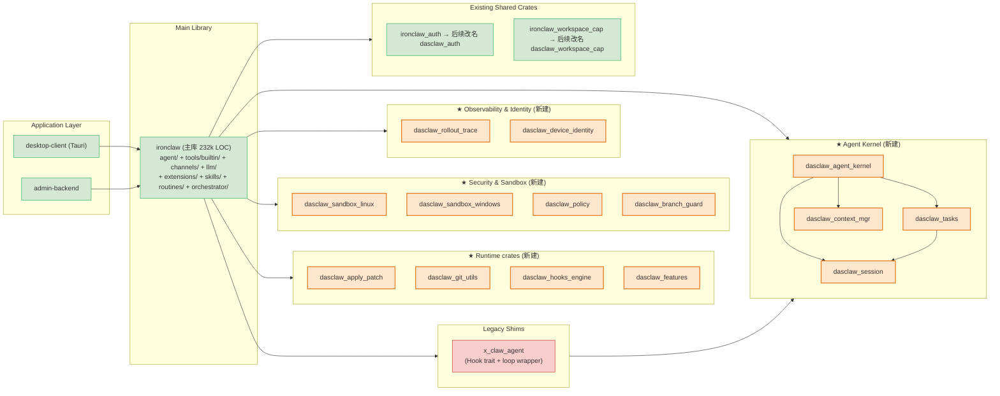
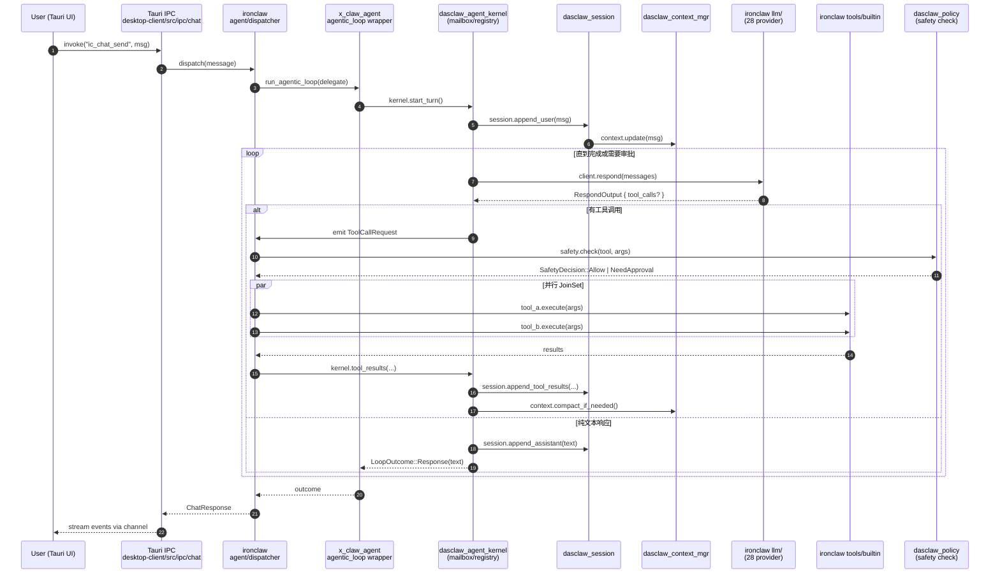
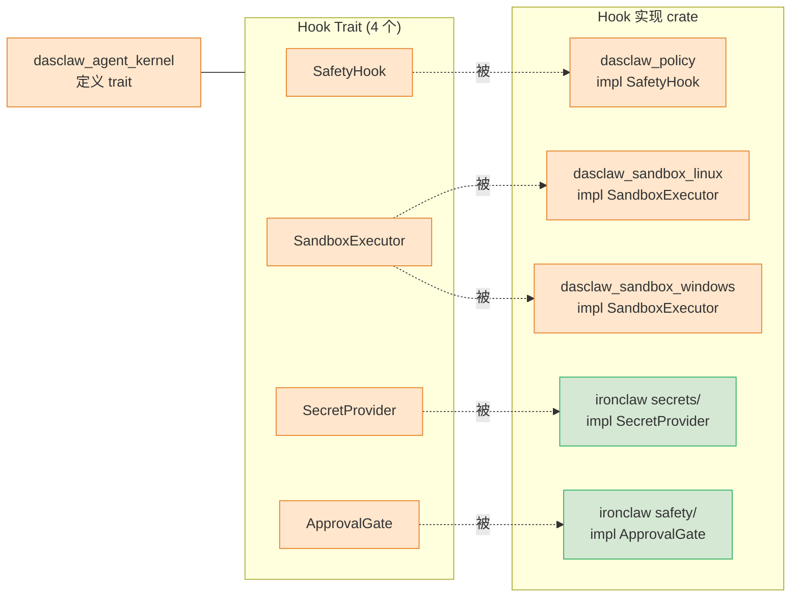

# 11 · 路线 B 目标架构设计 (供仔细 Review)

> 本文档专注**目标架构**, 不重复 09/10 的能力清单与质量评估。
> 路线 B = codex 内核 port + ironclaw 外围保留 + claw-code 能力源聚合。
> 命名规范: 新 crate 统一 `dasclaw_*` 前缀; 存量 `ironclaw_*` 后续分阶段改名。

---

## 1. 总览: 五层架构

```mermaid
flowchart TB
    subgraph L1["L1 · 用户入口 (UI)"]
        UI1["Tauri Window<br/>desktop-client/src-ui (React)"]
        UI2["Web Browser"]
        UI3["REPL CLI"]
        UI4["Webhook Caller"]
    end

    subgraph L2["L2 · 通信层 (Channels & IPC)"]
        IPC["Tauri IPC<br/>desktop-client/src/ipc/<br/>(79 command, 14 module)"]
        WEB["channels/web/<br/>(HTTP+SSE+WS+OpenAI 兼容)"]
        REPL["channels/repl/"]
        WH["channels/webhook_server"]
        RELAY["channels/relay/"]
    end

    subgraph L3["L3 · 编排层 (Agent Orchestration)"]
        DISP["ironclaw agent/dispatcher.rs<br/>★ 并行 JoinSet 工具调度<br/>★ 保留, 内部调用 L4 kernel"]
        ROUT["ironclaw agent/router.rs<br/>(/command 路由)"]
        SUB["ironclaw agent/submission.rs<br/>(用户输入解析)"]
        ROUTINE["ironclaw routines/<br/>scheduler + cron + event"]
        ORCH["ironclaw orchestrator/<br/>job_manager + reaper"]
    end

    subgraph L4["L4 · Agent 内核 (★ 路线 B 新建, codex port)"]
        K1["dasclaw_agent_kernel<br/>← codex core/agent<br/>★ mailbox + registry + role"]
        K2["dasclaw_session<br/>← codex core/session<br/>(25 文件分层)"]
        K3["dasclaw_tasks<br/>← codex core/tasks<br/>(含 ghost_snapshot)"]
        K4["dasclaw_context_mgr<br/>← codex core/context_manager"]
        WRAP["x_claw_agent (legacy)<br/>agentic_loop wrapper<br/>+ Hook trait → 迁到 K1"]
    end

    subgraph L5["L5 · 工具与运行时 (Tools & Runtime)"]
        TOOLS["ironclaw tools/builtin/<br/>33 builtin tool · 50k LOC<br/>★ 100% 保留"]
        APPLY["dasclaw_apply_patch<br/>← codex apply-patch"]
        GIT["dasclaw_git_utils<br/>← codex git-utils"]
        HOOKS["dasclaw_hooks_engine<br/>← codex hooks"]
        FEAT["dasclaw_features<br/>← codex features"]
        SANDLIN["dasclaw_sandbox_linux"]
        SANDWIN["dasclaw_sandbox_windows"]
        POL["dasclaw_policy<br/>← claw policy_engine + 等"]
        BRANCH["dasclaw_branch_guard<br/>← claw branch_lock + stale_*"]
        EXT["ironclaw extensions/<br/>+ claw mcp_lifecycle_hardened"]
        SKILL["ironclaw skills/<br/>+ codex skills/assets"]
    end

    subgraph L6["L6 · 持久化与服务 (Infra)"]
        LLM["ironclaw llm/<br/>28 provider + failover<br/>★ 100% 保留"]
        DB["ironclaw db/"]
        SEC["ironclaw secrets/<br/>+ dasclaw_device_identity"]
        OBS["ironclaw observability/<br/>+ dasclaw_rollout_trace"]
        AUTH["crates/ironclaw_auth"]
        WS["crates/ironclaw_workspace_cap"]
    end

    UI1 --> IPC
    UI2 --> WEB
    UI3 --> REPL
    UI4 --> WH

    IPC --> DISP
    WEB --> DISP
    REPL --> DISP
    WH --> DISP
    RELAY --> DISP

    DISP --> ROUT
    DISP --> SUB
    ROUTINE --> DISP
    ORCH --> DISP

    DISP --> WRAP
    WRAP --> K1
    K1 --> K2
    K1 --> K3
    K1 --> K4

    DISP --> TOOLS
    TOOLS --> APPLY
    TOOLS --> GIT
    TOOLS --> HOOKS
    TOOLS --> FEAT
    TOOLS --> SANDLIN
    TOOLS --> SANDWIN
    TOOLS --> POL
    TOOLS --> BRANCH
    TOOLS --> EXT
    TOOLS --> SKILL

    K1 --> LLM
    K2 --> DB
    OBS -.观察.-> K1
    SEC -.读密钥.-> TOOLS
    AUTH -.认证.-> WEB
    WS -.工作区.-> TOOLS

    classDef newCap fill:#ffe6cc,stroke:#e67e22,stroke-width:2px
    classDef retained fill:#d5e8d4,stroke:#27ae60
    classDef legacy fill:#f8cecc,stroke:#c0392b
    class K1,K2,K3,K4,APPLY,GIT,HOOKS,FEAT,SANDLIN,SANDWIN,POL,BRANCH newCap
    class TOOLS,LLM,DISP,WEB,IPC,EXT,SKILL,ROUTINE,ORCH retained
    class WRAP legacy
```



**色标**:
- 🟧 橙色: 新建 `dasclaw_*` crate (路线 B 新增, 14 个)
- 🟩 绿色: ironclaw 100% 保留模块
- 🟥 红色: legacy (保留为 wrapper, 部分内部下线)

---

## 2. Crate 依赖关系图



---

## 3. 数据流: 一次用户消息的处理路径



---

## 4. 多 Agent 协调架构 (路线 B 的最大升级点)

```mermaid
flowchart TB
    subgraph main_session["主会话 Session A"]
        MA["Main Agent A<br/>(role: planner)"]
    end

    subgraph kernel_inner["dasclaw_agent_kernel"]
        REG["AgentRegistry<br/>HashMap&lt;agent_id, AgentMetadata&gt;<br/>active_agents tree<br/>nicknames"]
        MBA["Mailbox A<br/>mpsc + watch + seq"]
        MBB["Mailbox B"]
        MBC["Mailbox C"]
        MBD["Mailbox D"]
    end

    subgraph subs["Sub-Agents (无深度限制)"]
        SA["Sub-Agent B<br/>(role: explore)"]
        SB["Sub-Agent C<br/>(role: verify)"]
        SC["Sub-Agent D<br/>(role: custom)"]
        SD["Sub-Sub-Agent E<br/>(由 D spawn)"]
    end

    MA <-->|InterAgentCommunication| MBA
    SA <--> MBB
    SB <--> MBC
    SC <--> MBD
    SD <--> MBD

    REG -.管理.-> MBA & MBB & MBC & MBD
    REG -.tree.-> MA & SA & SB & SC & SD

    MA -->|spawn| SA
    MA -->|spawn| SB
    MA -->|spawn| SC
    SC -->|spawn (depth 2+)| SD

    classDef new fill:#ffe6cc,stroke:#e67e22,stroke-width:2px
    class REG,MBA,MBB,MBC,MBD new
```

**对比 ironclaw 现状**:

| 能力 | ironclaw 现状 | 路线 B 后 |
|---|---|---|
| Agent 注册表 | ❌ 无 | ✅ `AgentRegistry` 维护活跃 agent + nickname + metadata |
| Agent 间通信 | ❌ 无, 仅父→子单向 spawn | ✅ `Mailbox` mpsc + watch + 序号保证 |
| Agent 树 | ❌ 平铺 | ✅ `agent_tree: HashMap<String, AgentMetadata>` |
| 深度限制 | `MAX_SUB_AGENT_DEPTH = 1` | ✅ 移除硬限, 由 registry 配额管控 |
| 角色解析 | 3 个硬编码 enum (Explore/Verify/Custom) | ✅ `agent_resolver.rs` 动态加载 + role registry |

---

## 5. Hook 注入点 (Phase 3 设计延续)

Phase 3 已在 `x_claw_agent::hooks` 定义 4 个 Hook trait, 路线 B 把它们**迁到 `dasclaw_agent_kernel` 顶层**, 接口契约不变, 实现层下沉到新 crate。



---

## 6. 文件级目录规划 (最终态)

```
x-claw/
├─ Cargo.toml                          # workspace root
├─ crates/                             # 共享 crate (16 个)
│   ├─ ironclaw_auth/                  # 保留, 后续改名 dasclaw_auth
│   ├─ ironclaw_workspace_cap/         # 保留, 后续改名 dasclaw_workspace_cap
│   ├─ x_claw_agent/                   # legacy: 仅保留 agentic_loop wrapper + bash_validation + permissions
│   │
│   ├─ dasclaw_agent_kernel/           # ★ W1: codex core/agent port (5.8k)
│   │   └─ src/
│   │       ├─ lib.rs
│   │       ├─ registry.rs             # AgentRegistry / ActiveAgents / AgentMetadata
│   │       ├─ mailbox.rs              # Mailbox / MailboxReceiver (mpsc+watch+seq)
│   │       ├─ control.rs              # AgentControl
│   │       ├─ role.rs                 # AgentRole / RoleRegistry
│   │       ├─ status.rs
│   │       ├─ agent_resolver.rs
│   │       └─ hooks.rs                # ← 从 x_claw_agent 迁来 (4 个 trait)
│   │
│   ├─ dasclaw_session/                # ★ W2: codex core/session port (~15k, 25 文件)
│   ├─ dasclaw_tasks/                  # ★ W3: codex core/tasks port (3k, 含 ghost_snapshot)
│   ├─ dasclaw_context_mgr/            # ★ W4: codex core/context_manager port (2k)
│   │
│   ├─ dasclaw_apply_patch/            # ★ W5: codex apply-patch (2k)
│   ├─ dasclaw_git_utils/              # ★ W5: codex git-utils (3k)
│   ├─ dasclaw_hooks_engine/           # ★ W6: codex hooks (6.9k schema+engine)
│   ├─ dasclaw_features/               # ★ W6: codex features (1k feature flag)
│   │
│   ├─ dasclaw_sandbox_linux/          # ★ W7: codex linux-sandbox
│   ├─ dasclaw_sandbox_windows/        # ★ W7: codex windows-sandbox-rs (12.5k)
│   ├─ dasclaw_policy/                 # ★ W8: claw policy_engine+permission_enforcer+trust_resolver 聚合
│   ├─ dasclaw_branch_guard/           # ★ W8: claw branch_lock+stale_base+stale_branch 聚合
│   │
│   ├─ dasclaw_rollout_trace/          # ★ W9: codex rollout-trace
│   └─ dasclaw_device_identity/        # ★ W9: codex device-key + agent-identity

├─ desktop-client/
│   ├─ src/                            # Tauri 层 (79 IPC, 14 module) — ★ 100% 保留
│   │   ├─ lib.rs                      # all_tauri_commands! 宏
│   │   ├─ ipc/                        # chat/threads/skills/extensions/jobs/...
│   │   ├─ engine.rs
│   │   ├─ safety_bridge.rs
│   │   ├─ dlp/
│   │   └─ src-ui/                     # React 前端
│   │
│   └─ ironclaw/src/                   # 主库 232k LOC — ★ 大部分保留
│       ├─ agent/
│       │   ├─ agentic_loop.rs         # re-export shim (沿用)
│       │   ├─ dispatcher.rs           # 并行 JoinSet 调度 (★ 保留, 内部调 kernel)
│       │   ├─ router.rs               # ★ 保留
│       │   ├─ submission.rs           # ★ 保留
│       │   ├─ thread_ops.rs           # 重写: 调 dasclaw_session
│       │   ├─ commands.rs             # ★ 保留
│       │   ├─ session.rs              # ❌ 下线 (换 dasclaw_session)
│       │   ├─ session_manager.rs      # ❌ 下线
│       │   ├─ task.rs                 # ❌ 下线 (换 dasclaw_tasks)
│       │   ├─ compaction.rs           # ❌ 下线 (换 dasclaw_context_mgr)
│       │   ├─ context_monitor.rs      # ❌ 下线
│       │   ├─ self_repair.rs          # ★ 保留 (合并 claw recovery_recipes)
│       │   ├─ heartbeat.rs            # ★ 保留 (ironclaw 独有)
│       │   ├─ cost_guard.rs           # ★ 保留 (ironclaw 独有)
│       │   ├─ routine.rs              # ★ 保留
│       │   └─ routine_engine.rs       # ★ 保留
│       ├─ tools/builtin/              # ★ 33 tool 100% 保留
│       │   ├─ apply_patch.rs          # ★ 新增 (薄 adapter 调 dasclaw_apply_patch)
│       │   ├─ code_edit.rs            # 改写: 调 dasclaw_apply_patch
│       │   ├─ git/                    # 改写: 调 dasclaw_git_utils
│       │   ├─ sub_agent.rs            # 重写: 移除 MAX_DEPTH=1, 调 dasclaw_agent_kernel
│       │   └─ ... (其余 30 个 tool 不变)
│       ├─ channels/                   # ★ 100% 保留 (web/repl/relay/webhook/wasm/signal)
│       ├─ llm/                        # ★ 100% 保留 (28 provider)
│       ├─ extensions/                 # ★ 保留 (融合 claw mcp_lifecycle_hardened)
│       ├─ skills/                     # ★ 保留 (引入 codex skills/assets)
│       ├─ routines/                   # ★ 保留 (融合 claw recovery_recipes)
│       ├─ orchestrator/               # ★ 100% 保留
│       ├─ hooks/                      # 改写: 基于 dasclaw_hooks_engine schema/engine
│       ├─ safety/                     # 改写: 基于 dasclaw_policy
│       ├─ sandbox/                    # 改写: 分发到 dasclaw_sandbox_linux/windows
│       ├─ secrets/                    # ★ 保留 (融合 dasclaw_device_identity)
│       └─ observability/              # ★ 保留 (融合 dasclaw_rollout_trace)
```

---

## 7. 关键能力归属表 (一览)

| 能力 | 所在 crate / 模块 | 来源 | 路线 B 状态 |
|---|---|---|---|
| **Agentic Loop** | `x_claw_agent::agentic_loop` (wrapper) + `dasclaw_agent_kernel` (内核) | ironclaw 原生 + codex port | 重组 |
| **多 Agent Mailbox** | `dasclaw_agent_kernel::mailbox` | codex port | ★ 新增 |
| **Agent Registry / Tree** | `dasclaw_agent_kernel::registry` | codex port | ★ 新增 |
| **Agent Role 解析** | `dasclaw_agent_kernel::role + agent_resolver` | codex port | ★ 新增 |
| **Session 生命周期** | `dasclaw_session` | codex port | ★ 替换 |
| **Tasks (regular/review/compact/undo/ghost_snapshot)** | `dasclaw_tasks` | codex port | ★ 替换 |
| **Context Manager** | `dasclaw_context_mgr` | codex port | ★ 替换 |
| **Hook 4 trait** | `dasclaw_agent_kernel::hooks` | Phase 3 自写 | 迁移 |
| **并行工具调度** | `ironclaw agent/dispatcher.rs` JoinSet | ironclaw 原生 | ★ 保留 |
| **Plan Mode** | `ironclaw tools/builtin/plan_mode.rs` | ironclaw 原生 | ★ 保留 |
| **Session Fork** | `ironclaw tools/builtin/session_fork.rs` | ironclaw 原生 | ★ 保留 (调 dasclaw_session) |
| **Sub-Agent** | `ironclaw tools/builtin/sub_agent.rs` | ironclaw 原生 | 重写 (调 kernel) |
| **33 Builtin Tool** | `ironclaw tools/builtin/` | ironclaw 原生 | ★ 100% 保留 |
| **Apply Patch 协议** | `dasclaw_apply_patch` | codex port | ★ 新增 |
| **Git utils (ghost_commits/baseline)** | `dasclaw_git_utils` | codex port | ★ 新增 |
| **Hooks schema + engine** | `dasclaw_hooks_engine` | codex port | ★ 新增 |
| **Feature flags** | `dasclaw_features` | codex port | ★ 新增 |
| **Linux/Windows 沙箱** | `dasclaw_sandbox_linux/windows` | codex port | ★ 新增 |
| **合规策略** | `dasclaw_policy` | claw 聚合 | ★ 新增 |
| **分支治理** | `dasclaw_branch_guard` | claw 聚合 | ★ 新增 |
| **错误恢复** | `ironclaw routines/self_repair.rs` 合并 | ironclaw + claw 融合 | 增强 |
| **MCP 加固** | `ironclaw extensions/` 内部 | ironclaw + claw 融合 | 增强 |
| **bash_validation** | `x_claw_agent::bash_validation` | claw port (Phase 3) | ★ 保留 |
| **permissions** | `x_claw_agent::permissions` | claw port (Phase 3) | ★ 保留 |
| **Rollout Trace** | `dasclaw_rollout_trace` | codex port | ★ 新增 |
| **Device Identity** | `dasclaw_device_identity` | codex port | ★ 新增 |
| **多 Channel 入口** | `ironclaw channels/` | ironclaw 原生 | ★ 100% 保留 |
| **28 LLM Provider** | `ironclaw llm/` | ironclaw 原生 | ★ 100% 保留 |
| **Routine + cron** | `ironclaw routines/` | ironclaw 原生 | ★ 100% 保留 |
| **Cost Guard** | `ironclaw agent/cost_guard.rs` | ironclaw 独有 | ★ 100% 保留 |
| **Heartbeat** | `ironclaw agent/heartbeat.rs` | ironclaw 独有 | ★ 100% 保留 |
| **Tauri 79 IPC** | `desktop-client/src/ipc/` | ironclaw 原生 | ★ 100% 保留 |
| **Skills 资产** | `ironclaw skills/` + codex bundled assets | ironclaw + codex 融合 | 增强 |

---

## 8. Wave 路线图 (路线 B 完整版)

| Wave | 主题 | 新增 / 改动 | 依赖 |
|---|---|---|---|
| **W1** | Agent Kernel | port codex `core/agent/` → `dasclaw_agent_kernel`; 把 Hook trait 从 `x_claw_agent` 迁过来 | - |
| **W2** | Session 分层 | port codex `core/session/` → `dasclaw_session`; ironclaw `session.rs/session_manager.rs` 下线 | W1 |
| **W3** | Tasks 与快照 | port codex `core/tasks/` → `dasclaw_tasks`; 含 ghost_snapshot 任务级回滚 | W1, W2 |
| **W4** | Context Manager | port codex `core/context_manager/` → `dasclaw_context_mgr`; ironclaw `compaction.rs/context_monitor.rs` 下线 | W1 |
| **W5** | Patch 与 Git | port `dasclaw_apply_patch` + `dasclaw_git_utils`; ironclaw `code_edit.rs / tools/builtin/git/` 改 adapter | - (并行) |
| **W6** | Hooks 与 Features | port `dasclaw_hooks_engine` + `dasclaw_features`; ironclaw `hooks/` 改 adapter | - (并行) |
| **W7** | 沙箱平台覆盖 | port `dasclaw_sandbox_linux` + `dasclaw_sandbox_windows`; ironclaw `sandbox/` 加分发层 | - (并行) |
| **W8** | 合规与分支治理 | 聚合 claw → `dasclaw_policy` + `dasclaw_branch_guard`; ironclaw `safety/` 改 adapter | - (并行) |
| **W9** | 可观测与身份 | port `dasclaw_rollout_trace` + `dasclaw_device_identity` | - (并行) |
| **W10** | 集成测试 + 老 sub_agent 重写 | `tools/builtin/sub_agent.rs` 重写为 kernel adapter; 契约/冒烟测试覆盖 14 个新 crate | W1-W9 |

**并行性**: W5/W6/W7/W8/W9 互不依赖, 可并行推进。W1→W4 是顺序的 (kernel 定义接口, 后续依赖)。

---

## 9. 待确认事项

请仔细看以下决策点:

1. **架构图是否清晰?** 5 个 mermaid 图分别覆盖: 五层总览 / crate 依赖 / 数据流 / 多 agent 协调 / Hook 注入。是否还需要补充某个视角的图?

2. **目录规划是否合理?** crates/ 下 14 个新 dasclaw_* + 3 个存量 + 1 个 legacy x_claw_agent, 是否过多需要合并? 例如:
   - `dasclaw_sandbox_linux` + `dasclaw_sandbox_windows` 合成 `dasclaw_sandbox` 单 crate?
   - `dasclaw_policy` + `dasclaw_branch_guard` 合成 `dasclaw_governance`?

3. **下线决策是否激进?** ironclaw `agent/{session.rs, session_manager.rs, task.rs, compaction.rs, context_monitor.rs}` 5 文件下线换成 codex port, 是否分阶段灰度更稳?

4. **Wave 顺序是否合适?** 当前是 W1-W4 内核优先, W5-W9 周边并行, W10 收口。或先做 W5-W8 周边能力, 再吃 W1-W4 内核?

5. **legacy x_claw_agent 命名是否改?** 当前保留为 wrapper, 文档建议保留原名; 或改为 `dasclaw_agent_legacy` 强调过渡性。
