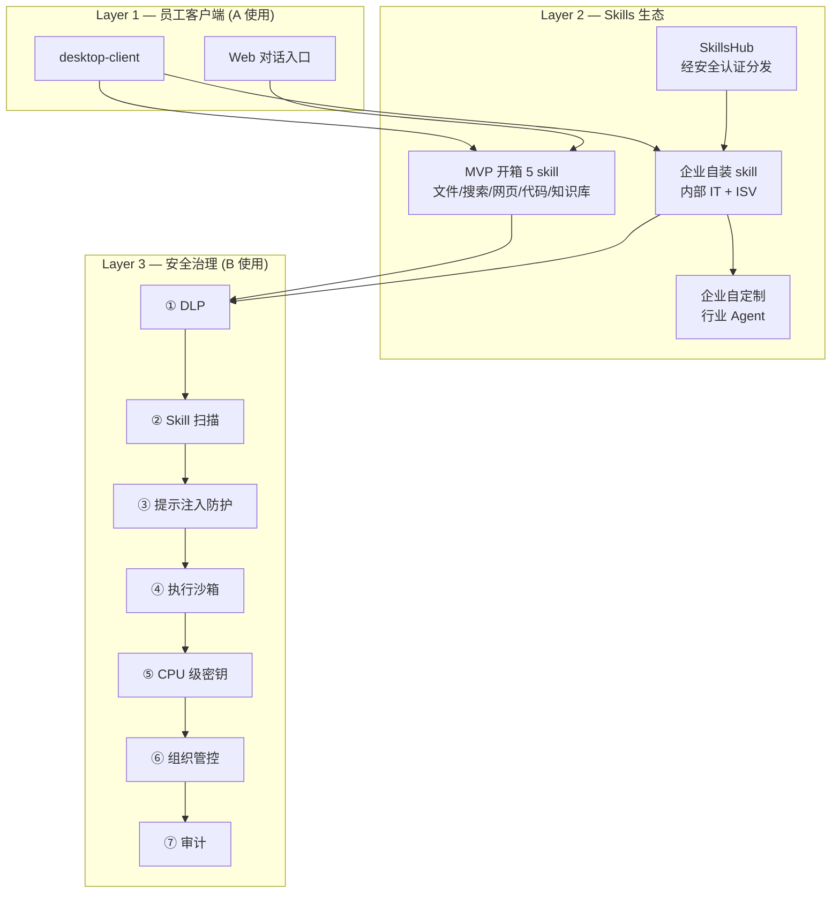

# 15 — Product North Star (产品北极星)

> **用途**: 本文档是 x-claw 产品定位的**最终决策快照**,后续所有架构/能力/优先级取舍都以本文档为准。若本文档的任何一项与 [11-target-architecture-route-b.md](11-target-architecture-route-b.md) / [14-claude-code-capability-parity.md](14-claude-code-capability-parity.md) 冲突,以本文档为准,上述文档需回写对齐。
>
> **产生方式**: 通过 `.codex/skills/deep-interview` Standard 模式 9 轮 Socratic 访谈产出,模糊度从 1.0 降至 0.08,达到 Standard 阈值 ≤ 0.20。
>
> **风险声明**: 本文档第 8 节的核心假设**尚未经过客户访谈验证**,必须在 W0-W2 之前完成验证,否则产品定位需要重做。

---

## 0. 元信息

| 字段 | 值 |
|-----|----|
| 文档版本 | v1.0 |
| 访谈日期 | 2026-04-24 |
| 访谈模式 | `.codex/skills/deep-interview` Standard (9 轮) |
| 当前模糊度 | 0.08 (达 Standard 阈值 ≤ 0.20) |
| 下一次复审 | 完成 3 客户 CISO 访谈后 / W2 结束时 |

---

## 1. 产品定位 — 一句话

> **x-claw 是面向中国政企的 AI Agent 平台框架,以全链路安全治理 + 经安全认证的 Skills Hub 为核心,让企业安全地把 AI 助手落地到任意办公岗位。**

### 扩展描述

- **不是** 智谱/通义/豆包那样的"垂直行业 AI 助手"
- **不是** Cursor/Codex 那样的编程 IDE
- **不是** Dify/LangChain 那样的通用 Agent 框架
- **是** "企业版 openClaw" — 平台框架 + 政企治理 + 经认证 Skills 生态

### 竞品象限

| 竞品 | 全链路安全 | 经认证 Skills Hub | 平台可扩展 | 政企私有部署 |
|-----|---------|-----------------|---------|----------|
| 智谱/通义/豆包企业版 | ⚠️ 部分 | ❌ | ⚠️ 有限 | ✅ |
| openClaw | ❌ | ❌ | ✅ | ⚠️ |
| Dify/LangChain | ❌ | ❌ | ✅ | ⚠️ |
| M365 Copilot | ⚠️ | ❌ | ⚠️ | ❌ (仅 GCC) |
| **x-claw** | ✅ 7 条栈 | ✅ | ✅ | ✅ |

**唯一差异化**: 7 条全链路安全管控 + 经认证 Skills Hub 的组合,是业界目前唯一覆盖全 6 列的产品。

---

## 2. 用户画像

### 2.1 付费决策方 (Buyer)

**B — 企业安全/合规管理员** (CISO / 安全主管 / 合规官)

- 岗位: 国企/央企/政务/金融/医疗的信息安全/合规部门
- 核心痛点: 员工可能在用 ChatGPT/豆包等外部 AI 导致数据泄露 (**未验证,见 §8**)
- 采购动机: 提供一个**员工愿意用 + 数据不外流 + 可审计**的替代品
- 决策权: 年度预算 License + 集成服务费

### 2.2 日常使用方 (User)

**A — 企业内任意办公岗位的员工** (非局限于 HR/技术/法务)

- 岗位: 平台不预设岗位,**由企业通过 skill 装配决定员工能做什么**
- 核心动作: 3-5 个通用动作 + 企业自装 skill 的岗位能力
- 产品感受目标: "比偷用 ChatGPT 差 30% 也能接受,但数据安全、老板不骂"

### 2.3 Skill 作者 (Builder)

**MVP 阶段 (Y1)**:

1. **企业内部 IT / 数据团队** — 为本企业写 skill,内部 Hub 分发
2. **ISV / 集成商 / 乙方** — 为客户项目交付 skill,按项目收费

**未来阶段 (Y2+)**:

3. **独立开发者 / 社区** — 通过经安全认证的 SkillsHub 向企业分发

---

## 3. 核心价值主张 — 7 大类 / 15 条安全技术栈

**x-claw 的 moat (技术护城河)**。产品视角分 7 大类,每类下映射 1-3 条技术实现,共 **15 条技术栈 + 1 条跨层工艺保证**。

> **与 [13-security-capability-inventory.md](13-security-capability-inventory.md) 的映射**: 13 是技术视角 9 层纵深防御 (L1-L9),本文档是产品视角 7 大类。下表每一行标注对应 13 文档的 L 编号,确保两文档同步。**用户视角 7 条 = 技术视角 15 条**,无 1:1 对应,但全量可追溯。

### 类别 ① 输入与输出 DLP (4 条)

| # | 技术栈 | 核心诉求 | 对应 13 层 | 对应 crate/模块 | 状态 |
|---|-------|--------|----------|---------|-----|
| 1.1 | **输入脱敏** | 用户输入涉密信息/文件自动 `[REDACTED]` 不可外传 | L6 | `ironclaw_safety::sanitizer` (725 行) | ✅ 已有 |
| 1.2 | **LLM 输出凭证检测** | 扫描 LLM 回复,拦截回显的 API key/ 密码 | L6 | `ironclaw_safety::credential_detect` (637 行) | ✅ 已有 |
| 1.3 | **大数据泄漏检测 DLP** | 身份证/手机号/合同大规模外传检测 | L6 | `ironclaw_safety::leak_detector` (1336 行) | ✅ 已有 |
| 1.4 | **DLP 策略引擎** | 按部门/角色/场景分级的 rule-based decision | L6 | `ironclaw_safety::policy` (535 行) | ✅ 已有 |

### 类别 ② Skill 安全 (2 条)

| # | 技术栈 | 核心诉求 | 对应 13 层 | 对应 crate/模块 | 状态 |
|---|-------|--------|----------|---------|-----|
| 2.1 | **SkillsHub 签名+扫描+分级+分发** | YARA + 静态扫描 + 签名校验 + 风险评级 + CVE 跟踪 | L9 | `admin-backend/SkillScanner` + YARA + 签名扩展 | ⚠️ 基础已有,签名/CVE 待补 |
| 2.2 | **WASM 工具沙箱 + capability opt-in** | 工具默认零权限,必须 manifest 显式声明才授予 host function | L4 | `tools/wasm/` (15 文件 ~3000 行) | ✅ 已有 |

### 类别 ③ 提示词注入防护 (1 条)

| # | 技术栈 | 核心诉求 | 对应 13 层 | 对应 crate/模块 | 状态 |
|---|-------|--------|----------|---------|-----|
| 3.1 | **Prompt injection 清洗** | 识别并拦截 PI 攻击 (多层: 用户输入/工具返回/RAG 注入) | L6 | `ironclaw_safety::sanitizer` + claw-code `prompt.rs:480` 系统提示 | ✅ 已有 |

### 类别 ④ 执行沙箱 (3 层纵深)

| # | 技术栈 | 核心诉求 | 对应 13 层 | 对应 crate/模块 | 状态 |
|---|-------|--------|----------|---------|-----|
| 4.1 | **应用层 FS 防护** | cap_std TOCTOU-safe,防 `../../etc/passwd` 路径逃逸 | L1 | `ironclaw_workspace_cap` (568 行) | ✅ 已有 |
| 4.2 | **子进程内核沙箱** (三平台) | Linux bwrap+seccomp+landlock+netns / Win Restricted Token+Firewall / macOS Seatbelt | L2 | `dasclaw_sandbox_{linux,windows,macos}` ← port codex (~15,254 行) | ❌ 待建 (W7) |
| 4.3 | **Docker 容器沙箱** (host+guest) | 容器 + 出口代理 + 域名白名单 + 凭证反向注入 | L3 | `ironclaw sandbox/` (3611) + `worker/` (5343) | ✅ 已有 |

### 类别 ⑤ 密钥安全 (2 条)

| # | 技术栈 | 核心诉求 | 对应 13 层 | 对应 crate/模块 | 状态 |
|---|-------|--------|----------|---------|-----|
| 5.1 | **密钥存储: OS Keychain → TPM/SE/国密卡** | master key 存 OS Keychain,合规版接 TPM/SE/CryptoCard (SM2/SM3/SM4) | L5 | `ironclaw secrets/` (2546 行) → `dasclaw_secure_store` 扩展 | ⚠️ OS Keychain 已有,硬件密钥+国密待建 |
| 5.2 | **凭证 host 边界注入** | 工具代码**永远看不到 secret 原文**,host 在 HTTP 出口按域名匹配后注入 | L5 | `tools/wasm/credential_injector.rs` (639 行) | ✅ 已有 **(ironclaw 最独特哲学)** |

### 类别 ⑥ 组织架构管控 (2 条)

| # | 技术栈 | 核心诉求 | 对应 13 层 | 对应 crate/模块 | 状态 |
|---|-------|--------|----------|---------|-----|
| 6.1 | **部门权限/配额管控** | 部门 AI 消费限额 / 客户端访问目录 / 客户端访问网络 / 知识库组织权限 | — (15 新增) | admin-backend 扩展 + desktop-client 权限边界 | ❌ 待建 |
| 6.2 | **内部服务网络安全** | 4 信任边界 + 5 端口 + Bearer/CORS/CSRF/常量时比较 | L8 | `NETWORK_SECURITY.md` + admin-backend auth | ✅ 已有 |

### 类别 ⑦ 对话审计 (2 条)

| # | 技术栈 | 核心诉求 | 对应 13 层 | 对应 crate/模块 | 状态 |
|---|-------|--------|----------|---------|-----|
| 7.1 | **对话级可回溯审计** | 员工每次对话/工具调用/Skill 触发全量落库,支持回溯/检索/导出/告警 | — (15 增强) | admin-backend 对话审计扩展 (基础已有,功能太简单) | ⚠️ 基础已有,**Y1 必须深度增强** |
| 7.2 | **日志自动脱敏** | 审计日志本身 18+ 敏感字段自动 `[REDACTED]`,防二次泄密 | L7 | `tools/redaction.rs` (251 行) | ✅ 已有 |

### 跨层工艺保证

| # | 技术栈 | 核心诉求 | 对应 crate/模块 | 状态 |
|---|-------|--------|---------|-----|
| ⊕ | **Fuzz 测试覆盖** | 安全关键 crate (`ironclaw_safety` 等) 保持 fuzz 测试,项目唯一差异化工艺承诺 | `ironclaw_safety/fuzz/` (sanitizer+validator+env) | ✅ 已有,Y1 扩到 sandbox/credential_injector |

### 独家组合 (moat)

业界没有单一产品同时覆盖这 **15 条 + 1 条工艺**。具体差异化:

- 🔴 **独家 3 项**: 凭证 host 边界注入 (5.2) / WASM capability opt-in (2.2) / 应用层 TOCTOU-safe FS (4.1)
- 🔴 **独家组合 2 项**: 三层执行沙箱纵深 (4.1+4.2+4.3) / 输入+输出双向 DLP (1.1+1.2+1.3)
- 🟡 **国产合规独家**: TPM/国密卡接入 (5.1) + 对话级可回溯审计深度 (7.1) + 部门配额管控 (6.1)
- 🟢 **工艺差异化**: Fuzz 覆盖 (⊕)

**Y1 状态盘点**: 15 条中 **9 条已有** (1.1/1.2/1.3/1.4/2.2/3.1/4.1/4.3/5.2/6.2/7.2 = 11 条已有),**4 条待增强** (2.1 签名+CVE / 5.1 国密 / 6.1 部门管控 / 7.1 审计增强),**1 条待建** (4.2 三平台内核沙箱)。

---

## 4. 核心使用场景与产品架构

### 4.1 平台三层架构

### 4.2 MVP 开箱 Skills (最小集)

企业装机后即可用的 5 个基础 skill,对应 openClaw 原生能力但过 x-claw 治理层:

| Skill | 能力 | 对应底层 |
|-------|-----|--------|
| `file_ops` | 文件读写/搜索 | claw-code `runtime/tools/file_*` |
| `search` | 本地/网页搜索 | 新集成 |
| `web_fetch` | 网页抓取 | ironclaw 已有 |
| `code_exec` | 代码执行 (沙箱内) | codex kernel + bash_guard |
| `kb_query` | 知识库 RAG 查询 | admin-backend 知识库 + 组织权限 |

**设计原则**:
- 每个 skill 必须过 ①-⑦ 全部 7 层治理
- 每个 skill 都是**参考实现**,教企业/ISV 怎么写自己的 skill

### 4.3 企业自定制行业 Agent

**这是 Y1 Q3-Q4 的 P1 能力**,不是 MVP P0。类比 Claude Code 的 `SubAgent` 但:

- 由**企业自己**捏 agent (不是我们做)
- 在**可视化编辑器**里组合 skill + 提示词 + 权限 + 知识库
- 通过 admin-backend 部署给部门使用
- **自动继承** 7 层安全治理

### 4.4 对话审计深度增强 (Y1 P0 增强项)

**现状**: admin-backend 已有对话审计基础能力,但**功能过于简单**,仅能查看对话列表,无法满足政企合规/安全调查需求。

**Y1 增强目标** (对应 §3 7.1 条,是 ❷"审计后台强"tradeoff 的核心落地):

| 能力 | 现状 | Y1 目标 |
|------|-----|-------|
| **全量落库** | ⚠️ 仅对话文本 | 对话 + 工具调用参数/返回 + Skill 触发 + DLP 拦截事件 + 沙箱逃逸告警 + 凭证注入记录,全链路 trace_id 串联 |
| **脱敏落库** | ❌ 未实现 | 落库时自动走 L7 redaction,审计员看到 `[REDACTED:API_KEY]` 而非原文 |
| **检索能力** | ⚠️ 仅按时间/员工 | 按员工/部门/时间/关键字/Skill/DLP 命中类型/风险等级**多维组合检索**,P50 < 1s |
| **回溯能力** | ⚠️ 30 天 | 至少 **90 天**在线回溯 + 归档后冷存储 1 年,支持按 trace_id 重放完整对话上下文 |
| **告警能力** | ❌ 未实现 | DLP 高频命中/ 沙箱逃逸/ 异常 Skill 调用实时告警,推送到安全管理员 |
| **导出能力** | ❌ 未实现 | 支持审计报告导出 (CSV/PDF),用于等保/合规报送 |
| **权限管控** | ⚠️ 管理员可见全部 | 按 6.1 组织权限**分部门隔离**,安全管理员跨部门查看,部门主管只看本部门 |

**技术落点**:
- admin-backend 扩展: `admin-backend/src/handlers/audit.rs` 新建完整查询/告警/导出接口
- desktop-client 扩展: 客户端遥测 hook,保证 DLP/Skill/沙箱事件全上报
- 存储: 热数据走 PostgreSQL + 冷数据走对象存储,按时间分区

**独家差异化**: 国内竞品 (智谱/通义/豆包企业版) 的审计能力普遍停留在"对话日志表",没有覆盖工具调用/DLP/沙箱事件的全链路串联审计。

---

## 5. Non-goals (明确不做)

### 5.1 永久不做

- ❌ **自研基础模型** — 只做路由和适配,国产/闭源模型都支持
- ❌ **代码 IDE 级体验** — 不跟 Cursor 比 IDE 集成深度,保持轻客户端
- ❌ **C 端个人版** — 政企专属,不做 to C

### 5.2 MVP 阶段不做 (Y2+ 可能启动)

- ❌ **非中文市场** — Y1 只做中国政企
- ❌ **公有云 SaaS** — Y1 只做私有部署
- ❌ **Skill 市场公开发布** — Y1 只有经认证的内部/ISV skill
- ❌ **移动端** — Y1 只做桌面 + Web

### 5.3 延期启动

- ⏸ **独立开发者/社区 skill 贡献** — 等 SkillsHub 签名+审核闭环成熟后 (Y2)
- ⏸ **多模型训练优化** — 只做基础路由,精调延后

---

## 6. Success Metrics (Y1 目标)

### 6.1 业务指标

| 指标 | Y1 目标 | 衡量频率 |
|-----|--------|-------|
| 付费客户数 | **≥ 10 个** | 月度 |
| 年续约率 | **≥ 70%** | Y2 初 |

### 6.2 使用指标

| 指标 | Y1 目标 | 衡量频率 |
|-----|--------|-------|
| 单员工日均对话轮数 | **≥ 10 轮** | 周度 |
| 单员工每天 skill 调用次数 | **≥ 5 次** (代表平台在用) | 周度 |

### 6.3 技术指标

| 指标 | Y1 目标 | 衡量频率 |
|-----|--------|-------|
| DLP 输入脱敏精确率 | **≥ 90%** | 月度 |
| DLP 输入脱敏召回率 | **≥ 95%** | 月度 |
| **LLM 输出凭证检测召回率** (G4) | **≥ 98%** (API key/ 密码/ token 必中) | 月度 |
| **大数据泄漏检测 DLP 精确率** (G5) | **≥ 85%** (身份证/ 手机号/ 合同条款) | 月度 |
| 系统可用性 SLA | **≥ 99.5%** (年停机 < 44h) | 月度 |
| 首 token 延迟 P50 | **< 2s** | 实时 |
| **安全关键 crate Fuzz 覆盖** (⊕) | `ironclaw_safety` 100%,`secrets`/`credential_injector` 新增 fuzz target | 季度 |
| **对话审计完整率** (7.1) | **100%** 对话/工具调用/Skill 触发全量落库,支持 < 1s 关键字检索,90 天内可回溯 | 月度 |

---

## 7. Tradeoffs (取舍原则)

用户已确认的 6 条 tradeoff,后续任何架构决策与以下原则冲突时,**本文档优先**:

| # | Tradeoff | 指导含义 |
|---|---------|---------|
| ❶ | 宁可功能比 ChatGPT 弱 30%,也要本地可控 | 不追最前沿 prompt 工程,追稳定治理 |
| ❷ | 宁可客户端 UI 丑,也要审计后台强 | admin-backend 投入 > desktop-client UI 美化 |
| ❸ | 宁可 MVP skill 只有 5 个,也要每个都过安全认证 | 不堆 skill 数量,堆 skill 质量 |
| ❹ | 宁可 Y1 只 10 个客户,也要每个交付 License+集成服务毛利可观 | 不做低价跑量,做高价深度交付 |
| ❺ | 宁可放弃移动端/SaaS,先把政企私有部署做透 | 不追市场扩张,追单场景深度 |
| ❻ | 宁可核心假设未验证就先做 7 条安全能力栈 | 安全能力是独立价值,即使"偷用 AI"假设错也值得做 |

---

## 8. 核心假设与验证方法 🔴

### 8.1 当前待验证假设

**假设 H1** — "合规政企员工大量在偷用外部 AI,构成 B 客户的核心采购动机"

- **当前证据强度**: 无 (来自创始人直觉,未经客户访谈)
- **风险**: 若 H1 错误 → B 客户的采购动机不是"替代偷用",而可能是"降本增效"/"行业合规强制"/"竞争对手都在上" → 产品定位需重新校准
- **影响面**: 整个 §1 定位语 + §3 价值主张排序

### 8.2 验证计划 (W0-W2 必完成)

**必须在 W0 正式进入开发前完成至少 3 次 CISO 访谈**。目标客户分布:

| 客户类型 | 访谈数 | 访谈对象 |
|--------|-------|--------|
| 央企/大型国企 | 1 | 信息安全部 CISO |
| 金融 (银行/券商/保险) | 1 | 信息安全主管 |
| 政务 (省级厅局 / 央地政务云) | 1 | 合规办主任 |

**统一问题 (每人问同样 3 个)**:

1. 过去 6 个月,你们通过 DLP/流量监控发现员工访问 `*.openai.com` / `*.baidu.com` / `*.moonshot.cn` 等外部 AI 的合规事件有几起?
2. 你们的 AI 使用政策是"禁止"、"限制"还是"鼓励使用合规版本"?实际执行度如何?
3. 如果有一个完全本地部署、数据不外流、员工也愿意用的 AI,你们年度安全预算里是否有对应的预算科目?预算大致范围?

**决策规则**:
- ≥ 2 客户确认"事件为 0 且无采购计划" → H1 失败,产品定位重做
- ≥ 2 客户确认"有事件 + 有预算" → H1 成立,按 §1 推进
- 中间态 → 再访谈 3 人

### 8.3 其他待验证假设 (由 analyst gap audit 新增)

| ID | 假设 | 影响 | 验证时机 |
|----|-----|-----|--------|
| H2 | "7 条安全能力栈的组合是唯一差异化" | 若竞品在 Y1 快速追平 → moat 消失 | Y1 Q2 竞品扫描 |
| H3 | "License + 集成服务费的毛利够养团队" | 若单客户客单价 < X 万元 → 商业模式不成立 | W4 首单成交前 |
| H4 | "CPU 级密钥存储 (TPM/SE) 在政企环境可用" | 硬件可用性/国密适配未知 | W2 POC |
| H5 | "企业有 IT 团队愿意写 skill" | 若企业 IT 不愿写/不会写 → Hub 无内容 | W6 首客户现场 |

---

## 9. 对现有架构文档的影响

### 9.1 [11-target-architecture-route-b.md](11-target-architecture-route-b.md)

**需回写对齐的点**:

| 原规划 | v1.0 修正 |
|------|---------|
| 14 个新 `dasclaw_*` crate | 新增 `dasclaw_secure_store` (密钥) + `dasclaw_skills_hub_enrichment` (签名/分级/分发,非新建而是 admin-backend 扩展) |
| Wave 路线以"技术架构"排序 | 改为"**按 §3 的 7 条安全能力栈逐条打透**"排序 |
| 编程场景优先 | 降为 skill 之一 (`code_exec`),不再是主场景 |
| TeamCreateTool/Coordinator/多 agent 协作 | 降为 Y2+,由"企业自定制行业 Agent" 能力取代 |
| KAIROS/BRIDGE_MODE/DAEMON Feature Flag | 永久不做 (Non-goal §5.1-5.2) |

### 9.2 [14-claude-code-capability-parity.md](14-claude-code-capability-parity.md)

**优先级重排**:

| 原 P0 | v1.0 修正 |
|------|---------|
| Bash AST 安全分析 (`dasclaw_bash_guard`) | **继续 P0** (对应 §3 第④条,skill 会跑 bash) |
| CVE 跟踪流程 | **继续 P0** (对应 §3 第②条) |
| sed/awk 修改标志识别 | 并入 `dasclaw_bash_guard` |

**新增 P0 (v1.0,经 13 文档对账补全)**:

| 新 P0 | 对应 §3 类别 | 来源 |
|------|-----------|-----|
| **CPU 级密钥存储** (`dasclaw_secure_store` + TPM/SE/国密卡 SM2/SM3/SM4) | 5.1 | §3 |
| **组织架构管控** (部门 AI 消费限制/目录/网络/知识库权限) | 6.1 | §3 |
| **SkillsHub 签名+CVE 跟踪+风险分级+分发** (admin-backend 扩展) | 2.1 | §3 + §4.2 |
| **对话审计深度增强** (见 §4.4) | 7.1 | §3 + §4.4 |
| **客户端 Agent 可视化编辑器** (企业自定制行业 Agent) | — | §4.3 (Y1 Q3) |
| **Fuzz 覆盖扩展** 到 `secrets` + `credential_injector` + `workspace_cap` + 待建 `dasclaw_sandbox_*` | ⊕ | §3 |

### 9.3 文档归档建议

- 00-08 系列 (Route A 时代 Phase 序列) → 移入 `docs/plans/architecture-refactor/archive/`
- 保留基线: 11 / 12 / 13 / 14 / **15** (本文档) / 后续 16 端到端流程
- 待写: 17-crate-inventory-audit (按 §9.1 盘三库全 crate 清单)

---

## 10. Analyst Gap Audit 输出

> 基于 `.codex/agents/analyst.toml` (Metis) 的视角对本文档做实施性审核。

### 10.1 Missing Questions (没问到但重要)

| # | 问题 | 影响 | 处理 |
|---|-----|-----|-----|
| M1 | 客户决策周期多长 (几个月 POC → 正式采购)? | 影响 Y1 10 客户目标的合理性 | W0 客户访谈时补 |
| M2 | 私有部署硬件前置是什么 (x86? ARM? GPU? 国产化?)? | 影响交付工程复杂度 | W1 POC 确认 |
| M3 | 国密算法合规要求是否刚性 (SM2/SM3/SM4)? | 影响 §3 ⑤密钥模块实现 | W0 前向客户确认 |
| M4 | 审计报告是否需要过等保/关基/密评认证? | 影响交付 SLA + 成本 | W0 前向客户确认 |

### 10.2 Undefined Guardrails (边界未定义)

| # | 需要边界 | 建议定义 |
|---|--------|---------|
| G1 | "最小集 5 skill" 是否允许客户添加 P0 之外的? | 允许,但非认证 skill 必须显式管理员开关 |
| G2 | "企业自定制行业 Agent" 边界在哪? 能不能调任意系统 API? | 只能调客户已授权的 MCP 服务 + 平台原生 skill |
| G3 | Y1 10 个客户,**至少** 还是 **至多** 10? | 至少,上不封顶 |
| G4 | 召回率 95% 的"漏报"如何统计 (红队测试集 vs 生产流量)? | 两者都要:红队月度 + 生产随机采样 |

### 10.3 Scope Risks (范围蔓延风险)

| # | 风险 | 防御 |
|---|-----|-----|
| S1 | "通用 AI 办公助手"被销售扩展成"什么都能做" | 销售材料 + 合同模板明确 MVP 5 skill 范围 |
| S2 | 企业要求定制 skill 被团队自己接下来做 (而不是让 ISV 做) | 建立"企业 skill 自研率 > 70%"硬 KPI |
| S3 | 国央企采购周期拖到 12-18 月,Y1 10 客户目标达不到 | 并行开拓金融/医疗等采购周期 3-6 月的客户 |

### 10.4 Acceptance Criteria 测试性

| 指标 | 是否可测 | 测试方法 |
|-----|--------|---------|
| DLP 精确率 90% | ✅ | 红队测试集 + 混淆矩阵 |
| 召回率 95% | ✅ | 已知涉密样本注入 + 拦截率 |
| SLA 99.5% | ✅ | Prometheus uptime |
| P50 < 2s | ✅ | 客户端埋点 + histogram |
| 日均 10 轮/员工 | ✅ | admin-backend 用量统计 |
| Skill 调用 5/天/员工 | ✅ | admin-backend 用量统计 |
| 续约 70% | ✅ | Y2 初硬统计 |
| 客户数 10 | ✅ | CRM |
| LLM 输出凭证检测召回 98% | ✅ | 红队注入已知 API key 测试集 + 实际拦截率 |
| 大数据泄漏检测精确率 85% | ✅ | 身份证/手机号合成测试集 + 混淆矩阵 |
| Fuzz 覆盖 `ironclaw_safety` 100% | ✅ | `cargo fuzz list` + 每 fuzz target 最低 1h 无 panic |
| 对话审计完整率 100% | ✅ | 注入 1000 条对话/工具调用/Skill/DLP 事件,比对 audit 表行数 |
| 审计检索 P50 < 1s | ✅ | 生产流量采样 + histogram |

**结论**: 指标可测性 100% (12/12 指标可测),符合 analyst 验收标准。

---

## 11. 变更历史

- **v1.1 (2026-04-24, 同日 second pass)**: 经 [13-security-capability-inventory.md](13-security-capability-inventory.md) 对账修订:
  - §3 "7 条安全栈" 重构为 "7 大类 / 15 条技术栈 + 1 跨层工艺",每条映射到 13 文档 L1-L9 层
  - §3 补齐 3 条🔴漏项 (凭证 host 边界注入 5.2 / WASM capability opt-in 2.2 / 应用层 TOCTOU-safe FS 4.1) + 4 条🟡 (1.2 输出凭证检测 / 1.3 大数据 DLP / 6.2 网络安全 / 7.2 日志脱敏) + 1 条🟢 (Fuzz 覆盖)
  - §4.4 新增 "对话审计深度增强" 章节,Y1 P0 硬要求 (全量落库/脱敏/多维检索/告警/导出/分部门隔离)
  - §6.3 技术指标扩至 8 条 (新增 G4 输出凭证检测 98% / G5 大数据 DLP 85% / Fuzz 覆盖 / 审计完整率 100%)
  - §9.2 新增 P0 增至 6 条 (新增对话审计增强 + Fuzz 覆盖扩展)
  - §10.4 指标可测性扩至 12 条
- **v1.0 (2026-04-24)**: 通过 deep-interview 9 轮 Socratic 访谈产出。产品定位从"Claude Code 企业版"/"HR 垂直应用"两度修正为"政企 AI Agent 平台框架"。模糊度 1.0 → 0.08。Analyst gap audit 识别 4 个 Missing Question / 4 个 Guardrail / 3 个 Scope Risk。5 个待验证假设 (H1-H5) 必须在 W0-W6 逐一验证。

---

## 附录 A — 访谈问答摘要 (9 轮)

| 轮 | 维度 | 关键问题 | 用户答 |
|----|-----|--------|-------|
| 1 | Who TOP 2 | 4 候选用户排序 | B (合规) + A (办公人员,非局限开发者) |
| 2 | Who 子岗位 | 财务/法务/HR/行政 选 1 | HR (后被第 5 轮推翻) |
| 3 | Why 主驱动 | 合规刚需 vs 效率驱动 | 合规刚需优先 |
| 4 | Why 证据 + 差异化 | 痛点证据 + 差异化主打 | 证据未验证 + 7 条全链路安全管控 |
| 5 | What 动作 | 9 候选动作选 3 | 推翻前提: **不是垂直应用,是平台框架** |
| 6 | 平台三要素 | 作者/MVP 范围/变现 | 内部 IT+ISV / 最小集 / License+服务费 |
| 7 | Non-goals | 8 条做/不做 | 6 个不做 + 1 新增: 企业自定制行业 Agent |
| 8 | Success Metrics | 业务/使用/技术指标 | 70% 续约 / 10 客户 / 10 轮 / 5 skills / 90% DLP |
| 9 | Tradeoffs | 6 条推导 confirm | 6 条全部接受 |
