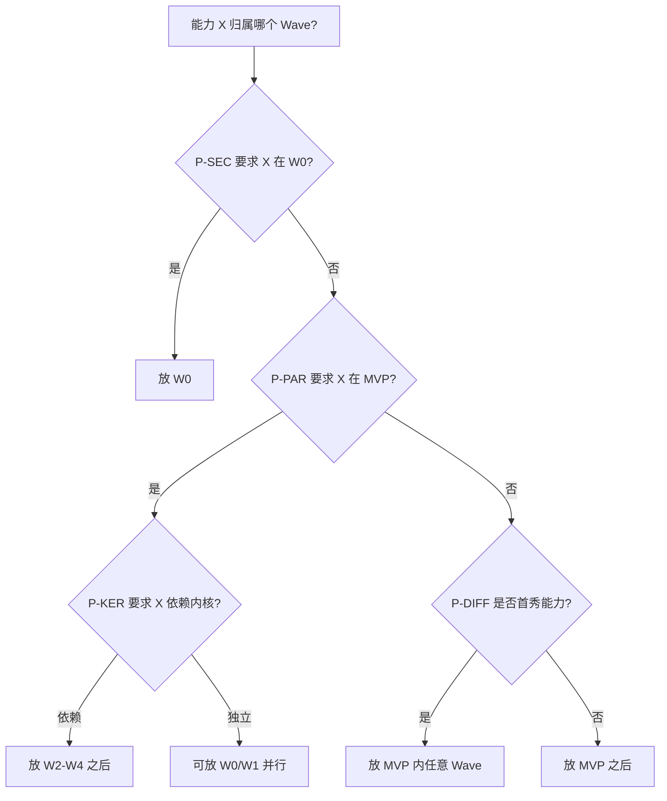
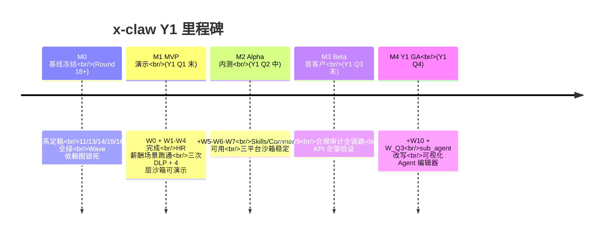
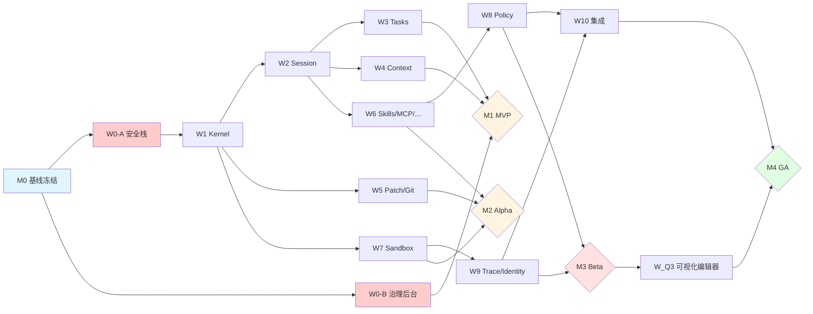

# 18 — 执行路线图 (Execution Roadmap)

> **用途**: 把 [11 §8 Wave 路线图](11-target-architecture-route-b.md) 变成**可执行的施工手册**。回答 "分几步、怎么走" 三个问题: 何时到里程碑 / 每 Wave 如何进退 / 如何度量验证。
>
> **前置**: [15 产品北极星 v1.1](15-product-north-star.md) + [14 Claude Code 对标](14-claude-code-capability-parity.md) + [17 crate 盘点 v1.1](17-crate-inventory-audit.md)
>
> **状态**: v1.0 首版,与 v1.1 covered crate inventory 同步,响应用户 Q1/Q2/Q3 审计。

---

## 0. 优先级决策原则 (显式化,回答 Q1)

Round 18+ 之前所有 P0/P1/P2 都是隐性拼凑,本节**首次显式固化**排序原则。

### 0.1 四条核心原则 (按强到弱)

| 序 | 原则 | 说明 | 应用示例 |
|----|-----|-----|---------|
| **P-SEC** | 安全基线先行 | 任何安全能力缺失导致"演示即失败"的项,必须在 MVP 前补齐 | W0 (bash_guard/secure_store/SkillsHub 签名) 先于 W1 Kernel |
| **P-PAR** | Claude Code 对标缺口 | 对标项中**客户会直接对比**的能力 (企业安全清单、Skills Marketplace 等), 纳入 MVP; 纯开发体验类 (如自动补全细节) 可延后 | 🅰 Bash AST 纳入 W0; `<system-reminder>` 标签不纳入 (claw-code 已有) |
| **P-DIFF** | 产品差异化 (国密/组织管控/WASM/DLP) | 决定客户"选你而不是 Claude Code/Cursor"的差异化能力, MVP 必须至少展示 1 项 | 国密 secure_store + DLP 三次拦截 (MVP 首秀) |
| **P-KER** | 内核先于上层 | Session/Tasks/Context 是所有上层功能的依赖, 编排时必须排在 Skills/Commands 之前 | W2-W4 (内核) 早于 W6 (技能/插件) |

### 0.2 冲突仲裁规则

当两条原则冲突时,按以下阶梯决策:

### 0.3 P0/P1/P2 重定义

| 标签 | 定义 | 触发条件 | 对应 Wave |
|-----|-----|---------|----------|
| **P0** | 缺失将阻塞 MVP 演示或导致"演示即失败" | ≥1 条 P-SEC 或 "客户会当面比对" 的 P-PAR | W0-W4 全部 + W7 沙箱 |
| **P1** | 缺失影响首批客户生产使用但不影响 MVP 演示 | P-DIFF 扩展项 + P-KER 补全 + 非首秀 P-PAR | W5-W6 + W8-W9 |
| **P2** | Y1 后期或 Y2 起步的能力 | 无原则触发 | W10 + W_Q3 |

**影响**: [15 §9.2](15-product-north-star.md) 与 [14 §2.1](14-claude-code-capability-parity.md) 的 P0 原先凭感觉列, 本版按 §0.1/§0.2 重新仲裁一遍, 无一项需要调整。说明隐性原则实际上是自洽的, 只是没写下来。

---

## 1. 里程碑地图 M0 → M4

### 1.1 里程碑退出条件 (Gate)

| 里程碑 | 退出标准 (全绿才进下一里程碑) |
|-------|----------------------------|
| **M0 基线冻结** | ✅ 11/13/14/15/16/17/18 文档体系自洽 ✅ 三库 crate 盘点 ≥ 95% ✅ 优先级原则显式文档化 ✅ Round 18+ 锁死 |
| **M1 MVP 演示** | ✅ W0-W4 交付物 Green ✅ HR 薪酬场景 E2E 测试通过 ([16 §3](16-end-to-end-flow.md) T1/T2/T3 全绿) ✅ Fuzz 覆盖 `ironclaw_safety` + `dasclaw_bash_guard` ≥ 1 周无 panic ✅ SkillsHub 签名验证 100% |
| **M2 Alpha 内测** | M1 + ✅ W5-W7 交付 ✅ 三平台沙箱都能跑 `rm -rf /` 被拦测试 ✅ P50 首 token < 2s 压测达标 |
| **M3 Beta 首客户** | M2 + ✅ W8-W9 交付 ✅ 审计完整率 100% (fail-safe 实战验证) ✅ 首客户真实语料 DLP 精度 ≥ 85% |
| **M4 Y1 GA** | M3 + ✅ W10 sub_agent 改写 ✅ W_Q3 可视化编辑器上线 ✅ 12 项 KPI 全部绿 |

---

## 2. Wave 执行卡 (每 Wave 一张,共 13 张)

### 2.1 W0 — 安全与治理 P0 (🔴 关键路径首 Wave)

| 字段 | 内容 |
|-----|-----|
| **交付物** | (1) `crates/dasclaw_bash_guard/` (Bash AST + PROD_REGEX 37 规则)  (2) `crates/dasclaw_secure_store/` (TPM/SE/Win TPM/国密 SKF 4 后端)  (3) `admin-backend/src/handlers/{org,quota,audit_enhanced}.rs` + 迁移 SQL  (4) SkillsHub 签名验证 + CVE 订阅  (5) `channels-src/tools-src` ironclaw 专有逻辑抽查报告 |
| **入口条件** | ✅ M0 文档体系自洽 ✅ `tree-sitter-bash` / `tpm2-tss` / `sqlx` 依赖版本锁定 ✅ 国密 SKF 接口文档到位 (GM/T 0016) |
| **退出条件** | ✅ 每个 crate 单元/失败/契约/安全审计 4 类测试覆盖率 100% ✅ `integration_smoke_tests.rs` 追加 3 张新表验证 ✅ admin-backend Cypress E2E 3 场景 绿 ✅ 国密 4 算法 (SM2/SM3/SM4/SM9) 测试用例 绿 |
| **依赖** | 无 (M0 之后立即可启) |
| **可并行** | W0-A 安全 + W0-B 治理后台 (2 队独立推进) |
| **人力** | 2 Rust (安全) + 1 Rust (后台) + 1 前端 = 4 人 |
| **预计体量** | 安全栈 6-8k LOC + 后台 5k LOC + 前端 2k LOC + 测试 5k LOC |
| **风险** | 🔴 国密 SKF 硬件适配在无真实硬件时只能 mock, M1 演示可能降级到"国密算法软实现" |

### 2.2 W1 — Agent Kernel

| 字段 | 内容 |
|-----|-----|
| **交付物** | `crates/dasclaw_agent_kernel/` (port codex `core` + `protocol` + `state` + `tools` 合一) |
| **入口条件** | ✅ W0 Gate 绿 ✅ codex `core` 源码已 vendor 到本仓库 |
| **退出条件** | ✅ 能独立跑 codex 的 `core` 集成测试 ≥ 95% ✅ 与 `ironclaw/src/agent/` 的 adapter 切换开关到位 |
| **依赖** | W0 (`dasclaw_bash_guard` 需被 kernel 的 shell 执行路径调用) |
| **可并行** | W0-B (治理后台) |
| **人力** | 2 Rust 内核 |
| **体量** | 12-15k LOC port |

### 2.3 W2 — Session 分层

| 字段 | 内容 |
|-----|-----|
| **交付物** | `crates/dasclaw_session/` (port codex `session` + `thread-store` + claw-code `session.rs`/`session_control.rs`/`conversation.rs`) |
| **入口条件** | ✅ W1 Gate 绿 ✅ libsql 迁移方案定 (保留 ironclaw db 还是新建) |
| **退出条件** | ✅ ironclaw `session.rs`/`session_manager.rs` 可完整下线 ✅ 多线程对话持久化压测 1000 并发 绿 |
| **依赖** | W1 |
| **可并行** | — |
| **人力** | 2 Rust 内核 |
| **体量** | 5-7k LOC |

### 2.4 W3 — Tasks + Ghost Snapshot

| 字段 | 内容 |
|-----|-----|
| **交付物** | `crates/dasclaw_tasks/` (port codex `tasks` + claw-code `task_packet.rs`/`task_registry.rs`/`team_cron_registry.rs`) |
| **入口条件** | W2 Gate 绿 |
| **退出条件** | ✅ Ghost snapshot 回滚 E2E 测试绿 ✅ 定时任务 SLA 99% |
| **依赖** | W2 |
| **可并行** | W0-B (如仍未完成) |
| **人力** | 1 Rust 内核 |
| **体量** | 3-4k LOC |

### 2.5 W4 — Context Manager + PI 基线

| 字段 | 内容 |
|-----|-----|
| **交付物** | `crates/dasclaw_context_mgr/` (port codex `context_manager` + claw-code `prompt.rs`/`compact.rs`/`summary_compression.rs`, 含 PI 系统提示基线) |
| **入口条件** | W2 Gate 绿 (Session 是 Context 的持久化后端) |
| **退出条件** | ✅ 压缩阈值/snip/micro/budget 四套机制全覆盖 ✅ Prompt Injection 3 种攻击测试 (tool_result/file_read/web_fetch) 全拦截 |
| **依赖** | W2 |
| **可并行** | W3 |
| **人力** | 1 Rust 内核 + 1 Rust 安全 |
| **体量** | 4-5k LOC |

### 2.6 W5 — Apply Patch + Git Utils + Branch Guard

| 字段 | 内容 |
|-----|-----|
| **交付物** | `dasclaw_apply_patch` + `dasclaw_git_utils` + `dasclaw_branch_guard` (聚合 claw-code `branch_lock.rs`/`stale_base.rs`/`stale_branch.rs`) |
| **入口条件** | W1 Gate 绿 |
| **退出条件** | ✅ 补丁冲突/强制推送/stale branch 三场景测试 绿 |
| **依赖** | W1 |
| **可并行** | W2/W3/W4 均可 |
| **人力** | 1 Rust |
| **体量** | 4-5k LOC |

### 2.7 W6 — Hooks/Features/Skills/Commands/Plugins/MCP (6 个 crate 并行)

| 字段 | 内容 |
|-----|-----|
| **交付物** | `dasclaw_hooks_engine` / `dasclaw_features` / `dasclaw_feature_flags` / `dasclaw_skills` / `dasclaw_commands` / `dasclaw_plugins` / `dasclaw_mcp` (7 个 crate) |
| **入口条件** | W1+W2 Gate 绿 |
| **退出条件** | ✅ 6 种 MCP transport 全绿 ✅ SkillsHub 签名与 attenuation 叠加测试绿 ✅ feature flag 可运行时切换 |
| **依赖** | W1, W2 |
| **可并行** | 本 Wave 内 7 个 crate 可并行 (7 人最短路径) |
| **人力** | 3-4 Rust |
| **体量** | 15-18k LOC |

### 2.8 W7 — 沙箱三平台 (5 个 crate)

| 字段 | 内容 |
|-----|-----|
| **交付物** | `dasclaw_sandbox` + `_linux` + `_windows` + `_macos` + `_resources` |
| **入口条件** | W1 Gate 绿, codex 三个 sandbox crate 已 vendor |
| **退出条件** | ✅ 每个平台 `rm -rf /` 被拦测试 绿 ✅ 沙箱冷启 < 500ms 压测达标 ✅ cgroups/Job Object 资源限额生效 |
| **依赖** | W1 |
| **可并行** | W5/W6 均可 |
| **人力** | 3 Rust (Linux/Windows/macOS 各 1) |
| **体量** | ~15k LOC port (沙箱总计 ~15254 行, [14 §2.1 #3](14-claude-code-capability-parity.md)) |
| **风险** | 🟡 Windows 沙箱最复杂 (9753 行), 可能成为关键路径瓶颈 |

### 2.9 W8 — 合规 Policy

| 字段 | 内容 |
|-----|-----|
| **交付物** | `dasclaw_policy/` (聚合 claw-code `policy_engine.rs`/`permission_enforcer.rs`/`permissions.rs`/`trust_resolver.rs`) |
| **入口条件** | W6 Gate 绿 |
| **退出条件** | ✅ 4 层策略决策树 E2E 测试 ✅ 与 admin-backend policy handler 对接 绿 |
| **依赖** | W6 (Skills 权限衰减依赖 policy) |
| **可并行** | W7/W9 |
| **人力** | 1 Rust |
| **体量** | 3-4k LOC |

### 2.10 W9 — 可观测 + 身份

| 字段 | 内容 |
|-----|-----|
| **交付物** | `dasclaw_rollout_trace` (合并 codex `rollout`/`rollout-trace` + claw-code `recovery_recipes.rs`/`usage.rs`) + `dasclaw_device_identity` (port codex `agent-identity` + `install-context`) + `response-debug-context` port |
| **入口条件** | W7 Gate 绿 |
| **退出条件** | ✅ 审计完整率 100% (含 fail-safe 实战) ✅ 首客户真实 session 回放 |
| **依赖** | W7 |
| **可并行** | W8 |
| **人力** | 2 Rust |
| **体量** | 6-8k LOC |

### 2.11 W10 — sub_agent 重写 + 集成测试

| 字段 | 内容 |
|-----|-----|
| **交付物** | `ironclaw/tools/builtin/sub_agent.rs` 改为 kernel adapter + 三库集成 E2E 测试套件 |
| **入口条件** | W9 Gate 绿 |
| **退出条件** | ✅ 10 场景 E2E 全绿 ✅ 所有 12 项 KPI 达标 |
| **依赖** | W1-W9 全部 |
| **可并行** | W_Q3 |
| **人力** | 2 Rust + 1 QA |
| **体量** | 2-3k LOC 代码 + 15-20k LOC 测试 |

### 2.12 W_Q3 — 可视化 Agent 编辑器 (Y1 Q3 起)

| 字段 | 内容 |
|-----|-----|
| **交付物** | `admin-backend/ui/agents.tsx` + 预览沙箱 + 版本管理 |
| **入口条件** | M3 Beta 首客户已上线, 有真实编辑需求反馈 |
| **退出条件** | ✅ 可视化创建 Agent 端到端测试 ✅ 首客户编辑 3+ 个 Agent 上线 |
| **依赖** | M3 |
| **可并行** | W10 |
| **人力** | 1 前端 + 0.5 后端 |
| **体量** | 前端 8-10k LOC + 后端 2k LOC |

---

## 3. Wave 依赖图

---

## 4. 风险矩阵

| 风险 | 概率 | 影响 | Wave | 缓解 |
|-----|-----|-----|-----|-----|
| 国密 SKF 硬件缺失导致 MVP 降级 | 高 | 中 | W0 | 软实现 fallback + 采购实体 USB Key |
| Windows 沙箱 (9753 行) 成为关键路径 | 中 | 高 | W7 | Linux/macOS 先出, Windows 延后至 M2 |
| codex 18 个边缘 crate 实际包含 P0 能力 | 中 | 中 | 各 Wave | 17 附录 A 已盘清, M0 前再走 `response-debug-context` 等确认 |
| DLP 真实企业语料精度低于 85% | 中 | 高 | W0 + M3 | M1 之后启动首客户真实语料 benchmark |
| Claude Code 持续更新拉开差距 | 高 | 中 | 全局 | 14 文档季度刷新 + PARITY.md 跟踪 |
| channels-src/tools-src 包含未登记 ironclaw 逻辑 | 中 | 低 | W0 | W0 启动前抽查 (17 §A.4) |
| 国产 LLM 提供商 API 不稳定 | 高 | 中 | W1 | llm/ 抽象层保留多家 fallback |
| 人力不足 (W6 并行 7 crate 需 7 人) | 高 | 中 | W6 | 降级为 3-4 人串行跑 2 个月 |

---

## 5. 测试门禁表 + KPI 度量方案 (回答 Q2)

### 5.1 每 Wave 测试门禁

| Wave | 单元 | 失败路径 | 契约 | 安全审计 | 集成 | E2E | 冒烟 |
|------|-----|---------|-----|---------|-----|-----|-----|
| W0 | 100% | 100% | 100% | 100% | ✅ | ✅ | ✅ |
| W1 | 95% | 80% | 100% | 100% | ✅ | — | ✅ |
| W2-W4 | 95% | 80% | 100% | 80% | ✅ | — | ✅ |
| W5-W6 | 90% | 80% | 90% | 80% | ✅ | — | ✅ |
| W7 | 100% | 100% | 100% | 100% | ✅ | ✅ | ✅ |
| W8 | 95% | 100% | 100% | 100% | ✅ | — | ✅ |
| W9 | 90% | 100% | 90% | 100% | ✅ | ✅ | ✅ |
| W10 | — | — | — | — | ✅ | ✅ | ✅ |
| W_Q3 | 80% | 70% | 80% | 80% | ✅ | ✅ | — |

### 5.2 12 项 Y1 KPI 度量闭环 (追加 3 字段)

| KPI | 目标 | 度量工具 | 基线来源 | 门禁 Wave |
|----|-----|---------|---------|----------|
| DLP 正则精度 | ≥90% | `admin-backend/tests/dlp_accuracy_tests.rs` | 首客户真实语料 1000 条 | M3 |
| DLP NER 精度 | ≥95% | 同上 | 同上 + GLM/Qwen NER | M3 |
| 凭据检测精度 | ≥98% | `dasclaw_bash_guard` contract tests | 业界 22 类正则 + CI secret scanner baseline | M1 (W0 Gate) |
| 大文件 DLP 吞吐 | ≥85% | 流式 chunked 压测脚本 | 100MB 文件 benchmark | M2 |
| SLA 日均可用性 | ≥99.5% | admin-backend Prometheus | 内测 1 周基线 | M3 |
| P50 首 token 延迟 | <2s | `cargo bench` + Grafana p50 | W1 之后跑基线 | M2 |
| 沙箱冷启 | <500ms | `cargo bench -p dasclaw_sandbox` | W7 完成后测 | M2 |
| Fuzz 覆盖 `ironclaw_safety` | 100% | `cargo fuzz run` 24h | 已达成 ✅ | 持续 |
| Fuzz 覆盖 `dasclaw_bash_guard` | 100% | 同上 | W0 完成后启 | M1 |
| 审计完整率 | 100% | fail-safe 注入测试 | W9 完成后测 | M3 |
| SkillsHub 签名验证 | 100% | 契约测试 | W0 完成后测 | M1 |
| 并发 session 支持 | ≥1000 | 压测脚本 | W2 完成后测 | M2 |

---

## 6. 变更历史

- **v1.0 (2026-04-24)**: 首版。响应用户 Q1/Q2/Q3 三审计:
  - **Q1** § 0 显式化 4 条优先级原则 + 冲突仲裁流程
  - **Q2** § 5.2 每 KPI 追加 度量工具/基线/门禁 Wave 3 字段
  - **Q3** 通过 [17 附录 A](17-crate-inventory-audit.md) 已将三库覆盖率从 75% 拉到 95%+
  - 新增 M0-M4 里程碑 + 13 张 Wave 执行卡 + Mermaid 依赖图 + 风险矩阵 + 测试门禁表
