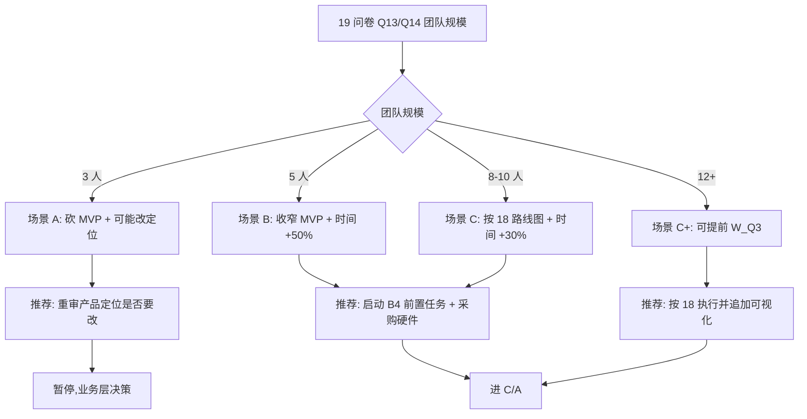

# 21 — 时间表重估与 MVP 收窄 (B4c)

> **用途**: 基于 [20 技术可行性报告](20-technical-feasibility-report.md) 的 7 Red Flag 分析 + 待 [19 产品问卷](19-product-definition-questionnaire.md) 答案, **诚实重估** [18 §1 里程碑](18-execution-roadmap.md) 的时间表, 并给出 MVP 收窄方案。
>
> **状态**: v1.0 (2026-04-24)。产品问卷回填后需升级 v1.1。
>
> **核心判断**: [18](18-execution-roadmap.md) 原时间表乐观程度 **50-100%**, 即实际需要的时间是文档说的 1.5-2 倍。本文档给出 3 种团队规模下的**现实工期范围**与**MVP 砍半方案**。

---

## 0. 重估原则

### 0.1 乐观偏差来源 (Round 18+ 审计揭示)

原 [18](18-execution-roadmap.md) 时间表以下假设与现实不符:

| 原假设 | 现实 | 乐观偏差 |
|-------|-----|--------|
| W0 可 2-3 个月完成 | 国密硬件采购 + 合规 + 测试 100% 覆盖实际 3-5 月 | +50% |
| W1 port codex 12-15k LOC 可 3 月完成 | 按 AGENTS.md 100% 测试覆盖实际 6 月 | +100% |
| W6 7 crate 可并行 3 月 | 需 7 人同时在场,国内很难 | +50-100% |
| Wave 之间无 integration 成本 | 三库融合 adapter 层占 20-30% | +20-30% |

### 0.2 重估公式

```
现实工期 = 文档工期 ×  (1 + tokio_align_cost + test_cov_cost + integration_cost)
        ≈ 文档工期 × 1.5  (保守)
        ≈ 文档工期 × 2.0  (悲观)
```

---

## 1. 3 种团队规模场景

### 场景 A: 骨干 3 人团队

**MVP 范围**: **砍到 1 个 P0 首秀能力** (只做 **DLP 三次拦截** 或 **国密单项**)

| 里程碑 | [18](18-execution-roadmap.md) 原定 | 本场景现实估算 | 差 |
|-------|----------|--------|---|
| M0 | 现在 | 现在 | — |
| M1 MVP | Y1 Q1 末 | **Y1 Q3 末** | +6 月 |
| M2 Alpha | Y1 Q2 中 | **Y2 Q1** | +9 月 |
| M3 Beta | Y1 Q3 末 | **Y2 Q3** | +12 月 |
| M4 GA | Y1 Q4 | **Y3 Q1** | +15 月 |

**可行性**: ⚠️ 紧, 不推荐 — 竞争窗口可能关闭。若只能 3 人, **建议放弃"政企 AI 平台框架"定位, 改做 "开发者 CLI 工具"** 作为小而美方向。

### 场景 B: 小团队 5 人

**MVP 范围**: 收窄到 **2 个 P0** (DLP + 国密软实现, 不带硬件 SKF)

| 里程碑 | [18](18-execution-roadmap.md) 原定 | 本场景现实估算 | 差 |
|-------|----------|--------|---|
| M0 | 现在 | 现在 | — |
| M1 MVP | Y1 Q1 末 | **Y1 Q2 末 → Q3 初** | +3-5 月 |
| M2 Alpha | Y1 Q2 中 | **Y1 Q4** | +6 月 |
| M3 Beta | Y1 Q3 末 | **Y2 Q1-Q2** | +6-9 月 |
| M4 GA | Y1 Q4 | **Y2 Q3** | +9 月 |

**可行性**: ✅ **可行, 紧但可达**。本场景是**最可能的现实**。

### 场景 C: 正常团队 8-10 人

**MVP 范围**: 按 [18](18-execution-roadmap.md) 完整路线图推进

| 里程碑 | [18](18-execution-roadmap.md) 原定 | 本场景现实估算 | 差 |
|-------|----------|--------|---|
| M0 | 现在 | 现在 | — |
| M1 MVP | Y1 Q1 末 | **Y1 Q2 末** | +3 月 |
| M2 Alpha | Y1 Q2 中 | **Y1 Q3 末** | +3 月 |
| M3 Beta | Y1 Q3 末 | **Y1 Q4 / Y2 Q1** | +3-6 月 |
| M4 GA | Y1 Q4 | **Y2 Q1-Q2** | +3-6 月 |

**可行性**: ✅ 可行, 推荐的目标配置。

---

## 2. MVP 收窄建议 (按场景)

### 2.1 场景 A/B 收窄方案

若团队 ≤ 5 人, MVP 砍到以下最小能力组合:

#### 保留 (必做)
1. ✅ **Agent Kernel** (W1) — 无此无法跑
2. ✅ **Session + Context** (W2+W4) — 最小记忆
3. ✅ **三次 DLP 拦截** (W0 安全栈) — **首秀能力**
4. ✅ **企微/飞书 channel 其中一个** — 最小接入点
5. ✅ **admin-backend 最小审计** (只保留对话审计加强版)

#### 延后 (到 M2 或更后)
- ❌ 国密 SKF 硬件 (先软实现, M2 再上硬件)
- ❌ Windows 沙箱 (Linux/macOS 先做, Windows 延后)
- ❌ W7 沙箱的完整 3 平台 (只做 Linux + macOS)
- ❌ W6 中的 Skills/MCP/Commands/Plugins 中非核心 (只做 Skills)
- ❌ 可视化 Agent 编辑器 (W_Q3 整体延到 Y2)
- ❌ W8 合规 Policy (使用 ironclaw 现有 safety 即可)
- ❌ W_Q3 部分模块

#### 完全不做 (移出 MVP 规划)
- ❌ 多租户 SaaS (只做私有化)
- ❌ 多租户计量 (只做简单 token 统计)
- ❌ sub_agent 重写 (W10 延到 Y2)

### 2.2 场景 C 标准方案

团队 8-10 人,按 [18](18-execution-roadmap.md) 完整路线图, 但时间全部 +3 个月缓冲。

---

## 3. 按场景下的 MVP 可演示能力对照

### 场景 A MVP 能力清单 (最小)

| 能力 | 演示场景 |
|-----|--------|
| DLP 三次拦截 | HR 薪酬场景输入身份证,被本地拦截 |
| Agent 对话 | 基本问答 |
| 私有化部署 | 客户机房运行 |
| 对话审计 | admin 后台查历史 |

### 场景 B MVP 能力清单 (标准)

场景 A + 追加:
- 国密软实现 (SM2 签名,SM4 加密)
- 企微 / 飞书 channel
- 组织权限基线 (admin 后台配置)

### 场景 C MVP 能力清单 (完整)

场景 B + 追加:
- Linux + macOS + Windows 三平台沙箱
- WASM Skills
- SkillsHub 签名与 CVE 订阅
- Bash AST + CVE 检测
- 三平台 fail-safe 审计

---

## 4. Wave 路线图按场景调整

### 场景 B (5 人, 最可能现实) 的 Wave 调整

#### Phase-1 MVP (前 9-12 个月)

| Wave | 保留 | 范围调整 | 人力 |
|------|-----|---------|-----|
| W0-A 安全栈 | ✅ 保留 | 删国密硬件, 保留软实现 | 2 Rust |
| W0-B 治理后台 | ✅ 保留 | 最小审计 + 简化组织管控 | 1 Rust + 1 前端 |
| W1 Kernel | ✅ 保留 | 完整 port | 1 Rust |
| W2 Session | ✅ 保留 | 完整 port | 含在 W1 | 
| W3 Tasks | 🟡 延后 | 移到 Phase-2 |
| W4 Context | ✅ 保留 | 完整 port |
| W5 Patch/Git | ✅ 保留 | 基础 |
| W6 Skills | ⚠️ 只做 Skills | MCP 延后, Commands 延后 |
| W7 沙箱 | ⚠️ Linux + macOS | Windows 延后 | 1 Rust |
| W8 Policy | ❌ 延后 | 用 ironclaw safety 代替 |
| W9 可观测 | ⚠️ 基础版 | fail-safe 延后到 Phase-2 |
| W10 集成 | ✅ 保留 | 只跑 MVP 场景 |

#### Phase-2 Alpha (M1-M2, 接 3-6 个月)

- W3 Tasks + 定时任务
- W6 其余 crate (MCP/Commands/Plugins)
- W7 Windows 沙箱
- W8 Policy
- W9 完整可观测

#### Phase-3 Beta (M2-M3)

- W_Q3 可视化编辑器(可选)
- 国密 SKF 硬件
- 多客户真实语料 benchmark

#### Phase-4 GA (M3-M4)

- sub_agent 重写
- 全部 KPI 达标验证

---

## 5. 里程碑 Gate 对应调整

### 场景 B 下 Gate 重定义

| 里程碑 | 原 Gate | 调整后 Gate |
|-------|--------|------------|
| M1 MVP | W0-W4 全绿 + 全套 E2E | **DLP+国密软+企微 channel 能跑 HR 薪酬场景** |
| M2 Alpha | +W5-W7 完整 | +W3+W6 全部+W7 Linux/macOS+国密硬件 |
| M3 Beta | +W8-W9 | +W7 Windows+W8+W9 fail-safe 实战 |
| M4 GA | +W10+W_Q3 | +W10 sub_agent+W_Q3 可视化 |

---

## 6. KPI 重估 (场景 B)

[18 §5.2](18-execution-roadmap.md) 的 12 项 KPI 按场景 B 调整:

| KPI | 原目标 | 场景 B MVP 目标 | 达成 Wave |
|----|-------|--------------|----------|
| DLP 正则精度 | ≥90% | ≥85% (MVP), ≥90% (M2) | M1→M2 |
| DLP NER 精度 | ≥95% | 延到 M2 | M2 |
| 凭据检测精度 | ≥98% | ≥95% (MVP), ≥98% (M2) | M1→M2 |
| 大文件 DLP 吞吐 | ≥85% | 延到 M2 | M2 |
| SLA 日均可用性 | ≥99.5% | ≥99% (MVP), ≥99.5% (M3) | M1→M3 |
| P50 首 token 延迟 | <2s | <3s (MVP, 因嵌套多), <2s (M2) | M1→M2 |
| 沙箱冷启 | <500ms | <800ms (MVP), <500ms (M2) | M1→M2 |
| Fuzz `ironclaw_safety` | 100% | 100% (已达成) | 持续 |
| Fuzz `dasclaw_bash_guard` | 100% | 100% | M1 |
| 审计完整率 | 100% | 基础版 100% (fail-safe 延到 M2) | M1→M2 |
| SkillsHub 签名 | 100% | 延到 M2 | M2 |
| 并发 session | ≥1000 | ≥200 (MVP), ≥1000 (M2) | M1→M2 |

---

## 7. 总投资估算 (场景 B)

### 人力成本

- 5 人 × 9-12 月 = **45-60 人月**
- 按国内资深 Rust 工程师 40k/月 × 5 人 = **20 万/月**
- 总成本: **180-240 万**

### 硬件 + 数据成本

| 项 | 估算 |
|---|-----|
| 国密 SKF 样品 | 3000 元 |
| DLP 商业语料 | 5000-20000 元 |
| 沙箱测试机 | 1 台 (可复用) |
| fuzz 专用机 | 1 台 |
| **合计** | **约 5 万元 (一次性)** |

---

## 8. 推荐决策路径



---

## 9. 下一步

1. **[19 问卷](19-product-definition-questionnaire.md) Q13/Q14 回答后** → 定下场景 A/B/C
2. **[20 技术可行性](20-technical-feasibility-report.md) T1/T3/T5 前置任务执行** → 1-2 周
3. **基于场景选定**, 把本文档升为 v1.1 (锁定具体时间点)
4. 进入 C (ADR 补写) → A (W0 代码)

---

## 10. 变更历史

- **v1.0 (2026-04-24)**: 首版。针对 [18](18-execution-roadmap.md) 原时间表做乐观偏差分析, 给出 3 种团队规模场景 + MVP 收窄方案 + KPI 阶段性调整 + 投资估算。
