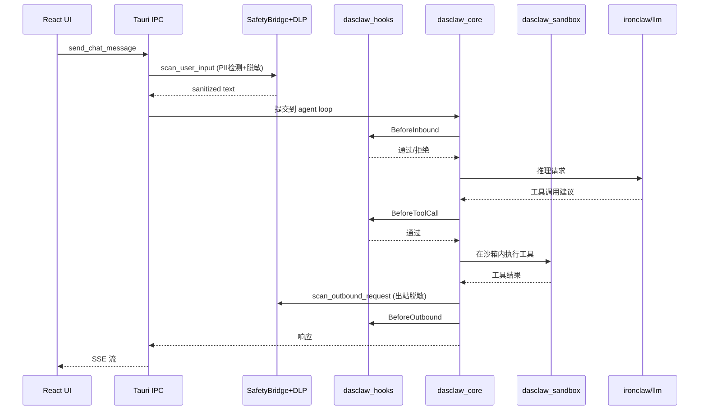

# 31 — 目标架构（边界清晰、可复用）

> **v2.7 (2026-05-25)** · ADR-153 §4.4 主流程收尾（基于已合并 PR #800 / #802 / #804 / #806 / #812 / #814 / #817）：
>   1. **ADR-153 §4.4 step 6 落点**：`crates/dasclaw_cli` 引入 `tools` 模块（`StaticToolExecutor` + `default_builtins()` 内置 `echo` / `now`），新增 `run --enable-tools` 开关；`dasclaw_cli::run_with_tools` 作为第二个库入口与 `run` 并存，不破坏零工具路径。证明 headless agent 可在零 desktop 依赖下完成 LLM ↔ 本地工具的完整往返（PR #804）。
>   2. **ADR-153 §4.4 step 7 落点**：`dasclaw_mcp` 新增 `McpToolExecutor`，把一个或多个 `Arc<McpClient>` 包成 `dasclaw_runtime::ToolExecutor`；工具名按 `<server>_<tool>` 限定避免多 server 冲突；未知工具 / 传输错误一律返回 `is_error=true` 的 `ToolResult`，喂回 LLM 而不是抛进 agent loop。该桥接住在 `dasclaw_mcp` 而非 `dasclaw_cli`，因为任何无头宿主都需要它（PR #806）。
>   3. **ADR-153 §4.4 step 8 落点**：`crates/dasclaw_cli` 新增 `mcp` 模块（stdio + HTTP 两种 transport，按 JSON config entry 形状路由），新增 `run --mcp-config <path>` 子开关；`dasclaw_runtime` 新增 `CompositeToolExecutor`，把 `StaticToolExecutor` 与 `McpToolExecutor` 按工具名求并、按 name 分发，`--enable-tools` 与 `--mcp-config` 可同时启用。配 `tests/mcp_e2e.rs` 端到端测试（stdio 子进程 + e1 成功 + e2 未知工具错误注入）。`#816 → #817` 实证：合并 stacked 下层 PR 时未保留分支也未提前切上层 base，会触发 GitHub 自动关闭且无法 reopen 的失败模式，AGENTS.md "标准流程" §7 已新增"路径 A / 路径 B"硬规则与对应禁止事项（PR #812 + #814 + #817）。
>   4. **ADR-153 主流程闭环宣告**：step 1（F3.x）/ step 2（dasclaw_runtime）/ step 4 ~ 8（CLI 五子步）全部落地；step 3（dasclaw_session）按 ADR 原文「等到有第二个调用方时再抽」保持暂搁；§4.4.6 必要性表里标"必要"的 4 项全部完成，"暂不必要"的 5 项（OAuth-backed MCP / 审批 / streaming / 工具白名单 / inline `--mcp-stdio` flag）按计划留给后续 ADR。
>   5. **crate 总数**：仍为 47；本期无新增 crate，全部能力以模块形式落入已有 `dasclaw_cli` / `dasclaw_runtime` / `dasclaw_mcp`。
> 本次升级是状态同步性质，不改架构决策，不重画 §1 总览图。

> **v2.6 (2026-05-25)** · ADR-156 落地收尾（基于已合并 PR #784 / #786 / #788 / #790 / #792）：
>   1. **§4.6 F4.6 工具壳全部执行完毕**：8 个子波次 F4.6.1 ~ F4.6.8 + §6.4 mod.rs 薄壳化对应 PR 全部合入 xClaw。原 v2.5 "计划落点"现转为"已落地"状态（详见 §4.6 表格的"PR / 状态"列）。
>   2. **F4.6.3 `dasclaw_memory_tools` 取消下沉**：按 [ADR-156 §6.3.1](adr-156-f46-builtin-tools-landing-decision.md) 决定，`memory` 模块依赖 `runtime` workspace crate（mtime / 大小 / 路径治理），强行下沉会绕过 ADR-153 边界，故 `memory` 留 desktop（与 §4.6 "留桌面 5 类"合并为 6 类：memory / extension / skill / job / routine / message）。
>   3. **§4.6 薄壳化已完成**：`desktop-client/ironclaw/src/tools/builtin/mod.rs` 已转为 wildcard re-export 入口（PR #792），同时为下沉 crate 留 `pub mod` 仅限留守 6 类；shim `shell.rs` / `lsp/mod.rs` 已删。
>   4. **crate 总数**：47（v2.5 写作时 45，新增 `dasclaw_misc_tools` 等本期产物）；`scripts/check_blueprint_sync.py` 自检为 `47 crates on disk / 2 planned`（剩 `dasclaw_bridge_lite` + `dasclaw_memory_tools` 处于 PLANNED 状态，后者按 ADR-156 §6.3.1 永久搁置）。
>   5. **ADR-153 §4.4 step 4 落点**：新增 `crates/dasclaw_cli`（headless agent CLI，骨架 + EchoResponder 端到端 demo），证明 `dasclaw_runtime::Agent` 在零 desktop 依赖（无 Tauri / 无 DB / 无 HTTP server）下可独立运行；真实 LLM provider 与 tool executor 接线留待 ADR-153 后续 slice。
>   6. **ADR-153 §4.4 step 5 落点**：`crates/dasclaw_cli` 引入 `provider` 模块，把 `dasclaw_llm_provider::ClawCodeLlmProvider` 通过 `dasclaw_runtime::LlmProviderResponder` 接入 headless agent，新增 `dasclaw-cli run --provider {anthropic|openai|openai_compat|ollama}` 子命令 + wiremock 端到端集成测试，证明真实 LLM 走 `Agent` 完整回路（无 desktop / 无 Tauri / 无 HTTP server）。Tool executor 接线仍留待后续 slice。
> 本次升级是状态同步性质，不改架构决策，不重画 §1 总览图。原 v2.5 内容保留（§4.6 表格仅增"PR / 状态"列覆盖）。

> **v2.5 (2026-05-23)** · 蓝图对齐 4-5 天发展（基于 [40-tool-ecosystem-inventory.md](40-tool-ecosystem-inventory.md) §1-3 实测 + [41-target-architecture-drift-analysis.md](41-target-architecture-drift-analysis.md) 漂移识别）：
>   1. **§4 补全 16 个 v2.4 遗漏 crate**（按字母序）：`dasclaw_absolute_path` / `dasclaw_bash_permissions` / `dasclaw_cert_trust` / `dasclaw_channels` / `dasclaw_exec` / `dasclaw_llm_provider` / `dasclaw_process_hardening` / `dasclaw_runtime` / `dasclaw_sandbox_linux` / `dasclaw_sandbox_windows` / `dasclaw_sandboxing` / `dasclaw_shell_command` / `dasclaw_tool` / `dasclaw_utils_home_dir` / `dasclaw_utils_rustls_provider` / `dasclaw_wasm_tools`。
>   2. **新增 §4.6 F4.6 工具壳分层落点**（按 [ADR-156](adr-156-f46-builtin-tools-landing-decision.md)）：8 个新 crate `dasclaw_{misc,image,memory,sub_agent,git,fs,shell,net}_tools` 分子波次 F4.6.1 ~ F4.6.8 下沉（~13073 LOC），T3/T4 共 8223 LOC（Extension/Skill/Job/Routine/Message 5 类）留桌面。
>   3. **§3 ADR 索引扩展到 ADR-156**：补 ADR-111 ~ ADR-156 共约 45 个 ADR 概要（详见 §3.2 索引表）。
>   4. **§4.4 落点确认**：`orchestrator` 按 [ADR-155](adr-155-f44-orchestrator-landing-decision.md) 留桌面，原 v2.4 §4.4 "升级为 dasclaw_*"承诺作废。
> P0 落地度：6/7（缺 `dasclaw_bridge_lite`）；P1：6.5/7（`dasclaw_git_tools` 待 F4.6.5 扩充）；P2：5/5。crates/ 真实总数 45 个，v2.4 蓝图列 26 个，本次补全后蓝图条目数 = 45 + F4.6 新建 8 = 53。

> **v2.4 (2026-04-26)** · 补 3 处蓝图缺口（基于 [39-fork-private-cargo-inventory.md](39-fork-private-cargo-inventory.md) §3 实测）：新增 `dasclaw_lsp`（fork 私货 1,694 LOC）/ `dasclaw_git_tools`（fork 私货 1,331 LOC）/ `dasclaw_routines`（提升点 31 LOC，路由 desktop-client/ironclaw 0.24 routines 模块）。原 P1 4 个 → 7 个，W1 骨架 14 → **17**。

> **v2.3 (2026-04-26)** · 订正 fork 处理矛盾：ADR-105 §落地 + §4.5 废弃表与 ADR-101 §136 对齐。git log 实测 fork 在 ironclaw-v0.26.0 tag 之后有 **42 fork-only commit**（Phase 2/3 dasclaw 接线核心成果：rig-core 清理 / ClawCodeLlmProvider / x_claw_agent host trait 接线 / IronclawSafetyHook / 5 agent 模块迁移 / SessionManager / routines 提升）。决策：W1-W6 保留 fork 作为私货来源，W6+ 私货全迁出后才删除；**永不**直接升级 fork 到 0.26 顶层依赖（与 38 §137 一致）。

> **v2.1 (2026-04-25)** · 基于 [30-architecture-truth.md](30-architecture-truth.md) v2（146 子能力、15 大类、~95% 覆盖率）的事实矩阵。
> 本文档替代 11/16 等历史架构文档（详见 cleanup-proposal.md）。
>
> **v1 → v2 主要修订**：
> 1. 补充 L4 能力域 `dasclaw_project_docs`（AGENTS.md/CLAUDE.md 多层加载）— 30 v2 §G
> 2. L4 工具系统增加 `portable-pty + exec-server` 子能力 — 30 v2 §C
> 3. L2 客户端外壳明确补齐 LSP IPC / MCP IPC / Approval WebSocket / AuthToken refresh — 30 v2 §4 硬伤
> 4. L6 增加 `dasclaw_crash`（统一 panic hook + crash 上报，四方公共缺口） — 30 v2 §K
> 5. 新增 ADR-106 / ADR-107 / ADR-108
>
> **v2.0 → v2.1 修订**：
> 1. **命名前缀翻转**：D5 决策从 A (`x_claw_*`) 改为 B (`dasclaw_*`)，新建 crate 全部使用 dasclaw_ 前缀；已存在的 `crates/x_claw_agent`（Phase 3 Step D-4 LoopDelegate Route B）作为过渡表象保留，后续升级为 `dasclaw_core`。
> 2. **ADR-101 路径修正**：改为“吸收式重构”（不直接切 ironclaw 0.24→0.26），原估“2-3 天”调为 4-6 周。
> 3. **ADR-107 拆分**：ADR-107a（Approval WebSocket）+ ADR-107b（AuthToken 续期），两件独立验收。
> 4. **dasclaw_workspace_cap 不扩到 admin-backend**：仅桌面本地强制，补齐策略层（借鉴 codex SandboxPolicy enum 思路）。
>
>
> **核心原则**：
> 1. **唯一职责** — 每层一件事，禁止能力跨层散落
> 2. **可复用** — 共享能力必须落 workspace crate，不允许 path 软链 fork
> 3. **零回退** — desktop-client 上层独家能力（DLP/Policy/IPC）一律保留
> 4. **不可绕过** — 三平台 sandbox + DLP + Hook 引擎是必经路径

---

## 1. 架构总览（六层 + 四纵切关注点）

**色标**：
- 🟧 橙色：新建 `dasclaw_*` 共享 crate（4 个 P0 + 6 个 P1/P2）
- 🟩 绿色：ironclaw 保留模块（无需重写）
- 🟦 蓝色：desktop-client 客户端外壳（独家产品层）

---

## 2. 边界契约（每层只做一件事）

| 层 | 唯一职责 | **禁止** |
|----|---------|---------|
| L1 表现层 | 渲染 + 用户交互事件分发 | ❌ 不直接调 LLM / 不持久化业务数据 |
| L2 客户端外壳 | IPC 路由 + DLP 前置 + 凭证桥接 + 审批入口 | ❌ 不实现 agent loop / 不直接持有 LLM client |
| L3 Agent Runtime | agent loop + session + context + compaction + plan-mode | ❌ 不实现工具具体逻辑 / 不实现沙箱 / 不知道 IPC 形态 |
| L4 能力域 | 单一能力 trait + 实现（沙箱/工具/Hook/治理/MCP/execpolicy） | ❌ 跨能力域互相 import / 持有 agent 状态 |
| L5 集成域 | LLM/通道/持久化/Routines/Secrets/文档抽取 | ❌ 不依赖 L4 能力域具体实现（通过 trait） |
| L6 基础设施 | 横切关注点（特性开关/可观测/身份/auth/workspace_cap） | ❌ 不持业务状态 |

**依赖方向**：L1 → L2 → L3 → L4 → L5/L6（L4 不依赖 L5）。
**反例（必须避免）**：L4 sandbox crate import L5 LLM crate；L3 直接 import L1 React 类型。

---

## 3. 关键架构决策（待 ADR 落地）

### ADR-101：唯一 Agent Runtime（吸收式重构）
**决策**：以 `crates/x_claw_agent`（已完成 LoopDelegate Route B）为起点升级为 `dasclaw_core`；上游 ironclaw-main 0.26 的关键模块（`gate/` 审批工作流、`bridge/` CodeAct 适配、`auth/` PKCE、`ownership/` workspace 信任、`http_intercept.rs`）逐项移植到 dasclaw_* 子 crate；desktop-client/ironclaw 私货（`claw_code_provider.rs` 1334 行、`llm/prompt/` 分层、`agent/traits_impl.rs` Tauri 适配）中立迁出后删 fork。
**不采用**：“直接依赖上游 0.24→0.26”路径。依据：
- fork vs upstream 同名文件行数差异：session.rs +2160、agentic_loop.rs +1051、dispatcher.rs +1202、agent_loop.rs +742、provider.rs +802、config/mod.rs +539。核心 6 文件上游领先 6,496 行，API 表面发生深层变化。
- 上游新增独立模块 8 个（`auth/` `bin/` `bridge/` `gate/` `ownership/` `code_challenge.rs` `http_intercept.rs` `generated_images.rs`），fork 完全缺失。
- fork 私货 ~1,642 行（以前估 ~500 行严重低估）。
**调整后工量**：4-6 周（原 v2.0 估 2-3 天错误）。
**落地**：在 32 执行计划 W1 启动骨架，W1→W6 逐 crate 吸收，W6 完成 fork 删除。

### ADR-102：三平台 Sandbox 是基线
**决策**：从 codex port `linux-sandbox` / `sandboxing` / `windows_sandbox` 进 `dasclaw_sandbox` crate，作为**所有工具调用必经路径**。Docker 沙箱（ironclaw）作为高隔离选项保留。
**理由**：
- desktop-client 当前**进程级沙箱零基线**，违反"不可绕过"原则。
- ironclaw 的 Docker 沙箱适合 orchestrator 场景，但桌面端单进程下需要 landlock/seatbelt/JobObject 级隔离。
**落地**：W2-W3。

### ADR-103：自治治理 6 件套作为可选 crate
**决策**：claw-code 6 件套（policy/recovery/trust/branch_lock/stale/green）port 进 `dasclaw_governance`，**默认关闭**，通过 Feature Flags 启用。
**理由**：政企客户路径不一定需要全部，但要给企业级客户一个可启用开关。
**落地**：W4。

### ADR-104：明确 non-goal 清单
**永久不做**（不再讨论）：
- TUI（codex/tui、claw rusty-claude-cli、ironclaw_tui）
- App-Server JSON-RPC 模式
- Cloud Tasks / SaaS 部署
- ChatGPT 专属 / responses-api proxy
- AWS-auth
- Realtime WebRTC
- mock-anthropic-service / compat-harness（保留作测试工具，不进生产）

**关于 ADR-101 dasclaw_core 工作量精算（v2.2 补充）**：
- ironclaw_engine v2 总 30,414 LOC，但 trait 文件**仅 410 LOC**（Effect 69 / Store 251 / Llm 61 / Workspace 20）+ 类型 3,109 LOC = **核心抽象只占 3,519 LOC**
- 其余 26,895 LOC 是 capability/executor/runtime/gate/memory 的具体实现，**桌面端只需要 chat + job 两类 thread type，可砍至 10-12k LOC**
- 加上选择性吸收 codex thread-store trait（参考 88 commit InMemory + LiveThread 设计）
- **dasclaw_core 真实工作量 ≈ 14-16k LOC**，远小于纸面 "30k LOC 全搬"
- **核心策略**：抽 v2 的 4 trait 骨架 + 关键类型 → 注入 x_claw_agent；不复制 26k LOC 实现

### ADR-105：保留 ironclaw 集成层
**决策**：L5（LLM/Channels/Memory/Routines/Secrets/Doc）继续依赖 `desktop-client/ironclaw` fork（吸收源），不直接升级到 ironclaw-main 0.26 顶层依赖。
**理由**：这部分是 ironclaw 真正的护城河（多通道、混合搜索、Routines），重写无价值。
**落地（v2.3 订正）**：fork 在 0.26.0 tag 之后还有 **42 个 fork-only commit**（Phase 2/3 dasclaw 接线全部成果：rig-core 清理 / ClawCodeLlmProvider / x_claw_agent host trait 接线 / IronclawSafetyHook / 5 agent 模块迁移 / SessionManager / routines 提升）。这些私货是吸收式重构的核心成果，**不能丢**。
- W1-W6 期间：fork 保留作为私货来源（path dep + ironclaw_safety + ironclaw_common 路径不动）
- W6+ 收尾：私货全部迁出到 dasclaw_* 子 crate 后，**才**删除 fork
- **永不**直接升级 fork 到 0.26（与 ADR-101 §136 一致；38 §137 已实证升级风险高 30k+ LOC + 5 migration）

### ADR-106：项目级文档统一为 AGENTS.md 协议
**决策**：新建 `dasclaw_project_docs` crate，统一加载优先级（同目录内）：`AGENTS.md` > `.dasclaw/AGENTS.md` > `CLAUDE.md` > `.codex/AGENTS.md` > project config。多层合并：user 全局 → project 项目级 → cwd 覆盖，与 codex `project_doc_max_bytes` 机制一致。`.dasclaw/AGENTS.md` 为 x-claw 项目命名空间主写位（issue #99/#100 已固定，**优先于第三方惯例 `CLAUDE.md`**），`.codex/AGENTS.md` 仅作 codex-fork 兼容只读回退。
**理由**：
- 30 v2 §G 事实：desktop-client 完全不加载项目级文档（grep ipc/ 无项目文档加载），与 codex/claw 生态不互通。
- AGENTS.md 已是业界事实标准（OpenAI / Anthropic / Cursor / Aider 等都采用），CLAUDE.md 为 Anthropic 生态别名。
**落地**：W3 随 hooks crate 一起进场（项目文档载入 → BeforeInbound 注入 system prompt）。

### ADR-107a：Approval WebSocket化（agent 工具执行门）
**决策**：`approval_polling.rs` 现行 30s polling（最多 24h × 2880 次）改为 **WebSocket 推送 + polling 降级**。优先用上游 ironclaw-main 0.26 的 `gate/` 模块（approval.rs / pending.rs / persistence.rs / store.rs）移植到 `dasclaw_governance::approval` 下，替代 fork 的 `approval_polling.rs` + `PendingTicketStore`。
**范围边界**：本 ADR 仅针对 **agent 执行高危工具时的审批门**（例如 destructive_bash / network_write），不是工单系统。Token 在 desktop-client 内存 + sled，WebSocket 走 ironclaw web 渠道。
**落地**：W6（与 LSP/MCP IPC 同期）。

### ADR-107b：AuthToken 客户端续期 + admin 审计
**决策**：`auth_token_manager.rs` 现行只检查 `is_valid_token` 但无自动续期，从 codex/login crate port `refresh_token` 流补齐。**Token 存储 + refresh 在客户端**（Keychain/DPAPI/libsecret），admin-backend 仅负责审计与企业版可选中央吐销。
**不采用**：“Token 集中放服务端”路径（违反 OAuth 设备绑定原则，且 admin-backend 不应介入个人 OAuth 会话凭证）。
**落地**：W7（与 identity + crash 同期）。

### ADR-108：LSP / MCP IPC 命令补齐
**决策**：desktop-client/src/ipc/ 新增 `lsp.rs`（4 命令：启/停/查/探） + `mcp.rs`（6 命令：attach/detach/list_tools/call_tool/list_servers/health），包装 `dasclaw_mcp` + ironclaw lsp/。
**理由**：30 v2 §4 硬伤：desktop-client 现状 grep ipc/ 无 lsp.rs 无 mcp.rs，前端无法调用（底层实现都在，只是未暴露）。
**落地**：W6 随 IPC 切换同步进场，FRONTEND_INVOKED_COMMANDS 同步更新。

### ADR-109：统一 panic hook + crash 上报
**决策**：新建 `dasclaw_crash` crate，统一 `panic::set_hook`，结构化写 trace + 可选接入 sentry/datadog。默认写本地 dump，远端上报走 admin-backend `/api/client-reports`（复用 DataReporter）。
**理由**：30 v2 §K 事实：**四方都无 panic hook / sentry 集成**，生产事故定位难。
**落地**：W7 与 observability + identity 一起进场。

### ADR-110：桌面端 Bridge Lite（≈ 5-7k LOC，**不抄 ironclaw bridge 25k**）
**决策**：新建 `crates/dasclaw_bridge_lite`（≈ 5-7k LOC），只取 ironclaw-main `src/bridge/` 25,369 LOC 中**桌面端真实需要**的部分：
- ✂️ **不要**：`router.rs` 9,609 LOC（多 channel 路由器，桌面端走 Tauri IPC 不需要）
- ✂️ **不要**：`store_adapter.rs` 大半 3,351 LOC（PG/libSQL 双后端切换，桌面端 libSQL 单库）
- ✂️ **不要**：`skill_migration.rs` 445 LOC（历史数据迁移）
- ✅ **要**：从 `effect_adapter.rs` 5,802 LOC 抽 EffectExecutor trait + safety/hook 链 (~2k)
- ✅ **要**：`llm_adapter.rs` 1,595 LOC（cost guard + provider chain）
- ✅ **要**：`auth_manager.rs` 1,581 LOC 简化版 ~500 LOC（桌面端只需 1-2 provider 凭证）
- ✅ **要**：`cost_guard_gate.rs` 41 LOC + `user_facing_errors.rs` 448 LOC 完整搬

**理由**：ironclaw bridge 的 25k LOC 是 v1 dispatcher ↔ v2 engine **双模式共存**的胶水。桌面端**没有 v1 历史债**，直接以 v2 trait 为唯一抽象，省掉双模式适配。

**和 ADR-101/104/108 的关系**：
- ADR-101 决定 dasclaw_core 路径
- ADR-104（v2.2 补充）说明 v2 抽象只占 3.5k LOC
- ADR-108 LSP/MCP IPC 是表面层
- **ADR-110 是连接 dasclaw_core ↔ 各 host 实现的胶水层**

**落地**：W6（与 IPC + 后端基底大移植同期）。

### 3.2 ADR-111 ~ ADR-156 索引（v2.5 新）

v2.4 §3 只列了 ADR-101 ~ ADR-110。W3 ~ W6 期间又落了约 45 个 ADR（不含废弃的 ADR-128 / 140），分组索引如下；每条只给一句结论，详情见对应 ADR 文件。

**评估与方法学族（ADR-111 ~ ADR-117）**

| ADR | 主题 | 结论 |
|---|---|---|
| [ADR-112](adr-112-compatibility-evaluation.md) | W3-A 兼容性评估嵌入节奏 | B1→B2→B3 三段式自带测试 |
| [ADR-112-input-checklist](adr-112-input-checklist.md) | W3-A 输入条件清单 | 13 项必填，缺一拒收 |
| [ADR-113](adr-113-hook-engine-unification.md) | Hook 引擎统一 | dasclaw_hooks 单一实现，编译期红线 `count_hook_systems() == 1` |
| [ADR-114](adr-114-dasclaw-rebrand.md) | `.ironclaw` → `.dasclaw` 命名迁移 | 类 A 业务零容忍，类 B 集中工程豁免 |
| [ADR-115](adr-115-project-docs-not-in-hook.md) | 项目文档不进 hook 链 | 走专用 ProjectDocLoader，不污染 hook |
| [ADR-117](adr-117-p0c-prompt-builder-unification.md) | Prompt builder 统一 | 单一 owner，详见 ADR-120 |

**Plan Mode / Job / Sandbox 三件套（ADR-118 ~ ADR-121, ADR-129 ~ ADR-131）**

| ADR | 主题 | 结论 |
|---|---|---|
| [ADR-118](adr-118-claw-code-readonly-and-self-impl.md) | claw-code 只读 + self impl 边界 | claw-code 不写回 fork |
| [ADR-119](adr-119-job-runtime-decision-for-desktop-client.md) | Job runtime 落点 | 留桌面（与 ADR-155 orchestrator 同理） |
| [ADR-120](adr-120-prompt-builder-ownership.md) | Prompt builder owner | `dasclaw_runtime::prompt` |
| [ADR-121](adr-121-p0a-sandbox-activation-decision.md) | Sandbox 激活路径 | 启动时按 OS dispatch 到 dasclaw_sandbox_{linux,macos,windows} |
| [ADR-129](adr-129-sandbox-windows-windows-crate-adoption.md) | sandbox-windows `windows` crate 选型 | 采纳 windows-rs，废弃 winapi |
| [ADR-130](adr-130-sandbox-windows-lib-bin-split.md) | sandbox-windows lib/bin 拆分 | lib 暴露 trait，bin 仅 main.rs |
| [ADR-131](adr-131-windows-job-object-resource-limits-wrapper.md) | Windows Job Object 资源限额 | wrapper crate 内联 wrap |

**ExecPolicy / Shell 族（ADR-132 ~ ADR-135）**

| ADR | 主题 | 结论 |
|---|---|---|
| [ADR-132](adr-132-execpolicy-starlark-port-plan.md) | execpolicy starlark port | 逐字搬 codex execpolicy，starlark rule 不动 |
| [ADR-133](adr-133-shell-command-adoption-eval.md) | `dasclaw_shell_command` 采纳 | 采纳，作为 parse_command 实现 |
| [ADR-134](adr-134-shell-escalation-non-goal.md) | shell 升权 non-goal | 禁止 sudo / runas 工具实现 |
| [ADR-135](adr-135-sandboxing-crate-adoption-eval.md) | `dasclaw_sandboxing` 采纳 | 采纳，作为顶层 dispatcher |

**Protocol / Net-proxy 族（ADR-136 ~ ADR-139）**

| ADR | 主题 | 结论 |
|---|---|---|
| [ADR-136](adr-136-protocol-expansion-plan.md) | dasclaw_protocol 扩展 | 文件级 verbatim slice 上游 28 *.rs |
| [ADR-137](adr-137-net-proxy-port-plan.md) | net-proxy port plan | 单层口径，不携带 credential resolver |
| [ADR-138](adr-138-protocol-step-c2-evaluation.md) | protocol Step C2 utils 评估 | 新增 4 个 utils slice 小 crate |
| [ADR-139](adr-139-mitm-ca-trust-chain.md) | MITM CA 信任链 | 默认关，按用户主动启用 |

**Sandbox 平台细节族（ADR-141 ~ ADR-151）**

| ADR | 主题 | 结论 |
|---|---|---|
| [ADR-141](adr-141-windows-enterprise-sandbox-support.md) | Windows enterprise sandbox 支持 | AppContainer + Job Object 组合 |
| [ADR-142](adr-142-writable-root-kernel-enforcement.md) | writable root kernel enforcement | 内核级写保护 |
| [ADR-143](adr-143-macos-residual-sinking-decision.md) | macOS 残余下沉决策 | sandbox-exec 残余留桌面 |
| [ADR-144](adr-144-linux-writable-root-kernel-enforcement.md) | Linux writable root enforcement | landlock + seccomp |
| [ADR-145](adr-145-windows-sandbox-users-naming-decision.md) | Windows sandbox 用户命名 | `dasclaw-sbx-<uid>` 模式 |
| [ADR-146](adr-146-safety-decision-enum-extension.md) | SafetyDecision enum 扩展 | 新增 `Quarantine` / `Audit` 变体 |
| [ADR-147](adr-147-composite-safety-hook.md) | 复合 safety hook | 多 hook 组合短路语义 |
| [ADR-148](adr-148-egress-gate-safety-hook-semantics.md) | egress gate hook 语义 | 默认 deny，allowlist 显式开 |
| [ADR-149](adr-149-tool-visibility-triple-gate.md) | 工具可见性三门控 | OS / Tier / SKU 三层 |
| [ADR-150](adr-150-symlink-escape.md) | symlink 逃逸防护 | 沙箱内 canonicalize 后再校验 |
| [ADR-151](adr-151-sandbox-model-divergence-from-upstream.md) | sandbox 模型与上游分歧 | 记录与 codex 模型差异 + 双向 drift 守卫 |

**F4 阶段决策族（ADR-152 ~ ADR-156）**

| ADR | 主题 | 结论 |
|---|---|---|
| [ADR-152](adr-152-agent-and-capability-fusion.md) | F4 agent + capability fusion 总规划 | 5 阶段切片 F4.0 ~ F4.6+ |
| [ADR-152 §F4.5 wasm-slicing](adr-152-f45-wasm-slicing.md) | F4.5 wasm slicing 子方案 | wasm 工具拆 crate 边界 |
| [ADR-152 §F4.5 addendum](adr-152-f45-wasm-slicing-addendum.md) | F4.5 wasm slicing 补遗 | 边界微调 |
| [ADR-153](adr-153-headless-agent-framework-draft.md) | headless agent framework 草案 | dasclaw_runtime 无 HTTP / 无 DB / 无 tenant |
| [ADR-154](adr-154-jobcontext-core-trait-split.md) | JobContext core trait 拆分 | 拆出最小 trait，桌面 impl 实例化 |
| [ADR-155](adr-155-f44-orchestrator-landing-decision.md) | F4.4 orchestrator 落点 | 留桌面（架构匹配 + 三方对账无等价） |
| [ADR-156](adr-156-f46-builtin-tools-landing-decision.md) | F4.6 builtin 工具下沉落点 | tier 切 8 刀，~13073 LoC 下沉，8223 LoC 留桌面 |

**说明**：ADR-128 / ADR-140 编号已废弃（合并入相邻 ADR）。任何后续 F4.7+ 决策按本表延续编号。

---

## 4. 新增 / 重构 crate 清单

### 4.1 新建（P0 必做，6 个）

| crate | 来源 | 提供 |
|-------|------|------|
| `crates/dasclaw_core` | x_claw_agent 升级（注入 ironclaw_engine v2 的 4 trait + 关键类型 ≈ 3.5k LOC，**不抄 30k 实现**） | Agent runtime 唯一入口（≈ 14-16k LOC 目标） |
| `crates/dasclaw_bridge_lite` | ironclaw bridge 25k 中**精选 5-7k**（去 router 9.6k + store 3k + 历史迁移 0.4k） | EffectExecutor + LlmBackend + AuthLite + CostGuard 胶水 |
| `crates/dasclaw_sandbox` | codex port | Linux/macOS/Win 三平台沙箱 |
| `crates/dasclaw_hooks` | codex port + ironclaw 合并 | schema/registry/engine 三分离 hook 引擎 |
| `crates/dasclaw_apply_patch` | codex port | Lark 语法 patch 协议 |
| `crates/dasclaw_project_docs` | codex/claw 合并 | AGENTS.md / CLAUDE.md 多层加载 |
| `crates/dasclaw_pty` | codex/exec-server port | portable-pty 信号转发 + resize |

### 4.2 新建（P1 推荐，7 个） — v2.4 补 3

| crate | 来源 | 提供 |
|-------|------|------|
| `crates/dasclaw_governance` | claw-code 6 件套 port | policy/recovery/trust/branch_lock/stale/green |
| `crates/dasclaw_mcp` | claw-code 6 transport port | 统一 MCP 客户端 |
| `crates/dasclaw_execpolicy` | codex port | Starlark 权限规则 |
| `crates/dasclaw_bash_validation` | claw-code/runtime/bash_validation.rs port | bash 注入检测（6 验证模块 × 1004 LOC）|
| `crates/dasclaw_lsp` **(v2.4 新)** | fork 私货迁出（5 文件 ≈ 1,694 LOC：`tools/builtin/lsp/{tool,client,mod,server_config,protocol}`） | LSP 客户端封装 + textDocument/* 包装工具 |
| `crates/dasclaw_git_tools` **(v2.4 新)** | fork 私货迁出（9 文件 ≈ 1,331 LOC：`tools/builtin/git/{branch,commit,diff,log,push,runner,stale,status,mod}`） | Git 操作工具集（与 dasclaw_governance::stale_branch 协作） |
| `crates/dasclaw_routines` **(v2.4 新)** | fork `desktop-client/ironclaw/.../routines/` 提升 | 例程编排（与 dasclaw_governance::recovery_recipes 衔接） |

### 4.3 新建（P2 增强，5 个）

| crate | 来源 | 提供 |
|-------|------|------|
| `crates/dasclaw_features` | codex port | 4 阶段 feature 生命周期 |
| `crates/dasclaw_observability` | ironclaw + codex/rollout-trace | 统一可观测 |
| `crates/dasclaw_identity` | codex agent-identity + device-key | 设备级身份 |
| `crates/dasclaw_crash` | 新建（四方公共缺口补齐）| panic hook + sentry 适配 |
| `crates/dasclaw_net_proxy` | codex/network-proxy port | rama 框架 + 自签 CA + MITM（**单层口径**：仅域名 allowlist + 可选 MITM 审计；凭证注入由 `desktop-client/ironclaw/src/tools/builtin/http.rs` 的 reqwest builder 层执行，详见 §4.5.1） |

### 4.4 保留（已存在，无需新建）

- `crates/ironclaw_auth` — 鉴权
- `crates/dasclaw_workspace_cap` — 工作区能力
- `desktop-client/ironclaw/crates/ironclaw_safety` → 升级为 `crates/dasclaw_safety`（移到顶层 workspace）
- `desktop-client/ironclaw/crates/ironclaw_common` → 升级为 `crates/dasclaw_common`

### 4.5 废弃 / 迁移（v2.3 订正）

| 现有 | 处理 | 时机 |
|------|------|------|
| `crates/x_claw_agent`（Phase 3 Step C） | 内容并入 `dasclaw_core`，crate rename | W6 收尾 |
| `crates/dasclaw_parsed_command` | rename → `crates/dasclaw_protocol`（W6 ADR-136 §3 Step C1.1 落地，见 §4.5.2）| W6（已完成，PR #382） |
| `desktop-client/ironclaw/`（fork @ 0.24.0 + 42 fork-only commit） | **W1-W6 保留作为私货来源**；W6+ 私货全部迁出到 dasclaw_* 后才删除 | W6+ |
| **直接升级 fork 到 ironclaw-main 0.26** | ❌ **永不**（与 ADR-101 §136 一致；38 §137 实证升级风险 30k+ LOC + 5 migration） | — |

### 4.5.1 ADR-137 PR-N23 决策记录：dasclaw_net_proxy 单层口径

**决策**：`crates/dasclaw_net_proxy` **逐字移植 codex/network-proxy 8,876 LOC**（commit `6e838a19`），不携带任何凭证注入代码；凭证注入沿用 `desktop-client/ironclaw/src/tools/builtin/http.rs` 的 reqwest builder 层。

**为什么不携带原 ironclaw fork 的 1,766 LOC `CredentialResolver` / `HttpProxy::with_credential_resolver`**：

1. **HTTPS 路径上是死代码**：默认 mapping（`OPENAI_API_KEY` / `ANTHROPIC_API_KEY` / `NEARAI_API_KEY`）目标全是 HTTPS。`crates/dasclaw_net_proxy` 自身在 `NETWORK_SECURITY.md §"No MITM"` 已注明「HTTPS body 不可注入凭证」，原 fork 代码注释（`http.rs:246`）也自陈 HTTPS 走 CONNECT tunnel、注入永远到不了 `Authorization` 头。
2. **架构上正确层是宿主**：`tools/builtin/http.rs:520-555` 在 `reqwest` 客户端构造时注入 header / query / 1Password ref——发生在 TLS 握手**之前**，HTTP 与 HTTPS 都生效，且 LLM 无法绕过（沙箱只暴露被代理的 reqwest 客户端）。
3. **MITM 路径需用户主动选择**：`mitm.toml` 默认关；要为代理层注入凭证必须强制全员开 MITM，违背 codex/ironclaw 的"默认零侵入"承诺，也会让所有 enterprise 部署强制安装自签 CA。
4. **ADR-129 §1.3 红线**：携带式移植带 1,766 LOC fork delta 会让 drift 守卫永久失败，CI 无法机械验证 byte-equivalent。

**结果**：

- **代理层（`crates/dasclaw_net_proxy`）**：仅做域名 allowlist 拦截 + 可选 MITM 审计，**不**做凭证注入。`scripts/check_codex_net_proxy_drift.py` 守卫 byte-for-byte equivalence。
- **凭证注入唯一权威路径**：`desktop-client/ironclaw/src/tools/builtin/http.rs`（host reqwest builder layer，HTTP+HTTPS 通吃）。
  - WASM 工具：`tools/wasm/credential_injector` 同样在宿主层。
  - 容器子进程：`orchestrator::api::/worker/{id}/credentials` 端点按 job 注入 env。
- **消费侧**（`desktop-client/ironclaw/src/sandbox/net_proxy.rs`）：单层适配器，不重新引入 `CredentialResolver` 抽象，不做兼容兼容；任何后续凭证类需求一律走 host reqwest 层。

**红线**：未来在 `crates/dasclaw_net_proxy` 重新引入凭证注入即视为**违反 ADR-137 PR-N23**，drift 守卫会 fail。

### 4.5.2 ADR-136 Step C1 + ADR-138 决策记录：dasclaw_protocol 文件级 slice + 4 utils vendor 小 crate

**决策**：`crates/dasclaw_protocol` **文件级 verbatim slice** 上游 `codex-cli-main/codex-rs/protocol/`（28 *.rs + 1 asset 全部 byte-for-byte equal，~16K LOC），并新增 4 个 file-level slice 小 vendor crate 满足 transitive utils 依赖。crate name / lib name / 内联版本 pin 保留 `dasclaw_*` 命名（不翻转为上游 `codex-protocol`），详见 ADR-138 Option 2B。

| crate | 来源 | 提供 | 落地 PR |
|---|---|---|---|
| `crates/dasclaw_protocol` | `codex-cli-main/codex-rs/protocol/`（28 *.rs + 1 asset，~16K LOC，**rename 自 `dasclaw_parsed_command`**）| codex protocol verbatim 类型表面：`protocol` / `permissions` / `models` / `config_types` / `openai_models` / `error` / `approvals` / `items` / `network_policy` / `request_permissions` / `parse_command` / 14 叶子（`account` / `agent_path` / `auth` / `dynamic_tools` / `exec_output` / `mcp` / `memory_citation` / `message_history` / `num_format` / `plan_tool` / `request_user_input` / `thread_id` / `tool_name` / `user_input`）| #382 / #389 / #391 / #402 / #404 |
| `crates/dasclaw_async_utils` | `codex-cli-main/codex-rs/utils/async-utils/` file-level slice | `CancelErr`（解锁 `dasclaw_protocol::error`）| #393 |
| `crates/dasclaw_utils_string` | `codex-cli-main/codex-rs/utils/string/` file-level slice | `truncate_middle_*`（解锁 `dasclaw_protocol::error`）| #396 |
| `crates/dasclaw_utils_cache` | `codex-cli-main/codex-rs/utils/cache/` file-level slice | `dasclaw_utils_image` 的 transitive dep | #398 |
| `crates/dasclaw_utils_image` | `codex-cli-main/codex-rs/utils/image/` file-level slice | `PromptImageMode` / `ImageProcessingError` / `load_for_prompt_bytes`（解锁 `dasclaw_protocol::models` / `permissions`）| #400 |

**红线 & 守卫**：

- 所有 vendored *.rs 文件 byte-for-byte equal 上游，由 `scripts/check_codex_protocol_drift.py` 每 PR 验证（PAIRS 表当前 27 行；CI job 见 `code_style.yml` 中 `codex-protocol-drift`）。
- 仅允许 ADR-129 §1.3 列出的机械替换：`codex_*` use-path → `dasclaw_*` use-path + Cargo.toml package rename。
- 上游 `codex-utils-template` 未被 28 个 *.rs 中任一行 `use`，**故意不 vendor**；如未来上游某 *.rs 新增 `use codex_utils_template::*`，drift script 会失败，按 ADR-136 prep-N 范式增开"Step C2 follow-up PR"vendor `dasclaw_utils_template`。
- Linux-only target deps（`landlock` / `seccompiler`）由 `crates/dasclaw_protocol/Cargo.toml` `[target.'cfg(target_os = "linux")'.dependencies]` 显式声明（与上游 `codex-cli-main/codex-rs/protocol/Cargo.toml:48-51` 同形）。
- 任何在 vendored *.rs 中手工 patch 即视为**违反 ADR-129 §1.3 verbatim 红线 + ADR-136 §3 amendment 2**，drift 守卫会 fail。

### 4.6 F4.6 工具壳分层落点（v2.5 新，按 [ADR-156](adr-156-f46-builtin-tools-landing-decision.md)）

`desktop-client/ironclaw/src/tools/builtin/` 共约 50 个内建工具、21505 LoC。按反向依赖 tier 切 8 刀下沉到 8 个新 crate，T3/T4 共 8223 LoC（依赖 orchestrator / agent / channels / db / extensions / skill_registry）留桌面：

| F4.6 子波次 | 新 crate | 工具来源 | LoC | tier | PR / 状态（v2.6） |
|---|---|---|---|---|---|
| F4.6.1 | `crates/dasclaw_misc_tools` | echo / time / json / plan_mode / restart / tool_info / session_fork / secrets | ~1900 | T0 | ✅ 已合入 |
| F4.6.2 | `crates/dasclaw_image_tools` | ImageGen / Analyze / Edit | 833 | T0 | ✅ 已合入 |
| F4.6.3 | `crates/dasclaw_memory_tools` | Memory 4 件套 | 974 | T0 | ❌ 取消下沉（ADR-156 §6.3.1）：依赖 `dasclaw_runtime`，强行下沉违反 ADR-153；memory 留 desktop |
| F4.6.4 | `crates/dasclaw_sub_agent_tools` | SubAgent | 400 | T0 | ✅ 已合入 |
| F4.6.5 | `crates/dasclaw_git_tools`（扩充 W1 空壳） | Git 7 + lsp shell | ~1200 | T1 | ✅ 已合入 |
| F4.6.6 | `crates/dasclaw_fs_tools` | File / Patch / Glob / Grep / CodeEdit / path_utils / file_guard | ~3700 | T1 | ✅ 已合入 |
| F4.6.7 | `crates/dasclaw_shell_tools` | Shell + classify_command_risk | 1666 | T2 | ✅ 已合入（PR #784 / #786） |
| F4.6.8 | `crates/dasclaw_net_tools` | Http / WebFetch / WebSearch / html_converter | ~2400 | T1+T2 | ✅ 已合入（PR #788 / #790） |
| F4.6 §6.4 | — (mod.rs 薄壳化) | `desktop-client/ironclaw/src/tools/builtin/mod.rs` + 删除 `shell.rs` / `lsp/mod.rs` shim | — | — | ✅ 已合入（PR #792） |

**留桌面 6 类（T3/T4，共 9197 LoC，不下沉；v2.6 把 `memory` 加入此列表，见顶部 v2.6 §2）**：

| 模块 | LoC | tier | 留守理由 |
|---|---|---|---|
| `memory.rs` | 974 | T3 | 依赖 `dasclaw_runtime`（mtime / 大小 / 路径治理），ADR-156 §6.3.1 取消下沉 |
| `extension_tools.rs` | 828 | T3 | 依赖 `desktop-client/extensions` 内部 manager |
| `skill_tools.rs` | 1322 | T3 | 依赖 `desktop-client/skill_registry` |
| `job.rs` | 2359 | T4 | 依赖 `desktop-client/orchestrator` |
| `routine.rs` | 2639 | T4 | 依赖 `desktop-client/agent` + `bootstrap` |
| `message.rs` | 1075 | T4 | 依赖 `desktop-client/channels` 完整运行时 |

**薄壳化**：F4.6.8 完成后，单独一个 PR 把 `desktop-client/ironclaw/src/tools/builtin/mod.rs`（原 87 行）改为薄 re-export 壳，全部下沉工具改为 `pub use dasclaw_*_tools::*`，留守 6 类保持本地 `pub mod`。**已落地于 PR #792（v2.6）**。

### 4.7 v2.4 蓝图遗漏 crate 补全（v2.5 新）

v2.4 §4.1~§4.3 列了 17 个 P0/P1/P2 crate，但实际 `crates/` 已落地 **45 个** dasclaw_* crate。本节补全 16 个 v2.4 遗漏但已存在的 crate，按字母序：

| crate | 已存在 | 提供 | 与 v2.4 表关系 |
|---|---|---|---|
| `crates/dasclaw_absolute_path` | ✅ | 绝对路径规范化（codex port 工具）| P1 补 |
| `crates/dasclaw_bash_permissions` | ✅ | bash 命令权限校验（与 dasclaw_bash_validation 配对）| P1 补 |
| `crates/dasclaw_cert_trust` | ✅ | 证书信任链管理（codex 自签 CA 配套）| P2 补 |
| `crates/dasclaw_channels` | ✅ | F4.5 核心子集（trait + relay + wasm + manager） | F4.5 落地 |
| `crates/dasclaw_exec` | ✅ | 进程执行子系统（codex exec port） | P0 配套 |
| `crates/dasclaw_llm_provider` | ✅ | LLM 提供方抽象（OpenAI/Anthropic/Claw provider） | P0 配套 |
| `crates/dasclaw_process_hardening` | ✅ | 进程加固（ptrace / debugger 检测） | P2 补 |
| `crates/dasclaw_runtime` | ✅ | headless agent 运行时（ADR-153） | ADR-153 落地 |
| `crates/dasclaw_sandbox_linux` | ✅ | sandbox Linux 实现（landlock + seccomp） | P0 拆分自 `dasclaw_sandbox` |
| `crates/dasclaw_sandbox_windows` | ✅ | sandbox Windows 实现（AppContainer） | P0 拆分自 `dasclaw_sandbox` |
| `crates/dasclaw_sandboxing` | ✅ | sandbox 顶层 dispatcher + policy（codex sandboxing port）| P0 与 `dasclaw_sandbox` 协作 |
| `crates/dasclaw_shell_command` | ✅ | shell 命令解析（兼容 dasclaw_protocol::parse_command） | P0 配套 |
| `crates/dasclaw_tool` | ✅ | 工具基础 trait 与 schema（与 dasclaw_protocol::tool_name 协作） | P0 配套 |
| `crates/dasclaw_utils_home_dir` | ✅ | home 目录解析（dasclaw_protocol::config_types 依赖） | utils slice 补 |
| `crates/dasclaw_utils_rustls_provider` | ✅ | rustls crypto provider（reqwest TLS 配套） | utils slice 补 |
| `crates/dasclaw_wasm_tools` | ✅ | WASM 工具加载与执行（OCI 镜像 + WIT 绑定） | P1 补 |

**说明**：以上 16 个 crate 多数在 W2 ~ W6 已落地，仅蓝图条目漏更新。v2.5 补登后蓝图总数 = v2.4 (17) + 本次补 (16) + F4.6 新建 (8) = **41 个 dasclaw_* crate 条目**，加 `ironclaw_auth` / `dasclaw_workspace_cap` / `dasclaw_safety` / `dasclaw_common` / `dasclaw_parsed_command`（已 rename）等保留共 **45+ 条**，与 `crates/` 实际目录一致。

---

## 5. desktop-client 客户端外壳保留清单

### 5.1 零改动保留（只更新引用 path）

| 模块 | 文件 |
|------|------|
| Tauri 命令注册宏 | desktop-client/src/lib.rs::all_tauri_commands! |
| 14 个 IPC 模块 | desktop-client/src/ipc/ |
| DLP 引擎 + 8 命令 | desktop-client/src/dlp/ + ipc/dlp.rs |
| SafetyBridge | desktop-client/src/safety_bridge.rs |
| Policy Sync 三件套 | policy_sync.rs / enterprise_policy_sync.rs / managed_policy.rs |
| DataReporter | desktop-client/src/data_reporter.rs |
| ConversationTracker / ModelSwitch | conversation_tracker.rs / model_switch.rs |
| 契约测试 | desktop-client/tests/tauri_command_contract_tests.rs |
| 启动时序测试 | desktop-client/src/engine_startup_tests.rs |

### 5.2 需修隶性保留（ADR-107/108）

| 模块 | 修订点 | 检查点（Wave） |
|------|--------|-----------------|
| approval_polling.rs | 加 WebSocket 推送分支，30s polling 作为降级 | W6 |
| auth_token_manager.rs | 接入 codex/login refresh_token 流 | W7 |
| ipc/ | 新增 lsp.rs（4 命令）+ mcp.rs（6 命令）；FRONTEND_INVOKED_COMMANDS 同步 | W6 |
| 项目文档加载（新增）| AppState 注入 `dasclaw_project_docs::ProjectDocLoader`，启动时加载 AGENTS.md/CLAUDE.md | W3-W6 |
| panic hook（新增）| `dasclaw_crash::install_panic_hook()` 在 lib.rs main 出口最早调用 | W7 |

---

## 6. Workspace 依赖图（目标态）

**关键约束**：
- `dasclaw_*` crate 都不能 import `ironclaw-main` 的具体业务模块（只通过 trait）。
- `desktop-client/ironclaw` 这个 path fork 在 W1 删除。
- 应用层（desktop-client / admin-backend）是唯一可以 import 多个能力域的层。

---

## 7. 安全 & 数据流（DLP + Sandbox + Hook 三道防线）

**三道不可绕过**：
1. **DLP**（IPC 入口必经）— PII 脱敏 + 字典匹配
2. **Sandbox**（工具调用必经）— 三平台进程沙箱
3. **Hooks**（关键 lifecycle 必经）— BeforeInbound/BeforeToolCall/BeforeOutbound + SessionStart/End + TransformResponse

---

## 8. 待用户决策点（非阻塞但需要明确）

| # | 决策点 | 选项 | 推荐 |
|---|-------|------|------|
| D1 | dasclaw_core 合并方式 | A) 重写 / B) ironclaw_engine 为基础 + 吸收 x_claw_agent 的 Step C hooks | **B** |
| D2 | desktop-client/ironclaw 处理 | A) 升级到 0.26 完整版 / B) 删 path fork 改用 git submodule 引上游 / C) 保持精简 fork 但同步到 0.26 | **B** |
| D3 | governance 6 件套是否默认开启 | A) 默认开 / B) 默认关 + Feature Flag | **B**（政企客户按 SKU 启用） |
| D4 | TUI / app-server 等 non-goal 是否真的不做 | A) ADR 永久关闭 / B) 留待 v2 评估 | **A** |
| D5 | 新 crate 命名前缀 | A) `x_claw_*` / B) `dasclaw_*`（11 文档历史命名） | **B**（v2.1 翻转：遵循用户“新的叫 dasclaw_、老的慢慢替换”决策；x_claw_agent 作为唯一过渡例外保留） |
| D6 | admin-backend 在新架构中的角色 | A) 独立产品（policy 下发 + 审计） / B) 收编为 desktop-client 的可选远端 | **A**（继续独立） || D7 | AGENTS.md / CLAUDE.md 加载优先级 | A) AGENTS.md > CLAUDE.md / B) 同级合并 / C) 只认 AGENTS.md | **A**（与 codex 生态对齐 + claw 向后兼容）|
| D8 | Approval 底层推送升级 | A) WebSocket-only / B) WebSocket + 30s polling 降级 / C) 保持 polling | **B** |
| D9 | crash 上报默认后端 | A) sentry / B) admin-backend `/api/client-reports` / C) 可选多后端 | **C**（默认 admin，可插拔 sentry）|
| D10 | bash_validation 是否独立 crate | A) 合进 dasclaw_safety / B) 独立 dasclaw_bash_validation | **B**（1004 LOC × 6 模块体量，职责独立）|
---

## 9. 与历史文档关系

| 历史文档 | 处理 |
|---------|------|
| 11-target-architecture-route-b.md | **被本文档替代**。命名前缀终究采用 dasclaw_（v2.1），6 件套改为可选 |
| 17-crate-inventory-audit.md | **保留作参考**，归属表融入本文档 §4 |
| 27-mvp-repriority-architecture-first.md | **保留**，本文档对应"架构优先"的具体落地 |
| ADR-001/002 | **保留**，本架构沿用其 sandbox 决策方向 |
| 09 / 13 / 14 / 18 | 见 cleanup-proposal.md 评估 |

---

## 10. v1 → v2 变更日志

基于 [30-architecture-truth.md](30-architecture-truth.md) v2（16 大类 / 146 子能力）净增增量：

| 变更 | 原因（对应 30 v2）|
|------|---------------------|
| L4 增加 `dasclaw_project_docs` crate | §G：desktop-client 不加载项目文档是硬伤 |
| L4 TOOLS 表明 portable-pty | §C：codex/exec-server 是唯一 PTY 实现 |
| L4 增加 `dasclaw_bash_validation` crate | §B/D：claw bash_validation 1004 LOC × 6 模块是独立资产 |
| L6 增加 `dasclaw_crash` crate | §K：四方均无 panic hook / sentry，必须补齐 |
| L6 增加 `dasclaw_net_proxy` crate | §L/E：codex network-proxy（rama）中央企业需要 |
| ADR 增加 106/107/108/109 | 项目文档协议 / approval+authToken / LSP-MCP IPC / panic hook 三处硬伤 |
| 决策点扩展到 D7-D10 | 新增补齐项需交互是否接受默认路径 |
| desktop 外壳清单分“零改动”与“需修隶性保留”两档 | §4 硬伤表：approval polling / authToken 不刷新 |

### 10.1 v2.4 → v2.5 变更日志（2026-05-23）

| 变更 | 原因 |
|------|------|
| 新增 §3.2 ADR-111 ~ ADR-156 索引表（约 45 个 ADR） | v2.4 §3 只到 ADR-110，W3 ~ W6 期间落地的所有 ADR 未在蓝图中索引 |
| §4.4 `orchestrator` 落点确认（留桌面，作废 v2.4 "升级为 dasclaw_*" 承诺） | [ADR-155](adr-155-f44-orchestrator-landing-decision.md) §6：架构匹配 / 三方对账无等价 / 依赖现实 / 代价对称 |
| 新增 §4.6 F4.6 工具壳分层落点表（8 新 crate + 5 留守） | [ADR-156](adr-156-f46-builtin-tools-landing-decision.md) §6：~13073 LoC 下沉，8223 LoC 留桌面 |
| 新增 §4.7 v2.4 蓝图遗漏 crate 补全表（16 个） | [41-target-architecture-drift-analysis.md](41-target-architecture-drift-analysis.md) 识别 `crates/` 真实 45 vs 蓝图列 26 的漂移 |
| §3 ADR 索引 + §4 补全后，crate 蓝图条目数 ≈ 45+，与 `crates/` 实际一致 | 修正 v2.4 蓝图相对实施的 19 个漂移条目 |
