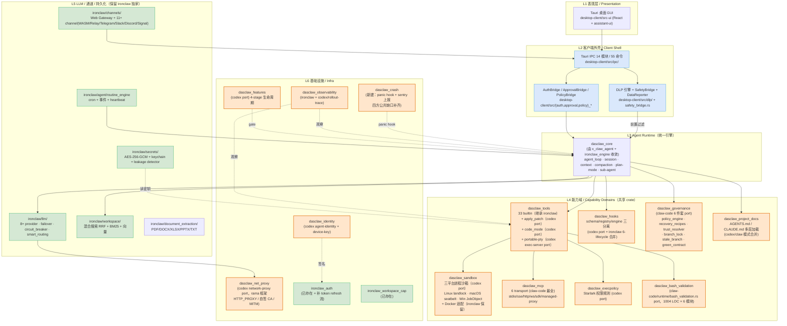
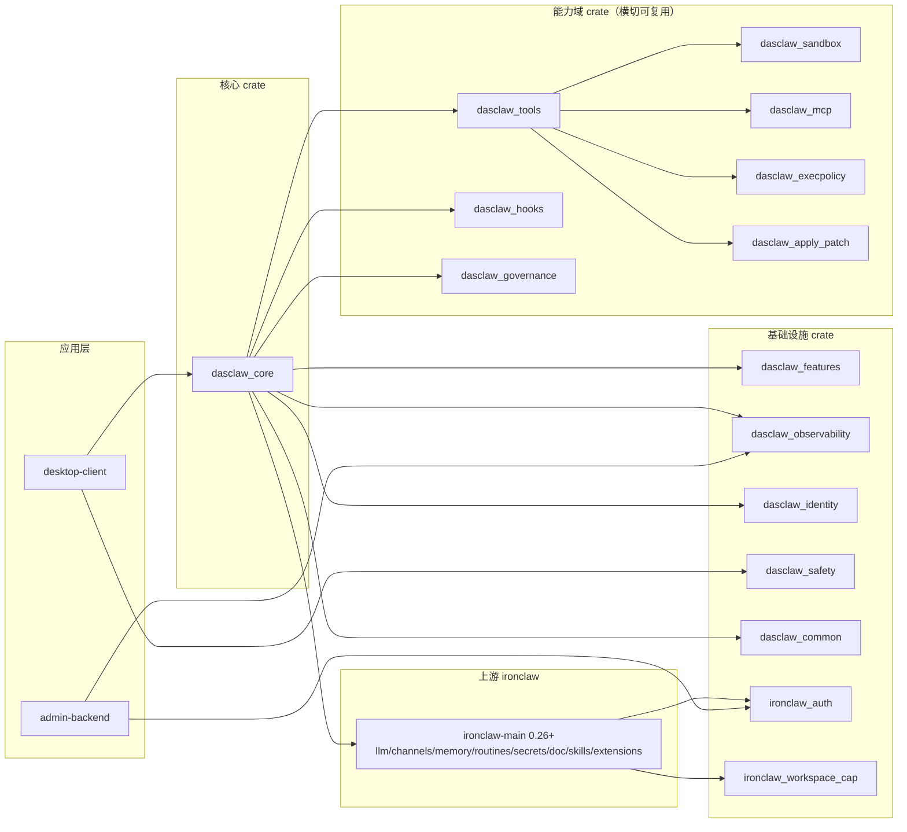
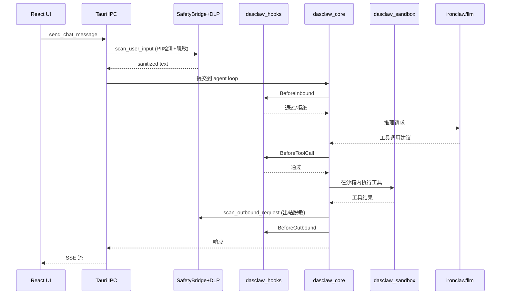

# 31 — 目标架构（边界清晰、可复用）

> **v2.1 (2026-04-25)** · 基于 [30-architecture-truth.md](30-architecture-truth.md) v2（146 子能力、15 大类、~95% 覆盖率）的事实矩阵。
> 本文档替代 11/16 等历史架构文档（详见 cleanup-proposal.md）。
>
> **v1 → v2 主要修订**：
> 1. 补充 L4 能力域 `dasclaw_project_docs`（AGENTS.md/CLAUDE.md 多层加载）— 30 v2 §G
> 2. L4 工具系统增加 `portable-pty + exec-server` 子能力 — 30 v2 §C
> 3. L2 客户端外壳明确补齐 LSP IPC / MCP IPC / Approval WebSocket / AuthToken refresh — 30 v2 §4 硬伤
> 4. L6 增加 `dasclaw_crash`（统一 panic hook + crash 上报，四方公共缺口） — 30 v2 §K
> 5. 新增 ADR-106 / ADR-107 / ADR-108
>
> **v2.0 → v2.1 修订**：
> 1. **命名前缀翻转**：D5 决策从 A (`x_claw_*`) 改为 B (`dasclaw_*`)，新建 crate 全部使用 dasclaw_ 前缀；已存在的 `crates/x_claw_agent`（Phase 3 Step D-4 LoopDelegate Route B）作为过渡表象保留，后续升级为 `dasclaw_core`。
> 2. **ADR-101 路径修正**：改为“吸收式重构”（不直接切 ironclaw 0.24→0.26），原估“2-3 天”调为 4-6 周。
> 3. **ADR-107 拆分**：ADR-107a（Approval WebSocket）+ ADR-107b（AuthToken 续期），两件独立验收。
> 4. **dasclaw_workspace_cap 不扩到 admin-backend**：仅桌面本地强制，补齐策略层（借鉴 codex SandboxPolicy enum 思路）。
>
>
> **核心原则**：
> 1. **唯一职责** — 每层一件事，禁止能力跨层散落
> 2. **可复用** — 共享能力必须落 workspace crate，不允许 path 软链 fork
> 3. **零回退** — desktop-client 上层独家能力（DLP/Policy/IPC）一律保留
> 4. **不可绕过** — 三平台 sandbox + DLP + Hook 引擎是必经路径

---

## 1. 架构总览（六层 + 四纵切关注点）

**色标**：
- 🟧 橙色：新建 `dasclaw_*` 共享 crate（4 个 P0 + 6 个 P1/P2）
- 🟩 绿色：ironclaw 保留模块（无需重写）
- 🟦 蓝色：desktop-client 客户端外壳（独家产品层）

---

## 2. 边界契约（每层只做一件事）

| 层 | 唯一职责 | **禁止** |
|----|---------|---------|
| L1 表现层 | 渲染 + 用户交互事件分发 | ❌ 不直接调 LLM / 不持久化业务数据 |
| L2 客户端外壳 | IPC 路由 + DLP 前置 + 凭证桥接 + 审批入口 | ❌ 不实现 agent loop / 不直接持有 LLM client |
| L3 Agent Runtime | agent loop + session + context + compaction + plan-mode | ❌ 不实现工具具体逻辑 / 不实现沙箱 / 不知道 IPC 形态 |
| L4 能力域 | 单一能力 trait + 实现（沙箱/工具/Hook/治理/MCP/execpolicy） | ❌ 跨能力域互相 import / 持有 agent 状态 |
| L5 集成域 | LLM/通道/持久化/Routines/Secrets/文档抽取 | ❌ 不依赖 L4 能力域具体实现（通过 trait） |
| L6 基础设施 | 横切关注点（特性开关/可观测/身份/auth/workspace_cap） | ❌ 不持业务状态 |

**依赖方向**：L1 → L2 → L3 → L4 → L5/L6（L4 不依赖 L5）。
**反例（必须避免）**：L4 sandbox crate import L5 LLM crate；L3 直接 import L1 React 类型。

---

## 3. 关键架构决策（待 ADR 落地）

### ADR-101：唯一 Agent Runtime（吸收式重构）
**决策**：以 `crates/x_claw_agent`（已完成 LoopDelegate Route B）为起点升级为 `dasclaw_core`；上游 ironclaw-main 0.26 的关键模块（`gate/` 审批工作流、`bridge/` CodeAct 适配、`auth/` PKCE、`ownership/` workspace 信任、`http_intercept.rs`）逐项移植到 dasclaw_* 子 crate；desktop-client/ironclaw 私货（`claw_code_provider.rs` 1334 行、`llm/prompt/` 分层、`agent/traits_impl.rs` Tauri 适配）中立迁出后删 fork。
**不采用**：“直接依赖上游 0.24→0.26”路径。依据：
- fork vs upstream 同名文件行数差异：session.rs +2160、agentic_loop.rs +1051、dispatcher.rs +1202、agent_loop.rs +742、provider.rs +802、config/mod.rs +539。核心 6 文件上游领先 6,496 行，API 表面发生深层变化。
- 上游新增独立模块 8 个（`auth/` `bin/` `bridge/` `gate/` `ownership/` `code_challenge.rs` `http_intercept.rs` `generated_images.rs`），fork 完全缺失。
- fork 私货 ~1,642 行（以前估 ~500 行严重低估）。
**调整后工量**：4-6 周（原 v2.0 估 2-3 天错误）。
**落地**：在 32 执行计划 W1 启动骨架，W1→W6 逐 crate 吸收，W6 完成 fork 删除。

### ADR-102：三平台 Sandbox 是基线
**决策**：从 codex port `linux-sandbox` / `sandboxing` / `windows_sandbox` 进 `dasclaw_sandbox` crate，作为**所有工具调用必经路径**。Docker 沙箱（ironclaw）作为高隔离选项保留。
**理由**：
- desktop-client 当前**进程级沙箱零基线**，违反"不可绕过"原则。
- ironclaw 的 Docker 沙箱适合 orchestrator 场景，但桌面端单进程下需要 landlock/seatbelt/JobObject 级隔离。
**落地**：W2-W3。

### ADR-103：自治治理 6 件套作为可选 crate
**决策**：claw-code 6 件套（policy/recovery/trust/branch_lock/stale/green）port 进 `dasclaw_governance`，**默认关闭**，通过 Feature Flags 启用。
**理由**：政企客户路径不一定需要全部，但要给企业级客户一个可启用开关。
**落地**：W4。

### ADR-104：明确 non-goal 清单
**永久不做**（不再讨论）：
- TUI（codex/tui、claw rusty-claude-cli、ironclaw_tui）
- App-Server JSON-RPC 模式
- Cloud Tasks / SaaS 部署
- ChatGPT 专属 / responses-api proxy
- AWS-auth
- Realtime WebRTC
- mock-anthropic-service / compat-harness（保留作测试工具，不进生产）

**关于 ADR-101 dasclaw_core 工作量精算（v2.2 补充）**：
- ironclaw_engine v2 总 30,414 LOC，但 trait 文件**仅 410 LOC**（Effect 69 / Store 251 / Llm 61 / Workspace 20）+ 类型 3,109 LOC = **核心抽象只占 3,519 LOC**
- 其余 26,895 LOC 是 capability/executor/runtime/gate/memory 的具体实现，**桌面端只需要 chat + job 两类 thread type，可砍至 10-12k LOC**
- 加上选择性吸收 codex thread-store trait（参考 88 commit InMemory + LiveThread 设计）
- **dasclaw_core 真实工作量 ≈ 14-16k LOC**，远小于纸面 "30k LOC 全搬"
- **核心策略**：抽 v2 的 4 trait 骨架 + 关键类型 → 注入 x_claw_agent；不复制 26k LOC 实现

### ADR-105：保留 ironclaw 集成层
**决策**：L5（LLM/Channels/Memory/Routines/Secrets/Doc）继续依赖 `ironclaw-main`，但通过 trait 暴露给 L3。
**理由**：这部分是 ironclaw 真正的护城河（多通道、混合搜索、Routines），重写无价值。
**落地**：W1 把 desktop-client/ironclaw 子模块切回上游 ironclaw-main 0.26+ git submodule，删除 path fork。

### ADR-106：项目级文档统一为 AGENTS.md 协议
**决策**：新建 `dasclaw_project_docs` crate，统一加载优先级：`AGENTS.md` > `CLAUDE.md` > `.codex/agents.md` > project config。多层合并：user 全局 → project 项目级 → cwd 覆盖，与 codex `project_doc_max_bytes` 机制一致。
**理由**：
- 30 v2 §G 事实：desktop-client 完全不加载项目级文档（grep ipc/ 无项目文档加载），与 codex/claw 生态不互通。
- AGENTS.md 已是业界事实标准（OpenAI / Anthropic / Cursor / Aider 等都采用），CLAUDE.md 为 Anthropic 生态别名。
**落地**：W3 随 hooks crate 一起进场（项目文档载入 → BeforeInbound 注入 system prompt）。

### ADR-107a：Approval WebSocket化（agent 工具执行门）
**决策**：`approval_polling.rs` 现行 30s polling（最多 24h × 2880 次）改为 **WebSocket 推送 + polling 降级**。优先用上游 ironclaw-main 0.26 的 `gate/` 模块（approval.rs / pending.rs / persistence.rs / store.rs）移植到 `dasclaw_governance::approval` 下，替代 fork 的 `approval_polling.rs` + `PendingTicketStore`。
**范围边界**：本 ADR 仅针对 **agent 执行高危工具时的审批门**（例如 destructive_bash / network_write），不是工单系统。Token 在 desktop-client 内存 + sled，WebSocket 走 ironclaw web 渠道。
**落地**：W6（与 LSP/MCP IPC 同期）。

### ADR-107b：AuthToken 客户端续期 + admin 审计
**决策**：`auth_token_manager.rs` 现行只检查 `is_valid_token` 但无自动续期，从 codex/login crate port `refresh_token` 流补齐。**Token 存储 + refresh 在客户端**（Keychain/DPAPI/libsecret），admin-backend 仅负责审计与企业版可选中央吐销。
**不采用**：“Token 集中放服务端”路径（违反 OAuth 设备绑定原则，且 admin-backend 不应介入个人 OAuth 会话凭证）。
**落地**：W7（与 identity + crash 同期）。

### ADR-108：LSP / MCP IPC 命令补齐
**决策**：desktop-client/src/ipc/ 新增 `lsp.rs`（4 命令：启/停/查/探） + `mcp.rs`（6 命令：attach/detach/list_tools/call_tool/list_servers/health），包装 `dasclaw_mcp` + ironclaw lsp/。
**理由**：30 v2 §4 硬伤：desktop-client 现状 grep ipc/ 无 lsp.rs 无 mcp.rs，前端无法调用（底层实现都在，只是未暴露）。
**落地**：W6 随 IPC 切换同步进场，FRONTEND_INVOKED_COMMANDS 同步更新。

### ADR-109：统一 panic hook + crash 上报
**决策**：新建 `dasclaw_crash` crate，统一 `panic::set_hook`，结构化写 trace + 可选接入 sentry/datadog。默认写本地 dump，远端上报走 admin-backend `/api/client-reports`（复用 DataReporter）。
**理由**：30 v2 §K 事实：**四方都无 panic hook / sentry 集成**，生产事故定位难。
**落地**：W7 与 observability + identity 一起进场。

### ADR-110：桌面端 Bridge Lite（≈ 5-7k LOC，**不抄 ironclaw bridge 25k**）
**决策**：新建 `crates/dasclaw_bridge_lite`（≈ 5-7k LOC），只取 ironclaw-main `src/bridge/` 25,369 LOC 中**桌面端真实需要**的部分：
- ✂️ **不要**：`router.rs` 9,609 LOC（多 channel 路由器，桌面端走 Tauri IPC 不需要）
- ✂️ **不要**：`store_adapter.rs` 大半 3,351 LOC（PG/libSQL 双后端切换，桌面端 libSQL 单库）
- ✂️ **不要**：`skill_migration.rs` 445 LOC（历史数据迁移）
- ✅ **要**：从 `effect_adapter.rs` 5,802 LOC 抽 EffectExecutor trait + safety/hook 链 (~2k)
- ✅ **要**：`llm_adapter.rs` 1,595 LOC（cost guard + provider chain）
- ✅ **要**：`auth_manager.rs` 1,581 LOC 简化版 ~500 LOC（桌面端只需 1-2 provider 凭证）
- ✅ **要**：`cost_guard_gate.rs` 41 LOC + `user_facing_errors.rs` 448 LOC 完整搬

**理由**：ironclaw bridge 的 25k LOC 是 v1 dispatcher ↔ v2 engine **双模式共存**的胶水。桌面端**没有 v1 历史债**，直接以 v2 trait 为唯一抽象，省掉双模式适配。

**和 ADR-101/104/108 的关系**：
- ADR-101 决定 dasclaw_core 路径
- ADR-104（v2.2 补充）说明 v2 抽象只占 3.5k LOC
- ADR-108 LSP/MCP IPC 是表面层
- **ADR-110 是连接 dasclaw_core ↔ 各 host 实现的胶水层**

**落地**：W6（与 IPC + 后端基底大移植同期）。

---

## 4. 新增 / 重构 crate 清单

### 4.1 新建（P0 必做，6 个）

| crate | 来源 | 提供 |
|-------|------|------|
| `crates/dasclaw_core` | x_claw_agent 升级（注入 ironclaw_engine v2 的 4 trait + 关键类型 ≈ 3.5k LOC，**不抄 30k 实现**） | Agent runtime 唯一入口（≈ 14-16k LOC 目标） |
| `crates/dasclaw_bridge_lite` | ironclaw bridge 25k 中**精选 5-7k**（去 router 9.6k + store 3k + 历史迁移 0.4k） | EffectExecutor + LlmBackend + AuthLite + CostGuard 胶水 |
| `crates/dasclaw_sandbox` | codex port | Linux/macOS/Win 三平台沙箱 |
| `crates/dasclaw_hooks` | codex port + ironclaw 合并 | schema/registry/engine 三分离 hook 引擎 |
| `crates/dasclaw_apply_patch` | codex port | Lark 语法 patch 协议 |
| `crates/dasclaw_project_docs` | codex/claw 合并 | AGENTS.md / CLAUDE.md 多层加载 |
| `crates/dasclaw_pty` | codex/exec-server port | portable-pty 信号转发 + resize |

### 4.2 新建（P1 推荐，4 个）

| crate | 来源 | 提供 |
|-------|------|------|
| `crates/dasclaw_governance` | claw-code 6 件套 port | policy/recovery/trust/branch_lock/stale/green |
| `crates/dasclaw_mcp` | claw-code 6 transport port | 统一 MCP 客户端 |
| `crates/dasclaw_execpolicy` | codex port | Starlark 权限规则 |
| `crates/dasclaw_bash_validation` | claw-code/runtime/bash_validation.rs port | bash 注入检测（6 验证模块 × 1004 LOC）|

### 4.3 新建（P2 增强，5 个）

| crate | 来源 | 提供 |
|-------|------|------|
| `crates/dasclaw_features` | codex port | 4 阶段 feature 生命周期 |
| `crates/dasclaw_observability` | ironclaw + codex/rollout-trace | 统一可观测 |
| `crates/dasclaw_identity` | codex agent-identity + device-key | 设备级身份 |
| `crates/dasclaw_crash` | 新建（四方公共缺口补齐）| panic hook + sentry 适配 |
| `crates/dasclaw_net_proxy` | codex/network-proxy port | rama 框架 + 自签 CA + MITM |

### 4.4 保留（已存在，无需新建）

- `crates/ironclaw_auth` — 鉴权
- `crates/ironclaw_workspace_cap` — 工作区能力
- `desktop-client/ironclaw/crates/ironclaw_safety` → 升级为 `crates/dasclaw_safety`（移到顶层 workspace）
- `desktop-client/ironclaw/crates/ironclaw_common` → 升级为 `crates/dasclaw_common`

### 4.5 废弃 / 迁移

| 现有 | 处理 |
|------|------|
| `crates/x_claw_agent`（Phase 3 Step C） | 内容并入 `dasclaw_core`，crate 删除 |
| `desktop-client/ironclaw/`（0.24 精简 fork） | 删除 path 子模块，改用 ironclaw-main 顶层依赖 |

---

## 5. desktop-client 客户端外壳保留清单

### 5.1 零改动保留（只更新引用 path）

| 模块 | 文件 |
|------|------|
| Tauri 命令注册宏 | desktop-client/src/lib.rs::all_tauri_commands! |
| 14 个 IPC 模块 | desktop-client/src/ipc/ |
| DLP 引擎 + 8 命令 | desktop-client/src/dlp/ + ipc/dlp.rs |
| SafetyBridge | desktop-client/src/safety_bridge.rs |
| Policy Sync 三件套 | policy_sync.rs / enterprise_policy_sync.rs / managed_policy.rs |
| DataReporter | desktop-client/src/data_reporter.rs |
| ConversationTracker / ModelSwitch | conversation_tracker.rs / model_switch.rs |
| 契约测试 | desktop-client/tests/tauri_command_contract_tests.rs |
| 启动时序测试 | desktop-client/src/engine_startup_tests.rs |

### 5.2 需修隶性保留（ADR-107/108）

| 模块 | 修订点 | 检查点（Wave） |
|------|--------|-----------------|
| approval_polling.rs | 加 WebSocket 推送分支，30s polling 作为降级 | W6 |
| auth_token_manager.rs | 接入 codex/login refresh_token 流 | W7 |
| ipc/ | 新增 lsp.rs（4 命令）+ mcp.rs（6 命令）；FRONTEND_INVOKED_COMMANDS 同步 | W6 |
| 项目文档加载（新增）| AppState 注入 `dasclaw_project_docs::ProjectDocLoader`，启动时加载 AGENTS.md/CLAUDE.md | W3-W6 |
| panic hook（新增）| `dasclaw_crash::install_panic_hook()` 在 lib.rs main 出口最早调用 | W7 |

---

## 6. Workspace 依赖图（目标态）

**关键约束**：
- `dasclaw_*` crate 都不能 import `ironclaw-main` 的具体业务模块（只通过 trait）。
- `desktop-client/ironclaw` 这个 path fork 在 W1 删除。
- 应用层（desktop-client / admin-backend）是唯一可以 import 多个能力域的层。

---

## 7. 安全 & 数据流（DLP + Sandbox + Hook 三道防线）

**三道不可绕过**：
1. **DLP**（IPC 入口必经）— PII 脱敏 + 字典匹配
2. **Sandbox**（工具调用必经）— 三平台进程沙箱
3. **Hooks**（关键 lifecycle 必经）— BeforeInbound/BeforeToolCall/BeforeOutbound + SessionStart/End + TransformResponse

---

## 8. 待用户决策点（非阻塞但需要明确）

| # | 决策点 | 选项 | 推荐 |
|---|-------|------|------|
| D1 | dasclaw_core 合并方式 | A) 重写 / B) ironclaw_engine 为基础 + 吸收 x_claw_agent 的 Step C hooks | **B** |
| D2 | desktop-client/ironclaw 处理 | A) 升级到 0.26 完整版 / B) 删 path fork 改用 git submodule 引上游 / C) 保持精简 fork 但同步到 0.26 | **B** |
| D3 | governance 6 件套是否默认开启 | A) 默认开 / B) 默认关 + Feature Flag | **B**（政企客户按 SKU 启用） |
| D4 | TUI / app-server 等 non-goal 是否真的不做 | A) ADR 永久关闭 / B) 留待 v2 评估 | **A** |
| D5 | 新 crate 命名前缀 | A) `x_claw_*` / B) `dasclaw_*`（11 文档历史命名） | **B**（v2.1 翻转：遵循用户“新的叫 dasclaw_、老的慢慢替换”决策；x_claw_agent 作为唯一过渡例外保留） |
| D6 | admin-backend 在新架构中的角色 | A) 独立产品（policy 下发 + 审计） / B) 收编为 desktop-client 的可选远端 | **A**（继续独立） || D7 | AGENTS.md / CLAUDE.md 加载优先级 | A) AGENTS.md > CLAUDE.md / B) 同级合并 / C) 只认 AGENTS.md | **A**（与 codex 生态对齐 + claw 向后兼容）|
| D8 | Approval 底层推送升级 | A) WebSocket-only / B) WebSocket + 30s polling 降级 / C) 保持 polling | **B** |
| D9 | crash 上报默认后端 | A) sentry / B) admin-backend `/api/client-reports` / C) 可选多后端 | **C**（默认 admin，可插拔 sentry）|
| D10 | bash_validation 是否独立 crate | A) 合进 dasclaw_safety / B) 独立 dasclaw_bash_validation | **B**（1004 LOC × 6 模块体量，职责独立）|
---

## 9. 与历史文档关系

| 历史文档 | 处理 |
|---------|------|
| 11-target-architecture-route-b.md | **被本文档替代**。命名前缀终究采用 dasclaw_（v2.1），6 件套改为可选 |
| 17-crate-inventory-audit.md | **保留作参考**，归属表融入本文档 §4 |
| 27-mvp-repriority-architecture-first.md | **保留**，本文档对应"架构优先"的具体落地 |
| ADR-001/002 | **保留**，本架构沿用其 sandbox 决策方向 |
| 09 / 13 / 14 / 18 | 见 cleanup-proposal.md 评估 |

---

## 10. v1 → v2 变更日志

基于 [30-architecture-truth.md](30-architecture-truth.md) v2（16 大类 / 146 子能力）净增增量：

| 变更 | 原因（对应 30 v2）|
|------|---------------------|
| L4 增加 `dasclaw_project_docs` crate | §G：desktop-client 不加载项目文档是硬伤 |
| L4 TOOLS 表明 portable-pty | §C：codex/exec-server 是唯一 PTY 实现 |
| L4 增加 `dasclaw_bash_validation` crate | §B/D：claw bash_validation 1004 LOC × 6 模块是独立资产 |
| L6 增加 `dasclaw_crash` crate | §K：四方均无 panic hook / sentry，必须补齐 |
| L6 增加 `dasclaw_net_proxy` crate | §L/E：codex network-proxy（rama）中央企业需要 |
| ADR 增加 106/107/108/109 | 项目文档协议 / approval+authToken / LSP-MCP IPC / panic hook 三处硬伤 |
| 决策点扩展到 D7-D10 | 新增补齐项需交互是否接受默认路径 |
| desktop 外壳清单分“零改动”与“需修隶性保留”两档 | §4 硬伤表：approval polling / authToken 不刷新 |
