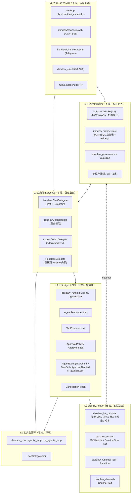

# 53 — 无头 Agent 框架能力设计

**主题**：分析"模型调用 / 工具注册 / 会话状态 / 持久化 / 多端分发"五项能力是否抽入 `crates/` 下的无头 agent 框架；给出分层归属与迁移路径。

**前置**：
- [49 — GUI 就绪度评估](49-gui-readiness-assessment.md)
- [52 — GUI 就绪度复盘](52-gui-readiness-reassessment.md)
- 三层验证调研结论（本文 §1.2 引用）

**结论先行**：五项中**三项已经抽完**（模型调用 / 会话快照 / 多端通道 trait），**一项部分抽完**（工具系统），**一项不应抽**（持久化业务表）。需要新增的是**两个轻量门面 crate** 和**一个 deprecation 路径**，不需要大型重写。

---

## 1. 现状盘点

### 1.1 五项能力 × 三个去处的现状矩阵

| 能力 | desktop-client/ironclaw 现状 | 通用 crate 现状 | 抽完了吗 |
|---|---|---|---|
| **模型调用** | `desktop-client/ironclaw/src/llm/mod.rs` 组装多供应商链路、缓存、熔断、录制 | `crates/dasclaw_llm_provider`（多供应商 / 流式 / 提示缓存 / 智能路由 / 成本核算 / 熔断）+ `crates/dasclaw_runtime/src/llm_adapter.rs`（适配到 `AgentResponder`） | ✅ **已抽完** |
| **工具注册 + 派发** | `desktop-client/ironclaw/src/tools/registry.rs` 聚合内建/MCP/WASM/扩展工具；`tools/execute.rs` 做三段式派发（前置审批 → 执行 → 后置安全） | `crates/dasclaw_runtime/src/tool.rs`（`Tool` trait）+ `agent.rs`（`ToolExecutor` trait）+ `rate_limit.rs`+ `approval.rs` | 🟡 **trait 抽完，聚合层留在 ironclaw** |
| **会话状态** | `desktop-client/ironclaw/src/agent/session.rs` 重导出 `dasclaw_core::session`（Session→Thread→Turn）、含审批/撤销/计划模式/fork | `crates/dasclaw_session`（单线程快照 + jsonl 持久化 + fork）+ `crates/dasclaw_core/src/session.rs`（Session/Thread/Turn 数据模型）+ `crates/dasclaw_runtime/src/context`（任务级 JobContext） | 🟡 **底层数据模型抽完，多线程会话门面只在 ironclaw** |
| **持久化** | PostgreSQL（生产）+ libSQL（桌面回退）+ refinery 迁移，含 `conversations`/`agent_jobs`/`job_actions`/`llm_calls` 等业务表 | `crates/dasclaw_session/src/store.rs`（`SessionStore` trait + 内存实现） | 🟡 **trait 抽完，业务表 schema 应留在业务端** |
| **多端分发** | `desktop-client/src/tauri_channel.rs` Tauri 通道；`ironclaw/src/channels/{web,wasm,...}` 多通道 | `crates/dasclaw_channels`（`Channel` trait + `Tauri/Http/Wasm/Repl` 四个实现） | ✅ **trait + 多个实现已抽完** |

### 1.2 关键事实（三层验证已通过）

1. **`dasclaw_llm_provider` 是零桌面耦合的纯 Rust 库**：流式 / 缓存 / 智能路由 / 成本核算 / 熔断全在内。Headless 评分 5/5。
2. **`dasclaw_session` 已存在且自洽**：单线程消息历史快照、`SessionStore` trait、jsonl 落盘版本通过 insta 锁定。Headless 评分 5/5。
3. **`dasclaw_channels` 已经统一**：四个生产实现（Tauri / HTTP / WASM / REPL）共用 `Channel` trait。
4. **`dasclaw_runtime::Agent` 是无头门面**：本仓库内零生产调用方；3 个测试调用方；故意保持极小，作为"第三方/无界面/远端"用例的接口。
5. **桌面端没有调用 `Agent`**：跑的是 `desktop-client/ironclaw/src/agent/dispatcher.rs:377` 的 `ChatDelegate`（也走 `dasclaw_core::agentic_loop::run_agentic_loop` 这条公共主循环）。
6. **重复代码主要在三处**：审批流程（4 处重复实现）、会话查询（3 处不同 schema）、工具派发循环（2 处不同复杂度）。**根因不是"没抽"，而是"业务诉求不同"**。

---

## 2. 无头 Agent 框架到底需要哪些能力

**先定义"无头"**：不依赖任何具体界面（不依赖 Tauri、不依赖浏览器、不依赖 Telegram、不依赖 admin-backend HTTP 服务）、不依赖任何具体后端（不强绑 PostgreSQL/libSQL/某个云）的纯 Rust 接入层。第三方系统通过这一层可以四行代码起一个 agent 跑起来。

**按这个定义，五项能力的应抽不应抽：**

| 能力 | 无头是否必需 | 应放哪一层 | 理由 |
|---|---|---|---|
| 模型调用 | **必需** | `dasclaw_llm_provider` + `dasclaw_runtime::LlmProviderResponder`（已在） | agent 不发模型请求无意义；多供应商/流式/缓存属于 LLM 客户端的通用能力，与界面无关 |
| 工具调用 trait | **必需** | `dasclaw_runtime::Tool` / `ToolExecutor`（已在） | agent 不调工具就退化成 LLM proxy；trait 必须在 |
| 工具注册聚合（registry） | **不应抽** | 留在各业务端 | 桌面端要 MCP+WASM+扩展，CLI 只要内建+MCP，Telegram 只要 WASM；强行统一会让 trait 边界变形 |
| 审批 trait | **必需** | `dasclaw_runtime::approval`（已在，PR #944 刚补完） | 多端审批 UX 差异很大（Tauri 弹框 / SSE 长轮询 / Telegram 内联键盘），但**触发审批的判定 + 等待回复**是通用机制 |
| 单线程会话快照 | **必需** | `dasclaw_session`（已在） | 任何无头场景都要"接续对话"，否则只能一次性问答 |
| 多线程会话（Thread/Fork/Plan 模式） | **可选，按需抽** | 暂留 `dasclaw_core::session`（已在那里，但供桌面端用） | CLI / API 服务通常只要单线程；多线程是桌面/IDE 类产品的诉求，强抽到无头反而成累赘 |
| 持久化 trait | **必需** | `dasclaw_session::SessionStore`（已在，含内存实现） | 第三方接入要能落盘；trait 足够，不强绑某 DB |
| 持久化业务表（conversations/agent_jobs/llm_calls 等） | **不应抽** | 留在 ironclaw / admin-backend | 业务字段、多租户切分、迁移策略与产品形态强绑；抽到无头框架会拖泥带水 |
| Channel trait | **必需** | `dasclaw_channels`（已在） | 多端是无头框架的核心动机之一 |
| 具体 Channel 实现（Tauri / Web / WASM） | **不应抽** | 留在各业务端 | Tauri 实现要依赖 Tauri 运行时；HTTP 实现要依赖 Axum；抽到通用层会把依赖树污染 |
| 取消令牌、流式事件 | **必需** | `dasclaw_runtime::AgentEvent` + `cancellation_token`（已在，PR #907 / #908 / #910 已补完） | GUI 的"停止 / 流式 / 审批"三大基线 |

**所以"无头 agent 框架要的能力"≈ `dasclaw_runtime` + `dasclaw_session` + `dasclaw_llm_provider` + `dasclaw_channels` 四个 crate 的合集。这四个 crate 现在都已经在了，且整体覆盖度约 90%。**

---

## 3. 分层架构图

**约定**：

- **L0–L2 是无头 agent 框架**，跨产品形态复用。
- **L3 的 `HeadlessDelegate` 是 L1 自带的默认 delegate**，第三方四行代码即可起 agent，不必自己写 delegate。
- **L3 的业务 delegate（ChatDelegate / JobDelegate / CodexDelegate）共享 L0 主循环但各自走自己的派发实现**。这是合理的，因为三段式审批 / 后台任务 / guardian 复审等业务诉求确实不同。
- **L4 / L5 是业务和界面，永远不上探**到无头框架。

---

## 4. 缺口与补法

按调研结果，目前距离"无头 agent 框架 100% 可用"还缺以下几点。**每一项都是窄改动，不是大重写。**

### 4.1 P0 — 不动等同于框架不可用

| 缺口 | 现状 | 补法 | 影响范围 |
|---|---|---|---|
| 文档与样例 | `dasclaw_runtime::Agent` 在仓库内零生产调用；外部第三方不知道怎么接 | 在 `dasclaw_cli/examples/` 加一个最小可跑 demo（含 `Agent::respond_to_approval` 端到端示例）+ `dasclaw_runtime/README.md` 起步章节 | 0 代码风险，纯文档 + 示例 |
| `SessionStore` 内存实现的位置 | 已在 `dasclaw_session`，但 jsonl 落盘版还在 PR #914 PR-C 待落 | 跟进 PR #914，落盘版进 `dasclaw_session` 而不是 `ironclaw` | 已计划，无需新决策 |
| `Agent` 与 `Session` 的合并入口 | `Agent::run` 与 `Session::run` 接口各自独立，没有"四行代码起 agent + 会话续接"的合并门面 | `dasclaw_session::Session::with_agent(agent)` 已经做到，把这个写进 `dasclaw_runtime` 顶层 README | 0 代码 |

### 4.2 P1 — 已经实现（更新：原列为缺口属脑补，已勘误）

> **勘误**：本节初稿列出两个 P1 缺口（MCP executor 桥 + Composite 提升），均为伪缺口。原因是初稿写作时违反 [AGENTS.md](../../AGENTS.md) 三层验证红线，未做 `semantic_search` 核验直接落笔。

**事实**：

| 原列缺口 | 实际状态 | 证据 |
|---|---|---|
| ~~新增 `dasclaw_runtime::mcp_executor::McpToolExecutor`（约 80 LOC）~~ | **已存在**：`dasclaw_mcp::McpToolExecutor` 早就 `impl ToolExecutor`，约 110 LOC | `crates/dasclaw_mcp/src/executor.rs:51-167`；`crates/dasclaw_cli/src/mcp.rs:148` 早已消费 |
| ~~把 `CompositeToolExecutor` 从 cli 升到 runtime（约 50 LOC）~~ | **早已在 runtime**：定义在 `crates/dasclaw_runtime/src/composite_executor.rs`，`lib.rs` 已 `pub use composite_executor::{CompositeError, CompositeToolExecutor};` | cli `main.rs` 是消费方而非定义方 |
| 自定义 LoopDelegate 接 `Agent::respond_to_approval` 的迁移指引 | **真缺**，但份量仅纯文档 | 见 §6 PR-3 |

**结论**：P1 整段从迁移路径中移除；剩余 P0 见 §4.1 + §6。

**桌面端继续保留独立 MCP 适配**（`desktop-client/ironclaw/src/tools/mcp/client_tool.rs`）**属合理多态**：那里走的是 `Tool` trait + 自带 `strip_top_level_nulls` 防守 + 通过 `ToolToExecutorAdapter` 桥接，结构性选择不是冗余复制。详见 §5。

### 4.3 P2 — 桌面端迁移到 `Agent` 门面（最大、最后做、最有争议）

**结论：不该做。** 这是有意识的设计选择，不是"还没做"。

**`ChatDelegate`（`desktop-client/ironclaw/src/agent/dispatcher.rs:354`）与 `HeadlessDelegate` 的 6 维度差异**：

| 维度 | `HeadlessDelegate` | `ChatDelegate` |
|---|---|---|
| **字段数** | 8（responder / tool_executor / hooks / sanitizer / token / event_tx / policy / inbox） | 15（含 tenant / `Arc<Mutex<Session>>` / thread_id / job_ctx / active_skills / disabled_extensions / 两个 cached_prompt / nudge_at / force_text_at / user_tz / Reasoning 引擎） |
| **持久化** | 纯内存，run 结束销毁 | **写数据库**：LLM call 落库，跨进程重启可恢复（[dispatcher.rs:553-567](../../desktop-client/ironclaw/src/agent/dispatcher.rs#L553)） |
| **工具派发** | 单次顺序循环 | **3 阶段**：preflight 审批 → 并行执行 → post-flight DLP/hooks（[dispatcher.rs:351](../../desktop-client/ironclaw/src/agent/dispatcher.rs#L351) 注释） |
| **审批模型** | `ApprovalInbox` + oneshot + `AgentEvent::ApprovalNeeded`（B4） | 直推 `StatusUpdate::ApprovalNeeded` 到 Tauri channel，不经 ApprovalInbox |
| **取消信号** | `CancellationToken` | 检查 `Session::ThreadState::Interrupted`（[dispatcher.rs:383-390](../../desktop-client/ironclaw/src/agent/dispatcher.rs#L383)） |
| **多租户 / Skills** | 无 tenant、无 skill | 每轮按 `tenant` + `active_skills` 重建 `tool_definitions_for_llm` |

**强迁的代价**：要让桌面端走 `Agent`，必须把上面 6 件事塞进 `dasclaw_runtime`。`Agent` 会从"窄门面"变成"宽超集"，CLI / 第三方反而被迫吃下不需要的多租户、Mutex 共享、Reasoning 引擎、3 阶段派发。**这违反 ADR-153 §4.4 "headless CLI 不依赖 DB / HTTP"**。

**不迁的代价**：净重复约 ~150 LOC（两个 LoopDelegate 实现）。但底层共享同一份 `dasclaw_core::agentic_loop::run_agentic_loop`（`desktop-client/ironclaw/src/agent/agentic_loop.rs:18` 即 `pub use dasclaw_core::agentic_loop::*`），共享同一份 `HookBundle`、同一份 `ToolExecutor` / `Tool` trait。**对换的是 `dasclaw_runtime` 公共面保持窄。这是个好交易。**

**未来真要合并的前置**（不在本次范围）：

1. `dasclaw_session` 能持久化桌面端的 `ThreadState` / `Tenant` / `Skills` schema
2. `dasclaw_runtime` 加可插拔的"3 阶段派发器"（hooks 强化版）
3. 审批完全统一到 `ApprovalInbox`

三件事都落地后，迁移成本会从"重写 ChatDelegate"降到"换三个 trait 实现"。在此之前迁是负价值。

---

## 5. 关于"重复代码"

调研估算跨端约 1500 LOC 涉及审批/会话/工具派发的重复。**不全是冗余**：

| 重复项 | 是真冗余还是合理多态 | 处置 |
|---|---|---|
| 审批 4 处实现 | **合理多态**。底层判定 trait 已抽（`ApprovalPolicy`），上层 UX（Tauri 弹框 / SSE / Telegram 键盘 / Guardian 自动复审）必然不同 | 不动 |
| 会话查询 3 处 schema | **业务诉求不同**。单用户桌面 vs JWT 多租户 vs 内存沙箱 | 不动；只保持 `SessionStore` trait 稳定 |
| 工具派发循环 2 处 | **部分冗余**。`HeadlessDelegate` 走简单顺序派发；`ChatDelegate` 走三段式（前置审批 + 并行 + 后置安全） | 桌面端三段式有产品诉求（并行 + 审批 + DLP），不应强压到 headless；headless 简洁是其卖点。**不动** |
| Guardian 自动复审只在 codex | **业务专属**。深度耦合 codex 会话/轮次上下文 | 不动 |

**唯一可消减的真冗余候选**：原以为是 MCP 工具适配，但调研发现 `desktop-client/ironclaw/src/tools/mcp/client_tool.rs`（70 LOC，`Tool` trait + `strip_top_level_nulls` 防守）和 `dasclaw_mcp::McpToolExecutor`（110 LOC，`ToolExecutor` trait）走两条不同 trait 路径，是结构性多态而非冗余复制。强行合并需要先重构 ironclaw 的 Tool registry 模型，代价远超收益。**暂不合并**。

---

## 6. 迁移路径（按优先级、单 PR 边界）

> **修订**：初稿列了 6 PR，调研后发现 §4.2 整段是伪缺口，实际剩余只有 3 个纯文档 PR。

| 顺序 | PR | 内容 | 预估改动 | 状态 |
|---|---|---|---|---|
| 1 | docs(runtime): 起步指南 + 样例 demo | `dasclaw_runtime/README.md` 起步章节 + `dasclaw_cli/examples/headless_agent_starter.rs` | 文档 + 1 个新示例文件 | **#945 in flight** |
| 2 | docs(repo): 顶层指针 | 仓库 `README.md` / `docs/INTEROP_DASCLAW.md` 增加"想嵌入无头 agent 看这里"指针 | ~10 行 docs | 待开 |
| 3 | docs(arch): 升 ADR-156 | 把本文升级为 ADR-156（无头 agent 框架能力边界）+ 反向链接到 ADR-153 / 49 / 52；同时把 `AgentError::ApprovalRequested` 迁移指引写进 ADR-156 附录或 `dasclaw_runtime/MIGRATION.md` | 文档 | 待用户拍板 §9.4 后开 |

**取消的 PR**（原列为 PR-2/3/5）：

- ~~PR-2 MCP executor 桥~~：已在 `dasclaw_mcp::McpToolExecutor`
- ~~PR-3 提升 CompositeToolExecutor~~：已在 `dasclaw_runtime::composite_executor`
- ~~PR-5 jsonl session store~~：PR #914 PR-C 已在飞，跟进即可

**不在路径里的**：桌面端从 `ChatDelegate` 迁到 `Agent`、统一审批多态、统一会话 schema —— 暂不做，理由见 §4.3 + §5。

---

## 7. 风险评估

| 风险 | 等级 | 缓解 |
|---|---|---|
| 第三方接入仍然不知道怎么起 agent | 中 | PR-1 解决（文档 + 样例） |
| MCP 桥落地后 ironclaw 端旧实现成为孤儿，长期不维护 | 低 | 旧实现是桌面专属（含 OAuth 储存、UI 配置面板等），与无头 MCP 桥定位不同；可共存 |
| 抽 `CompositeToolExecutor` 时改了行为导致 CLI 回归 | 低 | 搬迁前后跑 CLI 的现有快照测试 + 新增组合测试 | 
| `dasclaw_session` jsonl 版与 `dasclaw_cli` 已有的 jsonl 实现冲突 | 中 | 与 PR #914 协调，按 ADR-129 §1.3 verbatim port 红线判定是否合并 |
| 桌面端长期不迁到 `Agent`，两套并发模型继续分裂 | 低 | 这是有意识的设计选择；等 ADR-153 后续"持久化恢复"做完再评估 |

---

## 8. 与既有 ADR 的关系

- **ADR-112 §5.4**：B1–B3 评估嵌入节奏。本文确认 B1–B5 已通过 PR #907/#908/#909/#910/#911/#942/#944 全部落地。
- **ADR-129 §1.3**：verbatim port 红线。本文提出的 PR-2 / PR-3 / PR-5 不属于 verbatim port 场景，可以正常重构。
- **ADR-153 §4.4**：headless CLI 不依赖 DB / HTTP。本文 §2 重申该红线作为分层依据。
- **49 / 52**：本文是 49/52 的接续，从"GUI 就绪度评估"上升为"无头框架边界设计"。

---

## 9. 决策需要拍板的事

1. **接受四层架构归属**（§3 + §2 表格）作为后续所有"是否抽到通用 crate"判断依据？
2. **接受 §4.1 / §4.2 的 5 个 P0/P1 缺口** 作为下一阶段实施清单？
3. **接受桌面端不迁 `Agent`** 的判断（详见 52 §3 + 本文 §4.3）？
4. **本文是否升级为正式 ADR-156**？升级后会作为后续 PR 的 ADR cite 锚点。

---

## 附 A — 调研材料引用

本文结论基于三个并行 read-only 调研：

1. **LLM 调用 + 工具注册**：覆盖 `desktop-client/ironclaw/src/llm/` 与 `crates/dasclaw_llm_provider/`，13 个文件 line-level 引用。
2. **会话状态 + 持久化**：覆盖 `dasclaw_core::session` / `dasclaw_session` / `dasclaw_runtime::context` / ironclaw `history::store` + 全部 migrations。
3. **多端分发**：覆盖 Tauri 桌面 / admin-backend HTTP/SSE / Telegram WASM / CLI / MCP server hosting 五条通路，量化跨端重复 ~1500 LOC。

每项调研均经三层验证（semantic_search → code-review-graph 引用图 → grep 字面量）。
