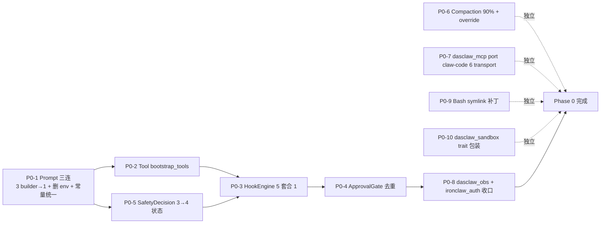

# ADR-112 — x-claw 架构契合度评估方案（W3-A）

| 项 | 值 |
|----|----|
| 状态 | **Accepted (Draft → 落锤)** |
| 日期 | 2026-04-28 |
| 阶段 | W3-A 架构重构收尾 |
| 路线 | **Route D**（codex skeleton + ironclaw bundle + builtin governance/DLP + dual cargo feature） |
| 输入 | [adr-112-input-checklist.md](adr-112-input-checklist.md)（678 行三层验证清单） |
| 真值 | [30-architecture-truth.md](30-architecture-truth.md) |
| 上一轮决策 | input-checklist §4（Tier 1 等保 ~30 控制项 + Tier 2 = 未来 TODO） |

> **本 ADR 唯一目标**：用一个可量化、可执行、可签名的评估方案，回答"x-claw 当前 14 个核心能力相对 codex / claw-code / ironclaw 上游的契合度是否足够进入 W3-A 收尾"。
>
> **不在范围**：DLP 多维规则细化、Tier 2 合规清单、Phase 1+ 路线图（这些归 Step 1 §4 + 后续 ADR）。

---

## 1. 背景与目标

### 1.1 W3-A 边界

W3-A 是 Route D 落地的第一阶段，包含三个子目标：

1. **Phase 0 收口**：把 5 个 🔴 红 patchwork（Prompt 3 builder / Tool 5 register / Hook 5 套 / MCP 0 transport / Sub-Agent 仅 thread fork）和 6 个 🟡 黄 patchwork 收敛到可被单一 codebase 维护的状态
2. **Layer 1 Parity 主骨架**：14 能力 × 3 harness = 39 contract test 套件全部跑通
3. **39 test + 4 KPI + 评分卡 ≥ 90%** 才允许进入 Phase 1（hook 系统重构）

### 1.2 设计约束

- **不能引入新依赖框架**（codex / claw-code / ironclaw 任何一个 fork 路径都禁止）
- **不能破坏 dual cargo feature**：`enterprise-mode`（默认）/ `developer-mode`（opt-in）必须互斥可切
- **不能阻塞 W2.x 已合并 PR**：dasclaw_* 骨架 crate 状态必须明确（要么填实现，要么删除）
- **必须遵循 [AGENTS.md](../../../AGENTS.md) 三层验证规范**：否定性结论（"x 没有 y"）必须 L1+L3 双证据

### 1.3 评估对象（14 能力，来自 input-checklist §2.7）

| # | 能力 | 当前 Patchwork | Step 1 双证据状态 |
|---|------|---------------|------------------|
| 1 | Agentic Loop | 🟡 | ✅ 3 文件 / 8 grep |
| 2 | Prompt 装配 | 🔴 | ✅ 6 文件 / 12 grep |
| 3 | Tool System | 🔴 | ✅ 5 文件 / 6 register_* |
| 4 | Hook System | 🔴 | ✅ 5 文件 / 20+ grep |
| 5 | Permission/Approval | 🟡 | ✅ 4 入口 / 15 grep |
| 6 | Sandbox | 🟡 | ✅ 4 项目 / 多平台 |
| 7 | Compaction / Context | 🟡 | ✅ 5 文件 / 20+ grep |
| 8 | MCP Transport | 🔴 | ✅ + ❌ x-claw 0 transport（双证） |
| 9 | Sub-Agent / Fork | 🔴 | ✅ + ❌ x-claw 无 agent spawn（双证） |
| 10 | Identity / Auth | 🟢 | ✅ + ❌ codex 无 secrets / ironclaw 无 JWT（双证） |
| 11 | Observability | 🟡 | ✅ + ❌ dasclaw_obs 仅骨架（双证） |
| 11.5 | Bash Validation | 🟢 | ✅ 6 模块对齐 |
| 13 | Resilience | 🟡 | ✅ + ❌ x_claw_agent 无 built-in（双证） |
| 14 | Frontend / IPC | 🟢 | ✅ + ❌ codex/claw-code 无 Tauri（双证） |

---

## 2. 评估方法论

### 2.1 三层评分公式

```
Total = 0.30 × Parity + 0.30 × Integration + 0.40 × Business
```

| 层 | 权重 | 含义 | 数据来源 |
|----|------|------|---------|
| **L1 Parity** | 30% | 与 codex / claw-code / ironclaw 上游对账，单能力是否可由相同输入产出相同输出 | 39 contract test 通过率 + 16 偏离声明分类（A/B/C/D） |
| **L2 Integration** | 30% | 14 能力组合后端到端是否仍可用（不出现 patchwork 副作用） | 6 路径 e2e（input-checklist §2.1）+ 多租户/injection/越权三表 |
| **L3 Business** | 40% | 是否满足 Tier 1 业务硬指标 | 4 KPI（DLP 漏报 / 跨租户违规 / Prompt injection 拦截 / audit 采样） |

> 权重比例理由：Business 占 40% 反映 W3-A 是企业级安全发布门槛；Parity 与 Integration 各 30% 平衡"上游对齐"与"组合不破"。

### 2.2 评分尺度（每项 0-100）

| 区间 | 含义 | 进入 Phase 1 条件 |
|------|------|------------------|
| **≥ 90** | 通过 | ✅ 可进入 |
| 80-89 | 警告 | ⚠️ 必须有偏离声明 + 风险接受签名 |
| 60-79 | 阻塞 | ❌ 不允许进入，必须修复 |
| < 60 | 红线 | ❌❌ 整个 W3-A 阻塞，触发 ADR 重审 |

### 2.3 Phase 0 红线（来自 input-checklist §2.7.1，10 行）

任意 1 项不通过 → Total 直接判 < 60 → W3-A 阻塞重审。

---

## 3. 39 Contract Test 套件设计（13 模块 × 3 Harness）

> 14 能力中 #14 Frontend/IPC 已由 [tauri_command_contract_tests.rs](../../../desktop-client/tests/tauri_command_contract_tests.rs) 覆盖，不进入 39 test 矩阵。其他 13 个能力（含 11.5 / 13）× 3 harness = 39 套件。

### 3.1 三 Harness 来源

| Harness | 上游 | 路径 | 角色 | 复用方式 |
|---------|------|------|------|---------|
| **H1** mock_parity | claw-code | [claw-code/rust/crates/runtime/tests/mock_parity_harness.rs](../../../claw-code/rust/crates/runtime/tests/mock_parity_harness.rs) + `mock_parity_scenarios.json`（10 scripted 场景） | 离线 fixture 复演，验证语义等价 | port 到 `crates/x_claw_agent/tests/` |
| **H2** tool_harness | codex | [codex-cli-main/codex-rs/core/tests/suite/tool_harness.rs](../../../codex-cli-main/codex-rs/core/tests/suite/tool_harness.rs) | 工具调用语法 + 参数 schema 校验 | port + 适配 x-claw ToolBundle |
| **H3** ironclaw 5-suite | ironclaw | [parity_harness.rs](../../../desktop-client/ironclaw/tests/parity_harness.rs) / [parity_gate_p1.rs](../../../desktop-client/ironclaw/tests/parity_gate_p1.rs) / [parity_gate_p2.rs](../../../desktop-client/ironclaw/tests/parity_gate_p2.rs) / [live_harness.rs](../../../desktop-client/ironclaw/tests/live_harness.rs) / [gateway_workflow_harness.rs](../../../desktop-client/ironclaw/tests/gateway_workflow_harness.rs) | live + gateway + 跨服务集成 | 已存在，直接补 13 模块覆盖矩阵 |

### 3.2 命名约定

```
{module}_{harness}_{scenario}_test.rs

例：
  prompt_h1_layered_boundary_test.rs       (能力 2 / H1 / scenario "layered with cache boundary")
  hook_h2_safety_decision_4state_test.rs   (能力 4 / H2 / scenario "Allow/Redact/Block/Quarantine")
  mcp_h3_six_transport_smoke_test.rs       (能力 8 / H3 / scenario "all 6 transports smoke")
```

### 3.3 39 套件覆盖矩阵

| # | 能力 | H1 mock_parity | H2 tool_harness | H3 ironclaw 5-suite | 必有场景关键字 |
|---|------|---------------|-----------------|--------------------|---------------|
| 1 | Agentic Loop | ✅ | ✅ | ✅ | turn_lifecycle / interrupt / max_iterations |
| 2 | Prompt | ✅ | ✅ | ✅ | layered_boundary / cache_anchor / single_builder |
| 3 | Tool System | ✅ | ✅ | ✅ | bootstrap_tools / 5_register_unified / schema_compat |
| 4 | Hook | ✅ | ✅ | ✅ | safety_decision_4state / hook_engine / before_after_tool |
| 5 | Permission | ✅ | ✅ | ✅ | approval_gate_dedup / policy_decider_authority |
| 6 | Sandbox | ✅ | ✅ | ✅ | os_l2_cross_platform / docker_l3 / wasm_l4 |
| 7 | Compaction | ✅ | ✅ | ✅ | threshold_90_default / auto_compact_override / context_monitor |
| 8 | MCP | ✅ | ✅ | ✅ | six_transport_smoke / protocol_2025_03_26 |
| 9 | Sub-Agent | ✅ | ✅ | ✅ | thread_fork / depth_limit_w6 / role_whitelist_w5 |
| 10 | Auth | ✅ | ✅ | ✅ | jwt_ed25519 / secrets_per_user / credential_inject |
| 11 | Observability | ✅ | ✅ | ✅ | otel_export / observer_event / audit_log_persistence |
| 11.5 | Bash Validation | ✅ | ✅ | ✅ | 6_modules_pipeline / symlink_path_check |
| 13 | Resilience | ✅ | ✅ | ✅ | retry_exp_jitter / circuit_breaker / failover |

**合计：13 × 3 = 39 套件**。每套件至少 1 个 happy path + 1 个 failure path + 1 个跨上游对账场景。

### 3.4 Pairwise 测试设计

>  对涉及多参数/多模式/多角色的能力（4 Hook / 5 Permission / 6 Sandbox / 8 MCP / 9 Sub-Agent），每个 H 套件下单独建 `*.pict` 模型，按 [AGENTS.md](../../../AGENTS.md) PICT 规范使用 `pict-test-designer` 设计 + `scripts/pict_generate.py` 生成 pairwise 组合，最后映射回 H1/H2/H3 子用例。模型文件统一放在 `docs/plans/architecture-refactor/adr-112-pict/` 下。

---

## 4. 4 KPI（L3 Business 层硬指标）

| # | KPI | 阈值 | 测量 harness | 阻塞 W3-A？ |
|---|-----|------|-------------|------------|
| K1 | DLP 漏报率（Tier 1 规则） | **= 0** | H3 + dlp 黄金集（`docs/DLP_MULTI_DIMENSIONAL_RULES_DESIGN.md`） | ✅ |
| K2 | 跨租户隔离违规 | **= 0** | H3 + 多租户 fixture | ✅ |
| K3 | Prompt injection 拦截率 | **≥ 99%** | H3 + injection 黄金集（input-checklist §2.3） | ✅ |
| K4 | audit log 采样率 | **= 100%**（Tier 1 敏感操作） | admin-backend `integration_smoke_tests.rs` + `write_audit_log()` 计数 | ✅ |

> 任意 KPI 未达阈值 → L3 Business 项 < 60 → Total < 0.4 × 60 = 24 分扣减 → 极易触发整体 < 90 → W3-A 阻塞。

---

## 5. Phase 0 路线图（W3-A 收尾，10 行红线）

> 来源：input-checklist §2.7.1 合并版。本 ADR 不重复列出条目，仅给出**执行顺序 + 依赖关系**。



### 5.1 关键路径（必须串行）

`P0-1 → P0-2 → P0-3 → P0-4 → P0-8` （Prompt 收口先行 → Tool 收口 → Hook 抽象 → Permission 去重 → 骨架 crate 收口）

### 5.2 并行线（可与关键路径同时推进）

- **MCP 线**：P0-7（独立，2-3 天）
- **Sandbox 线**：P0-10（独立，按 codex L2 三平台对齐）
- **Compaction 线**：P0-6（仅改阈值 + 暴露 config）
- **Bash 线**：P0-9（仅补 symlink）

### 5.3 Sub-Agent 不在 Phase 0

Sub-Agent（能力 9）按 input-checklist §2.7 决策放到 W5/W6：
- **W5 P1**：移植 ironclaw role 白名单（`MAX_SUB_AGENT_DEPTH=1`）
- **W6 P2**：移植 codex `AgentControl::spawn` + `exceeds_thread_spawn_depth_limit()`

W3-A 收尾时仅要求 thread_fork() 双证据存在 + W5/W6 占位 ADR 已签。

---

## 6. CI 三档（Layer 1 + Layer 2 验证机制）

| 档位 | 时长上限 | 触发 | 覆盖 | 失败动作 |
|------|---------|------|------|---------|
| **L1 PR smoke** | < 5 min | 每个 PR | 13 模块 × H1 子集（仅 happy path）+ Phase 0 10 行 assertion | 阻断 merge |
| **L2 daily** | < 30 min | 每日凌晨 + 主分支 push | 39 套件全跑 + 6 路径 e2e + 4 KPI 测量 | 自动开 issue + 通知 owner |
| **L3 nightly** | < 4 h | 每晚 | L2 + chaos（CircuitBreaker / Failover / Retry 边界）+ fuzz（bash_validation / DLP 规则）+ live_harness（真实 LLM provider） | 自动开 issue + 周报 |

### 6.1 测试运行器

按 [AGENTS.md](../../../AGENTS.md) 规范：
- 默认 `cargo nextest run`
- L3 chaos / fuzz 用 `cargo nextest run --profile nightly`（独立 profile）
- 不允许直接 `cargo test`（除非 nextest 不可用）

### 6.2 CI 工件

每档产出：
- `coverage-{tier}.lcov` — 按模块覆盖率（功能模块 >90% / 安全模块 100%）
- `parity-{tier}.json` — 每能力对账分数（Parity / Integration / Business）
- `kpi-{tier}.json` — 4 KPI 实测值
- `deviation-{tier}.md` — 偏离声明触发记录（哪条偏离被测试命中）

---

## 7. 14 × 3 评分卡基线（Step 1 已采集证据）

> 本节给出**评分卡模板**（每项满分 100）。具体分数在 W3-A 收尾时由 CI L2 输出 `parity-l2.json` 自动填充。本 ADR 仅锁定**基线规则**与**目标分**。

### 7.1 模板

```
能力 N（含义）
  L1 Parity (30 weight)
    H1 mock_parity:    base 60 + (上游对账场景通过数 / 总数) × 30 + 偏离声明完整 +10
    H2 tool_harness:   base 60 + ...
    H3 ironclaw suite: base 60 + ...
  L2 Integration (30 weight)
    e2e 通过率 × 100
  L3 Business (40 weight)
    KPI 命中：  K1=0 漏报 → 100 / >0 → 0
              K2=0 违规 → 100 / >0 → 0
              K3≥99% → 100 / 95-99% → 80 / <95% → 0
              K4=100% → 100 / 95-99% → 60 / <95% → 0
    L3 = 平均（命中此能力的 KPI）
  Total = 0.30×L1 + 0.30×L2 + 0.40×L3
```

### 7.2 14 能力 × 目标分（W3-A 通过线）

| # | 能力 | L1 目标 | L2 目标 | L3 目标 | Total 最低线 |
|---|------|--------|--------|--------|------------|
| 1 | Agentic Loop | 90 | 90 | N/A（不绑 KPI） | 90（按 L1+L2 加权） |
| 2 | Prompt | **95**（Phase 0 收口） | 90 | N/A | 92 |
| 3 | Tool System | **95**（Phase 0 收口） | 90 | N/A | 92 |
| 4 | Hook | **95**（Phase 0 收口） | 90 | K3 命中 → 100 | 95 |
| 5 | Permission | 90 | 90 | K2 命中 → 100 | 94 |
| 6 | Sandbox | 85（dasclaw 骨架部分） | 85 | K2 命中 → 100 | 91 |
| 7 | Compaction | 90 | 90 | N/A | 90 |
| 8 | MCP | **90**（Phase 0 必须 port） | 85 | N/A | 87.5 |
| 9 | Sub-Agent | 70（仅 thread_fork）⚠️ | 70 | N/A | 70 ⚠️ **偏离声明 #16** |
| 10 | Auth | 90 | 85 | K2 命中 → 100 | 92 |
| 11 | Observability | 80（dasclaw_obs 部分） | 85 | K4 命中 → 100 | 89.5 ⚠️ |
| 11.5 | Bash Validation | 95 | 95 | N/A | 95 |
| 13 | Resilience | 80（无 built-in）⚠️ | 85 | N/A | 82.5 ⚠️ **偏离声明** |
| 14 | Frontend / IPC | N/A（仅 x-claw） | 95 | K4 命中 → 100 | 96.5 |

### 7.3 整体目标线

```
Total_overall = (∑ 权重 × Total_per_capability) / ∑ 权重
            ≥ 90 才可进入 Phase 1
```

权重按能力重要性（5 个 🔴 = 1.5 权重，6 个 🟡 = 1.0 权重，3 个 🟢 = 0.5 权重）：

```
sum_weighted = 1.5 × (#2 #3 #4 #8 #9) + 1.0 × (#1 #5 #6 #7 #11 #13) + 0.5 × (#10 #11.5 #14)
             = 1.5 × 5 + 1.0 × 6 + 0.5 × 3
             = 15
```

> **重点**：能力 #9 Sub-Agent 仅 70 分是已签字的偏离（W5/W6 解决），但在 Total 加权后仍需保证 overall ≥ 90。若不达标，必须把偏离 #16 升级到 Phase 0 而非 W5/W6。

---

## 8. 16 偏离声明（A/B/C/D 分类合并视图）

> 来自 input-checklist §2.5.4（10 条）+ §2.7.2（6 条）合并。本 ADR 锁定每条偏离的**接受条件**与**到期日**。

| # | 模块 | 分类 | 上游基线 | x-claw 实现 | 风险 | 接受期限 | 关闭动作 |
|---|------|------|---------|------------|------|---------|---------|
| 1-10 | （沿用 §2.5.4 原 10 条，不重复） | — | — | — | — | — | — |
| 11 | Prompt | **A 架构** | claw-code 单 builder | ironclaw 3 builder | 🔴 | Phase 0 | P0-1 收敛 |
| 12 | Tool System | **A 架构** | codex build_specs 统一 | 5 register_* | 🔴 | Phase 0 | P0-2 bootstrap_tools() |
| 13 | Hook | **A 架构** | codex 单 engine | 5 套并存 | 🔴 | Phase 0 | P0-3 HookEngine |
| 14 | Compaction 阈值 | **C 行为** | codex 90% | x-claw 80% | 🟡 | Phase 0 | P0-6 改 90% + override |
| 15 | MCP | **B 能力缺失** | claw-code 6 transport | 0 transport | 🔴 | Phase 0 | P0-7 port |
| 16 | Sub-Agent | **B 能力缺失** | codex full / ironclaw role | 仅 thread_fork | 🔴 | **W5/W6**（不阻 W3-A） | W5 P1 + W6 P2 |

### 8.1 分类释义

- **A 架构偏离（Architectural）**：模块拆分/边界不一致 → 必须重构对齐（占 W3-A Phase 0 主体工作量）
- **B 能力缺失（Capability gap）**：上游有 / x-claw 无 → port 或 W5+ 排期
- **C 行为偏离（Behavioral）**：参数/阈值差异 → 配置消除即可
- **D 精度偏离（Precision）**：算法精简（如 bash pathValidation 缺 symlink） → 单点补丁

### 8.2 偏离签名规则

每条偏离必须满足：
1. **W3-A 内**有书面 ADR/PR 引用（这份文档 + 对应实现 PR）
2. **Phase 0** 截止前关闭（A/B/C 类）或排期到 W5+（仅限 #16 一条已批）
3. **CI L2 daily** 触发偏离命中时，自动写入 `deviation-l2.md`

---

## 9. 风险与回退

### 9.1 风险矩阵

| 风险 | 触发条件 | 影响 | 缓解 |
|------|---------|------|------|
| **R1** Phase 0 5 个 🔴 patchwork 并行修复互相冲突 | P0-1（Prompt）与 P0-3（Hook）共改 ironclaw `LayeredPromptBuilder` | 1-2 天进度回滚 | 先做 P0-1 完整收口再开 P0-3；用 stacked PR 隔离 |
| **R2** dasclaw_mcp port 工作量超预期（est. 2-3 天） | claw-code MCP 依赖 config 与 x-claw 不兼容 | Phase 0 延期 | 提前 spike 1 天验证 config 适配，超 1 天即降级为"仅 Stdio + Http 2 transport" |
| **R3** SafetyDecision 3→4 状态影响下游消费者 | Quarantine 状态新增导致 ironclaw / x_claw_agent / claw-code 多处 match 不全 | 编译期捕获 | 用 `#[non_exhaustive]` 或 helper 函数封装；CI 强制 `cargo build -p <each>` 全绿 |
| **R4** 14 能力 14×3 = 42 套件超 39 上限 | 修订漏算（Frontend/IPC #14 已排除） | 矩阵失衡 | 已在 §3 显式排除 #14；评分卡 #14 仅做 L2 单层 |
| **R5** Sub-Agent 偏离 #16 拖累 overall < 90 | 加权后 Total 因 #9 70 分被拉低 | W3-A 不能进入 Phase 1 | §7.3 已说明：必要时把 #16 强制提到 Phase 0（取消 W5/W6 排期） |
| **R6** L3 nightly 4h 超时（chaos + fuzz） | ironclaw provider_chaos + bash fuzz 累积 | CI 不稳定 | 拆 nightly profile A（chaos 1.5h）+ B（fuzz 2h），独立失败统计 |

### 9.2 回退策略

**触发 ADR 重审条件**（任一即重审）：
1. Phase 0 任一红线项跨越 2 周仍不能关闭
2. 4 KPI 任一在 CI L2 上**连续 3 天**未达阈值
3. overall Total 在 W3-A 收尾时 < 80（不仅是 < 90 警告）

**重审动作**：
1. 暂停 W3-A 收尾，所有 Phase 0 in-flight PR freeze
2. 召集 architecture review，决定：
   - (a) 降低 Phase 0 范围（合并某些 P0-x 到 W5+）
   - (b) 调整路线（Route D → 子集）
   - (c) 重新写 ADR-113 接续

---

## 10. 决策签名

### 10.1 落锤项

- ✅ **Route D** 作为 W3-A 主路线
- ✅ **三层评分公式 0.30 / 0.30 / 0.40** 锁定
- ✅ **39 contract test 套件 + 4 KPI** 作为唯一通过门槛
- ✅ **Phase 0 10 行红线**（来自 input-checklist §2.7.1 合并版）必须全绿
- ✅ **16 偏离声明**全部书面化 + A/B/C/D 分类
- ✅ **#16 Sub-Agent 偏离**接受 W5/W6 排期（前提：§7.3 加权后 overall ≥ 90）

### 10.2 与 Step 1 决策的对照

| Step 1 §4 决策 | Step 3 落锤位置 |
|---------------|----------------|
| Tier 1 等保 ~30 控制项 | §4 K1-K4 KPI（K1 DLP 对应 Tier 1 规则） |
| Tier 2 = 未来 TODO | §1.2 不在范围 |
| 选择题 1 合规框架 = 等保 free + Tier 1 | §4 K 系列硬指标 |
| 选择题 2 威胁模型 = DLP + injection + 越权 | §4 K1+K2+K3 |
| 选择题 3 阈值 = block 发布门槛 | §2.2 评分尺度 + §10.1 签名 |

### 10.3 后续 ADR 排期

- **ADR-113**：W5 sub-agent role 白名单（移植 ironclaw `MAX_SUB_AGENT_DEPTH=1`）
- **ADR-114**：W6 codex `AgentControl::spawn` + 深度管理
- **ADR-115**：dasclaw_resilience crate 抽象（统一 retry/timeout/CB/failover）
- **ADR-116**：Tier 2 合规清单（RBAC / policy version / DLP 维度 2-4）

---

## 11. 相关文档与交叉引用

- 输入：[adr-112-input-checklist.md](adr-112-input-checklist.md)（678 行三层验证）
- 真值：[30-architecture-truth.md](30-architecture-truth.md)
- claw-code parity 模板：[claw-code/PARITY.md](../../../claw-code/PARITY.md)
- claw-code 解构文档：[decode-claude-code-main/](../../../decode-claude-code-main/)
- 项目规范：[AGENTS.md](../../../AGENTS.md)（三层验证 + nextest + cargo sweep + PICT）
- 测试规范：[docs/testing-guide.md](../../testing-guide.md)
- DLP 规则模型：[docs/DLP_MULTI_DIMENSIONAL_RULES_DESIGN.md](../../DLP_MULTI_DIMENSIONAL_RULES_DESIGN.md)
- 安全审查 prompt：[.codex/prompts/security-reviewer.md](../../../.codex/prompts/security-reviewer.md)

---

**ADR-112 落锤**：2026-04-28  
**下一里程碑**：Phase 0 5 个 🔴 patchwork PR 拆分（建议 stacked PR 顺序：P0-1 → P0-2 → P0-3 → P0-4 → P0-8，并行 P0-6/P0-7/P0-9/P0-10）
