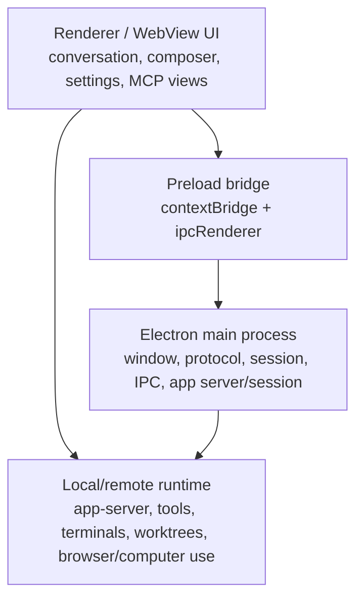
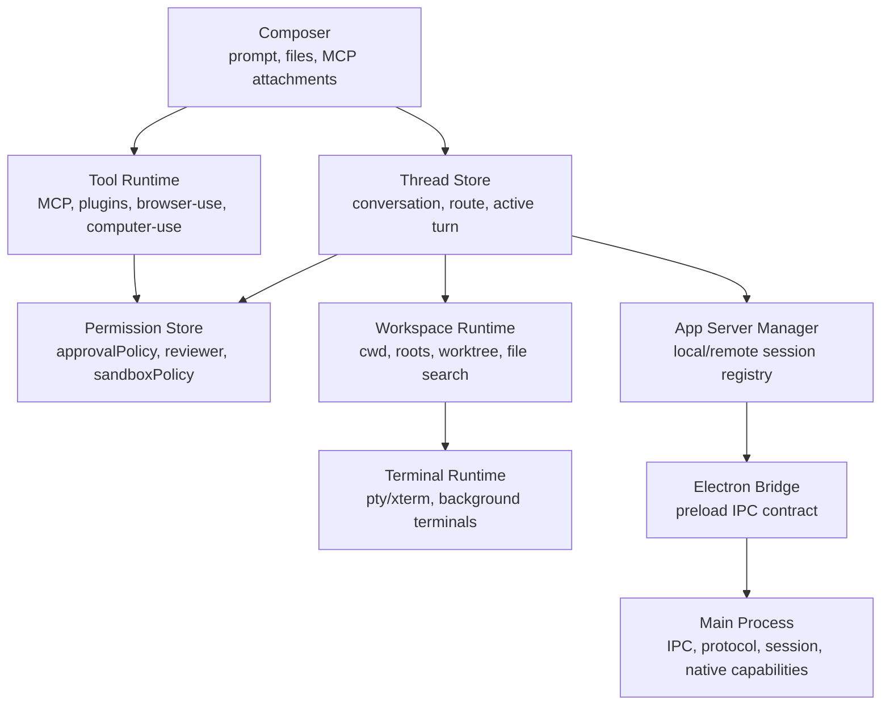

# Codex Electron Agent 客户端解包分析

> 基于 `reference-projects/codex-electron-26.527.31326-beautified` 与筛选后的分析目录整理。
> 目标是学习成熟 agent 桌面客户端的结构设计，而不是复刻或再分发打包产物。

## 0. 过程记录

`工具限制：本轮未拿到语义搜索 MCP / vscode_listCodeUsages 接口；以下内容只基于 reference-projects/docs 定向检索、code-review-graph 最小图谱、Repomix 压缩包与 rg 证据交叉整理，作为解包产物观察，不作为源码仓库级缺失断言。`

本轮产物：

| 产物 | 路径 | 用途 |
|---|---|---|
| 原始解包 | `reference-projects/codex-electron-26.527.31326` | 保留 asar 解包原貌 |
| 美化副本 | `reference-projects/codex-electron-26.527.31326-beautified` | Prettier 格式化后的可读版本 |
| 核心分析包 | `reference-projects/codex-electron-26.527.31326-beautified-analysis-core` | 保留较多 agent 相关 chunk，适合离线检索 |
| 最小图谱包 | `reference-projects/codex-electron-26.527.31326-beautified-analysis-min` | 去掉巨型 bundle 后的图谱/AI 分析入口 |
| AI 压缩上下文 | `reference-projects/codex-electron-26.527.31326-beautified-analysis-min/repomix-output-compressed.xml` | 约 3.27 万 token，适合直接喂给 AI |
| 完整核心上下文 | `reference-projects/codex-electron-26.527.31326-beautified-analysis-core/repomix-output.xml` | 约 502 万 token，只适合离线检索 |

`code-review-graph` 已对 `analysis-min` 建图：

| 指标 | 数值 |
|---|---:|
| 文件 | 85 |
| 节点 | 1845 |
| 边 | 13471 |
| 注册别名 | `codex-electron-min` |

## 1. 分析边界

本文只基于 Electron `app.asar` 的打包产物分析。它能反映客户端运行形态、模块边界、前端 chunk 命名、主进程/preload/renderer 的通信入口，但不能替代源码仓库级别的完整审计。

尤其要注意：

- 变量名和函数名大量来自 bundler 压缩/重命名。
- 模块边界来自 Vite/Rollup chunk，不一定等同原始源码目录。
- `.map` 路径在本轮检查中未取得可用输出，因此主要依赖格式化 bundle、文件名语义和定向搜索。
- 大型 bundle 如 `.vite/build/app-session-DjOuM2yJ.js`、`.vite/build/main-B260eRdI.js`、`webview/assets/local-conversation-thread-CtUuMnse.js` 更适合专题检索，不适合直接全文阅读。

## 2. 可观察的总体结构

解包后的入口显示这是一个 Electron Forge + Vite 风格客户端：

| 层 | 代表文件 | 观察重点 |
|---|---|---|
| Electron 启动/bootstrap | `.vite/build/bootstrap.js` | App 启动、窗口遍历、生命周期挂接 |
| 主进程能力 | `.vite/build/main-B260eRdI.js`、`.vite/build/app-session-DjOuM2yJ.js` | 窗口、session、协议、IPC、app server/session 相关逻辑 |
| Preload 桥 | `.vite/build/preload.js`、`.vite/build/sandbox-preload.js` | `ipcRenderer`、`contextBridge`、安全隔离桥 |
| Renderer/UI | `webview/index.html`、`webview/assets/*.js` | 线程、composer、MCP、权限、remote、browser-use、worktree 等 UI 模块 |
| 本地/远端 agent 会话 | `app-server-*`、`local-conversation-*`、`remote-*` | 会话状态、远程连接、本地环境切换 |
| 扩展/工具能力 | `mcp-*`、`plugin-*`、`skills-*` | MCP app capability、插件/skills、动态工具 |
| 运行控制面 | `permissions-*`、`browser-use-*`、`computer-use-*` | 权限、审批、浏览器/计算机使用风险提示 |
| 工作区能力 | `worktree-*`、`workspace-*`、`terminal-*`、`xterm-*` | workspace roots、worktree、终端展示与后台进程 |

学习 agent 客户端时，可以把它理解成四层：



## 3. Electron 边界：主进程、preload、renderer

### 3.1 Preload 是关键安全边界

`analysis-min` 中可见 `preload.js` 通过 `ipcRenderer` 同步/异步读取共享状态，并通过 `contextBridge.exposeInMainWorld` 暴露 renderer 可用能力。

证据入口：

- `.vite/build/preload.js`
- `.vite/build/sandbox-preload.js`

可观察点：

- `ipcRenderer.sendSync(...)` 用于启动时同步读取窗口类型、共享对象快照等状态。
- `ipcRenderer.invoke(...)` 用于菜单、共享对象更新、context menu、fast mode metrics 等异步能力。
- `contextBridge.exposeInMainWorld('electronBridge', ...)` 暴露了 renderer 侧调用入口。
- `sandbox-preload.js` 使用 `ipcRenderer.postMessage(...)`，说明部分 sandbox/webview 能力通过 message channel 传递。

对自研 agent 客户端的启发：

- 前端不要直接接触 Node/Electron 原生能力。
- preload 应该是唯一、窄口径、可审计的权限桥。
- 给 renderer 暴露的 API 要按“业务能力”命名，而不是直接暴露文件系统、shell、进程等底层 API。

### 3.2 主进程承担协议/session/IPC 接线

`workspace-root-drop-handler-8orvjKHg.js` 中可见 `protocol.handle('app', ...)`、`session.defaultSession.webRequest.onBeforeRequest(...)`、`ipcMain.handle(...)` 等主进程能力入口。

证据入口：

- `.vite/build/workspace-root-drop-handler-8orvjKHg.js`
- `.vite/build/bootstrap.js`

对自研 agent 客户端的启发：

- 自定义协议适合承载本地资源或内部路由。
- Electron session/webRequest 可作为统一网络/资源策略口。
- IPC handler 应集中注册，并与 preload 暴露 API 保持一一对应，避免 renderer 绕过权限层。

## 4. Agent 会话模型：app-server + conversation + thread

### 4.1 app-server 是 renderer 侧核心状态中心

多个模块直接依赖 `app-server-manager-signals-Bpaj8VHp.js` 和 `app-server-manager-hooks-DfDI-9lO.js`：

- `composer-view-state-CuoA48W8.js`
- `process-manager-target-0CUT6Ilg.js`
- `local-conversation-background-terminals-model-BTkMUdV8.js`
- `worktrees-settings-page-CMxJxVfF.js`
- `permissions-mode-helpers-pzg3XCVq.js`
- `use-workspace-file-search-BQOw_WDg.js`
- `use-codex-worktrees-XHL8EmmF.js`

可观察点：

- renderer 中存在面向 conversation/thread 的 app server manager。
- `app-server-manager-hooks` 有 recent conversations 刷新、conversationId 到 manager 的映射等逻辑。
- `app-server-dynamic-tools` 可发起 `start-conversation`、归档/取消归档 conversation，并读取 `host_config`。

对自研 agent 客户端的启发：

- UI 不应直接驱动 agent loop；更好的抽象是“app server/session manager”。
- conversation/thread 需要成为一等实体，关联 cwd、hostId、workspaceRoots、remote/local route。
- “start conversation” 应该是统一入口，而不是散落在多个 UI 组件中。

### 4.2 local / remote / worktree 是同一会话模型的不同执行环境

相关入口：

- `thread-context-CUiF4ehk.js`
- `remote-conversation-page-B90q2-DG.js`
- `local-remote-dropdown-DeyMvm23.js`
- `worktree-init-v2-page-B9jbmrK4.js`
- `worktrees-settings-page-CMxJxVfF.js`
- `mcp-capability-view-frame-CTGsi63X.js`

可观察点：

- `thread-context` 区分 `new-thread-panel`、`local-thread`、`remote-thread`。
- remote conversation 仍然带有 `approvalPolicy`、`sandboxPolicy` 等执行策略。
- worktree 初始化路径会构造 `launchMode: 'start-conversation'`。
- MCP follow-up 可以选择 current thread、新 thread、worktree 等目标。
- local/remote dropdown 中有 thread handoff 的状态 UI，包括 progress、warning、error、success。

对自研 agent 客户端的启发：

- local、remote、worktree 不应被设计成三套 UI/业务流。
- 更好的模型是统一的 `ThreadExecutionTarget`：
  - `local`
  - `remote`
  - `worktree`
  - `projectless`
- handoff 应该是显式状态机：准备、迁移中、风险提示、失败可重试、成功跳转。

## 5. 权限与安全控制面

### 5.1 permission mode 是用户可见的一等设置

相关入口：

- `use-permissions-mode-DHT7uJLN.js`
- `permissions-mode-defaults-D04JSGN-.js`
- `permissions-mode-helpers-pzg3XCVq.js`
- `permissions-mode-visibility-6n8bsFYA.js`
- `permission-request-model-5AfVo7IK.js`

可观察点：

- 权限模式围绕 `approvalPolicy`、`approvalsReviewer`、`sandboxPolicy` 组合。
- 代码中出现 `guardian_approval`，说明存在额外的审批/守护维度。
- permissions helper 与 app-server-manager 绑定，说明权限显示/计算依赖当前 thread/app server 状态。

对自研 agent 客户端的启发：

- 权限不是单个 boolean，而是策略三元组：
  - approval policy
  - reviewer / guardian
  - sandbox policy
- 权限 UI 要和当前 thread/environment 绑定，而不是全局静态显示。
- 权限默认值、可见性、helper 判断应拆成独立模块，方便审计。

### 5.2 Browser-use / computer-use 有独立风险提示

相关入口：

- `browser-use-settings-BofJu-_T.js`
- `browser-use-elevated-risk-learn-more-url-C-SjE192.js`
- `browser-use-origin-state-queries-CXm7tsis.js`
- `computer-use-settings-aHZZtKP_.js`
- `computer-use-app-approvals-query-Bsc2Hbhf.js`

可观察点：

- browser-use 设置中出现 `Elevated risk`、`approvalMode`、`alwaysAsk`、`neverAsk`。
- browser-use 对网站打开、浏览器历史、摄像头/麦克风等权限有设置入口。
- computer-use 有 app approvals query，说明 GUI automation/电脑控制与普通工具权限分开处理。

对自研 agent 客户端的启发：

- 浏览器控制和电脑控制应作为高风险能力单独分区。
- `never ask` 类选项必须带明确风险解释。
- 网站访问、历史读取、摄像头/麦克风、桌面 app 控制应拆分权限。

## 6. MCP / 插件 / Skills

### 6.1 MCP capability view 是独立沙箱模型

相关入口：

- `mcp-capability-view-frame-CTGsi63X.js`
- `mcp-capability-client-S28r7AvA.js`
- `mcp-capability-signals-DrIrJ7PH.js`
- `mcp-capability-file-viewer-frame-CTG0k-8V.js`
- `mcp-capability-thread-side-panel-tab-DrEeQ1_Y.js`
- `mcp-settings-DaavP1I8.js`
- `mcp-tool-item-content-utils-CWgc44LW.js`

可观察点：

- MCP app view 有 `sandboxId`、`sandboxOrigin`、`sandboxOriginScope`。
- 错误路径包含 `MCP sandbox host call failed`、`MCP sandbox RPC aborted`、`MCP sandbox RPC timed out`。
- MCP app sandbox 初始化失败会设置 `sandboxError`。
- 开发态存在打开 MCP app sandbox DevTools 的 UI 文案。
- MCP app follow-up 可以把 prompt 送到 current thread、新 thread、worktree。

对自研 agent 客户端的启发：

- MCP app 不只是“工具列表”，而是有 iframe/webview/sandbox 生命周期的插件应用。
- MCP sandbox RPC 应有超时、abort、host call failed 三类错误。
- MCP app 对主线程的 follow-up 应走统一 conversation 启动入口，不应绕开权限/环境选择。
- MCP view 与 thread side panel 可以解耦，让插件既能嵌入侧边栏，也能触发 agent follow-up。

### 6.2 Composer 支持 MCP/插件上下文附件

相关入口：

- `composer-view-state-CuoA48W8.js`
- `browser-sidebar-comment-light-dismiss-CEIAb7jh.js`
- `local-conversation-page-R_l0bLb_.js`

可观察点：

- composer state 中有 `mcpAppModelContextAttachments`。
- add context dropdown 中有 plugins/installed count 等 UI 文案。
- local conversation page 引入 `app-server-dynamic-tools`、`mcp-*`、`skills-*`、`plugin-*` 相关模块。

对自研 agent 客户端的启发：

- Composer 不只是文本输入框，而是“prompt + 上下文附件 + 工具/插件上下文”的组合器。
- MCP/插件上下文应有独立数据结构，支持增删改和提交时序列化。

## 7. 终端、后台进程与工作区

### 7.1 后台 terminal 与 thread 绑定

相关入口：

- `local-conversation-background-terminals-model-BTkMUdV8.js`
- `process-manager-target-0CUT6Ilg.js`
- `terminal-CHT13Kys.js`
- `xterm-display-helpers-BrRnk_cB.js`

可观察点：

- background terminal model 处理 `thread_switch_completed`。
- terminal/defaults 中带 `conversationId`。
- process manager target 使用 `conversationId`、`terminalId`，并有 `set-active-conversation`。
- stop action 中出现 `interrupt-conversation`。

对自研 agent 客户端的启发：

- 终端不是全局资源，而应绑定到 conversation/thread。
- 切线程时要处理后台 terminal 的归属和可见性。
- 中断 active turn 与终端进程管理要统一建模，避免 UI 按钮和实际进程状态脱节。

### 7.2 workspace / worktree 是长期会话能力

相关入口：

- `worktree-D_6WAQVb.js`
- `worktree-init-v2-page-B9jbmrK4.js`
- `worktrees-settings-page-CMxJxVfF.js`
- `worktree-query-keys-CtR3aBrr.js`
- `worktree-paths-qhwlCsbh.js`
- `use-workspace-file-search-BQOw_WDg.js`

可观察点：

- worktree settings 有 refresh、loading、error、empty、delete 等完整状态。
- 删除 worktree 会调用 `worktree-delete`，并与 archive conversation 关联。
- MCP follow-up 新建 thread 时可以选择 worktree 执行模式。
- start conversation 参数中出现 `workspaceRoots`、`workspaceKind`。

对自研 agent 客户端的启发：

- worktree 应作为 agent 客户端的长期环境对象，而不是临时 shell trick。
- worktree 生命周期应和 conversation 生命周期有明确关系。
- 文件搜索、上下文引用、cwd、workspaceRoots 应统一从 workspace model 读取。

## 8. Browser sidebar / remote / handoff

相关入口：

- `browser-sidebar-manager-BLXOqzh1.js`
- `browser-sidebar-state-BicXIuDK.js`
- `browser-sidebar-availability-6AqzkABm.js`
- `local-remote-dropdown-DeyMvm23.js`
- `remote-connections-settings-CzY38D3g.js`
- `remote-conversation-page-B90q2-DG.js`

可观察点：

- Browser sidebar 有独立 manager/state/availability。
- local remote dropdown 包含 thread handoff 的 progress/warning/error/success 文案。
- remote connections settings 是独立设置页。
- remote conversation 仍然复用 conversation/thread/permission 等概念。

对自研 agent 客户端的启发：

- 浏览器侧栏可以作为 agent 的“任务视窗”，但应有独立状态管理。
- remote handoff 应该是产品级流程，不只是后端切 host。
- remote/local/worktree 的差异最好被执行目标抽象吸收，UI 只显示必要差异。

## 9. 推荐的自研 agent 客户端参考架构

基于当前解包产物，建议我们自己的 agent 客户端可以按以下模块拆：



建议的核心接口：

```ts
type ExecutionTarget =
  | { kind: "local"; workspaceRoots: string[]; cwd: string }
  | { kind: "remote"; hostId: string; projectRoot?: string }
  | { kind: "worktree"; baseProjectRoot: string; worktreePath: string }
  | { kind: "projectless"; outputDirectory: string };

type PermissionProfile = {
  approvalPolicy: "auto" | "alwaysAsk" | "neverAsk" | string;
  approvalsReviewer?: "user" | "guardian" | string;
  sandboxPolicy?: "readOnly" | "workspaceWrite" | "dangerFullAccess" | string;
};

type StartConversationRequest = {
  prompt: string;
  target: ExecutionTarget;
  permissions: PermissionProfile;
  modelContextAttachments: Array<unknown>;
  launchMode: "start-conversation" | "follow-up";
};
```

## 10. 后续深挖路线

建议按以下顺序继续，而不是直接读完整大 bundle：

1. **IPC 合同**：从 `.vite/build/preload.js`、`.vite/build/workspace-root-drop-handler-8orvjKHg.js` 查 `electronBridge` 暴露 API 和 `ipcMain.handle` 对应关系。
2. **会话启动**：从 `app-server-dynamic-tools-ChwcT_7g.js`、`use-start-new-conversation-C5LOG7ib.js`、`worktree-init-v2-page-B9jbmrK4.js` 查 `start-conversation` 参数。
3. **权限模型**：从 `use-permissions-mode-DHT7uJLN.js`、`permissions-mode-helpers-pzg3XCVq.js`、`browser-use-settings-BofJu-_T.js` 查 approval/sandbox 组合。
4. **MCP sandbox**：从 `mcp-capability-view-frame-CTGsi63X.js` 查 sandbox lifecycle、RPC、follow-up thread。
5. **终端/进程**：从 `local-conversation-background-terminals-model-BTkMUdV8.js`、`process-manager-target-0CUT6Ilg.js`、`xterm-display-helpers-BrRnk_cB.js` 查 terminal 与 conversation 绑定。
6. **remote/worktree handoff**：从 `local-remote-dropdown-DeyMvm23.js`、`remote-conversation-page-B90q2-DG.js`、`worktrees-settings-page-CMxJxVfF.js` 查环境切换状态机。

推荐查询命令：

```bash
/Users/nallylin/.local/bin/code-review-graph repos

rg -n "start-conversation|approvalPolicy|sandboxPolicy|electronBridge|MCP sandbox" \
  reference-projects/codex-electron-26.527.31326-beautified-analysis-min

rg -n "ipcMain.handle|contextBridge|ipcRenderer.invoke|protocol.handle" \
  reference-projects/codex-electron-26.527.31326-beautified-analysis-min/.vite/build
```

## 11. 一句话结论

从当前解包产物看，成熟 agent 客户端的关键不在“聊天 UI”，而在一组可组合的运行时控制面：Electron preload 安全桥、app server/session manager、thread/conversation 状态、权限策略、MCP sandbox、local/remote/worktree 执行目标、终端/进程生命周期，以及 browser/computer-use 的高风险能力分区。
