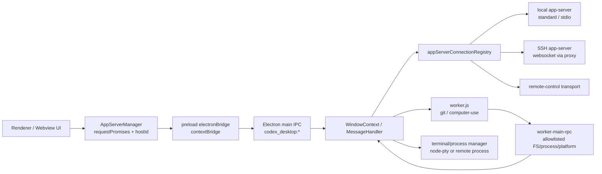

# Codex Electron 客户端与 app-server 通信架构分析

## 范围

本文分析 `reference-projects/codex-electron-26.527.31326-beautified` 中 Electron 客户端如何与 app-server 通信。该 reference 项目是打包/beautified 后的产物，不包含原始 TypeScript 源码；结论主要基于 `.vite/build/*.js` 与 `webview/assets/*.js` 的静态证据。

核验记录：

- 4 问结论：新增文档=是；会涉及通信边界总结=是；不是 codex/claw/ironclaw 跨项目对账；属于架构总结文档=是。
- Level 1：已用 code-review-graph 做两次语义搜索，未命中本仓已有等价文档或等价总结。
- Level 2：当前会话未暴露可调用的 LSP/`execute_lsp` 工具；且目标是打包 JS 产物，符号名已压缩，LSP 价值有限。
- Level 3：使用 `rg` 与行号片段核验 IPC channel、request lifecycle、connection registry、transport、worker RPC、terminal/process 链路。

## 总体结论

Codex Electron 的客户端到 app-server 不是“renderer 直接连本地进程”的结构，而是分成五层：

1. Renderer/UI 层维护业务态与 request promise map。
2. Preload 层暴露最小 `electronBridge`，把 renderer 消息送进 Electron IPC。
3. Main/WindowContext 层做可信事件校验、窗口上下文路由、hostId 路由和 app-server bridge。
4. AppServerConnection 层统一封装 local、SSH remote、remote-control 等 transport。
5. Worker/main RPC 层承接 Git、Computer Use、文件系统、进程、终端等高权限能力，使用 allowlist 方法集。

架构上最重要的设计是：UI 只发领域消息和 request，不直接 spawn app-server、不直接持有 Node 能力；main 进程集中管理 host connection、transport 选择、进程/文件系统权限和跨窗口广播。

## Renderer 到 main 的桥

Preload 定义了固定 IPC channel：

- `codex_desktop:message-from-view`
- `codex_desktop:message-for-view`
- `codex_desktop:worker:${id}:from-view`
- `codex_desktop:worker:${id}:for-view`
- `codex_desktop:connect-app-host`

`preload.js` 通过 `contextBridge.exposeInMainWorld("electronBridge", D)` 暴露 API。renderer 调用 `sendMessageFromView()` 时，preload 使用 `ipcRenderer.invoke("codex_desktop:message-from-view", message)` 进入 main；main 返回给 view 的消息则由 preload 监听 `codex_desktop:message-for-view`，再转成 `window.dispatchEvent(new MessageEvent("message", { data }))`。

还有一条 MessagePort 路径：renderer 向 window postMessage `{ type: "connect-app-host", port }` 后，preload 用 `ipcRenderer.postMessage("codex_desktop:connect-app-host", undefined, [port])` 把 port 交给 main。main 侧通过 `createAppHost()` 创建 host RPC surface，并把 port 和 host 绑定。

证据：

- `reference-projects/codex-electron-26.527.31326-beautified/.vite/build/preload.js:20`
- `reference-projects/codex-electron-26.527.31326-beautified/.vite/build/preload.js:44`
- `reference-projects/codex-electron-26.527.31326-beautified/.vite/build/preload.js:102`
- `reference-projects/codex-electron-26.527.31326-beautified/.vite/build/preload.js:111`
- `reference-projects/codex-electron-26.527.31326-beautified/.vite/build/preload.js:114`
- `reference-projects/codex-electron-26.527.31326-beautified/.vite/build/main-B260eRdI.js:6244`
- `reference-projects/codex-electron-26.527.31326-beautified/.vite/build/main-B260eRdI.js:54861`
- `reference-projects/codex-electron-26.527.31326-beautified/.vite/build/main-B260eRdI.js:54974`

## AppServerManager 的 request lifecycle

renderer 侧的 app-server manager 维护一个全局 request message handler。业务代码通过 `sendRequest(method, params, options)` 创建 request，生成 UUID，把 resolver/rejecter 存进 `requestPromises`，然后 dispatch：

- 普通 app-server request：`dispatchMessage("mcp-request", { request, hostId })`
- 预热线程启动：`dispatchMessage("thread-prewarm-start", { request, hostId })`

main 侧收到 `mcp-request` 后调用 `getAppServerConnection(hostId).handleClientRequest(new IpcClient(webContents), request)`。如果发生异常，main 会构造 `mcp-response` 错误消息回 view。renderer 收到响应后按 request id 调 `onResult()` 或 `onError()`，从 pending map 中 resolve/reject 并删除。

这个结构带来几个效果：

- UI 业务层只感知 `thread/start`、`turn/start`、`plugin/list`、`mcpServer/tool/call`、`model/list` 等方法名。
- 通道层只感知统一的 `mcp-request` / `mcp-response` / notification envelope。
- request id、timeout、conversationId、hostId 都在 renderer manager 层统一记录，便于日志和超时治理。

证据：

- `reference-projects/codex-electron-26.527.31326-beautified/webview/assets/app-server-manager-signals-Bpaj8VHp.js:281`
- `reference-projects/codex-electron-26.527.31326-beautified/webview/assets/app-server-manager-signals-Bpaj8VHp.js:1403`
- `reference-projects/codex-electron-26.527.31326-beautified/webview/assets/app-server-manager-signals-Bpaj8VHp.js:4251`
- `reference-projects/codex-electron-26.527.31326-beautified/webview/assets/app-server-manager-signals-Bpaj8VHp.js:4306`
- `reference-projects/codex-electron-26.527.31326-beautified/webview/assets/app-server-manager-signals-Bpaj8VHp.js:4351`
- `reference-projects/codex-electron-26.527.31326-beautified/webview/assets/app-server-manager-signals-Bpaj8VHp.js:11268`
- `reference-projects/codex-electron-26.527.31326-beautified/webview/assets/app-server-manager-signals-Bpaj8VHp.js:15174`
- `reference-projects/codex-electron-26.527.31326-beautified/.vite/build/main-B260eRdI.js:48183`
- `reference-projects/codex-electron-26.527.31326-beautified/.vite/build/main-B260eRdI.js:48216`

## hostId 与连接注册表

main 进程中的 `WindowContext` 构造时创建 local app-server connection，并放入：

- `appServerClients`
- `appServerConnectionRegistry`

每个 window 注册时，main 会遍历所有 host connection 并调用 `registerWebviewWindow()`。这说明 app-server connection 不只是一个请求客户端，也负责把 server 侧广播/notification 扇出到 webview window。

renderer 侧也有对应的 registry：`addManager()` 按 hostId 注册 manager，查询入口包括 `getDefault()`、`getForConversationId()`、`getForHostId()`、`getForHostIdOrThrow()`。因此 UI 可以按 conversation 或 host 找到对应 app-server manager。

证据：

- `reference-projects/codex-electron-26.527.31326-beautified/.vite/build/main-B260eRdI.js:53361`
- `reference-projects/codex-electron-26.527.31326-beautified/.vite/build/main-B260eRdI.js:53405`
- `reference-projects/codex-electron-26.527.31326-beautified/.vite/build/main-B260eRdI.js:53412`
- `reference-projects/codex-electron-26.527.31326-beautified/.vite/build/main-B260eRdI.js:53745`
- `reference-projects/codex-electron-26.527.31326-beautified/.vite/build/main-B260eRdI.js:53911`
- `reference-projects/codex-electron-26.527.31326-beautified/webview/assets/app-server-manager-hooks-DfDI-9lO.js:32`
- `reference-projects/codex-electron-26.527.31326-beautified/webview/assets/app-server-manager-hooks-DfDI-9lO.js:64`
- `reference-projects/codex-electron-26.527.31326-beautified/webview/assets/app-server-manager-hooks-DfDI-9lO.js:72`

## transport 选择

`createAppServerConnection(hostId, hostConfig, ...)` 先构造 transport，再创建 app-server connection。transport 分三类：

1. SSH websocket：如果 host config 能选出 SSH websocket 配置，使用 `AppServerTransportSshWebsocket`。
2. remote-control：使用 remote-control transport，并依赖 local desktop app-server client 做认证。
3. standard：否则使用 standard transport。local host 会落到这里。

local 启动阶段会取 `appServerConnectionRegistry.getConnection("local")` 并调用 `connect()`；随后 settings store 直接用同一个 connection 读写 config。main 还会在 local transport kind 为 `stdio` 时为 webContents 注册 IPC client，并在 app state snapshot 中采集 app-server stdio IO stats。

SSH remote 的路径更明确：它会在远端检查 `codex`，启动 `codex app-server --listen unix://`，然后通过 `codex app-server proxy` 建立 SSH stdio 流，并把这个流作为 websocket client 的 connection。

证据：

- `reference-projects/codex-electron-26.527.31326-beautified/.vite/build/main-B260eRdI.js:53799`
- `reference-projects/codex-electron-26.527.31326-beautified/.vite/build/main-B260eRdI.js:53816`
- `reference-projects/codex-electron-26.527.31326-beautified/.vite/build/main-B260eRdI.js:53827`
- `reference-projects/codex-electron-26.527.31326-beautified/.vite/build/main-B260eRdI.js:53919`
- `reference-projects/codex-electron-26.527.31326-beautified/.vite/build/main-B260eRdI.js:54079`
- `reference-projects/codex-electron-26.527.31326-beautified/.vite/build/main-B260eRdI.js:54088`
- `reference-projects/codex-electron-26.527.31326-beautified/.vite/build/main-B260eRdI.js:54096`
- `reference-projects/codex-electron-26.527.31326-beautified/.vite/build/main-B260eRdI.js:68932`
- `reference-projects/codex-electron-26.527.31326-beautified/.vite/build/main-B260eRdI.js:68945`
- `reference-projects/codex-electron-26.527.31326-beautified/.vite/build/main-B260eRdI.js:16267`
- `reference-projects/codex-electron-26.527.31326-beautified/.vite/build/main-B260eRdI.js:16330`
- `reference-projects/codex-electron-26.527.31326-beautified/.vite/build/main-B260eRdI.js:16419`
- `reference-projects/codex-electron-26.527.31326-beautified/.vite/build/main-B260eRdI.js:16462`
- `reference-projects/codex-electron-26.527.31326-beautified/.vite/build/main-B260eRdI.js:16765`

## worker 与高权限能力

reference 项目把 Git、Computer Use 等工作放到 worker 中。main 侧有 worker manager/bus，按 workerId 创建 `worker.js`，再把 view 的 worker message 转发给 worker。worker 要访问文件系统、进程、平台信息时，不直接随意调用 main，而是走 `worker-main-rpc-request`。

worker-main RPC 有显式 allowlist，包括：

- `codex-home`
- `platform-family`
- `platform-os`
- `process-start`
- `process-write`
- `process-resize`
- `process-terminate`
- `fs-read-file`
- `fs-write-file`
- `fs-watch`
- `worker-exit`

worker 侧也用 request id + pending map 管理 RPC 响应；main 侧收到 worker request 后调用对应 handler，再回发 `worker-main-rpc-response` 或 `worker-main-rpc-event`。

证据：

- `reference-projects/codex-electron-26.527.31326-beautified/.vite/build/main-B260eRdI.js:67447`
- `reference-projects/codex-electron-26.527.31326-beautified/.vite/build/main-B260eRdI.js:67512`
- `reference-projects/codex-electron-26.527.31326-beautified/.vite/build/main-B260eRdI.js:67559`
- `reference-projects/codex-electron-26.527.31326-beautified/.vite/build/main-B260eRdI.js:67656`
- `reference-projects/codex-electron-26.527.31326-beautified/.vite/build/worker.js:76944`
- `reference-projects/codex-electron-26.527.31326-beautified/.vite/build/worker.js:77060`
- `reference-projects/codex-electron-26.527.31326-beautified/.vite/build/worker.js:77163`
- `reference-projects/codex-electron-26.527.31326-beautified/.vite/build/worker.js:77214`

## terminal/process 链路

terminal 是另一条事件化链路。renderer terminal manager 订阅：

- `terminal-data`
- `terminal-exit`
- `terminal-error`
- `terminal-init-log`
- `terminal-attached`

创建、写入、resize、close 分别 dispatch `terminal-create`、`terminal-write`、`terminal-resize`、`terminal-close`。main 的 message handler 收到后交给 `terminalManager`。本地 backend 使用 `node-pty.spawn()` 创建 PTY；远程或 worker process 则可通过 app-server/worker-main RPC 的 `process-start` 等方法抽象。

证据：

- `reference-projects/codex-electron-26.527.31326-beautified/webview/assets/app-server-manager-signals-Bpaj8VHp.js:5417`
- `reference-projects/codex-electron-26.527.31326-beautified/webview/assets/app-server-manager-signals-Bpaj8VHp.js:5460`
- `reference-projects/codex-electron-26.527.31326-beautified/webview/assets/app-server-manager-signals-Bpaj8VHp.js:5475`
- `reference-projects/codex-electron-26.527.31326-beautified/webview/assets/app-server-manager-signals-Bpaj8VHp.js:5508`
- `reference-projects/codex-electron-26.527.31326-beautified/.vite/build/main-B260eRdI.js:48522`
- `reference-projects/codex-electron-26.527.31326-beautified/.vite/build/main-B260eRdI.js:52533`
- `reference-projects/codex-electron-26.527.31326-beautified/.vite/build/main-B260eRdI.js:52831`
- `reference-projects/codex-electron-26.527.31326-beautified/.vite/build/worker.js:77060`

## 方法总结

可复用的方法论如下：

1. Renderer 不直接接触 Node/app-server 进程。只暴露一个稳定 preload bridge。
2. 所有 app-server 交互都统一成 `{ id, method, params }` request envelope，再用 hostId 选择连接。
3. request promise map 放在 UI manager 层，超时、日志、conversationId、pending count 都集中治理。
4. main 进程是唯一的可信路由层，负责校验 IPC event、查 window context、转发到 app-server connection。
5. app-server connection registry 把 local、remote、remote-control 统一成同一套 client 接口。
6. transport 细节内聚在 connection 创建阶段：local standard/stdio、SSH websocket、remote-control 不泄漏到 UI。
7. server 到 UI 的广播通过 `registerWebviewWindow()` 和 `message-for-view` 扇出，而不是让 renderer 自己订阅底层 socket。
8. 高权限能力走 worker-main RPC allowlist，避免 worker 任意调用 main 能力。
9. terminal/process 使用事件流和 sessionId 管理，数据流、生命周期、用户动作分离。
10. restart、connection state、remote reconnect 等运维能力也以消息/connection 方法表达，便于 UI 展示状态但不拥有实现细节。

## 对本仓 desktop-app 的启发

如果要解决 `spawn dasclaw-app-server ENOENT` 这类问题，reference 的做法提示了几个方向：

- 启动路径不应散落在 renderer 或 UI action 中；应收敛到 main/app-server manager 的 transport 工厂。
- bridge 层只传领域请求，不直接暴露可执行文件名。
- app-server 可执行文件解析、环境变量、packaged/dev 差异、stdio/websocket 选择应该集中在一个 connection/transport object。
- 需要对启动失败产出结构化状态，而不只是把 `spawn ENOENT` 透传到用户消息提示。
- 如果支持 remote/local 多 host，应优先引入 hostId registry，避免后续把 local 逻辑写死。

## 限制

- 该 reference 目录没有可用 source map 文件，只有 `//# sourceMappingURL=...` 注释；原始模块名和类型签名不可完全恢复。
- `app-server-types`、`protocol` 等 workspace 包在 reference 中以打包依赖形式出现，部分类名被压缩为 `t.xn`、`t.Cn`、`t.cn`，本文只按调用点和行为归纳。
- 本文没有运行 reference app，也没有连接真实 app-server；结论是静态架构分析。
