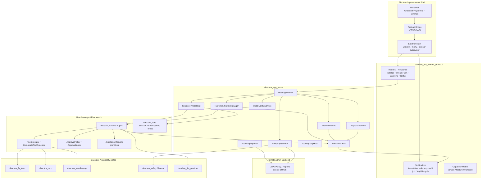

# Dasclaw App Server 架构与实施计划

> 状态：草案  
> 日期：2026-06-06  
> 目标：在迁移 Electron / open-cowork 客户端壳之前，先把当前 `desktop-client` 后端能力、无头 agent framework、未来 `dasclaw_app_server` 的边界理清楚，避免把 Tauri 时代的脏边界复制到新客户端。

## 0. 过程透明记录

本文件属于新增架构计划文档，按仓库规则应先完成三层核验：

| 启动问题 | 结论 | 处理 |
|---|---|---|
| 是否新增模块 / crate / 文件？ | 是，新增 app-server 架构文档 | 先查已有等价文档，再新增专项文档 |
| 是否包含“X 没有 Y / X 缺 Y / 独家”等否定判断？ | 是，涉及当前客户端和 runtime 能力边界 | 用现有文档、图谱状态、字面检索交叉核验 |
| 是否跨项目 / 跨层对账？ | 是，涉及 `desktop-client`、`crates/dasclaw_runtime`、Electron 壳、Codex app-server 参考 | 按边界矩阵写结论 |
| 是否写架构对账类文档？ | 是 | 保留证据说明，避免主观表格 |

当前会话未暴露 `semantic_search` / `vscode_listCodeUsages` 直接工具，因此本轮采用可用替代路径：

| 层级 | 本轮可用替代 | 结果 |
|---|---|---|
| 语义层 | 查阅既有架构文档与前序 code-review-graph 分析结论 | 已发现 `31-target-architecture.md`、`41-desktop-host-runtime-boundary.md`、`open-cowork-dasclaw-gui-poc-plan.md`，但没有独立 app-server 专项计划 |
| 图谱层 | `code-review-graph status --repo .` | 当前仓库图谱可用：27,576 nodes / 245,722 edges / 1,555 files |
| 字面量层 | `rg` 检索 `app-server`、`AppState`、`EngineState`、`VercelUIStream`、`Agent`、`ToolExecutor`、`DLP`、`policy_sync` 等 | 证实 runtime 核心类型在 `crates/dasclaw_runtime`，当前客户端沉积了 host/bootstrap/protocol/adapter 职责 |

已检查 `dasclaw app-server 架构计划` 是否已有，结论：已有目标架构和 desktop/runtime 边界文档，但没有专门面向 Electron 壳接入的 app-server 架构与实施计划；本文件用于补齐该决策与拆解。

## 1. 一句话结论

`dasclaw_app_server` 应定位为 **本地 agent service host / GUI control plane**，不是新的 agent loop，也不是 admin-backend。

最终边界应是：

```text
Electron / open-cowork shell
  -> dasclaw_app_server_protocol
  -> dasclaw_app_server
  -> dasclaw_runtime + dasclaw_* capability crates
```

当前 `desktop-client` 里的 Rust 后端能力不应该丢弃，但需要拆成三类：

| 类别 | 去向 |
|---|---|
| reusable agent framework | 下沉或保留在 `dasclaw_runtime` / `dasclaw_core` / capability crates |
| local service host / business integration | 上移到 `dasclaw_app_server` |
| Tauri-specific GUI adapter | 留在 `desktop-client` legacy adapter，Electron 成熟后逐步删除 |

## 2. 背景与问题

当前客户端的主要问题不是“重复实现了一套 agent loop”，而是 `desktop-client` 同时承担了太多职责：

| 当前职责 | 当前状态 | 问题 |
|---|---|---|
| GUI IPC | Tauri command + event | 合理，但和后端状态耦合过深 |
| runtime bootstrap | `engine.rs` 初始化 IronClaw / channel / safety / policy / jobs | 更像 app-server bootstrap |
| host state | `AppState` / `EngineState` 持有 engine、safety、DLP、model、logs、jobs 等 | 更像 app-server state |
| stream protocol | `TauriChannel` + `VercelUIStream` | UI 协议和 Tauri transport 混在一起 |
| DLP / admin sync / policy sync | 在 desktop-client 内初始化和同步 | 应属于 local app-server service，admin-backend 仍是 source of truth |
| jobs / routines / skills / memory | 部分留在 desktop host | 需要明确哪些是 runtime primitive，哪些是 app-server orchestration |

如果直接开写 app-server，而不先拆边界，风险是：

| 风险 | 后果 |
|---|---|
| 复制 `AppState` 到新 crate | app-server 继承 Tauri-shaped God object |
| 复制 `TauriChannel` 事件格式 | Electron 被迫兼容 Tauri event 细节 |
| 把 DLP / policy 全塞 runtime | runtime 变成产品后端，失去无头复用性 |
| 把 lifecycle 留在 Electron | runtime 崩溃、重启、版本不兼容、审批等待变成 UI 私有状态，容易出错 |

## 3. 核心概念

### 3.1 Headless agent framework

`Headless agent framework` 指可以在没有 GUI、没有 Tauri、没有 HTTP server 的情况下运行 agent turn 的核心库组合。

它应包含：

| 能力 | 推荐归属 |
|---|---|
| Agent loop | `dasclaw_runtime` |
| responder 调用 | `dasclaw_runtime` |
| tool dispatch iteration | `dasclaw_runtime` |
| `Tool` / `ToolExecutor` trait | `dasclaw_runtime` |
| approval primitive / approval event | `dasclaw_runtime` |
| `JobState` 等基础状态词汇 | `dasclaw_runtime` / `dasclaw_core` |
| cancellation primitive | `dasclaw_runtime` |
| tool lifecycle event | `dasclaw_runtime` |
| reusable session / submission vocabulary | `dasclaw_core` |

它不应包含：

| 不应包含 | 原因 |
|---|---|
| Electron / Tauri IPC | UI transport，不是 agent core |
| admin-backend HTTP client | 产品集成，不是 agent core |
| DLP config 拉取 | 本地服务职责，不是 agent loop 职责 |
| GUI approval 弹窗 | UI 表现层职责 |
| app lifecycle / process lifecycle | host 职责 |
| settings page / menu / window | shell 职责 |

### 3.2 App server

`dasclaw_app_server` 是本地长期运行或随 GUI 启动的 Rust service host。它的职责是把 headless runtime 托管成 GUI 可消费的产品服务。

它应包含：

| 能力 | 说明 |
|---|---|
| runtime lifecycle | spawn、initialize、ready、health、restart、shutdown、version compatibility |
| session/thread host | 管理 thread、turn、event log、订阅关系 |
| protocol routing | JSON-RPC / stdio / socket / WebSocket 等 transport 入口 |
| notification bus | 将 runtime event 变成稳定 app-server event |
| approval orchestration | 接收 runtime approval request，等待 GUI response，fail-safe 处理 |
| policy/DLP local service | 从 admin-backend 同步配置，本地缓存，执行 fail-safe gate |
| model/provider config service | 管理模型选择、provider health、默认模型、override |
| tool registry composition | 组合 builtin tools、MCP tools、WASM tools、sub-agent tools |
| jobs/routines host | 调度和暴露任务状态，底层状态词汇复用 runtime/core |
| sandbox status adapter | 暴露本地 sandbox 能力状态；未来可接 VM backend |
| logs/audit/reporting | 本地事件、审计、DLP 命中、运行指标上报 |

它不应包含：

| 不应包含 | 原因 |
|---|---|
| React UI | 表现层 |
| Electron menu/window/tray | shell 层 |
| admin policy authoring | admin-backend source of truth |
| tenant/user 管理 | admin-backend source of truth |
| 重新实现 agent loop | runtime 已经拥有 |
| 重新定义 ToolExecutor contract | runtime 已经拥有 |

### 3.3 Electron shell

Electron / open-cowork shell 的职责是产品壳和用户交互：

| 能力 | 说明 |
|---|---|
| window/menu/tray | 桌面体验 |
| renderer UI | chat、diff、approval、settings、tools UI |
| preload bridge | 最小受控 API surface |
| app-server process supervision | 启动 sidecar、连接、展示状态 |
| local plugin UI | 利用 Node/npm 生态做壳层配置和 UI |
| GUI automation UI | 可选能力，不能绕过 app-server 权限 |

Electron shell 不直接持有 agent loop，不直接调用 LLM，不直接绕过 DLP / approval / sandbox。

### 3.4 Admin backend

admin-backend 是远端管理与 source of truth：

| 能力 | 归属 |
|---|---|
| DLP 策略配置源 | admin-backend |
| enterprise policy authoring | admin-backend |
| tenant/user 管理 | admin-backend |
| report 聚合 | admin-backend |
| local enforcement | app-server |
| local cache / fail-safe | app-server |

## 4. 目标架构



## 5. 分层职责矩阵

| 层 | owns | does not own |
|---|---|---|
| Electron shell | UI、window、menu、renderer state、preload API、sidecar supervisor | agent loop、tool execution、DLP enforcement、policy source of truth |
| app-server protocol | 稳定 request/response/event schema、capability matrix、error code、version negotiation | 业务实现、UI 组件、runtime 内部类型 |
| app-server | local service lifecycle、session host、approval orchestration、policy/DLP sync、model config、job/routine host、notification bus | React UI、Tauri command、admin policy authoring、agent loop internals |
| runtime | agent turn orchestration、tool dispatch、approval primitive、cancellation、tool lifecycle、runtime event | GUI transport、admin HTTP、Electron/Tauri |
| capability crates | fs/mcp/sandbox/safety/provider 等单一能力 | app state、GUI lifecycle、session UI |
| admin-backend | enterprise source of truth、tenant/user/policy/report 聚合 | 本地 agent loop、本地工具执行 |
| legacy desktop-client | 过渡期 Tauri adapter、兼容旧 UI | 新架构 source of truth |

## 6. 当前 `desktop-client` 清理方向

### 6.1 应抽到 app-server 的部分

| 当前位置 | 当前职责 | 迁移方向 |
|---|---|---|
| `desktop-client/src/state.rs` | `AppState` / `EngineState` 持有 engine、safety、DLP、logs、model、jobs 等 | 拆成 `dasclaw_app_server::AppServerState` + `desktop-client::LegacyTauriState` |
| `desktop-client/src/engine.rs` | 初始化 IronClaw、TauriChannel、admin sync、policy、DLP、routine、job sink | 拆成 `dasclaw_app_server::bootstrap` / `services` |
| `desktop-client/src/tauri_channel.rs` | IronClaw channel 到 Tauri event 的桥 | 拆成 `NotificationBus` + `TauriNotificationAdapter` |
| `desktop-client/src/vercel_ui_protocol.rs` | AI SDK / assistant-ui stream frame | 纳入 `dasclaw_app_server_protocol` 或保留为兼容 adapter |
| `admin_sync.rs` / `policy_sync.rs` / `enterprise_policy_sync.rs` | admin config / policy 同步 | `dasclaw_app_server::policy` |
| DLP/safety bridge wiring | 本地 DLP 扫描、脱敏、上报 | `dasclaw_app_server::dlp`，底层规则可继续共享 |
| model switching | 默认模型、override、provider probe | `dasclaw_app_server::models` |
| conversation tracker / data reporter | 对话审计、DLP 标记、指标上报 | `dasclaw_app_server::audit` |
| jobs/routines orchestration | 后台任务、routine slot、job event sink | `dasclaw_app_server::jobs` |
| skills/extensions/memory host wiring | 产品能力宿主 | `dasclaw_app_server::services` |

### 6.2 应保留在 runtime / crates 的部分

| 能力 | 归属 |
|---|---|
| `Agent` / `AgentBuilder` / `AgentEvent` | `dasclaw_runtime` |
| `ToolExecutor` / `CompositeToolExecutor` | `dasclaw_runtime` |
| `Tool` trait | `dasclaw_runtime` |
| approval primitive / policy / inbox | `dasclaw_runtime` |
| `JobState` | `dasclaw_runtime` |
| tool lifecycle observer | `dasclaw_runtime` |
| MCP executor bridge | `dasclaw_mcp` |
| builtin fs/misc/sub-agent tools | respective `dasclaw_*_tools` crates |
| reusable session/submission vocabulary | `dasclaw_core` |

### 6.3 应留在 legacy Tauri adapter 的部分

| 能力 | 处理 |
|---|---|
| Tauri command registration | 过渡期保留，最终 Electron 替代 |
| `State<'_, EngineState>` 取状态 | 过渡期 adapter，不能进入 protocol |
| Tauri event emit/listen | 变成 `TauriNotificationAdapter` |
| Tauri dialog/window/fs API | 留 legacy shell |
| 前端 `invokeTauri` wrapper | 过渡期保留 |

## 7. Protocol 设计草案

### 7.1 Transport 选择

第一版推荐：

| transport | 推荐级别 | 理由 |
|---|---|---|
| stdio JSONL / JSON-RPC | 第一版首选 | Electron main 启动 sidecar 简单；无端口暴露；适合本地 app |
| Unix socket / named pipe | 第二阶段 | 更适合长期 daemon，多客户端连接能力更好 |
| local WebSocket | 可选 | renderer debug 友好，但需要更强本地安全边界 |
| local HTTP | 仅 dev/debug 或明确加鉴权 | 端口暴露风险更高，不建议第一版默认为产品 transport |

建议第一版 contract 不绑定 transport。协议层只定义 message shape，transport 可以逐步替换。

### 7.2 Initialize handshake

```json
{
  "id": "1",
  "method": "initialize",
  "params": {
    "client": {
      "name": "dasclaw-electron",
      "version": "0.1.0"
    },
    "protocolVersion": "2026-06-06",
    "workspace": {
      "root": "/path/to/workspace"
    },
    "capabilities": {
      "streaming": true,
      "approvalUi": true,
      "diffUi": true,
      "jobUi": true
    }
  }
}
```

返回：

```json
{
  "id": "1",
  "result": {
    "server": {
      "name": "dasclaw-app-server",
      "version": "0.1.0"
    },
    "protocolVersion": "2026-06-06",
    "capabilities": {
      "thread": true,
      "turn": true,
      "streaming": true,
      "approval": true,
      "dlp": true,
      "policy": true,
      "jobs": true,
      "sandboxStatus": true
    }
  }
}
```

### 7.3 Lifecycle states

| state | 含义 | UI 行为 |
|---|---|---|
| `starting` | sidecar 已启动但未 ready | 显示启动中，禁用提交 |
| `initializing` | protocol handshake 中 | 显示初始化 |
| `ready` | 可以接收请求 | 允许用户输入 |
| `running` | 有 turn 正在执行 | 显示 stop/cancel |
| `awaiting_approval` | runtime 正等待审批 | 显示审批 UI，agent loop 暂停 |
| `restarting` | app-server 正在重启 | 暂停输入，展示恢复中 |
| `degraded` | 部分能力不可用 | 显示 capability warning |
| `failed` | app-server 不可用 | 显示错误和重启入口 |
| `stopped` | 用户或 app 关闭 | 清理 UI |

没有 lifecycle manager 的风险：

| 场景 | 可能 bug |
|---|---|
| app-server 崩溃但 UI 仍以为 running | 用户提交丢失或卡死 |
| approval 请求发出后连接断开 | agent loop 永久等待或误放行 |
| DLP/policy 未同步但 UI 允许发送 | fail-open 安全漏洞 |
| protocol version 不兼容 | UI 误解析 event，出现隐性数据损坏 |
| 重启后旧 thread subscription 未恢复 | 消息流丢失 |

结论：如果采用 app-server，runtime lifecycle 必须是显式一等概念。

### 7.4 Request methods MVP

| method | 说明 | MVP |
|---|---|---|
| `initialize` | protocol handshake | 必须 |
| `shutdown` | 优雅关闭 | 必须 |
| `health/check` | 健康检查 | 必须 |
| `capabilities/get` | 获取能力矩阵 | 必须 |
| `thread/create` | 创建 thread | 必须 |
| `thread/list` | 列出 thread | 建议 |
| `thread/read` | 读取历史 | 建议 |
| `turn/start` | 开始一轮 agent turn | 必须 |
| `turn/cancel` | 取消当前 turn | 必须 |
| `approval/respond` | 用户响应审批 | 必须 |
| `model/list` | 获取可用模型 | 建议 |
| `model/setDefault` | 设置默认模型 | 建议 |
| `policy/status` | 获取 policy/DLP 状态 | 必须 |
| `sandbox/status` | 获取 sandbox 能力 | 建议 |
| `logs/subscribe` | 日志订阅 | 建议 |
| `job/list` | 任务列表 | 后续 |
| `job/cancel` | 任务取消 | 后续 |

### 7.5 Notifications MVP

| notification | 说明 | MVP |
|---|---|---|
| `lifecycle/changed` | app-server lifecycle 变化 | 必须 |
| `thread/created` | thread 创建 | 必须 |
| `turn/started` | turn 开始 | 必须 |
| `item/delta` | assistant text/reasoning delta | 必须 |
| `item/completed` | message/tool/reasoning item 完成 | 必须 |
| `tool/callStarted` | 工具调用开始 | 必须 |
| `tool/callCompleted` | 工具调用完成 | 必须 |
| `approval/requested` | 请求审批 | 必须 |
| `approval/resolved` | 审批结果 | 必须 |
| `turn/completed` | turn 完成 | 必须 |
| `turn/failed` | turn 失败 | 必须 |
| `policy/changed` | policy/DLP 状态变化 | 建议 |
| `job/event` | job event | 后续 |
| `log/event` | runtime/app-server log | 建议 |

## 8. Capability matrix

第一版 app-server 需要显式声明能力，而不是让 UI 猜。

| capability | 含义 | 第一版 |
|---|---|---|
| `thread` | thread create/list/read | 必须 |
| `turn` | start/cancel/retry | 必须 |
| `streaming` | token/item delta | 必须 |
| `approval` | approval request/respond | 必须 |
| `dlp` | 本地 DLP gate/status | 必须 |
| `policy` | enterprise/local policy status | 必须 |
| `models` | model list/default/probe | 建议 |
| `toolRegistry` | tool list/status | 建议 |
| `mcp` | MCP servers/tools | 后续 |
| `jobs` | jobs/routines | 后续 |
| `sandboxStatus` | sandbox health/smoke | 建议 |
| `vmSandbox` | VM backend | 后续优化项 |
| `logs` | logs subscribe/export | 建议 |
| `audit` | local audit/reporting | 建议 |

## 9. 实施计划

### Phase 0：边界冻结与文档化

目标：先防止脏边界继续扩散。

交付物：

| 编号 | 交付物 |
|---|---|
| P0-1 | 完成当前 `desktop-client` 后端能力 ownership matrix |
| P0-2 | 明确哪些能力归 runtime，哪些归 app-server，哪些留 legacy Tauri |
| P0-3 | 冻结第一版 app-server protocol 草案 |
| P0-4 | 明确 Electron shell 只通过 protocol 接入，不 import Rust 内部状态 |
| P0-5 | 建立 migration checklist，避免新功能继续写进 `desktop-client/src/engine.rs` God object |

验收标准：

| 标准 | 要求 |
|---|---|
| 无歧义 | 每个当前客户端后端模块都有归属 |
| 可执行 | app-server 第一版 method/event 清单明确 |
| 可迁移 | Tauri legacy adapter 的保留范围明确 |

### Phase 1：协议 crate 与 app-server skeleton

目标：先建立稳定 contract，不急着搬所有能力。

建议新增：

| 完成 | crate | 职责 |
|---|---|---|
| [x] | `crates/dasclaw_app_server_protocol` | request/response/event/capability/error schema |
| [x] | `crates/dasclaw_app_server` | local service host、router、lifecycle、runtime bridge |
| [x] | `crates/dasclaw_app_server_client` | Rust in-process / stdio client，供测试或 legacy adapter 使用 |

第一阶段只做：

| 完成 | 编号 | 交付物 |
|---|---|---|
| [x] | P1-1 | `initialize` / `shutdown` / `health/check` |
| [x] | P1-2 | lifecycle manager |
| [x] | P1-3 | thread create + turn start/cancel 的接口骨架 |
| [x] | P1-4 | notification bus 抽象 |
| [x] | P1-5 | protocol version / capability matrix |

非目标：

| 非目标 | 原因 |
|---|---|
| 不一次性迁移所有 Tauri command | 防止范围爆炸 |
| 不直接复制 Codex `CodexMessageProcessor` | 产品业务强耦合，不适合 wholesale port |
| 不把 admin-backend 逻辑搬进 app-server | app-server 只是本地服务，不是 source of truth |

### Phase 2：抽离 current desktop host state

目标：把 `AppState` / `EngineState` 中非 Tauri 的部分抽成 app-server state。

交付物：

| 编号 | 交付物 |
|---|---|
| P2-1 | `AppServerState` 定义 |
| P2-2 | `RuntimeLifecycleManager` 接管 engine ready/failed/restart |
| P2-3 | `NotificationBus` 接管 stream/log/job/lifecycle event |
| P2-4 | `TauriNotificationAdapter` 兼容旧前端 |
| P2-5 | `TauriState` 缩小为 legacy handle |

验收标准：

| 标准 | 要求 |
|---|---|
| app-server state 不依赖 Tauri | 不能 import `tauri::State` / `AppHandle` 作为核心状态 |
| legacy UI 不破 | Tauri adapter 继续可以转发旧事件 |
| lifecycle 明确 | engine 未就绪、DLP 未就绪、policy degraded 都有状态 |

### Phase 3：Electron / open-cowork shell 接入 PoC

目标：证明 Electron shell 可以作为新客户端壳消费 app-server。

交付物：

| 编号 | 交付物 |
|---|---|
| P3-1 | Electron main 启动 app-server sidecar |
| P3-2 | preload 暴露最小 `dasclaw` API |
| P3-3 | renderer 完成 chat turn |
| P3-4 | renderer 展示 lifecycle 状态 |
| P3-5 | renderer 展示 approval request 并回传 response |
| P3-6 | renderer 展示 tool call / tool result / error |

验收标准：

| 标准 | 要求 |
|---|---|
| 端到端可跑 | Electron UI 能完成一轮 app-server backed agent turn |
| 审批 fail-safe | approval UI 关闭、超时、连接断开默认拒绝或取消 |
| 生命周期可恢复 | app-server 崩溃后 UI 进入 failed 并可重启 |

### Phase 4：迁移 policy / DLP / model / jobs 等服务

目标：把当前客户端真正有价值的后端能力迁到 app-server。

顺序建议：

| 顺序 | 能力 | 理由 |
|---|---|---|
| 1 | policy/DLP status + sync | 安全边界，必须先稳 |
| 2 | model config/probe/switch | chat 可用性依赖 |
| 3 | approval polling / approval result | 高风险操作闭环 |
| 4 | logs/audit/reporting | 可观测性和审计 |
| 5 | jobs/routines | 范围较大，后置 |
| 6 | skills/extensions/memory | 产品体验增强，后置 |
| 7 | sandbox status / VM backend | 可作为未来优化项 |

### Phase 5：legacy desktop-client 变薄

目标：保留当前客户端可用，同时让它也走 app-server contract。

交付物：

| 编号 | 交付物 |
|---|---|
| P5-1 | Tauri command 从直接访问 `AppState` 改为调用 app-server client |
| P5-2 | Tauri event 从直接 emit runtime event 改为订阅 notification bus |
| P5-3 | 删除或隔离 legacy-only response DTO |
| P5-4 | Electron 达到替换门槛后，决定 Tauri 客户端退役策略 |

## 10. 清理优先级

建议先清理“边界污染”，不先追求代码漂亮。

| 优先级 | 清理项 | 原因 |
|---|---|---|
| P0 | 给每个 `desktop-client/src` 后端模块标注目标归属 | 没归属就会继续乱长 |
| P0 | 禁止新业务继续写进 `engine.rs` | 它已经是 app-server bootstrap 雏形 |
| P0 | 将 `VercelUIStream` 语义从 Tauri transport 中拆出来 | Electron 也要消费 stream，但不能绑定 Tauri |
| P1 | 抽 `NotificationBus` | 统一 Tauri/Electron/app-server event |
| P1 | 抽 `RuntimeLifecycleManager` | 避免 UI 私有 lifecycle |
| P1 | 抽 `PolicyDlpService` | DLP/policy 是安全边界 |
| P2 | 抽 `ModelConfigService` | 模型配置是多客户端共享能力 |
| P2 | 抽 `AuditLogReporter` | 审计与 DLP 命中需要统一 |
| P3 | jobs/routines/skills/memory 服务化 | 范围大，等主链路稳定 |

## 11. 关键设计原则

| 原则 | 说明 |
|---|---|
| runtime 不知道 GUI | `dasclaw_runtime` 不 import Electron/Tauri/admin backend |
| app-server 不重写 runtime | agent loop、tool dispatch、approval primitive 继续复用 runtime |
| protocol 不泄露内部 | 不把 `AppState` / `EngineState` / Tauri DTO 直接暴露给 Electron |
| approval fail-safe | UI 断开、超时、状态不一致时默认拒绝或取消 |
| DLP/policy fail-safe | 未同步、验签失败、缓存损坏时不能默认放行 |
| lifecycle 一等公民 | ready/running/awaiting_approval/failed/restarting 必须显式建模 |
| Electron 只是壳 | 利用 JS 生态，但不绕过 Rust 安全核心 |
| Tauri 作为 legacy adapter | 迁移期保留，不再作为新架构中心 |

## 12. 能力完整性与生效保障

app-server 完成后，不能只用“能聊天”作为验收标准。必须把“能力完整”和“能力真的生效”变成可测试、可阻断合并、可运行时观测的工程契约。

推荐闭环：

```text
能力台账
  -> protocol contract
  -> handler 注册契约测试
  -> 行为 / 失败路径测试
  -> legacy 对照回放
  -> CI 门禁
  -> 运行时 capability matrix + telemetry
```

### 12.1 定义完整与生效

| 目标 | 判断标准 |
|---|---|
| 能力完整 | 当前客户端已有能力，在 app-server 中有明确 owner、method/event、handler、测试、UI 映射 |
| 能力生效 | 不只是 schema 存在，而是调用能进入真实实现，并产生可观察结果或 fail-safe 错误 |

以 approval 为例：

| 层 | 必须存在 |
|---|---|
| protocol | `approval/requested`、`approval/respond`、`approval/resolved` |
| app-server | `ApprovalService` handler |
| runtime | approval primitive / inbox / policy |
| UI | 审批弹窗和响应入口 |
| tests | allow / deny / timeout / disconnect |
| telemetry | approval requested / resolved / cancelled event |

### 12.2 Capability manifest

每个迁移能力都应该进入机器可读 manifest，避免靠人工记忆追踪迁移进度。

示例：

```yaml
id: approval.tool_execution
source:
  legacy_entry: desktop-client approval flow
owner: app-server
runtime_dependency: dasclaw_runtime approval primitive
protocol:
  request: approval/respond
  notifications:
    - approval/requested
    - approval/resolved
ui:
  electron_component: ApprovalDialog
tests:
  positive:
    - approval_allow_runs_tool
  negative:
    - approval_deny_blocks_tool
    - approval_disconnect_fail_safe
required: true
release_gate: blocking
```

manifest 至少应覆盖：

| 字段 | 用途 |
|---|---|
| `id` | 稳定能力 ID |
| `source.legacy_entry` | 当前客户端来源 |
| `owner` | `runtime` / `app-server` / `electron-shell` / `legacy-adapter` |
| `runtime_dependency` | 依赖的 runtime/core/capability crate |
| `protocol` | method / notification / error code |
| `ui` | Electron 或 legacy UI 映射 |
| `tests` | 正常路径和失败路径 |
| `required` | 是否阻断发布 |
| `release_gate` | blocking / warning / optional |

### 12.3 Capability matrix

`initialize` 后 app-server 必须返回 capability matrix。客户端不能猜测后端支持什么。

示例：

```json
{
  "capabilities": {
    "thread": true,
    "turn": true,
    "streaming": true,
    "approval": true,
    "dlp": true,
    "policy": true,
    "models": true,
    "jobs": false,
    "sandboxStatus": true,
    "vmSandbox": false
  }
}
```

客户端处理规则：

| 情况 | 处理 |
|---|---|
| required capability 缺失 | UI 启动失败或进入 degraded，不允许静默运行 |
| optional capability 缺失 | 隐藏对应 UI，并显示能力不可用 |
| protocol version 不兼容 | 阻断连接 |
| DLP/policy 未 ready | fail-safe，不允许敏感路径直接放行 |

### 12.4 Contract tests

app-server 需要和当前 Tauri command contract 类似的门禁，防止“协议写了但没接线”。

| 测试 | 防止的问题 |
|---|---|
| manifest 中 required method 都已注册 handler | method 写了但没挂路由 |
| advertised capability 都有 handler | capability matrix 虚报 |
| handler 至少有一个行为测试 | handler 空实现 |
| notification 可序列化 / 反序列化 | UI 收不到事件 |
| error code snapshot 稳定 | UI 无法稳定处理失败 |
| protocol version negotiation | 新旧客户端误连 |

### 12.5 Golden trace replay

为了防止“实现存在但事件语义缺失”，应引入 golden trace replay：

1. 用当前 `desktop-client` 捕获典型场景事件流。
2. 归一化成 transport-independent trace。
3. app-server 用 fake responder / scripted tool executor 重放同样场景。
4. 对比 normalized timeline。

第一批 trace 应覆盖：

| 场景 | 必须覆盖 |
|---|---|
| 普通 chat | text delta、done |
| reasoning | reasoning delta、reasoning done |
| tool call | tool start、args、result、error |
| approval | requested、allow、deny、timeout |
| DLP block | input blocked、outbound blocked、redaction |
| policy degraded | policy unavailable、fail-safe |
| cancel | turn cancelled、tool cancellation |
| app-server restart | lifecycle failed/restarting/ready |
| model switch | model changed、provider probe |
| job event | job queued/running/completed/failed |

真实 LLM 输出不可稳定对比，trace replay 应使用 scripted responder，而不是直接比较真实模型文本。

### 12.6 安全 fail-safe 门禁

DLP / policy / approval / sandbox 必须单独验证失败路径，不能只测 happy path。

| 能力 | 必测失败路径 |
|---|---|
| DLP | config 拉取失败、缓存损坏、验签失败、扫描器未 ready |
| policy | policy 缺失、版本不兼容、远端不可达 |
| approval | UI 断开、超时、重复响应、未知 request id |
| sandbox | sandbox 不可用、权限降级、路径逃逸 |
| tool execution | approval 未完成时工具不得执行 |
| logs/audit | 错误信息不得泄露原始敏感数据 |

安全规则：

> 不确定就拒绝；不确定不能放行。

### 12.7 迁移期 shadow mode

Tauri legacy 退役前，建议保留对照能力：

| 模式 | 作用 |
|---|---|
| legacy path | 当前客户端继续可用 |
| app-server path | 新路径开发 |
| scripted dual-run | 同一 fake LLM / fake tool 输入下，对比事件和状态 |
| canary flag | 小范围启用 app-server |
| fallback flag | app-server 不稳定时回 legacy |

dual-run 只用于 deterministic 场景。真实 LLM 输出不作为强一致对比对象。

### 12.8 CI gate

第一版 CI 至少需要这些 gate：

| Gate | 目的 |
|---|---|
| capability manifest coverage | 防能力漏迁 |
| protocol schema snapshot | 防协议无意破坏 |
| handler registration contract | 防 method 没挂上 |
| notification serialization test | 防 UI event 断裂 |
| lifecycle integration test | 防 ready/running/failed 状态错乱 |
| approval E2E | 防高危操作绕过审批 |
| DLP/policy fail-safe test | 防安全能力失效 |
| golden trace replay | 防事件语义缺失 |
| Electron smoke | 防壳子连不上 sidecar |

### 12.9 运行时 telemetry

发布后也要能发现“能力存在但没生效”。

| 信号 | 用途 |
|---|---|
| `capability_invoked` | 能力被调用 |
| `capability_effective` | 能力真实执行 |
| `capability_failed` | 能力失败 |
| `approval_requested` / `approval_resolved` | 审批闭环 |
| `dlp_checked` / `dlp_blocked` / `dlp_redacted` | DLP 是否真的经过 |
| `policy_loaded` / `policy_degraded` | policy 是否生效 |
| `tool_started` / `tool_completed` | tool executor 是否接线 |
| `lifecycle_changed` | app-server 状态变化 |

### 12.10 完成标准

app-server 完成时至少满足：

| 验收项 | 标准 |
|---|---|
| 能力台账 | 当前客户端后端能力 100% 标注归属 |
| required capabilities | 100% 有 protocol + handler + test |
| stream parity | golden trace 关键事件一致 |
| approval | allow / deny / timeout / disconnect 全覆盖 |
| DLP/policy | fail-safe 失败路径覆盖 |
| lifecycle | crash/restart/version mismatch 可恢复 |
| Electron | 完成一轮 chat + tool + approval |
| legacy | Tauri adapter 过渡期不破坏 |
| telemetry | 能看到能力调用和生效状态 |

## 13. 需要避免的错误路径

| 错误路径 | 为什么危险 |
|---|---|
| 直接把 `desktop-client/src/engine.rs` 搬进 app-server | 会把 Tauri channel、legacy state、admin sync、runtime bootstrap 全混进去 |
| 把 app-server 做成薄 HTTP proxy | 无法处理 lifecycle、subscription、approval pause/resume、capability matrix |
| Electron 直接 spawn `dasclaw_cli` 并解析 stdout | 短期快，长期无法承载审批、DLP、jobs、恢复、版本协商 |
| 把 DLP/policy 放进 renderer | 安全边界错误，容易被绕过 |
| app-server 直接承担 admin-backend 职责 | source of truth 混乱，企业策略不可控 |
| 为了复用 Codex app-server wholesale port | Codex processor 产品耦合重，应借鉴 protocol/lifecycle 结构，不整搬 |

## 14. 决策门

进入下一阶段前，需要回答：

| 决策 | 通过标准 |
|---|---|
| 是否新增 `dasclaw_app_server_protocol` crate | protocol schema 需要被 Electron、Tauri legacy、测试共同引用 |
| 第一版 transport 选什么 | 推荐 stdio JSONL；若选 socket/HTTP，必须说明本地安全边界 |
| `VercelUIStream` 是保留还是替换 | 如果 assistant-ui 仍依赖，可作为 compat event；核心 protocol 不应只等于 Vercel frame |
| DLP/policy 服务先迁还是后迁 | 建议先迁 status/sync/gate，保证安全闭环 |
| Tauri legacy 是否也走 app-server | 建议走，这样 Electron/Tauri 共用后端 contract，减少双实现 |

## 15. 最小可交付切片

推荐第一批 PR 不追求完整客户端，只交付可验证的骨架：

| PR | 目标 |
|---|---|
| PR-1 | 新增 app-server ownership matrix 文档和 protocol 草案 |
| PR-2 | 新增 `dasclaw_app_server_protocol`，只含 type/schema，无 runtime |
| PR-3 | 新增 `dasclaw_app_server` skeleton：initialize/health/lifecycle/capabilities |
| PR-4 | 接入 `dasclaw_runtime::Agent` 的最小 turn/start + item delta notification |
| PR-5 | approval request/respond 端到端 |
| PR-6 | Electron shell PoC 启动 sidecar 并完成一轮 chat |
| PR-7 | DLP/policy status 服务化 |

## 16. 当前结论

在 app-server 前需要清理架构，但不需要等所有历史脏代码都清完。

正确顺序是：

```text
边界文档
  -> protocol schema
  -> app-server skeleton
  -> current desktop host state extraction
  -> Electron shell PoC
  -> policy/DLP/model/jobs 服务迁移
  -> Tauri legacy 变薄
```

最重要的第一原则是：

> `dasclaw_runtime` 是无头 agent framework；`dasclaw_app_server` 是本地服务宿主；Electron/open-cowork 是 GUI 壳。三者边界必须先固定，再开始迁移。

## 21. Phase 0 artifacts（2026-06-07）

本轮先完成 app-server 文档切片，不新增 Rust crate，不迁移 DLP/jobs/skills 全量能力：

| Artifact | 作用 |
|---|---|
| `docs/plans/dasclaw-app-server-ownership-matrix.md` | 明确 `desktop-client -> dasclaw_app_server -> dasclaw_runtime` ownership 边界，记录目标 worktree code-review-graph 接入与三层核验证据 |
| `docs/plans/dasclaw-app-server-protocol-v0.md` | 定义第一版 method/event/capability schema，先覆盖 `initialize`、`health/check`、`shutdown`、`capabilities/list`、`lifecycle/status` |

后续新增 `dasclaw_app_server_protocol` / `dasclaw_app_server` crate 前，必须基于目标 worktree 图谱再次核验等价实现，并在 commit message 写入：

```text
已检查 dasclaw_app_server_protocol / dasclaw_app_server 是否已有，结论：目标 worktree 中已有 dasclaw_protocol/runtime/core 可复用组件，但没有专用 GUI control-plane app-server crate；本 PR 新增最小 protocol/lifecycle skeleton。
```

## 22. Phase 1 status sync（2026-06-07）

本节同步当前实现状态，避免计划文档落后于代码切片。

| Plan item | 当前状态 | 落点 |
|---|---|---|
| P0-1 ownership matrix | 已完成初版 | `docs/plans/dasclaw-app-server-ownership-matrix.md` |
| P0-2 protocol v0 草案 | 已完成初版 | `docs/plans/dasclaw-app-server-protocol-v0.md` |
| P1-1 `initialize` / `shutdown` / `health/check` | 已完成 skeleton | `crates/dasclaw_app_server` |
| P1-2 lifecycle manager | 已完成最小内存态 skeleton | `AppServer` lifecycle snapshot |
| P1-5 protocol version / capability matrix | 已完成 skeleton | `dasclaw_app_server_protocol::CapabilityMatrix::phase_one()` |
| JSON-RPC router | 已完成 in-process line payload router | `AppServer::handle_json_rpc` |
| stdio sidecar loop | 已完成 line-delimited skeleton | `dasclaw_app_server` binary |
| lifecycle/capability notifications | 已完成 response 后逐行输出 skeleton | `ServerNotification` + `AppServer::drain_json_rpc_notifications` |
| notification bus | 已完成最小内存队列 skeleton | `NotificationBus` |
| capability handler consistency | 已补测试防止 implemented method 虚报 | `implemented_capability_methods_are_routable` |
| method/event string constants | 已完成协议常量收敛，降低 GUI/router/capability matrix 漂移 | `dasclaw_app_server_protocol::{method,event}` |
| stdio transcript state retention | 已补测试确认同一 sidecar 进程多行请求共享 lifecycle 状态 | `stdio_loop_keeps_server_state_across_lines` |
| shutdown sidecar exit | 已补 `shutdown` 后 stdio loop 退出，避免 supervisor 看到 accepted 但进程仍活着 | `stdio_loop_exits_after_shutdown` |
| JSON-RPC client notification semantics | 已补无 `id` 请求不返回 response | `json_rpc_notification_without_id_does_not_return_response` |
| logs capability status | 已降为 declared/disabled，避免没有真实 log source 时虚报 | `CapabilityMatrix::phase_one()` + health `Logs` |
| JSON-RPC envelope protocol types | 已新增共享 request/response/error shape，app-server router 已切换为复用该类型 | `JsonRpcRequest` / `JsonRpcResponse` / `JsonRpcError` |
| one-shot health probe | 已新增 `--health-once`，便于 Electron supervisor / 人工调试做进程级探活 | `dasclaw-app-server --health-once` |
| one-shot version probe | 已新增 `--version-json`，便于 Electron supervisor 启动前做 protocol/version compatibility check | `dasclaw-app-server --version-json` |
| one-shot capability probe | 已新增 `--capabilities-once`，便于 Electron supervisor 在不建立 stdio 会话时读取 capability matrix | `dasclaw-app-server --capabilities-once` |
| CLI mode guard | 已新增 `--help` 和未知参数 fail-fast，避免 supervisor typo 静默进入 stdio loop | `parse_run_mode` |

仍未完成、不得误认为已实现：

| Area | 状态 |
|---|---|
| runtime `Agent` bridge | 未做 |
| session/thread host | 未做 |
| approval orchestration | 未做 |
| DLP/policy local service | 未做 |
| jobs/routines/skills/MCP/sandbox 接入 | 未做 |
| Electron sidecar supervisor | 未做 |

当前实现仍遵守 Phase 0/1 约束：app-server 是 local service host / GUI control plane，不重新实现 `AgenticLoop` / `ToolExecutor`，也不复制 Tauri-specific state。

### Phase 1 status sync: protocol schema discovery (2026-06-07)

Completed in the Phase 1 skeleton slice:

| Area | Status | Notes |
|---|---|---|
| JSON-RPC schema discovery | implemented | Added `protocol/schema` as a read-only method returning current protocol version, routable methods, events, and capability matrix. |
| CLI schema probe | implemented | Added `--schema-once` for Electron/open-cowork bootstrap probing without starting a long-lived stdio session. |
| Capability matrix alignment | implemented | `protocol` now advertises `initialize` and `protocol/schema`; `logs` remains declared until a real log source is wired. |

Still out of scope for this slice: runtime Agent bridge, ToolExecutor, session/thread host, approval orchestration, DLP/policy migration, jobs, skills, MCP, sandbox, and Electron sidecar supervision.

### Phase 1 status sync: explicit initialize lifecycle (2026-06-07)

Completed in the Phase 1 skeleton slice:

| Area | Status | Notes |
|---|---|---|
| Initialize lifecycle sequence | implemented | `initialize` now emits `starting -> initializing -> ready` lifecycle notifications before capability refresh. |
| Stdio notification ordering | implemented | The stdio sidecar loop preserves response-first output, followed by lifecycle notifications and `capabilities/changed`. |

Still out of scope for this slice: runtime Agent bridge, ToolExecutor, session/thread host, approval orchestration, DLP/policy migration, jobs, skills, MCP, sandbox, and Electron sidecar supervision.

### Phase 1 status sync: initialize idempotency and stopped guard (2026-06-07)

Completed in the Phase 1 skeleton slice:

| Area | Status | Notes |
|---|---|---|
| Initialize idempotency | implemented | Repeated `initialize` while ready/running/degraded returns the current server snapshot and does not re-emit lifecycle/capability notifications. |
| Stopped lifecycle guard | implemented | `initialize` after `shutdown` is rejected with a structured lifecycle error; the process must be restarted instead of reanimated in-place. |

Still out of scope for this slice: runtime Agent bridge, ToolExecutor, session/thread host, approval orchestration, DLP/policy migration, jobs, skills, MCP, sandbox, and Electron sidecar supervision.

### Phase 1 status sync: lightweight health probes (2026-06-07)

Completed in the Phase 1 skeleton slice:

| Area | Status | Notes |
|---|---|---|
| Health detail flag | implemented | `health/check.includeDetails=false` now returns a lightweight lifecycle probe with an empty `services` list; `true` returns the service matrix. |

Still out of scope for this slice: runtime Agent bridge, ToolExecutor, session/thread host, approval orchestration, DLP/policy migration, jobs, skills, MCP, sandbox, and Electron sidecar supervision.

### Phase 1 status sync: initialize capability negotiation (2026-06-07)

Completed in the Phase 1 skeleton slice:

| Area | Status | Notes |
|---|---|---|
| Requested capability negotiation | implemented | `initialize` tolerates future/declared/unknown requested capability ids and returns them in `unavailableRequestedCapabilities` without failing startup. |
| GUI downgrade signal | implemented | Electron/open-cowork can use the field to disable unavailable UI affordances instead of guessing from hard-coded capability assumptions. |

Still out of scope for this slice: runtime Agent bridge, ToolExecutor, session/thread host, approval orchestration, DLP/policy migration, jobs, skills, MCP, sandbox, and Electron sidecar supervision.

### Phase 1 status sync: shutdown idempotency (2026-06-07)

Completed in the Phase 1 skeleton slice:

| Area | Status | Notes |
|---|---|---|
| Shutdown idempotency | implemented | Repeated `shutdown` after `stopped` returns the current stopped lifecycle and does not re-emit lifecycle notifications. |
| Supervisor safety | implemented | Duplicate stop requests from a GUI sidecar supervisor remain harmless and observable without creating extra lifecycle noise. |

Still out of scope for this slice: runtime Agent bridge, ToolExecutor, session/thread host, approval orchestration, DLP/policy migration, jobs, skills, MCP, sandbox, and Electron sidecar supervision.

### Phase 1 status sync: binary self-check probe (2026-06-07)

Completed in the Phase 1 skeleton slice:

| Area | Status | Notes |
|---|---|---|
| Binary self-check | implemented | Added `--self-check` to run an in-process initialize smoke probe and emit lifecycle, health, capability, and protocol schema JSON. |
| GUI bootstrap probes | implemented | Documented `--version-json`, `--health-once`, `--capabilities-once`, `--schema-once`, and `--self-check` as distinct startup/supervision probes. |

Still out of scope for this slice: runtime Agent bridge, ToolExecutor, session/thread host, approval orchestration, DLP/policy migration, jobs, skills, MCP, sandbox, and Electron sidecar supervision.

### Phase 1 status sync: JSON-RPC error contract coverage (2026-06-07)

Completed in the Phase 1 skeleton slice:

| Area | Status | Notes |
|---|---|---|
| JSON-RPC error contract tests | implemented | Added focused assertions for parse errors, invalid JSON-RPC version, non-empty params on no-param methods, and notification no-response behavior. |
| Protocol error behavior docs | implemented | Documented request vs notification response behavior for malformed envelopes and unknown methods. |

Still out of scope for this slice: runtime Agent bridge, ToolExecutor, session/thread host, approval orchestration, DLP/policy migration, jobs, skills, MCP, sandbox, and Electron sidecar supervision.

### Phase 1 status sync: JSON-RPC envelope boundary (2026-06-07)

Completed in the Phase 1 skeleton slice:

| Area | Status | Notes |
|---|---|---|
| Invalid request shape handling | implemented | Valid JSON that cannot deserialize into a JSON-RPC request now returns `-32600` invalid request instead of parse error, preserving `id` when present. |
| Batch request boundary | implemented | JSON-RPC batch arrays are explicitly rejected because Phase 1 stdio uses one request or notification per line. |

Still out of scope for this slice: runtime Agent bridge, ToolExecutor, session/thread host, approval orchestration, DLP/policy migration, jobs, skills, MCP, sandbox, and Electron sidecar supervision.

### Phase 1 status sync: invalid notification shape handling (2026-06-07)

Completed in the Phase 1 skeleton slice:

| Area | Status | Notes |
|---|---|---|
| Invalid request shape with id | implemented | Valid JSON objects that cannot deserialize into a JSON-RPC request return `-32600` while preserving `id`. |
| Invalid notification shape without id | implemented | Valid JSON objects without `id` that cannot deserialize into a JSON-RPC request return no response, matching notification fire-and-forget semantics. |

Still out of scope for this slice: runtime Agent bridge, ToolExecutor, session/thread host, approval orchestration, DLP/policy migration, jobs, skills, MCP, sandbox, and Electron sidecar supervision.

### Phase 1 status sync: protocol schema consistency guards (2026-06-07)

Completed in the Phase 1 skeleton slice:

| Area | Status | Notes |
|---|---|---|
| Protocol schema consistency tests | implemented | Added guards that every method advertised by an implemented capability appears in `protocol/schema.methods`. |
| Schema uniqueness guards | implemented | Added tests ensuring method and event names exposed by `protocol/schema` remain unique. |
| Protocol maintenance rule | documented | Documented schema consistency requirements so GUI bootstrap can treat `protocol/schema` as the Phase 1 discovery source. |

Still out of scope for this slice: runtime Agent bridge, ToolExecutor, session/thread host, approval orchestration, DLP/policy migration, jobs, skills, MCP, sandbox, and Electron sidecar supervision.

### Phase 1 status sync: thread and turn interface skeletons (2026-06-07)

Completed in the Phase 1 skeleton slice:

| Area | Status | Notes |
|---|---|---|
| Thread create skeleton | implemented | Added `thread/create` params/response schema and app-server route returning structured `CAPABILITY_UNAVAILABLE`. Superseded in Phase 1.5 by in-memory thread creation. |
| Turn start skeleton | implemented | Added `turn/start` params/response schema and app-server route returning structured `CAPABILITY_UNAVAILABLE`; no runtime Agent bridge is wired. |
| Turn cancel skeleton | implemented | Added `turn/cancel` params/response schema and app-server route returning structured `CAPABILITY_UNAVAILABLE`; no turn cancellation host is wired. |
| Session capability contract | implemented | `session` remains `declared`, with thread/turn methods and events visible for protocol review without claiming runtime support. |

Still out of scope for this slice: runtime Agent bridge, ToolExecutor, real session/thread host, approval orchestration, DLP/policy migration, jobs, skills, MCP, sandbox, and Electron sidecar supervision.

### Phase 1.5 status sync: minimal app-server client crate (2026-06-07)

Completed in the Phase 1.5 follow-up slice:

| Area | Status | Notes |
|---|---|---|
| Client crate | implemented | Added `crates/dasclaw_app_server_client` as a minimal JSON-RPC client helper crate. |
| In-process transport | implemented | Added closure-backed in-process transport for legacy adapter/tests without spawning a sidecar process. |
| Line-delimited stdio transport | implemented | Added stdio JSONL transport that writes one request per line and skips notifications until the matching response id. |
| Typed client helpers | implemented | Added typed helpers for initialize, health, capabilities, lifecycle, schema, shutdown, and thread/turn skeleton methods. |

Still out of scope for this slice: Electron process supervision, async background reader, reconnect logic, runtime Agent bridge, ToolExecutor, real session/thread host, approval orchestration, DLP/policy migration, jobs, skills, MCP, and sandbox.

### Phase 1.5 status sync: in-memory thread creation (2026-06-07)

Completed in the Phase 1.5 follow-up slice:

| Area | Status | Notes |
|---|---|---|
| In-memory thread host | implemented | Added a minimal `SessionThreadHost` that allocates stable local `thread_N` ids and stores thread metadata in memory. |
| `thread/create` route | implemented | `thread/create` now returns `ThreadCreateResponse` and emits `thread/created` instead of returning `CAPABILITY_UNAVAILABLE`. |
| Turn boundary | unchanged | `turn/start` and `turn/cancel` remain routable skeleton methods returning `CAPABILITY_UNAVAILABLE`; no runtime Agent bridge is wired. |

Still out of scope for this slice: runtime Agent bridge, ToolExecutor, durable thread persistence, turn execution, approval orchestration, DLP/policy migration, jobs, skills, MCP, sandbox, and Electron sidecar supervision.

### Phase 1.5 status sync: session initialize guard (2026-06-07)

Completed in the Phase 1.5 follow-up slice:

| Area | Status | Notes |
|---|---|---|
| Session initialize guard | implemented | `thread/create` now enforces `protocol/schema.requiresInitialize=true` and returns `NOT_INITIALIZED` with `retryable=true` until initialize reaches `ready`. |
| Client alignment | implemented | App-server client tests now initialize before calling typed session helpers. |
| Protocol documentation | implemented | Documented lifecycle/probe methods as pre-initialize safe and session methods as initialize-guarded. |

Still out of scope for this slice: runtime Agent bridge, ToolExecutor, durable thread persistence, turn execution, approval orchestration, DLP/policy migration, jobs, skills, MCP, sandbox, and Electron sidecar supervision.

### Phase 1.5 status sync: turn skeleton guards (2026-06-07)

Completed in the Phase 1.5 follow-up slice:

| Area | Status | Notes |
|---|---|---|
| Turn initialize guard | implemented | `turn/start` and `turn/cancel` now enforce initialize before reaching the skeleton unavailable path. |
| Thread existence guard | implemented | Turn methods validate `threadId` against the in-memory thread host and return `INVALID_PARAMS` for unknown threads. |
| Runtime boundary | unchanged | Existing-thread turn methods still return `CAPABILITY_UNAVAILABLE`; no runtime Agent bridge or turn execution is wired. |

Still out of scope for this slice: runtime Agent bridge, ToolExecutor, durable thread persistence, turn execution, approval orchestration, DLP/policy migration, jobs, skills, MCP, sandbox, and Electron sidecar supervision.

### Phase 1.5 status sync: in-memory thread list/read (2026-06-07)

Completed in the Phase 1.5 follow-up slice:

| Area | Status | Notes |
|---|---|---|
| `thread/list` route | implemented | Added initialize-guarded in-memory thread listing for GUI bootstrap and legacy adapter probes. |
| `thread/read` route | implemented | Added initialize-guarded read of a known in-memory thread summary; unknown thread ids return `INVALID_PARAMS`. |
| Client typed helpers | implemented | Added `thread_list` and `thread_read` helpers to `dasclaw_app_server_client`. |

Still out of scope for this slice: durable thread persistence, message history, runtime Agent bridge, ToolExecutor, turn execution, approval orchestration, DLP/policy migration, jobs, skills, MCP, sandbox, and Electron sidecar supervision.

### Phase 1.5 status sync: in-memory turn start/cancel (2026-06-07)

Completed in the Phase 1.5 follow-up slice:

| Area | Status | Notes |
|---|---|---|
| In-memory turn host | implemented | Added minimal in-memory `TurnRecord` storage with `pending` and `cancelled` statuses; raw prompts are not persisted. |
| `turn/start` route | implemented | Existing-thread `turn/start` now creates a pending in-memory turn and emits `turn/started`; no runtime Agent bridge or model provider is wired. |
| `turn/cancel` route | implemented | Known pending turns can be marked cancelled and emit `turn/cancelled`; unknown turns return `INVALID_PARAMS`. |
| Client typed helpers | updated | Existing `turn_start` and `turn_cancel` helpers now decode successful in-memory turn responses. |

Still out of scope for this slice: runtime Agent bridge, ToolExecutor, model/provider execution, durable turn persistence, prompt/message history, approval orchestration, DLP/policy migration, jobs, skills, MCP, sandbox, and Electron sidecar supervision.

### Phase 1.5 status sync: in-memory turn list/read (2026-06-07)

Completed in the Phase 1.5 follow-up slice:

| Area | Status | Notes |
|---|---|---|
| `turn/list` route | implemented | Added initialize-guarded in-memory turn listing for known threads. |
| `turn/read` route | implemented | Added initialize-guarded read of a known in-memory turn summary; unknown turns return `INVALID_PARAMS`. |
| Client typed helpers | implemented | Added `turn_list` and `turn_read` helpers to `dasclaw_app_server_client`. |
| Prompt/data boundary | preserved | Turn summaries expose ids and status only; raw prompts and model output are not stored or returned by the skeleton. |

Still out of scope for this slice: runtime Agent bridge, ToolExecutor, model/provider execution, durable turn persistence, prompt/message history, approval orchestration, DLP/policy migration, jobs, skills, MCP, sandbox, and Electron sidecar supervision.

### Phase 1.5 status sync: self-check session smoke (2026-06-07)

Completed in the Phase 1.5 follow-up slice:

| Area | Status | Notes |
|---|---|---|
| Self-check session smoke | implemented | `--self-check` now runs initialize plus in-memory thread create/list/read and turn start/cancel/list/read. |
| Probe report | implemented | Self-check JSON includes a `session` section with thread/turn responses and emitted session notification count. |
| Runtime boundary | preserved | The smoke probe does not invoke runtime Agent, ToolExecutor, model providers, or persist raw prompts. |

Still out of scope for this slice: runtime Agent bridge, ToolExecutor, model/provider execution, durable turn persistence, prompt/message history, approval orchestration, DLP/policy migration, jobs, skills, MCP, sandbox, and Electron sidecar supervision.

### Phase 1.5 status sync: session health reporting (2026-06-07)

Completed in the Phase 1.5 follow-up slice:

| Area | Status | Notes |
|---|---|---|
| Session health service | implemented | Added `session` to `ServiceName` and reports it as `degraded` while only the in-memory session host is available. |
| No capability overclaim | preserved | Health explicitly distinguishes local in-memory thread/turn bookkeeping from runtime Agent-backed turn execution. |
| Protocol documentation | implemented | Updated health schema and Phase 1 health expectations with session degraded semantics. |

Still out of scope for this slice: runtime Agent bridge, ToolExecutor, model/provider execution, durable turn persistence, prompt/message history, approval orchestration, DLP/policy migration, jobs, skills, MCP, sandbox, and Electron sidecar supervision.

### Phase 1.5 status sync: stopped session guard (2026-06-07)

Completed in the Phase 1.5 follow-up slice:

| Area | Status | Notes |
|---|---|---|
| Stopped session guard | implemented | Session and turn methods now return a stopped lifecycle error after `shutdown` instead of looking like pre-initialize calls. |
| Retry semantics | implemented | Post-shutdown session errors are non-retryable in-process; the GUI/supervisor must restart the app-server process. |
| Protocol documentation | implemented | Documented the distinction between `NOT_INITIALIZED` before initialize and stopped lifecycle errors after shutdown. |

Still out of scope for this slice: runtime Agent bridge, ToolExecutor, model/provider execution, durable persistence, prompt/message history, approval orchestration, DLP/policy migration, jobs, skills, MCP, sandbox, and Electron sidecar supervision.

### Phase 1.5 status sync: protocol schema router guard (2026-06-07)

Completed in the Phase 1.5 follow-up slice:

| Area | Status | Notes |
|---|---|---|
| Schema/router consistency guard | implemented | Added a test that every method advertised by `protocol/schema` is present in the app-server router method table. |
| Protocol documentation | implemented | Documented that schema-advertised methods must be routable, even when a handler remains a skeleton. |

Still out of scope for this slice: runtime Agent bridge, ToolExecutor, model/provider execution, durable persistence, prompt/message history, approval orchestration, DLP/policy migration, jobs, skills, MCP, sandbox, and Electron sidecar supervision.

## Phase 1 / 1.5 closure summary (2026-06-07)

This section consolidates the current app-server skeleton state before moving into real runtime/service wiring.

### Completed checklist

| Done | Area | Notes |
|---|---|---|
| [x] | Ownership matrix | `desktop-client -> dasclaw_app_server -> dasclaw_runtime` ownership matrix is documented separately. |
| [x] | Protocol v0 draft | Method, event, capability, lifecycle, health, error, and probe schema are documented in `dasclaw-app-server-protocol-v0.md`. |
| [x] | `dasclaw_app_server_protocol` crate | Owns JSON-RPC envelope, lifecycle, health, capability, session/turn skeleton, event, and error schema. |
| [x] | `dasclaw_app_server` crate | Owns local service host skeleton, JSON-RPC router, lifecycle, notification bus, health, and in-memory session/turn host. |
| [x] | `dasclaw_app_server_client` crate | Owns minimal in-process and line-delimited stdio JSON-RPC client helpers. |
| [x] | Stdio JSON-RPC transport | One request/notification per line; batch arrays are rejected explicitly. |
| [x] | Lifecycle methods | `initialize`, `lifecycle/status`, and `shutdown` are implemented with idempotency and stopped guards. |
| [x] | Health methods | `health/check` supports lightweight and detailed probes; session is reported as degraded while runtime execution is unwired. |
| [x] | Capability methods | `capabilities/list` and `protocol/schema` expose GUI discovery surfaces. |
| [x] | JSON-RPC error contract | Parse, invalid request, invalid params, unknown method, notification no-response, and batch rejection behavior are covered. |
| [x] | Notification bus | Emits lifecycle, capability, thread, and turn notifications in JSON-RPC notification shape. |
| [x] | In-memory thread host | `thread/create`, `thread/list`, and `thread/read` operate on local in-memory summaries. |
| [x] | In-memory turn host | `turn/start`, `turn/cancel`, `turn/list`, and `turn/read` operate on local pending/cancelled turn summaries. |
| [x] | CLI probes | `--version-json`, `--health-once`, `--capabilities-once`, `--schema-once`, and `--self-check` are available. |
| [x] | Self-check smoke | `--self-check` runs initialize, health/capability/schema probes, and in-memory thread/turn smoke. |
| [x] | Guard semantics | Session/turn methods distinguish pre-initialize retryable errors from stopped non-retryable errors. |
| [x] | Schema consistency guards | Protocol schema methods are checked against implemented capability methods and app-server router support. |

### Explicit non-goals still preserved

| Area | Status |
|---|---|
| Runtime Agent bridge | Not wired in this skeleton. |
| ToolExecutor / tool registry | Not reimplemented or wired in app-server. |
| Model/provider execution | Not wired. |
| Prompt/message history | Not stored or returned by the skeleton. |
| Durable thread/turn persistence | Not implemented. |
| Approval orchestration | Not implemented. |
| DLP/policy local service | Not migrated. |
| Jobs/routines/skills/MCP/sandbox | Not migrated. |
| Electron sidecar supervisor | Not implemented. |
| Async process-spawn client/reconnect logic | Not implemented. |

### Recommended next-session starting point

Open a fresh session before real wiring. Recommended prompt:

```text
继续 dasclaw app-server 真实接线开发。
工作区只允许：/Users/nallylin/Documents/code/x-claw-open-cowork-gui-poc
不要触碰：/Users/nallylin/Documents/code/x-claw
所有回答中文。

当前 Phase 1/1.5 skeleton 已完成：
- dasclaw_app_server_protocol / dasclaw_app_server / dasclaw_app_server_client
- stdio JSON-RPC router/client
- initialize / health / lifecycle / shutdown / capabilities / protocol/schema
- in-memory thread create/list/read
- in-memory turn start/cancel/list/read
- notification bus
- CLI probes and --self-check
- schema/router consistency guards

真实接线前要求：
- 不要在 app-server 里重新实现 Agent loop / ToolExecutor
- runtime Agent bridge 必须复用 dasclaw_runtime
- 先读并遵守 AGENTS.md 三层核验规则
- 接线前先给出触碰文件和最小切片计划

建议第一真实接线切片：
1. 设计 RuntimeBridge trait 或 adapter boundary
2. 只接 turn/start 到 dasclaw_runtime 的最小 happy-path 或 mockable boundary
3. 保持 DLP/jobs/skills/MCP/sandbox 不迁移
4. 跑窄范围 cargo fmt/check
```

