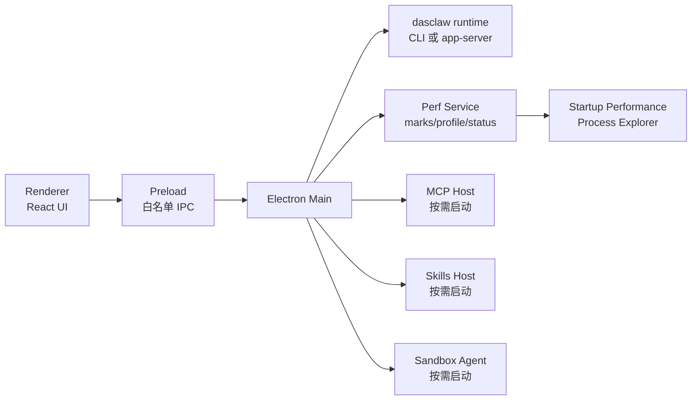

# Electron 客户端体积与性能优化记录

> 状态：草案  
> 日期：2026-06-06  
> 关联计划：`open-cowork based dasclaw GUI PoC`  
> 目的：沉淀从 `open-cowork` 与 VS Code 借鉴到的 Electron 减体积、启动加速、性能观测和长期治理方案。

## 1. 过程透明记录

本文件是新增架构资料文档。按仓库规则，本应先使用 `semantic_search` 检查是否已有等价文档，再用符号层和字面量层核验。当前会话未暴露 `semantic_search` / `vscode_listCodeUsages`，因此本轮使用以下替代证据：

| 层级 | 替代方式 | 结果 |
|---|---|---|
| 图谱层 | `code-review-graph status --repo reference-projects/open-cowork` | `open-cowork` 图谱可用，统计为 3,945 nodes / 37,017 edges / 381 files |
| 字面量层 | 搜索 `open-cowork` 的 Electron builder、Vite、afterPack、DMG、Python runtime、MCP bundle、lazy import 等关键词 | 已定位体积与启动性能相关实现 |
| 外部资料 | 查询 VS Code 官方 Wiki / Extension API 文档 | 已确认 VS Code 公开了性能诊断、startup profiling、Process Explorer、extension bundling 等方法 |

已检查 `Electron 客户端体积与性能优化记录` 是否已有，结论：已有 `open-cowork-dasclaw-gui-poc-plan.md` 中的简要记录，但没有独立性能优化文档；本文件用于独立沉淀方法、指标和 PoC 约束。

## 2. 一句话结论

dasclaw GUI PoC 应同时借鉴两类经验：

| 来源 | 最值得借鉴的部分 |
|---|---|
| `open-cowork` | 安装包减肥、afterPack 清理、MCP bundle、Python runtime 白名单清理、DMG 压缩 |
| VS Code | 性能可观测性、多进程隔离、延迟初始化、启动 profile、Process Explorer、扩展/插件隔离 |

推荐策略：

> 用 `open-cowork` 的打包减肥方法控制发行体积，用 VS Code 的性能治理方法控制长期复杂度。

## 3. open-cowork 的安装包减体积方案

`open-cowork` 已经有一套明确的 Electron 减体积工程，核心在 `electron-builder.yml` 和打包脚本中。

| 方案 | 文件 | 作用 | dasclaw PoC 策略 |
|---|---|---|---|
| `files` 白名单 | `reference-projects/open-cowork/electron-builder.yml` | 只打包 `dist`、`dist-electron`、必要依赖和资源 | 必须采用 |
| 排除非运行文件 | `electron-builder.yml` | 排除 sourcemap、`.d.ts`、`.ts`、README、CHANGELOG、LICENSE、tsconfig 等 | 必须采用 |
| 精准 `asarUnpack` | `electron-builder.yml` | 只 unpack native 模块 | 必须采用 |
| platform-specific `extraResources` | `electron-builder.yml` | 按平台复制 Node、Python、sandbox agent、skills 等资源 | 只保留 PoC 必需资源 |
| afterPack 二次清理 | `scripts/after-pack.js` | 删除非目标平台二进制、native build 中间产物、Electron 多余 locales | 必须采用 |
| MCP server bundle | `scripts/bundle-mcp.js` | 用 esbuild 将 MCP server 打成自包含 CJS bundle | MCP 阶段采用 |
| macOS DMG ULMO 压缩 | `scripts/compress-dmg.js` | 使用 LZMA 压缩 DMG | 发布阶段采用 |
| Python runtime 清理 | `scripts/prepare-python.js` | 只保留 GUI automation 所需包，删除测试、pycache、tkinter 等 | GUI automation flavor 才采用 |
| 生产 sourcemap 关闭 | `vite.config.ts` | 生产构建不输出 sourcemap | 必须采用 |

### 3.1 open-cowork 的重要启发

`open-cowork` 不是轻量壳。它的发行包包含 Node.js / npm、Python runtime、MCP servers、Skills、WSL2 / Lima agent、GUI automation tools 和 native modules。

因此，我们不能简单继承它的完整资源集。dasclaw GUI PoC 的第一版应该更轻：

```text
Electron shell
+ dasclaw_cli 或 dasclaw app-server
+ approval / tool / diff UI
- Python runtime
- VM sandbox agent
- GUI automation tools
- 完整 Skills / MCP 生态
```

## 4. open-cowork 的启动与运行性能方案

| 方案 | 文件线索 | 作用 | dasclaw PoC 策略 |
|---|---|---|---|
| Renderer 懒加载 | `src/renderer/App.tsx` | `ChatView`、`ContextPanel`、`ConfigModal`、`SettingsPanel` 使用 `React.lazy` / `Suspense` | 必须采用 |
| Markdown 懒加载 | `ContentBlockView.tsx`、`ThinkingBlock.tsx` | Markdown 渲染组件按需加载 | 建议采用 |
| Main process 重依赖外部化 | `vite.config.ts` | SDK、MCP、chokidar、archiver、ngrok、ws 等不打进 main bundle | 视实现采用 |
| 重模块动态 import | main / mcp / sandbox 多处 `await import(...)` | Slack、Google GenAI、electron-updater、archiver、LimaSync 等按需加载 | 必须采用 |
| 环境解析缓存 | `mcp-manager.ts` | shell env 等重操作只做一次 | 建议采用 |
| GUI tool 路径缓存 | `gui-operate-server.ts` | Python、cliclick、display config 等路径缓存 | GUI automation 阶段采用 |
| Plugin catalog cache | `plugin-catalog-service.ts` | 插件目录请求缓存 | 插件阶段采用 |

### 4.1 PoC 阶段的懒初始化原则

首屏不应该初始化以下能力：

| 能力 | 初始化时机 |
|---|---|
| MCP servers | 用户打开 MCP 设置或 session 首次需要 MCP 时 |
| Skills registry | 用户打开 Skills 设置或 session 声明需要 Skills 时 |
| VM sandbox | 用户选择 sandbox mode 时 |
| GUI automation | 用户启用 computer-use / GUI automation 时 |
| Plugin catalog | 用户打开 plugin 页面时 |
| Remote / schedule | 用户启用远程或定时任务时 |

## 5. VS Code 的性能治理方案

VS Code 也是大型 Electron 应用，它最值得借鉴的是长期性能治理，而不是某个单点压缩脚本。

| 方案 | 公开能力 | dasclaw PoC 借鉴方式 |
|---|---|---|
| Startup Performance | `Developer: Startup Performance` | 做一个开发者页面展示启动阶段耗时 |
| 启动 CPU profile | `code --prof-startup` | 增加 `--prof-startup` 或环境变量触发 main / renderer profile |
| Process Explorer | `Help > Open Process Explorer` | 增加进程状态页，显示 main、renderer、runtime、MCP、sandbox 的 PID / CPU / 内存 |
| `code --status` | CLI 输出进程状态 | 增加 `dasclaw-gui --status` 或 debug IPC |
| perf marks | VS Code Workbench 使用 perf marks 观测启动阶段 | 给 GUI / runtime lifecycle 加统一打点 |
| delayed services | VS Code 内部强调延迟 service 初始化 | MCP、Skills、VM、plugin catalog 不在构造期启动 |
| Extension Host 隔离 | 扩展运行在独立进程 | MCP / Skills / plugin 不进入 renderer 主线程 |
| sandbox renderer | VS Code 使用 Electron process sandbox 与 preload bridge | renderer 不拿 Node 权限，只通过白名单 IPC |
| Extension bundling | VS Code 官方推荐 esbuild bundle/minify extension | MCP / Skills / plugin 也应 bundle、minify、外部化宿主模块 |

参考资料：

| 资料 | 地址 |
|---|---|
| VS Code Performance Issues | `https://github.com/microsoft/vscode/wiki/performance-issues` |
| VS Code DEV Perf Tools | `https://github.com/microsoft/vscode/wiki/%5BDEV%5D-Perf-Tools-for-VS-Code-Development` |
| VS Code Bundling Extensions | `https://code.visualstudio.com/api/working-with-extensions/bundling-extension` |
| vscode-perf-bot package 信息 | `https://npm.io/package/vscode-perf-bot` |

## 6. dasclaw GUI 的推荐性能架构



核心设计：

| 设计 | 要求 |
|---|---|
| 首屏轻量 | 首屏只加载 conversation shell、workspace selector、基础状态 |
| Runtime 后置 | 用户真正开始 session 时才启动 runtime |
| 能力按需 | MCP、Skills、VM、GUI automation 不参与冷启动 |
| 插件隔离 | plugin / MCP / Skills 不跑在 renderer 主线程 |
| 可观测 | 所有启动阶段和 runtime 生命周期都有 perf marks |
| 可诊断 | 用户能导出 process status 与 startup profile |

## 7. 分 flavor 打包策略

| Flavor | 包含内容 | 不包含内容 |
|---|---|---|
| `core` | Electron shell、dasclaw runtime client、approval / tool / diff UI | Python、VM agent、GUI automation、完整 MCP / Skills |
| `mcp` | `core` + MCP server bundle + MCP settings | Python、VM agent、GUI automation |
| `gui-tools` | `mcp` + Python runtime + GUI automation tools | VM agent |
| `sandbox` | `core` + WSL2 / Lima agent + workspace sync | GUI automation 默认仍可选 |

第一版只实现 `core`。其它 flavor 是后续实验包，不得阻塞 PoC。

## 8. 建议落地清单

### 8.1 打包清单

| 项目 | 要求 |
|---|---|
| `electron-builder files` | 使用白名单，不使用全量项目目录 |
| sourcemap | 生产构建默认关闭 |
| native modules | 精准 `asarUnpack` |
| afterPack | 删除非目标平台二进制、build 中间产物、多余 locales |
| MCP bundle | MCP 阶段用 esbuild 单文件 bundle |
| Python | 只在 `gui-tools` flavor 打包，并做白名单清理 |
| VM agent | 只在 `sandbox` flavor 打包 |

### 8.2 启动清单

| 项目 | 要求 |
|---|---|
| 首屏组件 | conversation shell 懒加载之外的大组件不进入首屏 |
| settings | 按路由懒加载 |
| Markdown / diff viewer | 按需加载 |
| runtime | 用户启动 session 时再启动 |
| MCP / Skills / plugin | 按需加载 |
| updater / remote / schedule | 不参与冷启动 |

### 8.3 观测清单

| 指标 | 说明 |
|---|---|
| `main/start` | Electron main process 入口 |
| `main/app-ready` | `app.whenReady()` 完成 |
| `window/will-create` | 创建 BrowserWindow 前 |
| `window/did-create` | BrowserWindow 创建完成 |
| `renderer/first-paint` | renderer 首次绘制 |
| `renderer/app-mounted` | React app mount 完成 |
| `runtime/will-start` | 准备启动 dasclaw runtime |
| `runtime/did-start` | runtime 进程或 app-server ready |
| `runtime/first-token` | 首个 assistant token / delta 返回 |
| `session/done` | session run 完成 |

## 9. 第一版建议验收指标

| 指标 | 建议目标 |
|---|---|
| 冷启动到首屏 | 小于 3 秒，允许开发机差异 |
| 首次发送消息到 runtime ready | 小于 2 秒，不含模型响应时间 |
| 默认包内容 | 不包含 Python runtime、VM agent、GUI automation tools |
| renderer 初始 bundle | 不包含 settings、MCP、Skills、diff 大组件 |
| 生产 sourcemap | 默认关闭 |
| afterPack 清理 | 必须删除非目标平台二进制和 build 中间产物 |
| 进程可观测 | main、renderer、runtime 至少能显示 PID 和退出状态 |
| profile 可导出 | 开发模式能导出 startup profile |

## 10. 当前推荐

PoC 阶段采用以下路线：

```text
core flavor first
performance marks from day one
Process Explorer later but leave API seam
MCP / Skills / VM / GUI automation all lazy and optional
```

这能避免第一版重演重型 Electron 客户端的常见问题：安装包一开始就过大、首屏启动慢、插件和 runtime 抢主线程、性能问题无从定位。

