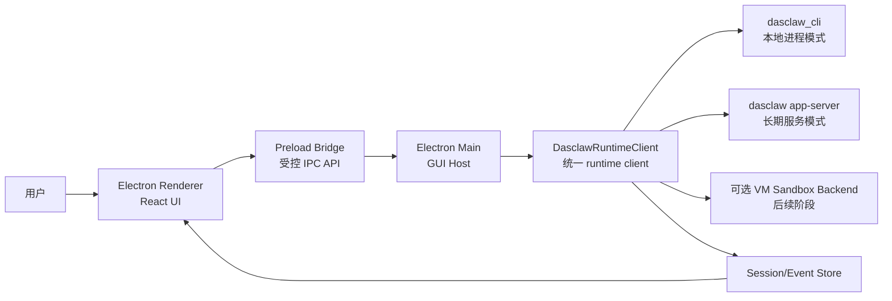

# open-cowork based dasclaw GUI PoC 计划

> 状态：草案  
> 日期：2026-06-06  
> 目标：以 Electron / `open-cowork` 作为新客户端壳基座，当前 Rust `desktop-client` 中的核心能力收敛为 dasclaw app-server / Rust sidecar 接入；PoC 通过后进入替换评估。

## 0. 过程透明记录

本计划属于新增架构计划文档，按仓库规则本应先使用 `semantic_search` 查找等价实现，再用符号层与字面量层交叉验证。当前会话未暴露 `semantic_search` / `vscode_listCodeUsages` 工具，因此本轮采用可用替代路径：

| 层级 | 本轮可用替代 | 结果 |
|---|---|---|
| 语义层 | 复用前序 `code-review-graph` 分析与参考项目评估结论 | 已确认 `open-cowork` 适合做 Electron consumer shell PoC，`codex-electron` 更适合作产品体验参考 |
| 图谱层 | `code-review-graph status --repo .` | 当前仓库图谱可用，统计为 27,576 nodes / 245,722 edges / 1,555 files |
| 字面量层 | `rg` 搜索 `open-cowork`、`codex-electron`、`dasclaw GUI`、`客户端壳子`、`PoC` 等关键词 | 已发现既有评估文档，但未发现同名 PoC 执行计划 |

已检查 `open-cowork based dasclaw GUI PoC` 是否已有，结论：已有参考项目评估与 codex-electron 分析文档，但没有独立的中文 PoC 执行计划；本文件用于补齐执行拆解与决策门。

## 1. 一句话结论

主线决策调整为：以 Electron / `open-cowork` 作为新客户端壳基座，充分利用 Electron 成熟的窗口、插件、Node.js / npm、WebView、调试和生态能力；当前 `desktop-client` 的 Rust 能力不丢弃，而是收敛为 dasclaw app-server / Rust sidecar，由 Electron 通过稳定 contract 接入。

## 2. 背景

前序分析给出的判断是：

| 候选 | 推荐定位 |
|---|---|
| `open-cowork` | 适合作为 Electron 客户端壳子 PoC 基座，优点是源码完整、MCP / Skills / 权限弹窗 / VM sandbox / remote / schedule / memory 等模块齐全 |
| `codex-electron` | 适合作为 Codex-style 产品体验参考，优点是 UI 和 app-server 体验成熟，但当前参考库更像打包产物，不适合作为直接可维护基座 |
| 当前 `desktop-client` | 仍是现有主客户端，不能在 PoC 通过前直接替换 |

因此，本计划不是“用 JS 重写 Rust 能力”，而是“换壳不换核”：Electron 负责产品壳、插件生态和 UI 迭代，Rust app-server 负责 engine、DLP、policy、approval、jobs、skills、memory、sandbox 等核心能力。

## 3. 目标

PoC 的目标是证明以下命题：

> Electron / `open-cowork` 可以作为新客户端成熟壳基座，稳定接入 dasclaw app-server / Rust sidecar，并保留当前客户端的安全、治理、审批、流式会话和后台任务能力。

具体目标：

| 目标 | 说明 |
|---|---|
| Electron 壳可启动 | Electron 主进程、preload、renderer 能形成稳定 IPC 闭环 |
| Rust app-server 可接入 | Electron 可以启动、连接、健康检查和重启 dasclaw app-server / Rust sidecar |
| 当前能力可保留 | chat stream、thread routing、approval、DLP、jobs、skills、memory 等能力可映射到 app-server contract |
| JS 生态可利用 | MCP、插件、WebView、工具 UI、调试和打包链路能受益于 Electron / Node 生态 |
| 成本可量化 | IPC、打包、安全、测试、性能治理成本必须被记录 |
| 替换决策可落地 | PoC 结束后能明确回答是否进入 `desktop-client` 替换实施 |

## 4. 非目标

PoC 阶段明确不做：

| 非目标 | 原因 |
|---|---|
| 不完整复刻 `codex-electron` | 当前参考库以构建产物为主，直接复刻成本高且维护风险大 |
| 不用 JS 重写 Rust 核心能力 | DLP / policy / approval / engine / jobs 等继续留在 Rust app-server |
| 不在 PoC 阶段全量替换 `desktop-client` | 先验证 Electron shell + app-server contract，再进入分阶段替换 |
| 不强制启用 VM sandbox | VM sandbox 是未来优化项，不应阻塞第一版 GUI 闭环 |
| 不实现完整 plugin marketplace | 第一版只保留插件 / Skills / MCP 的接口和 UI 插槽 |
| 不迁移全部历史会话 | 第一版只需要验证新 session 生命周期 |
| 不追求 UI 细节完全产品化 | PoC 关注架构闭环和关键交互正确性 |

## 5. 总体架构草案

核心原则：

| 原则 | 说明 |
|---|---|
| Electron 壳优先 | 新客户端以 Electron / `open-cowork` 为基座 |
| Rust 核心保留 | 当前 `desktop-client` 的后端能力收敛为 dasclaw app-server / Rust sidecar |
| UI 不直接绑 CLI stdout | 中间必须有 `DasclawRuntimeClient` 统一事件协议 |
| runtime lifecycle 独立建模 | 启动、健康检查、重启、退出、版本不兼容必须是显式状态 |
| 审批是 runtime contract | 审批不是普通弹窗，而是会暂停/恢复 agent loop 的协议 |
| sandbox 后置 | 先跑通本地模式，再接 VM sandbox backend |
| codex-electron 只做参考 | 参考交互模型，不直接搬构建产物代码 |
| JS 生态用于壳层 | Node/npm、WebView、插件、MCP UI、调试工具用于客户端壳，不侵入 Rust 安全核心 |

## 6. 模块拆分

| 模块 | 职责 | 来源策略 |
|---|---|---|
| `Electron Shell` | 应用窗口、菜单、托盘、preload、IPC、设置页 | 优先参考 / 基于 `open-cowork` |
| `DasclawRuntimeClient` | 统一封装本地 CLI / app-server 的启动、事件、取消、审批响应 | 新增我们自己的 contract |
| `Session Model` | thread、message、tool call、plan、diff、runtime state | 参考 `codex-electron` 的产品形态，自己实现 |
| `Approval Bridge` | command approval、MCP approval、权限模式、用户响应 | 复用 `open-cowork` 权限 UI 思路，结合 dasclaw 事件协议 |
| `Diff Viewer` | 文件改动展示、review 状态、应用/撤销入口 | 第一版做只读展示，后续增强 |
| `Terminal Panel` | 后台命令、runtime logs、debug 输出 | 参考 `codex-electron` terminal 体验 |
| `MCP / Skills Slot` | MCP server、skills、插件配置入口 | 第一版保留接口，后续接真实能力 |
| `Sandbox Adapter` | WSL2 / Lima / OS sandbox 的可选执行后端 | 后续接入，不阻塞 PoC |

## 7. 分阶段计划

### Phase 0：Electron 基座决策冻结与 app-server contract 先行

目标：确认 Electron / `open-cowork` 为新客户端壳基座，并先把 Rust 能力收敛为稳定 app-server contract。

交付物：

| 编号 | 交付物 |
|---|---|
| P0-1 | 确认 Electron / `open-cowork` 为新客户端壳基座 |
| P0-2 | 梳理 `all_tauri_commands!()` 为 capability groups |
| P0-3 | 定义第一版 `DasclawRuntimeClient` 接口草案 |
| P0-4 | 定义第一版 runtime lifecycle 状态集合 |
| P0-5 | 确认 Electron PoC 位置：独立 app、fork `open-cowork` 子目录，或使用 reference-projects 外部分支 |
| P0-6 | 确认当前 Rust 能力的 app-server / sidecar 边界 |

建议：第一版 contract 以 Electron consumption 为主要目标，但保留协议独立性，避免 GUI 直接依赖 Rust 内部类型。

### Phase 1：Rust app-server / sidecar contract 落地

目标：把当前 `desktop-client` 的 Rust 后端能力变成 Electron 可消费的 app-server / sidecar contract。

交付物：

| 编号 | 交付物 |
|---|---|
| P1-1 | `DasclawRuntimeClient` TypeScript / Rust contract 草案 |
| P1-2 | runtime state：`starting`、`ready`、`running`、`awaiting_approval`、`failed`、`restarting`、`stopped` |
| P1-3 | stream event schema：message delta、reasoning、tool call、approval、diff、plan、error、done |
| P1-4 | 将现有 `chat-stream` / `VercelUIStream` 语义纳入 contract |
| P1-5 | 将 `threadId` 路由作为强约束写入 contract |
| P1-6 | 将 approval request / response 定义为 runtime contract，而不是 UI 私有事件 |
| P1-7 | 明确 app-server transport：stdio JSON-RPC、local HTTP、Unix socket / named pipe 三选一 |
| P1-8 | 明确 app-server lifecycle：spawn、ready、health、restart、shutdown、version check |

验收标准：

| 标准 | 要求 |
|---|---|
| Electron 可消费 | Electron main process 能通过稳定 transport 调用 Rust app-server |
| 不丢能力 | chat、thread routing、approval、DLP gate、diff 至少有 contract 映射 |
| 不泄漏内部 | Contract 不暴露 Rust 内部临时结构和 Tauri 专属概念 |
| 生命周期可靠 | app-server 启动失败、崩溃、版本不兼容都有明确状态 |

### Phase 2：最小 Electron 壳子体验验证

目标：验证 Electron 壳与 Rust app-server 能形成最小产品闭环。

交付物：

| 编号 | 交付物 |
|---|---|
| P2-1 | Electron main process 启动 |
| P2-2 | preload 暴露最小安全 IPC API |
| P2-3 | Electron main process 启动 / 连接 dasclaw app-server |
| P2-4 | assistant 流式输出能回到 UI |
| P2-5 | approval / diff / tool call 的最小 UI 可对比 |
| P2-6 | 记录 Electron 打包、启动、IPC、安全、测试成本 |
| P2-7 | 用 Node/npm 生态验证一个 Electron 壳层优势点，例如 MCP server 管理、插件设置页或 WebView sandbox |

验收标准：

| 标准 | 要求 |
|---|---|
| 闭环可用 | 用户能在 Electron UI 中完成一次 app-server backed chat run |
| 范围受控 | 不迁移 jobs、routines、skills、extensions、memory 全量能力 |
| 生态收益可见 | 至少展示一个 Electron / Node 生态带来的实际壳层收益 |

### Phase 3：runtime lifecycle 与 app-server 评估

目标：把 runtime 当作长期可维护边界，而不是临时进程封装。

交付物：

| 编号 | 交付物 |
|---|---|
| P2-1 | 定义 `DasclawRuntimeClient` 接口 |
| P2-2 | 定义 runtime state：`idle`、`starting`、`ready`、`running`、`awaiting_approval`、`restarting`、`stopped`、`failed` |
| P2-3 | 定义事件 schema：message delta、tool call、tool result、approval request、diff、plan、error、done |
| P2-4 | 实现 cancel / retry / restart |
| P2-5 | 实现 runtime health check |
| P2-6 | 实现 version / protocol compatibility check |

验收标准：

| 标准 | 要求 |
|---|---|
| 可恢复 | runtime 崩溃后 UI 能进入 failed 状态并允许重启 |
| 可解释 | 每个生命周期状态都能在 UI 中解释原因 |
| 可扩展 | 后续可以在不改 renderer 主流程的情况下替换 CLI / app-server backend |

### Phase 4：审批与权限闭环

目标：让高风险操作进入明确审批流。

交付物：

| 编号 | 交付物 |
|---|---|
| P3-1 | command approval request UI |
| P3-2 | approval allow / deny / always allow 响应 |
| P3-3 | runtime 暂停等待审批 |
| P3-4 | 审批超时 / runtime 退出 / 用户关闭窗口的失败路径 |
| P3-5 | 权限模式最小实现：只读、workspace-write、full-access |

验收标准：

| 标准 | 要求 |
|---|---|
| 不丢审批 | runtime 请求审批时 UI 必须可见 |
| 不误放行 | UI 关闭、IPC 失败、状态不一致时默认拒绝或取消 |
| 可审计 | 审批结果进入 session event log |

### Phase 5：工具调用、diff 与 review 体验

目标：让 GUI 能承载真实代码修改工作流。

交付物：

| 编号 | 交付物 |
|---|---|
| P4-1 | tool call / tool result 卡片 |
| P4-2 | 文件 diff 只读展示 |
| P4-3 | changed files 列表 |
| P4-4 | plan summary 展示 |
| P4-5 | runtime logs / terminal panel |

验收标准：

| 标准 | 要求 |
|---|---|
| 可理解 | 用户能看懂 agent 做了哪些工具调用 |
| 可 review | 用户能看到文件变更摘要和 diff |
| 可 debug | runtime 异常时能看到必要日志 |

### Phase 6：MCP / Skills / 插件插槽

目标：保留未来能力扩展点，但不让插件系统拖慢 PoC。

交付物：

| 编号 | 交付物 |
|---|---|
| P5-1 | MCP settings 页面入口 |
| P5-2 | Skills settings 页面入口 |
| P5-3 | plugin capability 数据模型草案 |
| P5-4 | MCP / Skills 权限事件预留 |

验收标准：

| 标准 | 要求 |
|---|---|
| 不阻塞主流程 | 没有 MCP / Skills 时对话仍可用 |
| 有扩展点 | 后续接入 MCP / Skills 不需要重写 session 主模型 |

### Phase 7：可选 VM sandbox backend

目标：评估是否把 open-cowork 的 WSL2 / Lima agent 思路接入 dasclaw。

交付物：

| 编号 | 交付物 |
|---|---|
| P6-1 | 定义 `SandboxExecutor` / `ExternalSandbox` 边界 |
| P6-2 | 对比当前 OS sandbox 与 VM sandbox 的能力缺口 |
| P6-3 | 实现实验性 VM backend 启动 / 健康检查 |
| P6-4 | 实现 workspace mount / sync 策略草案 |
| P6-5 | 输出是否纳入主线的决策记录 |

验收标准：

| 标准 | 要求 |
|---|---|
| 可选 | VM sandbox 不影响本地模式 |
| 可解释 | 用户知道命令在哪个环境执行 |
| 可回退 | VM 不可用时能回退本地受限模式 |

## 8. 决策门

PoC 结束时，不以“写了多少代码”为成功标准，而以能否回答以下问题为标准：

| 问题 | 通过标准 |
|---|---|
| Electron 是否能稳定作为主壳？ | main / preload / renderer / app-server lifecycle 能形成可靠闭环 |
| JS 生态是否形成收益？ | 在 MCP、插件、WebView、调试、打包或 UI 迭代中至少一项有实际收益 |
| open-cowork 壳子是否适合长期维护？ | 主进程、preload、renderer、构建链路能被我们掌控 |
| dasclaw runtime 是否适合 GUI 驱动？ | 有稳定事件协议与生命周期管理 |
| 审批流是否可靠？ | 不丢审批、不误放行、失败时 fail-safe |
| app-server 是否必要？ | 能明确比较 spawn CLI 与长期 app-server 的优劣 |
| VM sandbox 是否应进入主线？ | 能明确作为可选 backend，而不是默认阻塞项 |
| 替换 `desktop-client` 是否可分阶段实施？ | 能以 app-server contract 为边界逐步替换，而不是一次性重写 |

进入 Electron 替换实施的最低条件：

| 条件 | 要求 |
|---|---|
| 日常任务可用 | 至少能完成一次真实代码修改会话 |
| 生命周期稳定 | 启动、取消、重启、崩溃恢复均可控 |
| 审批安全 | 高风险操作不会绕过用户 |
| diff 可审查 | 用户能看到 agent 改了什么 |
| 技术栈可接受 | Electron / Node 维护成本被团队接受 |
| 收益明显 | Electron / Node 生态在壳层能力上有明确收益 |
| 分阶段可迁移 | 当前 Rust 后端能力可通过 app-server contract 保留 |

## 9. 风险清单

| 风险 | 等级 | 缓解方式 |
|---|---|---|
| 把 Electron 迁移误解为 JS 重写核心 | 高 | 明确“换壳不换核”，Rust app-server 保留安全和 runtime 核心 |
| 直接复刻 `codex-electron` 导致维护不可控 | 高 | 只参考行为和交互，不直接搬构建产物 |
| `open-cowork` runner 与 dasclaw runtime 模型不一致 | 高 | 第一阶段先抽 `DasclawRuntimeClient`，不要把 Claude runner 深度耦合进 UI |
| app-server lifecycle 被低估 | 高 | Phase 2 单独建模启动、健康检查、重启、版本兼容 |
| 审批 UI 只是弹窗但没有 runtime contract | 高 | 把 approval request / response 纳入事件协议 |
| VM sandbox 过早引入拖慢 PoC | 中 | Phase 6 后置，第一版只保留 adapter seam |
| Electron 安全边界变宽 | 中 | preload 只暴露白名单 API，renderer 不直接访问 Node |
| 插件 / MCP / Skills 范围膨胀 | 中 | Phase 5 只做插槽，不做 marketplace |

## 10. 建议 issue 拆分

| Issue | 标题 | 范围 |
|---|---|---|
| 1 | `Spike: open-cowork shell starts dasclaw runtime` | 启动壳子、spawn runtime、流式输出 |
| 2 | `Define DasclawRuntimeClient contract` | runtime state、event schema、cancel/retry/restart |
| 3 | `Implement approval bridge for dasclaw GUI PoC` | approval request / response / fail-safe |
| 4 | `Render tool calls and diffs in dasclaw GUI PoC` | tool cards、diff viewer、changed files |
| 5 | `Add app-server lifecycle manager evaluation` | app-server 启动、健康检查、崩溃恢复 |
| 6 | `Keep MCP and Skills as optional capability slots` | settings 入口、能力模型、权限事件预留 |
| 7 | `Evaluate VM sandbox backend for GUI client` | WSL2 / Lima agent 可选后端评估 |
| 8 | `Desktop-client replacement decision record` | PoC 结果、迁移成本、是否进入替换 |

调整后的建议 issue 顺序：

| Issue | 标题 | 范围 |
|---|---|---|
| A | `Define DasclawRuntimeClient contract for Electron shell` | 先抽 Electron 可消费的 runtime contract |
| B | `Map current desktop-client capabilities to app-server contracts` | 从 `all_tauri_commands!()` 拆 capability groups |
| C | `Build Rust app-server lifecycle manager` | spawn / health / restart / shutdown / version check |
| D | `Spike open-cowork Electron shell with dasclaw app-server` | 验证 Electron 壳闭环 |
| E | `Electron replacement implementation decision record` | 用 PoC 证据决定替换实施顺序 |

## 11. 第一周建议执行顺序

| 顺序 | 任务 | 预期结果 |
|---|---|---|
| 1 | 从 `all_tauri_commands!()` 拆 capability groups | 明确当前能力边界 |
| 2 | 写 `DasclawRuntimeClient` 最小接口草案 | Electron shell 有稳定目标 |
| 3 | 明确 app-server transport 与 lifecycle | Electron main 不直接绑临时 CLI stdout |
| 4 | 固定 Electron PoC 目录和构建方式 | 避免污染当前 `desktop-client` |
| 5 | 打通 Electron shell 的 stream / approval / diff 展示 | 得到最小产品闭环 |
| 6 | 写第一版 Electron replacement 决策记录 | 明确替换实施顺序和保留能力 |

## 12. 与既有文档的关系

| 文档 | 关系 |
|---|---|
| `docs/plans/desktop-client-reference-project-evaluation.md` | 提供候选客户端总体评估，本文件承接其中 `open-cowork` Electron PoC 路线 |
| `docs/plans/codex-electron-agent-client-analysis.md` | 提供 `codex-electron` 产品能力参考，本文件只把它作为交互与架构参考源 |
| GitHub issue `#1087` | VM agent sandbox 未来优化项，本文件 Phase 6 与其对应 |

## 13. Electron 体积与启动性能方案记录

本节记录对 `reference-projects/open-cowork` 的补充分析结论，用于指导 PoC 阶段的 Electron 打包策略。

详细方案见独立文档：[`docs/plans/electron-performance-optimization-notes.md`](electron-performance-optimization-notes.md)。

### 13.1 分析依据

本轮使用的证据来源：

| 来源 | 结论 |
|---|---|
| `code-review-graph status --repo reference-projects/open-cowork` | 图谱可用，统计为 3,945 nodes / 37,017 edges / 381 files |
| `reference-projects/open-cowork/electron-builder.yml` | 存在明确的打包白名单、资源拆分、`asarUnpack` 与 platform-specific `extraResources` |
| `reference-projects/open-cowork/vite.config.ts` | 存在生产 sourcemap 关闭、main process 外部化依赖、preload 独立构建 |
| `reference-projects/open-cowork/scripts/after-pack.js` | 存在 afterPack 二次清理，注释标注典型节省约 160MB |
| `reference-projects/open-cowork/scripts/compress-dmg.js` | macOS DMG 使用 ULMO / LZMA 压缩 |
| `reference-projects/open-cowork/scripts/prepare-python.js` | bundled Python runtime 做白名单清理 |
| `reference-projects/open-cowork/scripts/bundle-mcp.js` | MCP server 使用 esbuild 打自包含 bundle |
| renderer / main 搜索 | 存在 `React.lazy`、`Suspense`、动态 import、缓存等启动性能优化线索 |

### 13.2 open-cowork 已有的减体积能力

| 能力 | 说明 | PoC 是否借鉴 |
|---|---|---|
| `electron-builder files` 白名单 | 只打包 `dist`、`dist-electron`、必要 `node_modules` 与资源 | 必须借鉴 |
| 排除非运行文件 | 排除 sourcemap、TypeScript、声明文件、README、CHANGELOG、LICENSE、tsconfig 等 | 必须借鉴 |
| 精准 `asarUnpack` | 只 unpack native 模块，如 `better-sqlite3`、`bufferutil`、`utf-8-validate`、`@img` | 必须借鉴 |
| afterPack 二次清理 | 删除非目标平台二进制、native build 中间产物、Electron 多余 locales | 必须借鉴 |
| MCP server 自包含 bundle | 用 esbuild 将 MCP server 打成单文件 CJS bundle，避免额外 node_modules | 建议借鉴 |
| macOS DMG ULMO 压缩 | 使用 LZMA 压缩 DMG，压缩率高于默认 zlib 路径 | 建议借鉴 |
| Python runtime 清理 | 只保留 GUI automation 需要的 Pillow / PyObjC / Quartz 等包 | 仅在启用 GUI automation 时借鉴 |
| 生产 sourcemap 关闭 | `NODE_ENV=production` 时不输出 sourcemap | 必须借鉴 |

### 13.3 open-cowork 已有的启动与运行性能能力

| 能力 | 说明 | PoC 是否借鉴 |
|---|---|---|
| Renderer 懒加载 | `ChatView`、`ContextPanel`、`ConfigModal`、`SettingsPanel` 使用 `React.lazy` / `Suspense` | 必须借鉴 |
| Markdown 懒加载 | message 内容渲染中的 Markdown 组件按需加载 | 建议借鉴 |
| Main process 重依赖外部化 | OpenAI / Anthropic SDK、MCP SDK、chokidar、archiver、ngrok、ws 等不打入 main bundle | 视实现借鉴 |
| 重模块动态 import | Slack、Google GenAI、electron-updater、archiver、LimaSync、pi-coding-agent 等按需加载 | 必须借鉴 |
| 环境解析缓存 | MCP shell env、Python 路径、GUI automation tool 路径等有缓存 | 建议借鉴 |
| Plugin catalog cache | 插件目录请求做缓存 | 后续插件阶段借鉴 |

### 13.4 对 dasclaw GUI PoC 的约束

`open-cowork` 的减肥策略适合“重能力客户端压缩”，但 dasclaw GUI PoC 不应默认继承全部 runtime：

| 重量来源 | PoC 策略 |
|---|---|
| Bundled Node.js / npm | 第一版尽量不内置，除非 MCP / npx 能力成为 PoC 必需 |
| Bundled Python | 第一版不带；GUI automation 进入后续可选包 |
| WSL2 / Lima agent | 第一版不带；VM sandbox 作为 Phase 6 可选 backend |
| Skills 全量资源 | 第一版只保留 capability slot，不内置完整生态 |
| MCP server 全量资源 | 第一版只保留最小 MCP adapter 或后置 |
| GUI automation tools | 第一版不带，避免安装包体积和权限面膨胀 |

### 13.5 推荐打包策略

PoC 推荐使用分层打包，而不是一次性继承 `open-cowork` 的完整资源集：

| Flavor | 内容 | 用途 |
|---|---|---|
| `core` | Electron shell + dasclaw runtime client + approval / diff / tool UI | 默认 PoC 包 |
| `mcp` | `core` + MCP server bundle / MCP settings | MCP 能力验证包 |
| `gui-tools` | `mcp` + Python runtime + GUI automation tools | GUI automation 实验包 |
| `sandbox` | `core` + WSL2 / Lima agent + workspace sync | VM sandbox 实验包 |

第一版只实现 `core` flavor。`mcp`、`gui-tools`、`sandbox` 均不得阻塞核心会话闭环。

### 13.6 推荐验收指标

后续进入实现阶段时，建议给 Electron PoC 增加以下非功能指标：

| 指标 | 第一版建议目标 |
|---|---|
| 冷启动到首屏 | 小于 3 秒，允许开发机差异 |
| 首次发送消息到 runtime started | 小于 2 秒，不含模型响应时间 |
| 默认安装包内容 | 不包含 Python runtime、VM agent、GUI automation tools |
| renderer 初始 bundle | 不把 settings、MCP、Skills、diff 大组件全部塞入首屏 chunk |
| 生产 sourcemap | 默认关闭 |
| native / binary 清理 | afterPack 必须删除非目标平台二进制和 build 中间产物 |

### 13.7 当前结论

`open-cowork` 有比较完整的 Electron 安装包减体积方案，尤其是打包白名单、afterPack 清理、MCP bundle、DMG 压缩、Python runtime 清理；但它不是轻量壳，而是把 Node、Python、MCP、Skills、VM sandbox、GUI automation 都纳入发行包的重型客户端。

dasclaw GUI PoC 应借鉴它的减肥技术，但不继承它的完整资源集。默认路线应是：

> `Electron shell + dasclaw_cli/app-server + 最小 approval / tool / diff UI`

VM sandbox、Python GUI automation、完整 MCP / Skills 生态进入后续可选 flavor。

## 14. 推荐当前决策

当前不建议宣布替换 `desktop-client`。推荐决策是：

> 采用 Electron / `open-cowork` 作为新客户端壳基座；当前 Rust `desktop-client` 中的核心能力不重写，而是收敛为 dasclaw app-server / Rust sidecar。PoC 周期以 1-2 周为上限，优先验证 Electron shell + app-server lifecycle + chat stream + approval + diff 的最小闭环；通过后进入分阶段替换实施。
