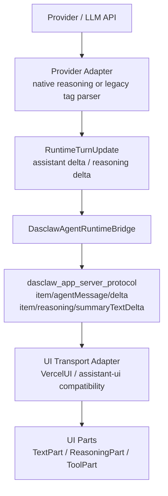

# Structured Reasoning Streaming Final Plan

> 日期：2026-06-15
> 状态：待执行方案
> 目标：从根源解决 desktop-app 发送消息后正文里出现 `<think>...</think>` 的问题，同时避免 UI 末端清洗、测试侧适配或补丁式字符串修复。

## 0. 过程透明记录

本文件用于后续新会话执行，属于新增架构方案文档，按仓库规则先完成 4 问与三层核验。

| 启动问题 | 结论 | 处理 |
|---|---|---|
| 是否新增模块 / crate / 文件？ | 是，新增方案文档 | 先用 code-review-graph 与 `rg` 查已有等价文档 |
| 是否包含否定性结论？ | 是，会判断哪些位置不应承担 reasoning 解析 | 保留证据与限制说明 |
| 是否跨项目对账？ | 是，涉及 `codex-main-cli`、Electron reference、`desktop-client`、当前 crates | 用 CRG / 源码行号 / `rg` 交叉核验 |
| 是否写架构对账类文档？ | 是 | 写入证据、推论、未知项，避免只凭直觉 |

核验记录：

| 层级 | 工具 / 证据 | 结果 |
|---|---|---|
| Level 1 语义层 | `mcp__code_review_graph.semantic_search_nodes_tool` 查询 `reasoning tags think app server structured protocol UI parts architecture final plan` | 未发现已有等价方案文档；命中 `crates/dasclaw_runtime/src/agent.rs`、`crates/dasclaw_runtime/src/llm_adapter.rs` 等相关实现面 |
| Level 1 跨 repo | `mcp__code_review_graph.cross_repo_search_tool` 查询 `reasoning summary text delta app server protocol UI parts Vercel adapter think tags` | 命中 `desktop-client/ui` 的 UI chunk 测试、`crates/dasclaw_protocol` 的 delta 类型等相关面 |
| Level 2 符号层 | 本轮未暴露可调用 `execute_lsp` 工具 | 已记录限制；用 CRG 跨 repo 结果与精确源码行号替代 |
| Level 3 字面层 | `rg` 搜索 `think`、`reasoning`、`summaryTextDelta`、`VercelUI`、`assistant-ui`、`app-server` | 证实 Codex / Electron reference / desktop-client 都有结构化 reasoning 或 UI part 边界，且当前 crates/app-server 已在迁移相关事件 |

已检查 `structured reasoning streaming final plan` 是否已有，结论：已有 app-server 架构、Electron 通信架构和 assistant-ui 迁移 review 文档，但没有专门面向 `<think>` 泄露问题的最终执行方案；本文件补齐该决策与执行切片。

## 1. 一句话结论

最终方案选择：

```text
结构化来源
  -> 结构化内部事件
  -> 结构化 app-server 协议
  -> UI transport adapter
  -> UI 按 part 渲染
```

`VercelUI` / assistant-ui 兼容层可以存在，但只能放在最外层 transport adapter，不能成为 runtime、provider、app-server 协议或测试断言的事实来源。

## 2. 问题定义

当前用户可见问题是 desktop-app 收到的 assistant 正文里包含：

```text
<think>...</think>
你好！请问有什么我可以帮你的吗？
```

根因判断：

1. reasoning 被某一层退化成了普通 assistant text。
2. 下游 UI 只能把它当正文渲染。
3. 在 app-server / desktop-app / test 侧删除 `<think>` 标签，只能掩盖一次泄露，不能恢复丢失的结构化语义。

因此修复目标不是“让 UI 不显示标签”，而是：

- reasoning delta 永远走 reasoning 事件；
- assistant text delta 永远只包含用户可见正文；
- UI 只根据 part / item type 渲染，不解析 `<think>` 语法；
- legacy `<think>` provider 只在 provider/runtime 边界被解析一次，并立即转成结构化 reasoning。

## 3. 参考项目结论

### 3.1 codex-main-cli

Codex 主线在 Responses SSE 层已经区分正文与 reasoning：

- `codex-cli-main/codex-rs/codex-api/src/sse/responses.rs:295`：`response.output_text.delta` 映射为 `ResponseEvent::OutputTextDelta`
- `codex-cli-main/codex-rs/codex-api/src/sse/responses.rs:311`：`response.reasoning_summary_text.delta` 映射为 `ResponseEvent::ReasoningSummaryDelta`
- `codex-cli-main/codex-rs/codex-api/src/sse/responses.rs:319`：`response.reasoning_text.delta` 映射为 `ResponseEvent::ReasoningContentDelta`

turn/session 层继续分流：

- `codex-cli-main/codex-rs/core/src/session/turn.rs:2152`：`OutputTextDelta` 进入 assistant text path
- `codex-cli-main/codex-rs/core/src/session/turn.rs:2199`：`ReasoningSummaryDelta` 进入 reasoning summary event
- `codex-cli-main/codex-rs/core/src/session/turn.rs:2229`：`ReasoningContentDelta` 进入 raw reasoning event

app-server protocol 层也保留独立 method：

- `codex-cli-main/codex-rs/app-server-protocol/src/protocol/common.rs:1062`：`item/agentMessage/delta`
- `codex-cli-main/codex-rs/app-server-protocol/src/protocol/common.rs:1080`：`item/reasoning/summaryTextDelta`
- `codex-cli-main/codex-rs/app-server-protocol/src/protocol/common.rs:1082`：`item/reasoning/textDelta`

推论：Codex 主线不是在 UI 末端识别 `<think>`，而是在来源、内部事件和 app-server 协议层持续保留结构化语义。

### 3.2 reference Electron

`reference-projects/codex-electron-26.527.31326-beautified` 是打包/beautified 产物，不是完整原始源码；证据强度低于源码仓库，但可观察到其 UI state machine 消费的是自有 app-server notifications。

依赖层证据：

- `reference-projects/codex-electron-26.527.31326-beautified/package.json:75` 依赖 `app-server-types`
- 同一依赖列表未见 `@assistant-ui/*`、`@ai-sdk/*`、`ai` 作为核心 chat transport 依赖

notification 分流证据：

- `reference-projects/codex-electron-26.527.31326-beautified/webview/assets/app-server-manager-signals-Bpaj8VHp.js:17185`：`item/agentMessage/delta` 入队到 `target: { type: "agentMessage" }`
- `reference-projects/codex-electron-26.527.31326-beautified/webview/assets/app-server-manager-signals-Bpaj8VHp.js:17213`：`item/reasoning/summaryTextDelta` 入队到 `target: { type: "reasoningSummary", ... }`
- `reference-projects/codex-electron-26.527.31326-beautified/webview/assets/app-server-manager-signals-Bpaj8VHp.js:17235`：`item/reasoning/textDelta` 入队到 `target: { type: "reasoningContent", ... }`
- `reference-projects/codex-electron-26.527.31326-beautified/webview/assets/app-server-manager-signals-Bpaj8VHp.js:17668`：`agentMessage` delta 累积到 agent message text
- `reference-projects/codex-electron-26.527.31326-beautified/webview/assets/app-server-manager-signals-Bpaj8VHp.js:17678`：`reasoningSummary` delta 累积到 reasoning summary
- `reference-projects/codex-electron-26.527.31326-beautified/webview/assets/app-server-manager-signals-Bpaj8VHp.js:17693`：`reasoningContent` delta 累积到 reasoning content
- `reference-projects/codex-electron-26.527.31326-beautified/webview/assets/app-server-manager-signals-Bpaj8VHp.js:19364`：渲染模型按 `agentMessage` item 生成 assistant message
- `reference-projects/codex-electron-26.527.31326-beautified/webview/assets/app-server-manager-signals-Bpaj8VHp.js:19393`：渲染模型按 `reasoning` item 生成 reasoning block

推论：reference Electron 更接近“自有 app-server typed notifications + UI state machine”，不是把 Vercel AI SDK UI stream 作为后端协议。

### 3.3 desktop-client

`desktop-client` 当前使用 assistant-ui / Vercel AI SDK runtime，因此存在 Vercel UI stream adapter，但它放在 transport 边界。

证据：

- `desktop-client/src/vercel_ui_protocol.rs:1`：文件定义 Vercel AI SDK UI Stream Protocol types
- `desktop-client/src/vercel_ui_protocol.rs:18`：目标是兼容 `@assistant-ui/react-ai-sdk`
- `desktop-client/src/tauri_channel.rs:334`：`StatusUpdate::Thinking` 映射成 `ReasoningStart` / `ReasoningDelta`
- `desktop-client/src/tauri_channel.rs:371`：`StatusUpdate::StreamChunk` 映射成 `TextDelta`
- `desktop-client/ui/src/app/runtime/ChatRuntimeProvider.tsx:4`：前端 runtime 是 `useChatRuntime -> TauriChatTransport -> chat-stream`
- `desktop-client/ui/src/app/runtime/TauriChatTransport.ts:2`：Tauri IPC 被包装为 AI SDK `ChatTransport`
- `desktop-client/ui/src/app/components/assistant-ui/thread.tsx:324`：UI 按 `MessagePrimitive.Parts` 渲染
- `desktop-client/ui/src/app/components/assistant-ui/reasoning.tsx:220`：reasoning part 有独立 renderer

推论：desktop-client 的 VercelUI 层是 UI SDK adapter，不是领域模型。这个位置可以借鉴，但不能把它上移到 runtime/app-server。

## 4. 当前实现风险点

后续执行前先确认这些点是否仍然存在：

| 风险点 | 文件 / 位置 | 风险 |
|---|---|---|
| provider 把 thinking 包成 `<think>` 拼入正文 | `crates/dasclaw_llm_provider/src/provider/claw_code_provider.rs` 附近 `OutputContentBlock::Thinking` 处理 | 从源头破坏结构化语义 |
| runtime adapter 用字符串标签作为唯一 reasoning 来源 | `crates/dasclaw_runtime/src/llm_adapter.rs` | legacy provider 需要支持，但不能污染 native path |
| app-server protocol 缺失 reasoning delta 或客户端未识别 | `crates/dasclaw_app_server_protocol/src/lib.rs`、`crates/dasclaw_app_server_client/src/lib.rs` | reasoning 可能掉到 unknown 或 text path |
| embedded / desktop sidecar allowlist 缺少 reasoning event | `desktop-client/src/embedded_server.rs` | UI 侧收不到结构化 reasoning |
| desktop-app 末端清洗正文 | `desktop-app/src/renderer/...` | 属于补丁式修复，应避免作为主方案 |

## 5. 目标边界



责任边界：

| 层 | 应做 | 不应做 |
|---|---|---|
| Provider adapter | 把 native reasoning 字段转成结构化 reasoning；legacy `<think>` 只在这里解析 | 把 thinking 拼成普通 assistant content |
| Runtime | 维护 `assistant_text_delta` 与 `reasoning_summary_delta` 等结构化 update | 输出 Vercel UI chunk |
| App-server protocol | 暴露 Codex-compatible typed notifications | 让客户端从正文里猜 reasoning |
| UI transport adapter | 把 app-server notification 映射成 assistant-ui / Vercel parts | 承担 reasoning 识别、标签清洗 |
| UI renderer | 按 part 渲染 text / reasoning / tool | 修改正文语义或删除标签 |

## 6. 执行切片

### Slice 1：锁定协议契约

目标：确认 app-server protocol 能表达 reasoning 与 text 两条独立流。

工作项：

1. 检查 `crates/dasclaw_app_server_protocol/src/lib.rs` 是否包含：
   - `item/agentMessage/delta`
   - `item/reasoning/summaryTextDelta`
   - 必要时补 `item/reasoning/textDelta`
2. 检查 schema / fixture / contract test 是否覆盖 reasoning delta 与 agent text delta 并列出现。
3. 检查 `crates/dasclaw_app_server_client/src/lib.rs` 是否能解析 reasoning notification，不应落入 `Unknown`。

验收：

- 普通正文只出现在 `item/agentMessage/delta`。
- reasoning 只出现在 `item/reasoning/summaryTextDelta` 或 `item/reasoning/textDelta`。
- 测试断言不包含“从 text 中 strip `<think>` 才通过”的逻辑。

### Slice 2：修正 provider/runtime 来源

目标：从源头阻止 native thinking 被拼成 `<think>` 正文。

工作项：

1. 在 provider adapter 处区分 native thinking 与 normal text。
2. legacy provider 返回单一字符串且确实包含 `<think>` 时，只在 provider/runtime 边界解析一次。
3. 解析结果输出结构化 reasoning delta 与 text delta。
4. 清理或限制任何把 `OutputContentBlock::Thinking` 序列化成 `<think>` 正文的路径。

验收：

- native `Thinking` 不进入 assistant text。
- legacy `<think>` 被转成 reasoning event 后，最终 text delta 不含标签。
- 代码块中的 `<think>` 不能被误识别为 reasoning 标签。
- 多 chunk streaming 下跨 chunk 标签能正确处理。

### Slice 3：runtime 到 app-server bridge

目标：runtime update 进入 app-server 时保持结构化。

工作项：

1. 检查 `RuntimeTurnUpdate` 或等价 update 中是否有 reasoning summary / raw reasoning 字段。
2. `DasclawAgentRuntimeBridge` 将 reasoning update 发为 `ReasoningSummaryTextDeltaEvent`。
3. assistant text update 发为 `AgentMessageDeltaEvent`。
4. 顺序保持稳定：reasoning delta 与 text delta 可以交错，但类型不能混。

验收：

- 一个包含 `<think>private scratch</think>final answer` 的 legacy provider fixture，app-server 输出：
  - `item/reasoning/summaryTextDelta` = `private scratch`
  - `item/agentMessage/delta` = `final answer`
- 没有任何 `item/agentMessage/delta` 包含 `<think>` 或 `</think>`。

### Slice 4：UI adapter 只做映射

目标：允许 desktop-app 使用 assistant-ui / Vercel parts，但只作为 adapter。

工作项：

1. app-server notification 到 UI part 的映射应是机械映射：
   - `item/agentMessage/delta` -> text part
   - `item/reasoning/summaryTextDelta` -> reasoning part
   - `item/reasoning/textDelta` -> raw reasoning part 或按配置隐藏
2. 删除或避免新增 UI text sanitizer。
3. 测试模拟 app-server notification，而不是模拟“正文里带 `<think>` 然后 UI 删除”。

验收：

- UI 测试证明 reasoning part 出现，text part 不含标签。
- 不新增“清理 assistant message content 中 `<think>`”的 UI helper。
- 如果后端错误发了带标签的 text delta，UI 可以显示为后端 bug，不应静默吞掉。

## 7. 必补测试

测试必须锁定业务目标，而不是锁定错误设计。

| 测试层 | 用例 | 断言 |
|---|---|---|
| provider/runtime unit | native thinking + output text | thinking 进入 reasoning，text 只含正文 |
| provider/runtime unit | legacy `<think>` 包裹 reasoning | 标签内容进入 reasoning，正文不含标签 |
| streaming unit | `<think>` / `</think>` 跨 chunk | 不泄露标签，顺序稳定 |
| code fence unit | Markdown code block 中出现 `<think>` | 保留为普通 text，不解析 |
| app-server contract | 同一 turn 同时发 reasoning 与 text | method 分别为 `item/reasoning/summaryTextDelta` 与 `item/agentMessage/delta` |
| client protocol | reasoning notification 解析 | 不落入 unknown |
| UI adapter | reasoning notification -> reasoning part | text part 不含标签，reasoning part 可渲染 |

禁止的测试形态：

- 断言 UI 调用了 `stripThinkTags()`。
- 断言 assistant 正文先包含 `<think>` 再被清理。
- 为了让测试通过，把客户端 bug 固化成 snapshot baseline。

## 8. 推荐修改优先级

1. 先锁 app-server protocol contract。
2. 再修 provider/runtime 来源。
3. 再接 runtime bridge。
4. 最后改 UI adapter。

这样做的原因：

- 协议先稳定，后续层都有明确目标。
- 来源先结构化，UI 不需要补洞。
- bridge 再转 notification，能用 contract test 防回退。
- UI adapter 最后收口，避免让 UI 设计反向污染后端协议。

## 9. 非目标

本方案不做：

- 不重写 assistant-ui 组件体系。
- 不迁移整个 desktop-client。
- 不把 app-server protocol 改成 Vercel AI SDK wire protocol。
- 不为了兼容当前 bug 在 UI 末端删除 `<think>`。
- 不新增第三方依赖。

## 10. 新会话执行提示

新会话可以从以下 prompt 开始：

```text
请按 docs/plans/structured-reasoning-streaming-final-plan.md 执行 Slice 1-4。
要求：禁止 UI 末端清洗 <think>，禁止测试侧适配或掩盖客户端 bug。
先检查当前 diff 和已有改动，保护用户未提交改动。
完成后跑相关 cargo check/test/fmt/clippy，并说明 python3.12 check_no_panics 若不可用的验证缺口。
```

优先检查文件：

- `crates/dasclaw_llm_provider/src/provider/claw_code_provider.rs`
- `crates/dasclaw_llm_provider/src/provider/reasoning.rs`
- `crates/dasclaw_runtime/src/llm_adapter.rs`
- `crates/dasclaw_runtime/src/agent.rs`
- `crates/dasclaw_app_server_protocol/src/lib.rs`
- `crates/dasclaw_app_server_client/src/lib.rs`
- `crates/dasclaw_app_server/src/lib.rs`
- `desktop-client/src/embedded_server.rs`
- `desktop-app/src/renderer/...` 仅作为 adapter / UI 验证面，不作为 reasoning 解析主战场

## 11. 完成定义

完成时必须能证明：

1. app-server wire output 中 reasoning 与 assistant text 是不同 notification。
2. assistant text notification 不包含 `<think>` / `</think>`。
3. UI 看到的是 reasoning part 与 text part，不是清洗后的单一 text。
4. legacy provider 的标签解析只发生在 provider/runtime 边界。
5. native reasoning provider 不经过标签序列化。
6. 测试没有固化错误路径。

