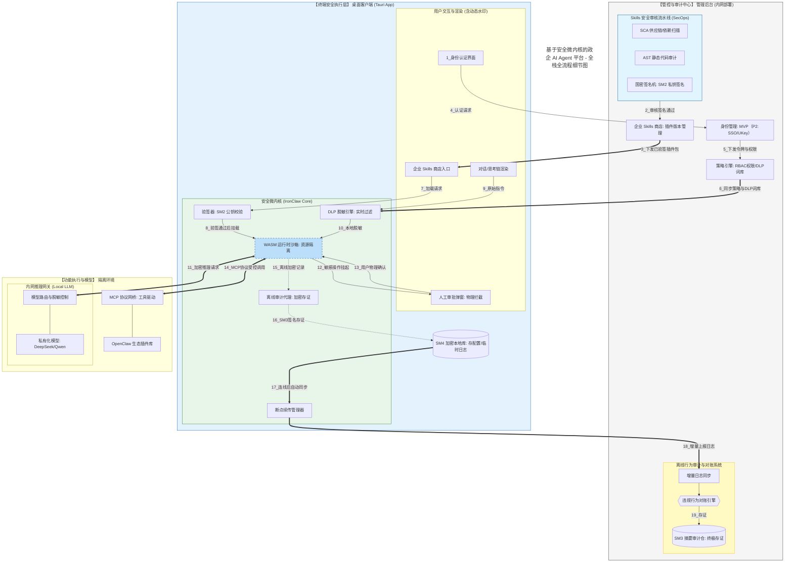

```mermaid
graph TD
    subgraph Title [基于安全微内核的政企 AI Agent 平台 - 全栈全流程细节图]
    direction TB
    end

    %% --- 管理后台模块 ---
    subgraph AdminBackend ["【管控与审计中心】 管理后台 (内网部署)"]
        direction TB
        subgraph SecPipeline ["Skills 安全审核流水线 (SecOps)"]
            SCA[SCA 供应链/依赖扫描]
            Static[AST 静态代码审计]
            Signer[国密签名机: SM2 私钥签名]
        end
        
        IAM[身份管理: MVP（P2: SSO/UKey）]
        StoreSvr[企业 Skills 商店: 插件版本管理]
        PolicyEngine[策略引擎: RBAC权限/DLP词库]
        
        subgraph AuditCenter ["离线行为审计与对账系统"]
            LogSync[增量日志同步]
            Reconcile{{"违规行为对账引擎"}}
            LogVault[(SM3 摘要审计仓: 终极存证)]
        end
    end

    %% --- 客户端模块 ---
    subgraph ClientTerminal ["【终端安全执行层】 桌面客户端 (Tauri App)"]
        direction TB
        subgraph UI_Layer ["用户交互与渲染 (含动态水印)"]
            LoginUI[1_身份认证界面]
            Chat[对话/思考链渲染]
            StoreUI[企业 Skills 商店入口]
            ApprovalUI[人工审批弹窗: 物理拦截]
        end

        subgraph SecurityKernel ["安全微内核 (IronClaw Core)"]
            direction TB
            Validator[验签器: SM2 公钥校验]
            DLPEngine[DLP 脱敏引擎: 实时过滤]
            WASM_Box[WASM 运行时沙箱: 资源隔离]
            AuditProxy[离线审计代理: 加密存证]
            SyncManager[断点续传管理器]
        end
        
        LocalDB[(SM4 加密本地库: 存配置/临时日志)]
    end

    %% --- 执行环境模块 ---
    subgraph ExecutionEnv ["【功能执行与模型】 隔离环境"]
        direction TB
        MCP_Bridge[MCP 协议网桥: 工具驱动]
        OpenClaw_Skills[OpenClaw 生态插件库]
        
        subgraph LLM_Gateway ["内网推理网关 (Local LLM)"]
            ModelProxy[模型路由与脱敏控制]
            LocalLLM[私有化模型: DeepSeek/Qwen]
        end
    end

    %% --- 核心技术交互逻辑 ---

    %% 1. 插件上架流程
    SecPipeline -- 2_审核签名通过 --> StoreSvr
    StoreSvr ==>| 3_下发已验签插件包 | StoreUI

    %% 2. 身份与策略下发
    LoginUI -- 4_认证请求 --> IAM
    IAM -- 5_下发令牌与权限 --> PolicyEngine
    PolicyEngine ==>| 6_同步策略与DLP词库 | DLPEngine

    %% 3. 插件加载与验签
    StoreUI -->| 7_加载请求 | Validator
    Validator -->| 8_验签通过后挂载 | WASM_Box

    %% 4. 推理与脱敏 (支持离线)
    Chat -->| 9_原始指令 | DLPEngine
    DLPEngine -->| 10_本地脱敏 | WASM_Box
    WASM_Box <==>| 11_加密推理请求 | ModelProxy
    ModelProxy --- LocalLLM

    %% 5. 受控执行与物理拦截
    WASM_Box -->| 12_敏感操作挂起 | ApprovalUI
    ApprovalUI -- 13_用户物理确认 --> WASM_Box
    WASM_Box <==>| 14_MCP协议受控调用 | MCP_Bridge
    MCP_Bridge --- OpenClaw_Skills

    %% 6. 离线审计与连线对账
    WASM_Box -.->| 15_离线加密记录 | AuditProxy
    AuditProxy -.->| 16_SM3签名存证 | LocalDB
    LocalDB ===>| 17_连线后自动同步 | SyncManager
    SyncManager ===>| 18_增量上报日志 | LogSync
    LogSync --> Reconcile
    Reconcile -->| 19_存证 | LogVault

    %% 样式
    style Title fill:#fff,stroke:none,font-size:20px
    style AdminBackend fill:#f5f5f5,stroke:#333
    style ClientTerminal fill:#e3f2fd,stroke:#1565c0
    style SecurityKernel fill:#e8f5e9,stroke:#2e7d32
    style AuditCenter fill:#fff9c4,stroke:#fbc02d
    style WASM_Box fill:#bbdefb,stroke:#0d47a1,stroke-dasharray: 5 5
    style SecPipeline fill:#e1f5fe,stroke:#01579b
```
